#  Google OAuth for n8n (Gmail • Drive • Sheets • Calendar)

⚠️ **Authentication Required**
You will create a **Google OAuth2** app and connect it to **n8n** for these products: **Drive, Sheets, Gmail, Calendar**.

**Flow ➝** Copy n8n Redirect URL ➝ Create Google Project & Consent Screen ➝ Add Test Users ➝ Create OAuth Client (Web) ➝ Enable APIs ➝ Paste keys in n8n ➝ Sign in ➝ Smoke-test.

---

## 🔎 Overview (Power Pattern)
**n8n Credential ➝ Google Cloud OAuth App ➝ Enable APIs ➝ Connect in n8n ➝ Test**

---

## ✅ Prerequisites (checklist)
- You can access **Google Cloud Console** with your Google account.
- Your n8n base URL is known:
  - Local: `http://localhost:5678`
  - Public: `https://<your-domain-or-ngrok>/`
- You know which Google account(s) will sign in (add them as **Test users**).

---

## 1) Copy the OAuth Redirect URL from n8n
1. Open n8n ➝ **Credentials**.
2. Open any Google credential form (e.g., Google Sheets) or create one.
3. **Copy** the **OAuth Redirect URL** exactly (you’ll paste it in Google Cloud).

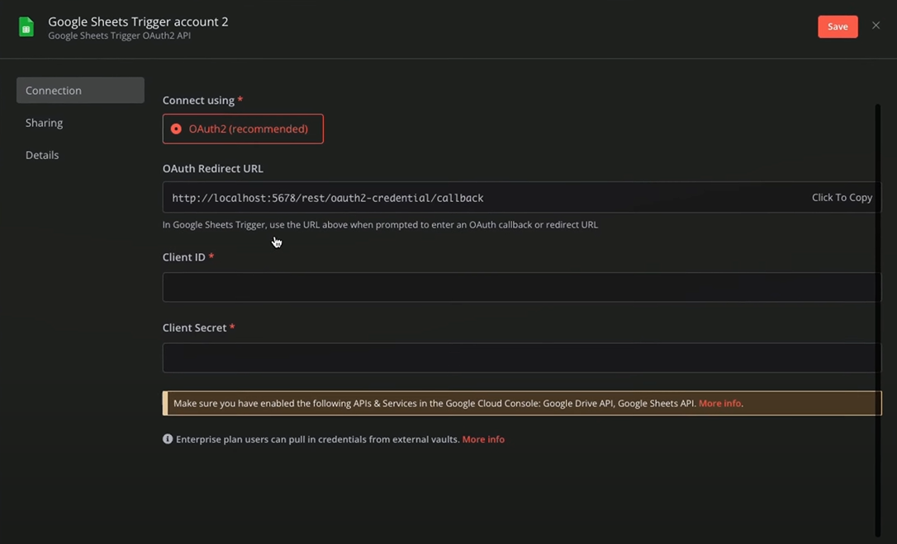

> **Why**: Google must redirect the user back to this URL so n8n can finish OAuth.

---

## 2) Select or Create a Google Cloud Project
1. Go to **https://console.cloud.google.com**.
2. Top bar ➝ **Project selector** ➝ choose an existing project **or** click **New Project**.

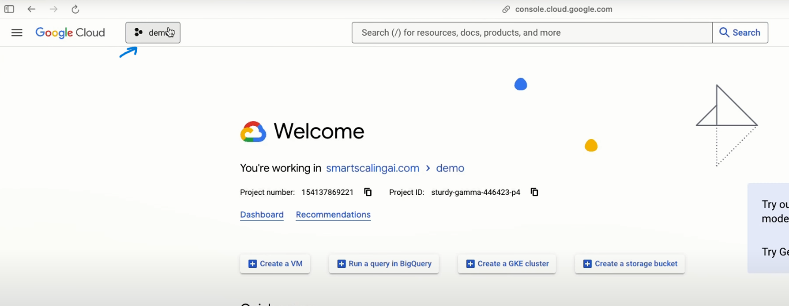
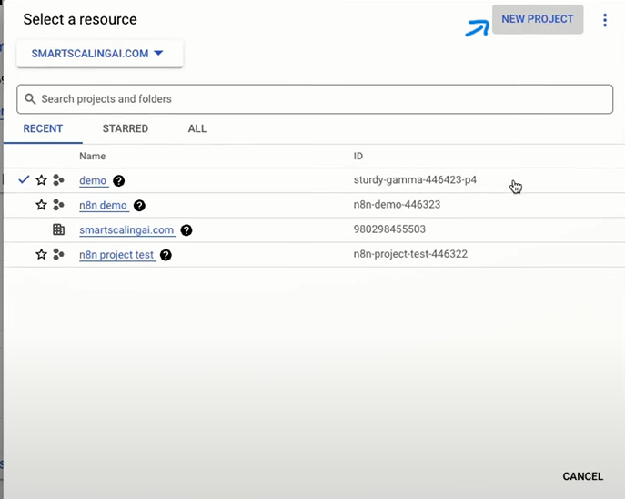

> **Why**: OAuth apps & API enablement are scoped per-project.

---

## 3) Configure the OAuth Consent Screen (External)
1. Left nav ➝ **APIs & Services ➝ OAuth consent screen**.
2. **User type** ➝ select **External** ➝ **Create**.

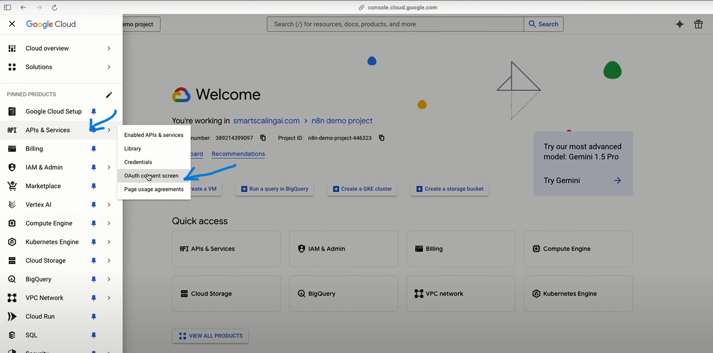
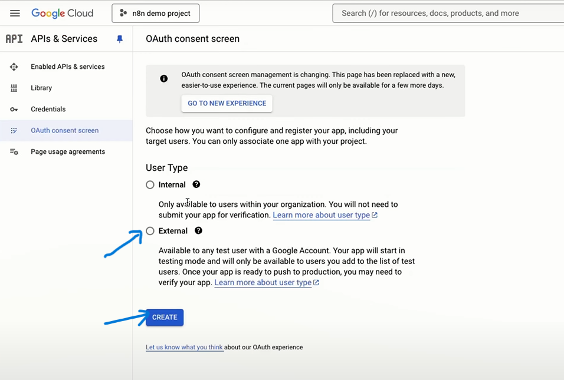

3. Fill **App name** and **Support email** ➝ **Save and continue** through steps (you can skip logo/scopes now; scopes will be requested by n8n).

> **Tip**: You can add explicit scopes later via **Add or remove scopes**, but n8n requesting scopes at auth time is enough for testing.

---

## 4) Add Test Users (avoid 403 access_denied)
1. On the same **OAuth consent screen** page ➝ **Test users** tab.
2. Click **Add users** ➝ enter the Gmail accounts that will authenticate.
3. **Save**.

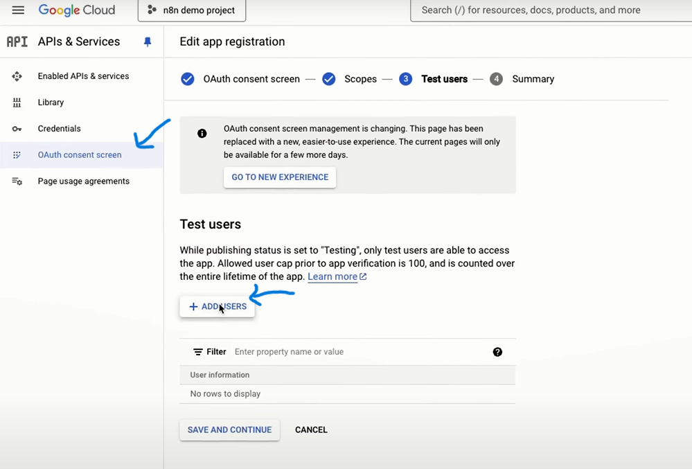
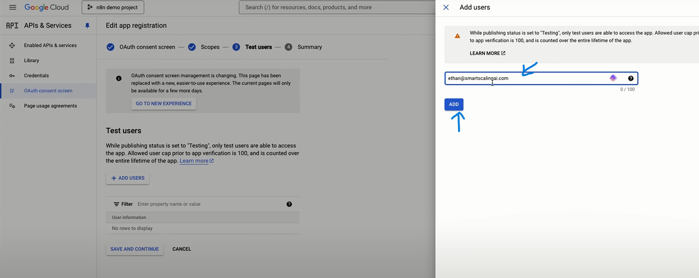

> **Note**: While the app is in **Testing**, only addresses listed here can complete OAuth.

---

## 5) Create OAuth Client (Web application)
1. Left nav ➝ **APIs & Services ➝ Credentials**.
2. **Create credentials ➝ OAuth client ID**.

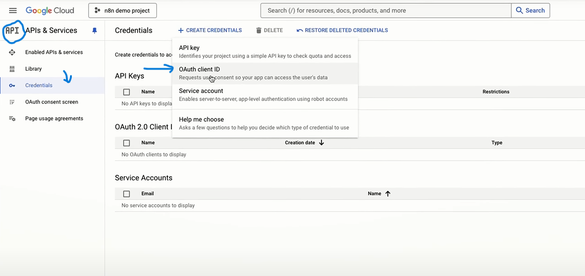

3. **Application type**: **Web application**.  
4. **Authorized redirect URIs** ➝ click **Add URI** and paste the exact value from **Step 1** (no extra slash).
   - Example (local): `http://localhost:5678/rest/oauth2-credential/callback`
   - Example (public): `https://<your-domain>/rest/oauth2-credential/callback`

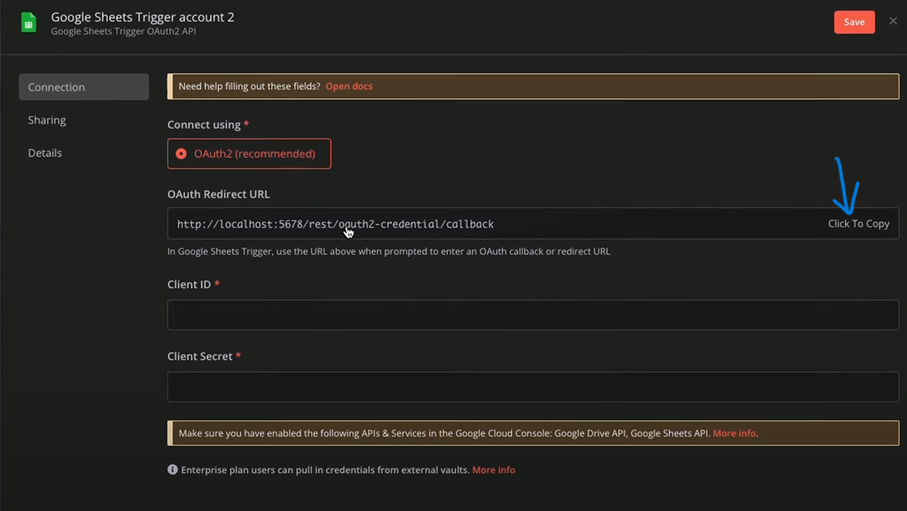
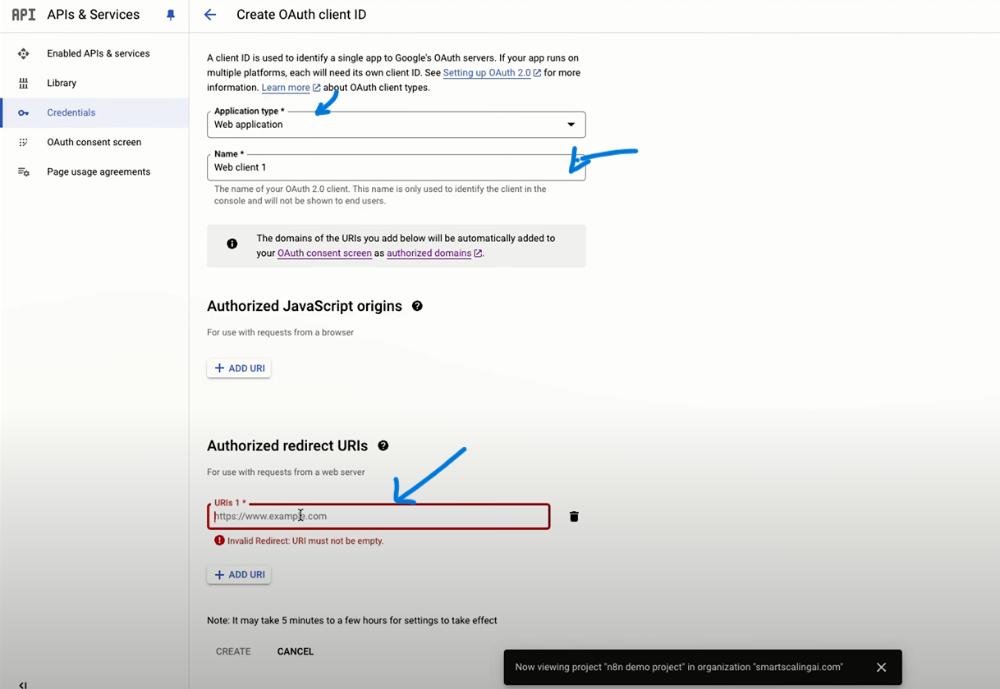

5. Click **Create** ➝ copy **Client ID** and **Client Secret** (you can retrieve them anytime in Credentials).

> **Why**: n8n uses these to exchange authorization codes for tokens.

---

## 6) Enable Required Google APIs (Drive, Sheets, Gmail, Calendar)
1. Left nav ➝ **APIs & Services ➝ Library**.

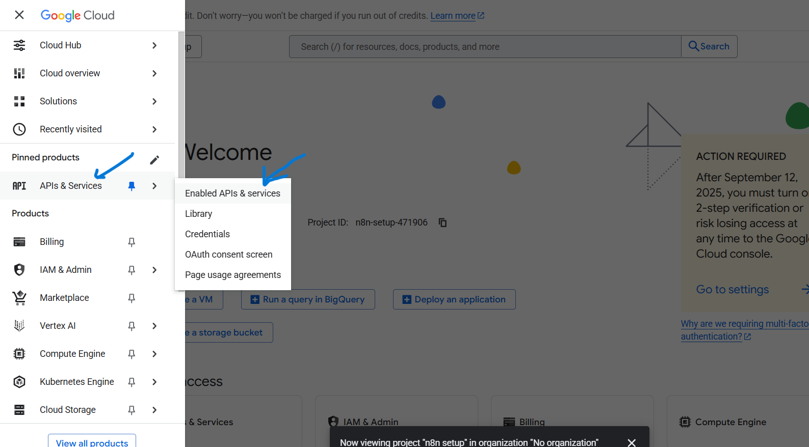
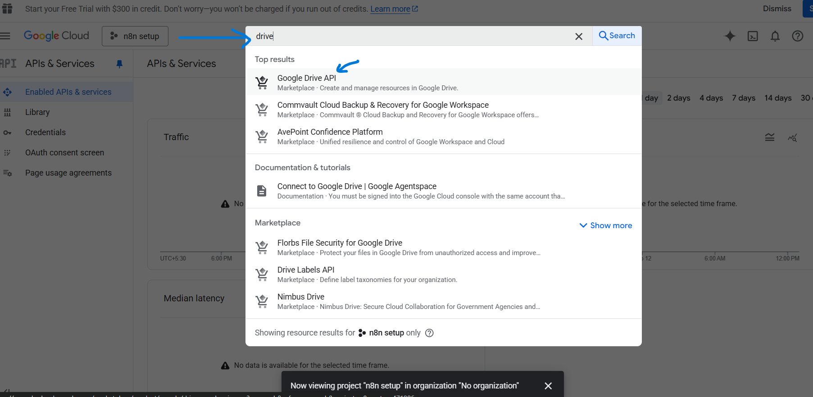

2. Search each API name below ➝ open it ➝ click **Enable**:
   - **Google Drive API**  
     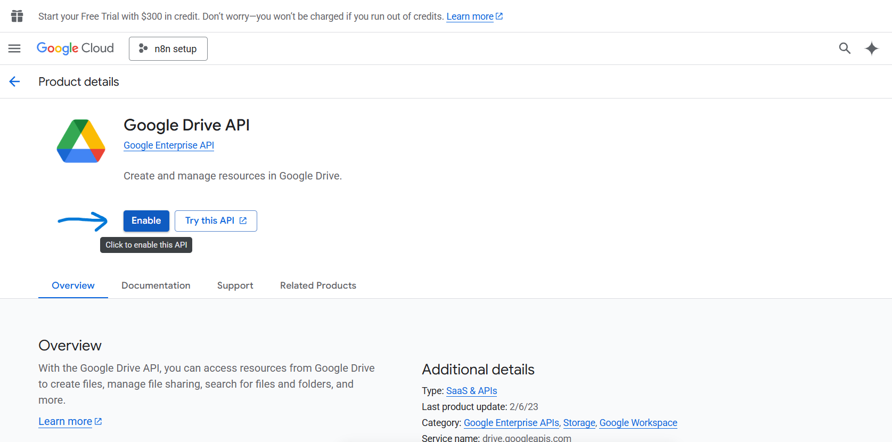
   - **Google Sheets API**  
     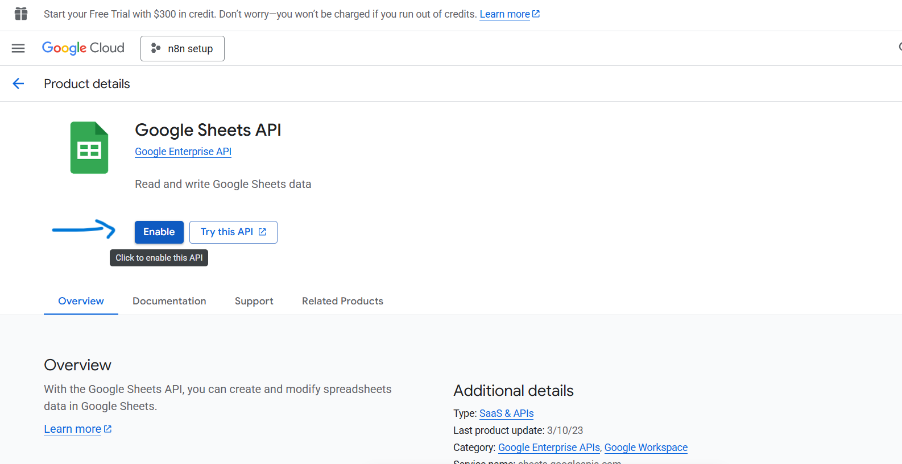
   - **Gmail API**  
     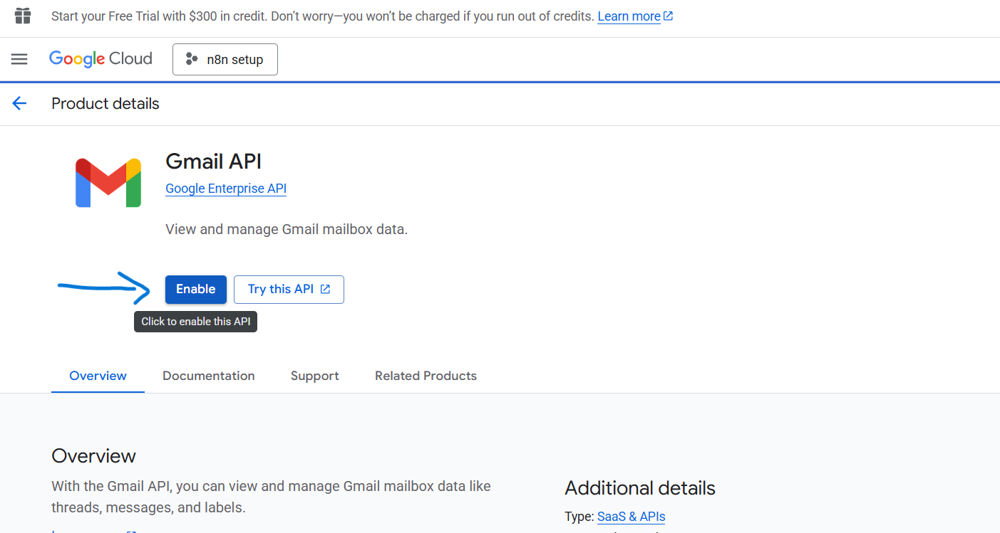
   - **Google Calendar API**  
     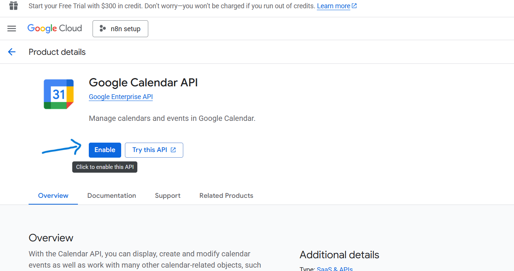

> **Why**: If an API isn’t enabled, respective nodes will fail with “API not enabled”.

---

## 7) Paste credentials into n8n and sign in
1. Back in **n8n ➝ Credentials** (or open a Google node’s credential selector).
2. **Connect using**: OAuth2  
3. Paste your **Client ID** and **Client Secret** from Step 5.  
4. Ensure **OAuth Redirect URL** matches Step 1 exactly (domain + path).  
5. Click **Sign in with Google** ➝ select the test user account ➝ approve scopes.

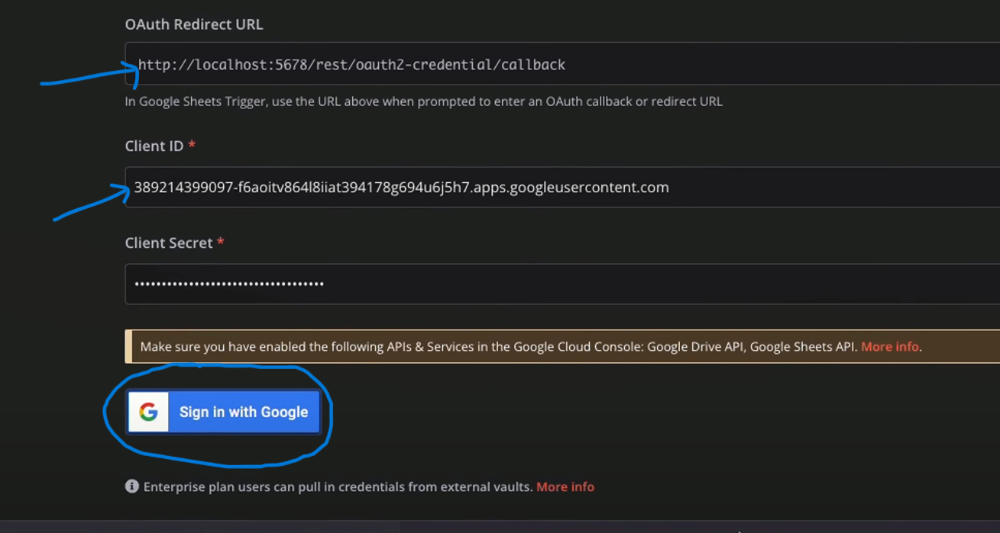
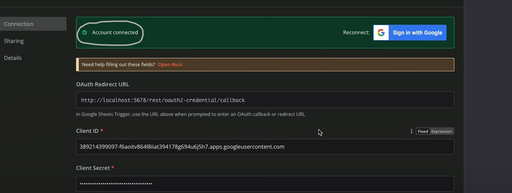

> **Result**: You’ll see **Connected/Authenticated**. n8n now stores a refresh token for API calls.

---

## 8) Quick smoke test in n8n (Sheets)
**Goal**: Prove the credential works end-to-end.

**Drag & drop**
- Drag **Manual Trigger** ➝ canvas.
- Drag **Google Sheets** node ➝ canvas.
- Connect **Manual Trigger ➝ Google Sheets** (arrow).

**Configure Google Sheets**
1. Operation: **Append Row**.  
2. Select the new **Google OAuth** credential.  
3. Choose a test Spreadsheet & Sheet (create one in Google Drive if needed).  
4. Map a simple value, e.g., a column named **Test** ➝ value `Hello from n8n`.  
5. Click **Execute Node** ➝ verify a row appears in the Sheet.

> If it works here, Drive/Gmail/Calendar will also work when you use nodes for those APIs.

---

## 🧰 Troubleshooting (fast)
- **Error 403: access_denied** ➝ Add your Google account under **Test users** (Step 4).  
- **redirect_uri_mismatch** ➝ The URI in Google Cloud must match **exactly** what n8n shows (Step 1).  
- **API not enabled** ➝ Re-check Step 6 for Drive/Sheets/Gmail/Calendar.  
- **Org restrictions** ➝ In Workspace setups, admin may need to approve external apps/scopes.  
- **Switched from localhost to public URL?** ➝ Add the **new** public redirect URI in the same OAuth client and reconnect.

---

## Appendix — Product ↔ API mapping (for nodes)
- **Google Drive nodes** (search/list/download/upload) ➝ **Drive API**
- **Google Sheets nodes** (append/read/update) ➝ **Sheets API**
- **Gmail nodes** (send/read) ➝ **Gmail API**
- **Google Calendar nodes** (list/create events) ➝ **Calendar API**

> One OAuth credential can be reused by multiple Google nodes across the same workspace.

---
**End of Guide**
