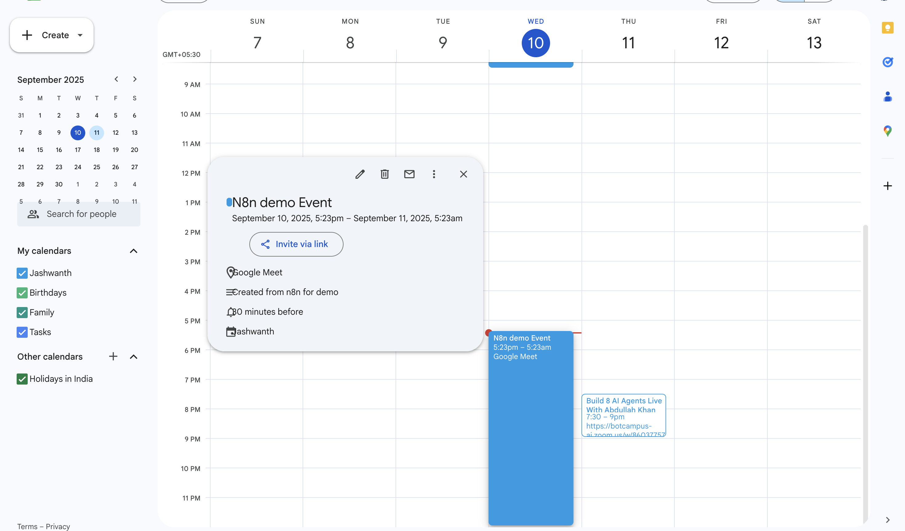

# 📅 n8n — Google Calendar: Create an event → Get an event (by ID)

> **Auth required (do this first):**
> - Connect **Google Calendar OAuth2** in n8n with read/write permission.
> - Use a **writable calendar** (e.g., your Primary calendar). Public calendars such as *Holidays in India* are read‑only and will return “Forbidden” on create.

## What you’ll build
`Manual Trigger ➝ Google Calendar (Create an event) ➝ Google Calendar (Get an event by ID)`


---

## Step 1 — Manual Trigger
- Drag **Manual Trigger** onto the canvas. No settings required.

## Step 2 — Create an event (Google Calendar)
- Drag **Google Calendar** and rename it **Create an event**.
- **Resource:** `Event`
- **Operation:** `Create`
- **Calendar:** choose your **Primary** calendar (your email).
- **Start:** `={{ $now }}`
- **End:** `={{ $now.plus(1, 'hour') }}`
- Optional:
  - **Summary:** `N8n demo Event`
  - **Description:** `Created from n8n for demo`
  - **Location:** `Google Meet`

Connect **Manual Trigger ➝ Create an event** and click **Execute step**.
You should receive an output with an **`id`** (the event’s ID).


> If you see **“Forbidden - perhaps check your credentials? You need to have writer access to this calendar.”**, switch the **Calendar** to your **Primary** calendar or any calendar where you have *Make changes* permission.

## Step 3 — Get the event by ID (Google Calendar)
- Drag another **Google Calendar** and rename it **Get an event**.
- **Resource:** `Event`
- **Operation:** `Get`
- **Calendar:** your **Primary** calendar
- **Event ID:** click **gear → Add expression** and paste:
  ```
  ={{ $node["Create an event"].json["id"] }}
  ```

Connect **Create an event ➝ Get an event** and click **Execute step** to fetch the full details.


---

## Confirmation — Event created in Google Calendar
Below is the event visible in Google Calendar with title, time and details:



---

## Notes
- To fetch many events, use **Operation = Get Many**, which doesn’t require Event ID.
- Adjust time zone or ISO dates in **Workflow settings** if needed.
