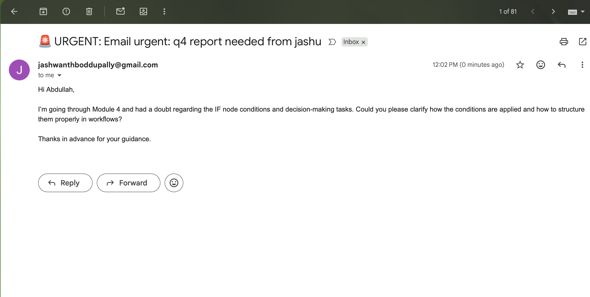

# IF–Node Email Triage (Urgent + Domain) — n8n  
**Goal:** Route email-like data with two IF gates → (Urgent+Company) alert, (Company) priority reply, else standard queue.



---

## At-a-glance outcomes
- Detect **“urgent”** in subject (case-insensitive).
- Extract **sender domain/name** and a **clean subject**.
- Two IF gates (**AND**, strict types) → **3 outcomes**.
- Send Gmail **alert to you** or **reply to sender** using `Email Data1`.
- Import-ready JSON (your version) reflected in every step.

---

## Prereqs & Auth (do this first)
- **n8n:** Cloud or Self-hosted (recent build).  
- **Gmail OAuth2 credential**
  - **n8n Cloud:** **Credentials → New → Gmail OAuth2 API → Connect**.
  - **Self-hosted:** In Google Cloud, enable **Gmail API** → create **OAuth Client (Web)** → add redirect:
    ```
    https://YOUR_N8N_DOMAIN/rest/oauth2-credential/callback
    ```
    Paste **Client ID/Secret** in n8n → **Connect**.
  - Name it e.g. **Gmail – Personal**, and select it in both Gmail nodes below.

---

## Architecture snapshot (nodes/tools & branching)
**Order**
1) **Manual Trigger**  
2) **Set – Email Data** (seed sample)  
3) **Set – Email Data1** (raw copy for Gmail)  
4) **Set – Extract & Clean** (derive fields/flags)  
5) **IF – Urgent + Company?** (AND)  
   - **True →** 6) **Set – Urgent Notification1** → 7) **Gmail – Send a message** *(alert to you)*  
   - **False →** 8) **IF – Company?**  
     - **True →** 9) **Set – Priority Inbox1** → 10) **Gmail – Send a message1** *(reply to sender)*  
     - **False →** 11) **Set – Standard Queue** → 12) **NoOp**

**Branching behavior**
- Urgent **and** domain matches → **Alert path** (to you)  
- Not urgent, but domain matches → **Priority path** (reply to sender)  
- Otherwise → **Standard path** (no email)

---

## Step-by-Step (with instant copy blocks)

### 1) Manual Trigger — **When clicking ‘Execute workflow’**
➜ a. Drag **Manual Trigger**.  
➜ b. Rename to **When clicking ‘Execute workflow’**.

---

### 2) Seed data — **Set: Email Data**
➜ a. Add **Set** → **Add Fields → String**: `sender`, `subject`, `body`.  
➜ b. Paste values (you can adjust later):

```text
sender = jashu@botcampus.com
subject = URGENT: Q4 Report Needed
body =
Hi Abdullah,

I’m going through Module 4 and had a doubt regarding the IF node conditions and decision-making tasks. Could you please clarify how the conditions are applied and how to structure them properly in workflows?

Thanks in advance for your guidance.
```

➜ c. Keep **Keep Only Set = Off** (default).  
➜ d. Name: **Email Data**.  
➜ e. **Connect:** Manual Trigger → **Email Data**.

---

### 3) Preserve raw fields for emails — **Set: Email Data1**
> Purpose: a stable place for Gmail nodes to read `sender/subject/body`.

➜ a. Add **Set** → **Keep Only Set = On**.  
➜ b. Add strings exactly:

```text
sender  = {{ $json.sender }}
subject = {{ $json.subject }}
body    = {{ $json.body }}
```

➜ c. Name: **Email Data1**.  
➜ d. **Connect:** Email Data → **Email Data1**.

---

### 4) Derive fields — **Set: Extract & Clean**
> Purpose: compute domain, clean subject, sender name, and urgency flag.

➜ a. Add **Set** → **Keep Only Set = On**.  
➜ b. Add these fields (copy-paste):

```text
sender_domain = {{ ($json["sender"] || "").split("@")[1] || "" }}
subject_clean = {{ ($json["subject"] || "").toLowerCase() }}
sender_name   = {{ ($json["sender"] || "").split("@")[0] || "" }}
is_urgent     = {{ ($json["subject"] || "").toLowerCase().includes("urgent") }}
```

➜ c. Name: **Extract & Clean**.  
➜ d. **Connect:** Email Data1 → **Extract & Clean**.

---

### 5) First gate — **IF: Urgent + Company?** *(AND, strict types)*
> Match urgent subject **and** company domain.

➜ a. Add **IF** → Name **Urgent + Company?**  
➜ b. Configure **Options**:  
- **Case Sensitive = true**  
- **Type Validation = strict**  
- **Combinator = AND**

➜ c. Add **two conditions**:

```text
[Boolean → Equals]
Left  = {{ $json.is_urgent }}
Right = true
```

```text
[String → Equals]
Left  = {{ $json.sender_domain }}
Right = botcampus.com
```

➜ d. **Connect:** Extract & Clean → **Urgent + Company?**.

---

### 6) True branch payload — **Set: Urgent Notification1**
➜ a. **Keep Only Set = On**.  
➜ b. Fields (copy-paste):

```text
category = Urgent {{ $json.is_urgent }}
action   = immediate_notification
message  = 🚨 URGENT: Email {{ $json.subject_clean }} from  {{ $json.sender_name }}
```

---

### 7) True branch email — **Gmail: Send a message** *(alert to you)*
➜ a. Choose your **Gmail – Personal** credential.  
➜ b. Set fields:

```text
To         = jashwanthboddupally@gmail.com
Subject    = {{ $json.message }}
Email Type = Text
Message    = {{ $('Email Data1').item.json.body }}
```

➜ c. **Connect:** Urgent + Company? (true) → **Urgent Notification1** → **Send a message**.

---

### 8) False branch second gate — **IF: Company?** *(strict types)*
➜ a. Add **IF** → Name **Company?**  
➜ b. **Options**: Case Sensitive = true, Type Validation = strict, **Combinator = AND** (single condition)  
➜ c. Condition:

```text
[String → Equals]
Left  = {{ $json.sender_domain }}
Right = botcampus.com
```

➜ d. **Connect:** Urgent + Company? (false) → **Company?**.

---

### 9) Company true payload — **Set: Priority Inbox1**
➜ a. **Keep Only Set = On**.  
➜ b. Fields:

```text
category = company_priority
action   = add_to_priority_inbox
message  = {{ "⚠️ Company email from " + $json["sender_name"] + " - " + $json["subject"] }}
```

---

### 10) Company true email — **Gmail: Send a message1** *(reply to sender)*
➜ a. Use the same **Gmail – Personal** credential.  
➜ b. Fields (note the stable `Email Data1` references):

```text
To         = {{ $('Email Data1').item.json.sender }}
Subject    = {{ $('Email Data1').item.json.subject }}
Email Type = Text
Message    = {{ $('Email Data1').item.json.body }}
```

➜ c. **Connect:** Company? (true) → **Priority Inbox1** → **Send a message1**.

---

### 11) External payload — **Set: Standard Queue**
➜ a. **Keep Only Set = On**.  
➜ b. Fields:

```text
category = external
action   = standard_processing
message  = {{ "📧 External email from " + $json["sender_name"] + " - " + $json["subject"] }}
```

---

### 12) Sink — **No Operation, do nothing**
➜ **Connect:** Standard Queue → **No Operation, do nothing**.

---

## Key parameters (quick table)

| Node | Field | Value |
|---|---|---|
| Extract & Clean | `sender_domain` | `{{ ($json["sender"] || "").split("@")[1] || "" }}` |
|  | `subject_clean` | `{{ ($json["subject"] || "").toLowerCase() }}` |
|  | `sender_name` | `{{ ($json["sender"] || "").split("@")[0] || "" }}` |
|  | `is_urgent` | `{{ ($json["subject"] || "").toLowerCase().includes("urgent") }}` |
| IF: Urgent + Company? | Options | Case Sensitive = **true**; Type Validation = **strict**; Combinator = **AND** |
| IF: Urgent + Company? | Cond #1 | `{{ $json.is_urgent }} == true` (Boolean → Equals) |
|  | Cond #2 | `{{ $json.sender_domain }} == botcampus.com` (String → Equals) |
| IF: Company? | Options | Case Sensitive = **true**; Type Validation = **strict**; Combinator = **AND** |
| IF: Company? | Cond | `{{ $json.sender_domain }} == botcampus.com` (String → Equals) |
| Gmail: Send a message | To | `jashwanthboddupally@gmail.com` *(adjust)* |
|  | Subject | `{{ $json.message }}` |
|  | Message | `{{ $('Email Data1').item.json.body }}` |
| Gmail: Send a message1 | To | `{{ $('Email Data1').item.json.sender }}` |
|  | Subject | `{{ $('Email Data1').item.json.subject }}` |
|  | Message | `{{ $('Email Data1').item.json.body }}` |

---

## Sample I/O for quick tests

**Input (Email Data):**
```json
{
  "sender": "jashu@botcampus.com",
  "subject": "URGENT: Q4 Report Needed",
  "body": "Hi Abdullah,\n\nI’m going through Module 4 and had a doubt..."
}
```

**Derived (Extract & Clean):**
```json
{
  "sender_domain": "botcampus.com",
  "subject_clean": "urgent: q4 report needed",
  "sender_name": "jashu",
  "is_urgent": true
}
```

**Urgent path payload (Urgent Notification1):**
```json
{
  "category": "Urgent true",
  "action": "immediate_notification",
  "message": "🚨 URGENT: Email urgent: q4 report needed from  jashu"
}
```

---

## Testing & Validation
1) **Urgent + Company** → `subject="URGENT: ..."` + `sender=@botcampus.com` → expect **Gmail alert to you**.  
2) **Company only** → `subject="FYI: ..."` + `sender=@botcampus.com` → expect **Gmail reply to sender**.  
3) **External** → `sender=@gmail.com` → expect **Standard Queue → NoOp**.  
4) **Edge cases** → Empty subject → `is_urgent=false`; malformed sender → `sender_domain=""`.

---

## Troubleshooting
- **401/403 (Gmail)** → Reconnect credential; ensure scopes & correct Google account.  
- **Redirect mismatch (self-hosted)** → Use exact callback shown in Prereqs.  
- **No company match** → Ensure both IF nodes use the **same domain string**.  
- **Undefined path errors** → Keep `Email Data1` before Gmail nodes; references read from **Email Data1**.  
- **No email sent** → Check **Email Type = Text**, and watch Spam folder.

---

## What to deliver
- Final guide (this).  
- Images folder: `images/workflow-graph.png`, `images/email-output.png` (update with your captures).  
- (Optional) Workflow JSON export once we package.
