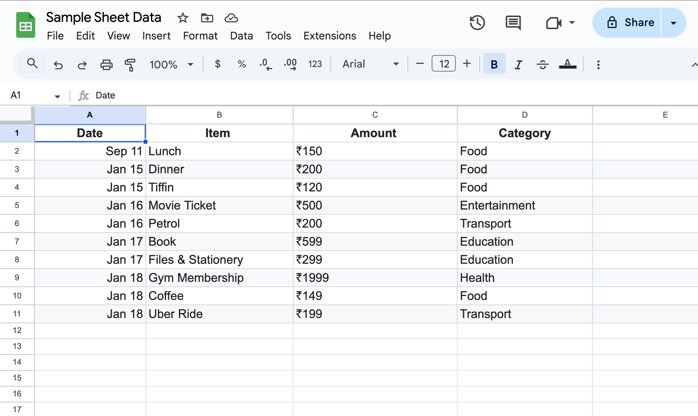
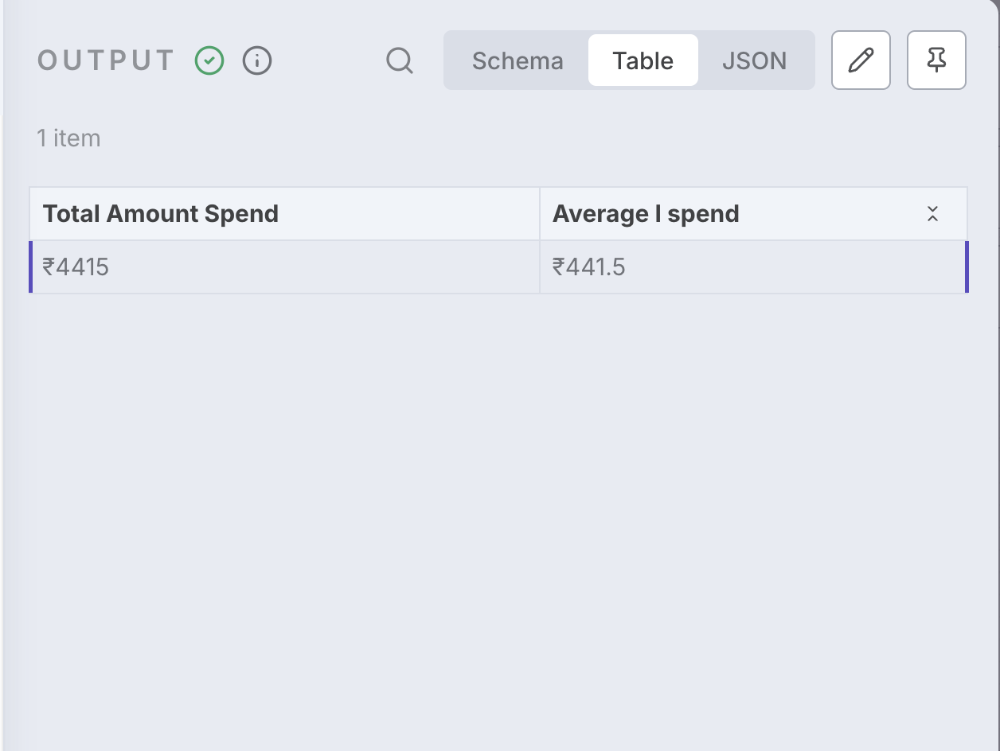

# Google sheets Expense Tracker (n8n Form ➝ Google Sheets ➝ Average Spend)

Real-world workflow that collects expenses through an **n8n Form**, appends each entry to **Google Sheets**, reads all rows back, and calculates **Total Spend** and **Average Spend**.

**Flow:**  
`Expense Form ➝ Clean Expense Data ➝ Append to Sheets ➝ Read All Rows ➝ Code (totals) ➝ Filtering (final output)`


---

##  Authentication & Prereqs

- Connect **Google Sheets** in n8n using **OAuth2** (Google Cloud → enable Sheets API).  
- Create a Google Sheet named anything (e.g., `Expenses`) with **exact** headers:

```
Date | Item | Amount | Category
```

> Tip: Keep **Amount as a plain number** in the sheet (e.g., `150`). Add currency symbols (₹/$) only when displaying in n8n outputs/emails.

---

##  Build Steps (Drag • Configure • Map)

### 1 ➝ Form Trigger — “Expense Form”
- Drag **Form Trigger** onto the canvas.  
- Fields:
  - **Date** (Date)
  - **Item** (Text)
  - **Amount** (Number)
  - **Category** (Dropdown: Food, Entertainment, Education, Transport, Health, Other)

➡️ This gives you a public form URL to submit expenses.

---

### 2 ➝ Set — “Clean Expense Data”
- Drag **Set**, connect: `Expense Form ➝ Clean Expense Data`.  
- **Keep Only Set:** On  
- Map values:
  - `Date` → `={{ $json.Date }}`
  - `Item` → `={{ $json.Item }}`
  - `Amount` → _Option A (recommended numeric)_: `={{ $json.Amount }}`
  - `Category` → `={{ $json.Category }}`

> If you must store currency with symbol, you can set `Amount` to `=₹{{$json.Amount}}`.  
> The Code node below already strips symbols safely during math.

## sample google sheet

- Sample Google Sheet  
  
---

### 3 ➝ Google Sheets — “Expenses” (Append)
- Drag **Google Sheets**, connect: `Clean Expense Data ➝ Expenses`.  
- Operation: **Append**  
- Document: **By URL** → paste your sheet link  
- Sheet: select your sheet/tab (e.g., `Sheet1`)  
- Map columns:
  - **Date** → `{{$json["Date"]}}`
  - **Item** → `{{$json["Item"]}}`
  - **Amount** → `{{$json["Amount"]}}`
  - **Category** → `{{$json["Category"]}}`

---

### 4 ➝ Google Sheets — “Read All Rows”
- Drag **Google Sheets**, connect: `Expenses ➝ Read All Rows`.  
- Resource: **Sheet Within Document**  
- Operation: **Get Row(s)**  
- Document: **By URL** → same sheet  
- Sheet: your tab (e.g., `Sheet1`)  
- **Filters:** leave empty → reads the whole table.

---

### 5 ➝ Code — “Amount spend Average”
- Drag **Code**, connect: `Read All Rows ➝ Amount spend Average`.  
- Paste:

```js
let totalSpent = 0;
let rowCount = 0;

for (const row of items) {
  // Handle “Amount” with or without hidden tabs & currency symbols
  const raw = row.json["Amount"] || row.json["Amount\t"] || "0";
  const amount = parseFloat(String(raw).replace(/[^0-9.]/g, ""));
  if (!isNaN(amount)) {
    totalSpent += amount;
    rowCount++;
  }
}

return [{
  json: {
    totalSpent,
    rowCount,
    averageSpend: totalSpent / (rowCount || 1)
  }
}];
```

---

### 6 ➝ Set — “Filtering” (Final Output)
- Drag **Set**, connect: `Amount spend Average ➝ Filtering`.  
- Fields:
  - **Total Amount Spend** → `=₹{{$json.totalSpent}}`
  - **Average I spend** → `=₹{{$json.averageSpend}}`

You’ll see a table like:  
| Total Amount Spend | Average I spend |  
| --- | --- |  
| ₹4415 | ₹441.5 |

---

## Workfolw Canvas 

- Workflow canvas  
  


---

## output

- Output (totals & average)  
  

---

## 🧪 Try It Yourself

1. Fill the form multiple times (e.g., Lunch 150, Movie 500, Petrol 200, Book 599…).  
2. Open `Read All Rows` → you should see all entries.  
3. Open `Amount spend Average` → inspect `totalSpent`, `rowCount`, `averageSpend`.  
4. See final numbers in **Filtering**.

---

##  Troubleshooting

- **Wrong/empty math:**  
  - Check sheet headers exactly: `Date | Item | Amount | Category` (no trailing spaces/tabs).  
  - If you stored currency symbols in **Amount**, the Code node above strips them; keep the script as is.

- **Didn’t read all rows:**  
  - In “Read All Rows”, **Operation = Get Row(s)** and **Filters empty**.

- **OAuth / Permission errors:**  
  - Reconnect Google Sheets OAuth2 and ensure your user can edit the sheet.


---


