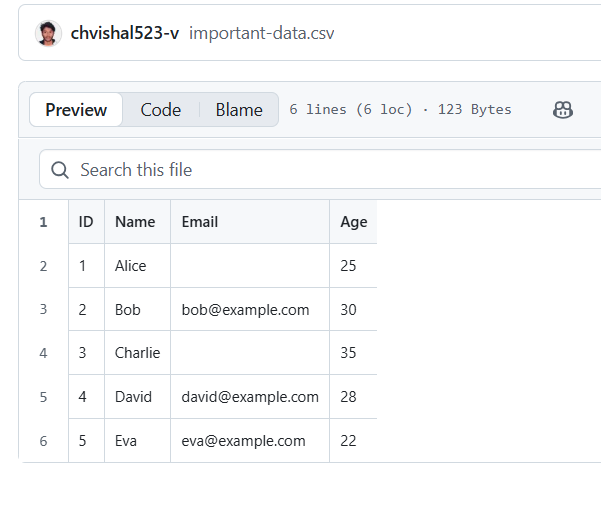

#Working with files & Database 
## Scheduled CSV → Clean → Google Sheets → Email CSV Backup
---
### Canvas


**Goal (1‑liner):** On a schedule, download a CSV file, clean out rows with missing emails, append the cleaned rows to Google Sheets, and email a CSV backup attachment.

> This guide is written for a brand‑new hire who’s never used n8n. Follow each step exactly. The steps and code match your JSON workflow.

---

## At‑a‑glance outcomes
- ⏰ Runs on a **Schedule Trigger**
- 🌐 **HTTP Request** downloads the CSV (as a file/binary)
- 🗂️ **Extract from File** converts binary → text
- 🧮 **Code (JS)** filters rows where **Email** is missing and prepares row objects
- 📄 **Google Sheets: Append** inserts rows into the sheet
- 📦 **Code (JS)** builds a CSV from cleaned rows (binary)
- ✉️ **Gmail: Send a message** emails the CSV backup as an attachment

---

## Prereqs & Auth (do this first)
1) **Google Sheets OAuth2**
   - Create a Google Cloud project, enable **Google Sheets API** and **Google Drive API**.
   - In n8n → **Credentials** → **Google Sheets OAuth2 API** → connect your Google account.
2) **Gmail OAuth2**
   - Enable **Gmail API** in the same Google Cloud project.
   - In n8n → **Credentials** → **Gmail OAuth2** → connect your Google account.
3) **Target Google Sheet**
   - Create a sheet with headers in row 1 (all lowercase to match mapping):  
     `id | name | email | age`
4) **CSV format expectation**
   - The source CSV should have headers: `ID,Name,Email,Age` (capitalized).  
   - Example (for testing):
     ```csv
     ID,Name,Email,Age
     1,Alice,alice@example.com,28
     2,Bob,,30
     3,Carol,carol@example.com,27
     ```

> **Reference image — Raw Source CSV Preview**  
> 

---

## Architecture snapshot (nodes & order)
1) **Schedule Trigger** →  
2) **HTTP Request** →  
3) **Extract from File** →  
4) **Code in JavaScript** (clean + map) →  
   ├─ **Append row in sheet**  
   └─ **Code in JavaScript1** (CSV builder) → **Send a message (Gmail)**

---

## Step‑by‑Step (drag‑and‑drop + exact settings)

### 1) Schedule Trigger
- **Drag & drop:** From left panel, drag **Schedule Trigger** onto the canvas. Place it at the far left.
- **Connect:** None yet (it’s the first node).
- **Mode / Operation:** Interval.
- **How to set it:**
  - Open the node → **Trigger**: choose **Interval**.
  - Example config: Every `1` hour (you can choose minutes/hours/days).
- **Why:** Starts the workflow automatically.

### 2) HTTP Request (download CSV as a file)
- **Drag & drop:** Drag **HTTP Request** next to the Schedule node.
- **Connect:** From **Schedule Trigger (main output)** → **HTTP Request (main input)**.
- **Mode / Operation:** GET request; response as **file/binary**.
- **Settings:**
  - **HTTP Method:** **GET**
  - **URL:**  
    ```
    https://raw.githubusercontent.com/chvishal523-v/dummy-csv/refs/heads/main/important-data.csv
    ```
  - **Options → Response → Response Format:** **File**
- **Why:** We need the CSV as binary so the next node can extract text reliably.

### 3) Extract from File (binary → text)
- **Drag & drop:** Drag **Extract from File** after HTTP Request.
- **Connect:** **HTTP Request → Extract from File**.
- **Mode / Operation:** **Operation = Text**
- **Settings:**
  - **Operation:** **Text** (this outputs the file content into `data`).
- **Output you should see (sample):**
  ```json
  {
    "data": "ID,Name,Email,Age\n1,Alice,alice@example.com,28\n2,Bob,,30\n3,Carol,carol@example.com,27"
  }
  ```

### 4) Code in JavaScript (clean CSV → rows)
- **Drag & drop:** Drag a **Code** node (JavaScript) after Extract from File.
- **Connect:** **Extract from File → Code in JavaScript**.
- **Mode / Operation:** **Language = JavaScript**
- **Paste this code (exact):**
  ```javascript
  // Get CSV string from previous node
  const csvData = items[0].json.data;

  // Split lines
  const lines = csvData.trim().split("\n");

  // Extract header
  const header = lines[0].split(",");

  // Filter rows (skip ones where Email is empty)
  const filtered = lines.slice(1).filter(line => {
    const cols = line.split(",");
    return cols[2] && cols[2].trim() !== "";
  });

  // Convert filtered rows into row objects for Google Sheets Append
  const rows = filtered.map(line => {
    const cols = line.split(",");
    let obj = {};
    header.forEach((h, i) => {
      obj[h] = cols[i];
    });
    return { json: obj };
  });

  // ✅ Return only row objects so Google Sheets appends all
  return rows;
  ```
- **What it does:**  
  - Removes any row with missing **Email**.  
  - Keeps field names from the CSV header: `ID, Name, Email, Age`.  
  - Returns an **array of items** like:
    ```json
    [{ "json": { "ID":"1","Name":"Alice","Email":"alice@example.com","Age":"28" } }, ...]
    ```

### 5) Google Sheets — Append row in sheet
- **Drag & drop:** Drag **Google Sheets** node above/right of the Code node.
- **Connect:** **Code in JavaScript → Append row in sheet** (one branch).
- **Mode / Operation:** **Operation = Append**
- **Credentials:** Select your **Google Sheets OAuth2** credential.
- **Settings (match your JSON):**
  - **Spreadsheet**: **By ID**, paste your Sheet ID (from the URL).
  - **Sheet:** Select **Sheet1** (or `gid=0` if you see the internal list value).
  - **Columns → Mapping mode:** **Define Below**
  - **Field mapping (copy–paste these expressions):**
    - **id:**  
      ```
      ={{ $json.ID }}
      ```
    - **name:**  
      ```
      ={{ $json.Name }}
      ```
    - **email:**  
      ```
      ={{ $json.Email }}
      ```
    - **age:**  
      ```
      ={{ $json.Age }}
      ```
- **Sheet preparation tip:** Ensure row 1 headers are **exactly**: `id | name | email | age` (lowercase).

> **Reference image — Cleaned data appended to Google Sheets**  
> 

### 6) Code in JavaScript1 (build a CSV backup from cleaned rows)
- **Drag & drop:** Drag another **Code** node to the right of the first Code node.
- **Connect:** **Code in JavaScript → Code in JavaScript1** (second branch).
- **Mode / Operation:** **Language = JavaScript**
- **Paste this code (exact):**
  ```javascript
  // Assume previous node gave rows like:
  // items = [ {json: {ID:"2", Name:"Bob", Email:"bob@example.com", Age:"30"}}, {...} ]

  // Extract all headers (keys from the first row)
  const headers = Object.keys(items[0].json);

  // Build CSV rows
  const csvRows = [headers.join(",")];  // Header line

  items.forEach(item => {
    const row = headers.map(h => item.json[h] ?? "").join(",");
    csvRows.push(row);
  });

  // Join into final CSV string
  const csvData = csvRows.join("\n");

  // Return both as JSON and as binary CSV file
  return [
    {
      json: { csv: csvData },   // for preview
      binary: {
        data: {
          data: Buffer.from(csvData).toString("base64"),
          mimeType: "text/csv",
          fileName: "exported.csv"
        }
      }
    }
  ];
  ```
- **What it does:** Builds a CSV string from the cleaned items and exposes it as **binary** at property **`data`** with file name **exported.csv**.

### 7) Gmail — Send a message (attach the CSV)
- **Drag & drop:** Drag **Gmail** node to the right of Code in JavaScript1.
- **Connect:** **Code in JavaScript1 → Send a message**.
- **Credentials:** Select your **Gmail OAuth2** credential.
- **Mode / Operation:** **Send a message**
- **Settings:**
  - **To:** your email (example)  
    ```
    ch.vishal.leadmaster.ai@gmail.com
    ```
  - **Subject:**  
    ```
    cleaned backup data
    ```
  - **Message:**  
    ```
    filtered data
    ```
  - **Attachments → Binary Property:**  
    ```
    data
    ```
    *(This must match the binary property name returned by the previous Code node.)*

> **Reference image — Email with CSV attachment**  
> 

---

## Testing & Validation (do this to verify)
1) **Dry run once**
   - Temporarily **disable** the Schedule node (toggle off) to avoid automatic runs during testing.
   - Right‑click **Code in JavaScript** → **Execute Node** to preview filtered rows.
2) **Full workflow run**
   - Click **Execute Workflow** at the top.
   - Watch the green bars move across nodes.
   - **Check Google Sheet:** New rows appended under `id | name | email | age`.
   - **Check Email:** Confirm you received **exported.csv**.
3) **Re‑enable schedule** once confirmed.

---

## Troubleshooting (common issues + fixes)
1) **HTTP 404/403 on HTTP Request** → Verify the CSV URL is correct and public.
2) **Extract from File → empty `data`** → Ensure HTTP Response **Format = File** (binary).
3) **Code errors: “Cannot read properties of undefined (reading 'data')”** → `items[0].json.data` missing; check Extract from File output.
4) **Google Sheets: Missing/Duplicate Headers** → Make row‑1 headers exactly `id | name | email | age` (lowercase).
5) **Google Sheets: Wrong mapping** → Use **Define Below** and paste expressions exactly.
6) **Gmail: No attachment** → Set **Attachments → Binary Property = `data`**.
7) **OAuth errors (401/403)** → Reconnect Google/Gmail credentials and enable APIs.
8) **CSV delimiter issues** → For commas/quotes inside data, switch to a robust CSV parser in Code.

---

## What to deliver
- A running **n8n workflow** that:
  - Triggers on a schedule,
  - Downloads the CSV,
  - Removes rows with missing emails,
  - Appends valid rows to Google Sheets,
  - Emails a CSV backup attachment.

