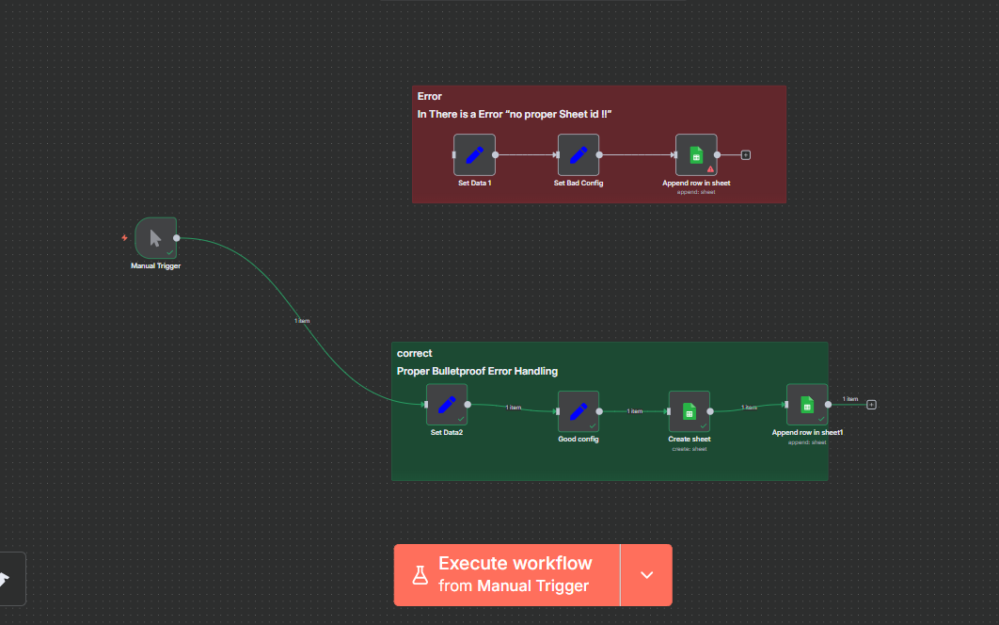

# Guide.md — Bulletproof Error Handling with Google Sheets in n8n

⚠️ **Authentication Required**
- Google Sheets nodes require an OAuth2 credential in n8n. After importing the JSONs, open each Sheets node and select your credential.

---


# Google Sheets — Bulletproof Append with Auto‑Create (n8n)

> **Goal:** Add user data (name, email) into a Google Sheet. If the **sheet doesn’t exist**, create it first. **Never** crash due to a bad Sheet/Spreadsheet ID. Keep the **wrong/error demo flow disconnected**.



---

## At‑a‑glance outcomes
- ✅ Appends user data to a specific Google **Spreadsheet** and **Sheet**.
- ✅ If the target Sheet tab is missing, it’s **created first**.
- ✅ Uses a **known‑good** Spreadsheet ID (no random/invalid IDs).
- ✅ The “Bad Config (error demo)” path is **not connected** to the trigger.

---

## Prereqs & Auth
- **Google account** with access to the target Spreadsheet.
- In n8n, set up **Google Sheets OAuth2** credential (Scopes: `https://www.googleapis.com/auth/spreadsheets`, `.../drive` if you want to create/find files).
- Have or create a Spreadsheet in Google Sheets; copy its **Spreadsheet ID** (the long string in the URL). Example:
  - `https://docs.google.com/spreadsheets/d/**1AbCDeFGhIJkLmNoPqrSTuvWxYz_1234567890**/edit#gid=0`

> **Tip:** Keep a dedicated Sheet tab (e.g., `Error_Handling`) with columns like `ID | NAME | EMail`.

---

## Architecture (nodes & wiring)
1) **Manual Trigger** → runs the happy‑path flow on demand.  
2) **Set Data2 (Set)** → holds incoming user data (`Name`, `Email`).  
3) **Good config (Set)** → injects the **good Spreadsheet ID** and passes data forward.  
4) **Google Sheets: Create sheet (Create Sheet)** → ensures the Sheet tab exists.  
5) **Google Sheets: Append row in sheet1 (Append)** → writes one row with mapped columns.

> **Error demo cluster (DISCONNECTED):** `Set Data1` → `Set Bad Config` → `Append row in sheet` (uses invalid ID). Keep it on canvas for training, **not** wired to the trigger.

---

## Step‑by‑Step (with exact node settings)

### 1) Manual Trigger
- **Node Type:** Manual Trigger  
- **Purpose:** Run the workflow manually while building/testing.
- **Action:** Drag **Manual Trigger** → drop on canvas → **no parameters**.

### 2) Set Data2 (user data)
- **Node Type:** Set  
- **Name:** `Set Data2`  
- **Purpose:** Provide the user payload to append.
- **Action:** Drag **Set** → connect from **Manual Trigger** → set fields.

**Fields (Add Field → String):**
```text
Name  = Jane Doe
Email = jane.doe@example.com
```
**Toggle:** `Keep Only Set` = **ON**

> You can later replace these with values coming from a form/webhook.

### 3) Good config (good Spreadsheet ID + pass‑through data)
- **Node Type:** Set  
- **Name:** `Good config`  
- **Purpose:** Ensure we always use a **valid** Spreadsheet ID and forward Name/Email.
- **Action:** Drag **Set** → connect from **Set Data2** → set fields.

**Fields (Add Field → String):**
```text
document_Id = 1AbCDeFGhIJkLmNoPqrSTuvWxYz_1234567890   ← put your REAL Spreadsheet ID
Name        = ={{ $json.Name }}
Email       = ={{ $json.Email }}
```
**Toggle:** `Keep Only Set` = **ON**

> **Why Set here?** Centralizes the live Spreadsheet ID so downstream nodes can reference `{{$json.document_Id}}` safely.

### 4) Google Sheets — Create Sheet (idempotent)
- **Node Type:** Google Sheets  
- **Name:** `Create sheet`  
- **Operation:** **Create Sheet** (ensures a Sheet tab exists)  
- **Connect:** from **Good config**

**Key parameters:**
- **Credential:** your Google Sheets OAuth2
- **Document ID (Spreadsheet):**
  ```text
  ={{ $json.document_Id }}
  ```
- **Sheet Title:** `Error_Handling`

> If the tab already exists, the node is a no‑op; if it doesn’t, it creates it.

### 5) Google Sheets — Append
- **Node Type:** Google Sheets  
- **Name:** `Append row in sheet1`  
- **Operation:** **Append**  
- **Connect:** from **Create sheet**

**Key parameters:**
- **Credential:** your Google Sheets OAuth2
- **Document ID (Spreadsheet):**
  ```text
  ={{ $json.document_Id }}
  ```
- **Sheet:** `Error_Handling` (or choose by ID from the dropdown once the doc is resolved)
- **Columns mapping:** (example assumes columns `ID | NAME | EMail`)

**Map values (use Expressions):**
```text
ID    → ={{ $('Good config').item.json.document_Id }}
NAME  → ={{ $('Good config').item.json.Name }}
EMail → ={{ $('Good config').item.json.Email }}
```

---

## Keep the Error Demo **Disconnected**
Your canvas also includes an **error** path using a bogus ID `1INVALID_ID_DEMO_NOT_FOUND`:
- `Set Data1` → `Set Bad Config` → `Append row in sheet`

> **DO NOT** connect this chain to **Manual Trigger** (or any running path). Keep it on the side for demos/tests only.

---

## Test & Validate
1. Click **Execute Workflow** (bottom bar).  
2. Confirm:
   - `Create sheet` succeeds (or is skipped if the tab exists).  
   - `Append row in sheet1` succeeds.  
3. Open your Spreadsheet → Sheet `Error_Handling` → verify a new row with `ID | NAME | EMail`.

**Expected sample row:**
```text
1AbCDeFGhIJkLmNoPqrSTuvWxYz_1234567890 | Jane Doe | jane.doe@example.com
```

---

## Troubleshooting (bulletproofing)
- **404 / invalid document ID:** Double‑check `document_Id` in **Good config**. It must match the URL’s Spreadsheet ID.
- **403 / permission denied:** Ensure the Google account used in n8n **has access** to the Spreadsheet.
- **“Sheet not found” in Append:** The tab name differs. Re‑use exactly `Error_Handling` in both **Create sheet** and **Append**.
- **Wrong columns / empty cells:** Verify the **Columns** mapping in **Append** matches your Sheet headers **exactly**.
- **Accidentally wired the bad flow:** Disconnect lines to `Set Bad Config`/its Append node, then re‑run.


---

**You’re done!** This pattern is safe, idempotent, and beginner‑friendly—append will not crash due to missing tabs or bad wiring.

