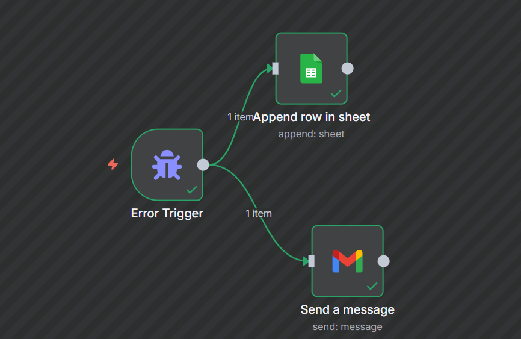
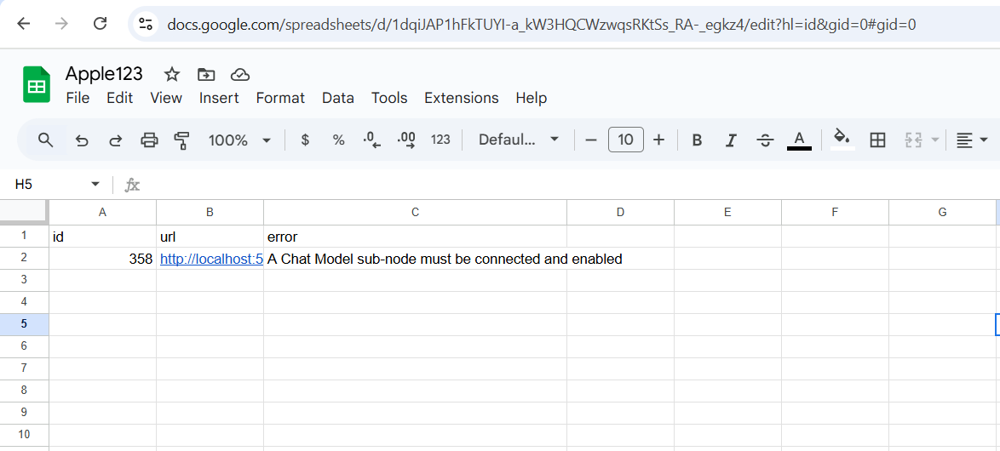
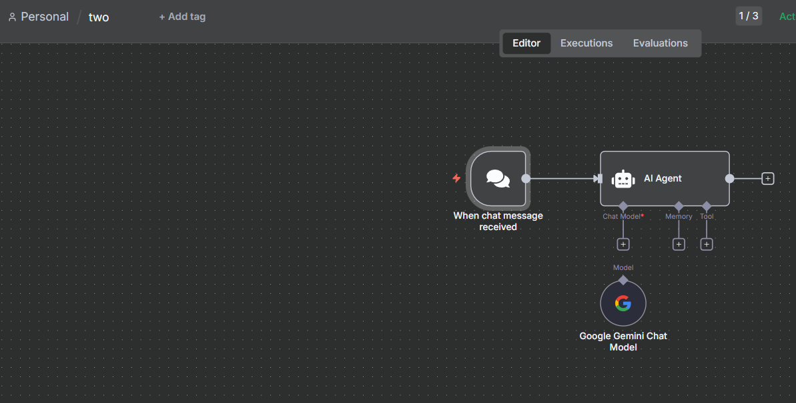
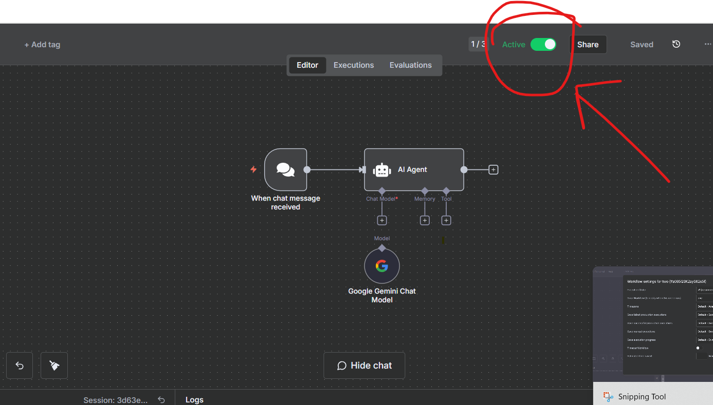

# n8n — Error Capture & Chat Agent (Gemini)  
**Purpose:** Build two clear workflows:  
1) Error workflow that appends error details to Google Sheets and emails you.  
2) Public chat workflow (AI Agent + Google Gemini Chat Model) that routes failures to the error workflow.

---

## What you will create
- **Error Capture & Notify** workflow  
  Nodes: **Error Trigger** → **Google Sheets (Append)**, **Gmail (Send a message)**  
  Two outgoing connections from **Error Trigger** (one to Sheets, one to Gmail).

- **Chat Agent (Gemini)** workflow  
  Nodes: **When chat message received** → **AI Agent**; and a **Google Gemini Chat Model** node connected to the Agent via **Chat Model** port.  
  Set this workflow’s **Error Workflow** to **Error Capture & Notify**.

---

## Prerequisites
- n8n (cloud or self‑hosted)
- **Google Sheets OAuth2** credential (Append rows)
- **Gmail OAuth2** credential (Send a message)
- **Google Gemini (PaLM) API** credential for **Google Gemini Chat Model**

---

## Part A — Error Capture & Notify (Sheets + Gmail)

### A1) Create workflow
- **Workflows → New**, name: `Error Capture & Notify`.

### A2) Add **Error Trigger**
- Drag **Error Trigger** to canvas.
- No operation to configure. This workflow will run when other workflows route errors here.

### A3) Add **Google Sheets** (Append)
- Drag **Google Sheets**; connect **Error Trigger → Google Sheets**.
- **Operation:** `Append`
- **Document:** pick your Spreadsheet by **ID**; **Sheet:** e.g., `Sheet1` (with headers `url`, `id`, `error`).
- **Define Columns Below** and map these expressions:

**Expressions (copy/paste):**
```
={{ $json.execution.url }}
={{ $json.execution.id }}
={{ $json.execution.error.message }}
```

### A4) Add **Gmail** (Send a message)
- Drag **Gmail**; connect **Error Trigger → Gmail**.
- **To:** your email address
- **Subject:** `error caught`
- **Message:**

**Template (copy/paste):**
```
error:  {{ $json.execution.error.message }}
url:{{ $json.execution.url }}
id:
{{ $json.execution.id }}
```

### A5) Result (reference)


**What a sheet row looks like when an error occurs:**


---

## Part B — Chat Agent (Gemini)

### B1) Create workflow
- **Workflows → New**, name: `Chat Agent (Gemini)`.

### B2) Add **When chat message received**
- Drag **When chat message received**.
- Set **Public** = `true` (so you can chat with it).

### B3) Add **AI Agent**
- Drag **AI Agent** and connect **When chat message received → AI Agent**.

### B4) Add **Google Gemini Chat Model**
- Drag **Google Gemini Chat Model** and select your Gemini credential.
- Connect its output to the **AI Agent → Chat Model** input port (small port under the Agent).

**Reference layout:**


### B5) Configure Error Workflow
- Open **Workflow → Settings** for `Chat Agent (Gemini)` and set **Error Workflow** = `Error Capture & Notify`.
- **Activate** the chat workflow.

**Activation UI reference:**


---

## Part C — Test by forcing an error (safe)

Create a small test workflow to ensure the error handler runs and logs to Sheets and Gmail.

### C1) Build
- **Manual Trigger** → **Code (Function)**

**Function code (copy/paste):**
```javascript
// Purpose: Force an error to test the Error Workflow
throw new Error('Division by zero test: 7/0');
```

### C2) Route errors
- In the test workflow **Workflow → Settings**, set **Error Workflow** = `Error Capture & Notify`.
- Run the test workflow. You should see a new row in Sheets and receive an email.

---

## Troubleshooting

1) **No row in Google Sheets**  
   - Check OAuth credential. Confirm Spreadsheet **ID** and **Sheet**.  
   - Ensure headers `url`, `id`, `error` exist. Re-try.

2) **No email received**  
   - Verify **Gmail OAuth2** credential and recipient address.  
   - Inspect Execution Logs for the error workflow.

3) **Error workflow didn’t run**  
   - Confirm the failing workflow’s **Error Workflow** setting points to `Error Capture & Notify`.  
   - The error workflow does not need to be active; it runs when referenced.

4) **Agent error “A Chat Model sub‑node must be connected and enabled”**  
   - Ensure the **Google Gemini Chat Model** node is connected to the **AI Agent → Chat Model** port and the node is enabled.  
   - Then activate and try again.

---

## Files in this package
- `README.md` (this guide)
- `images/01-error-capture.png`
- `images/02-sheet-append.png`
- `images/03-chat-workflow.png`
- `images/04-activate-toggle.png`
- `one.json` (error workflow import) — if present
- `two.json` (chat workflow import) — if present
