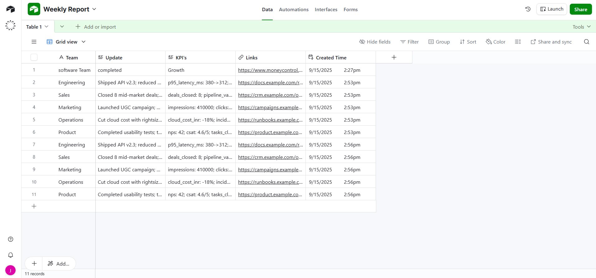
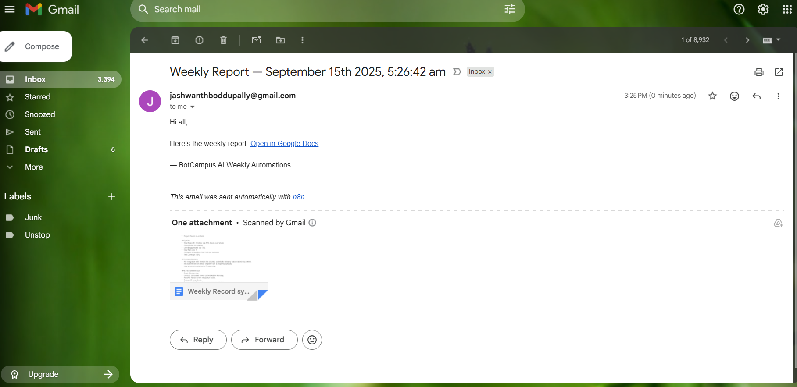
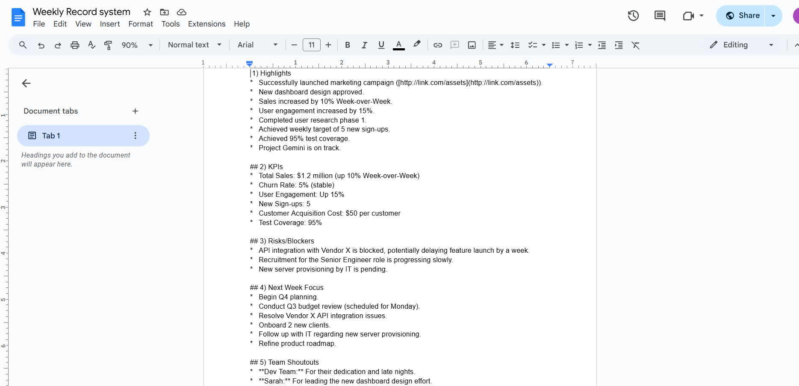

# Weekly Report Inbox → Executive Report System (n8n)

Automates weekly team updates from **Airtable** into a concise executive email via **Gemini LLM** and **Gmail**.

**Architecture (matches the included JSON)**  
**Schedule Trigger** → **Code (seed rows)** → **Airtable: Create record** → **Airtable: Get record** → **LLM (Gemini via Basic LLM Chain)** → **Gmail: Send**.

> Import the ready-made workflow: `Weekly Report System.json` (included).  
> n8n → **Workflows** → **Import from file**.  
> Then open each credential field (Airtable, Gmail, Gemini) and select your saved credential.

---

## PHASE 0 — Airtable Setup (do these first)

### 0.1 Sign in with Google
Open: <https://airtable.com/>  
Click **Sign up / Log in → Continue with Google** → choose your account.


### 0.2 Create the Base & “Updates” Table
**Goal:** a simple team “inbox” for weekly bullets.

- **Create → Start from scratch**  
- **Base name:** `Weekly Report Inbox`  
- Open the base → Add table (or rename “Table 1”) to **`Updates`**  
- Configure **Updates** fields:
  - **Team** → *Single select* (e.g., Engineering, Sales, Marketing, Ops)  
  - **Update** → *Long text* (what happened)  
  - **KPI's** → *Long text* (optional metrics)  
  - **Links** → *URL* (optional)  
  - **Created Time** → *Created time* (auto)

(Zero‑tech input) **Create a Form** view for *Updates*:  
**Views** → **+ Create → Form** → include fields (Team, Update, KPI's, Links) → **Share form** → copy link → share with team.  
*Tip:* Add 3–4 weeks of sample entries so you can test week‑over‑week behavior.


### 0.3 Create a Personal Access Token (PAT)
You’ll use this token in n8n to read/write Airtable.

1) In Airtable (top-right) click your avatar → **Developer hub**  
2) **Personal access tokens → Create new token**  
3) **Name:** `n8n-weekly-report`  
4) **Scopes (minimum):**
   - `data.records:read`
   - `data.records:write`
   - `schema.bases:read` *(lets n8n list bases/tables)*
5) **Access** → *Add a base* → select **Weekly Report Inbox**  
6) **Create token** → **Copy it** (store securely).


### 0.4 (Optional) Know your IDs
When you open a grid view, URL looks like:  
`https://airtable.com/appXXXXXXXX/tblYYYYYYYY/viwZZZZZZZZ`  
**Base ID** = `app…`, **Table ID** = `tbl…`, **View ID** = `viw…`  
*n8n can also select by names if you included `schema.bases:read`.*

### 0.5 Connect Airtable in n8n
n8n → **Credentials → New → Airtable**  
- **Authentication:** Access Token  
- **Access Token:** *(paste your PAT)* → **Save**

---

## PHASE 1 — Build the Flow in n8n

### Step 1 — Schedule Trigger (weekly)
- **Node:** Schedule Trigger  
- **Mode:** Every Week → **Day:** Friday → **Time:** 17:00 → **Timezone:** Asia/Kolkata  
- Rename: `Weekly Trigger (Fri 5PM)`

### Step 2 — Code (seed 5 demo rows)
This node returns 5 items that match your Airtable schema. Paste this in a **Code** node (Language: JavaScript).

```js
// Returns 5 n8n items with fields: Team, Update, KPI's, Links
const rows = [
  { Team: "Engineering",  Update: "Shipped API v2.3; reduced p95 latency.", Kpis: "p95_latency_ms: 380->312; error_rate: -22%", Links: "https://docs.example.com/release-v2-3" },
  { Team: "Sales",        Update: "Closed 8 mid-market deals; pipeline healthy.", Kpis: "deals_closed: 8; pipeline_value_inr: 1.8cr; win_rate: 32%", Links: "https://crm.example.com/opps?week=latest" },
  { Team: "Marketing",    Update: "Launched UGC campaign; best CTR this quarter.", Kpis: "impressions: 410000; clicks: 18950; ctr: 4.6%; cac_inr: 142", Links: "https://campaigns.example.com/ugc-q3" },
  { Team: "Operations",   Update: "Cut cloud cost with rightsizing & spot usage.", Kpis: "cloud_cost_inr: -18%; incidents: 0; uptime: 99.97%", Links: "https://runbooks.example.com/cost-rightsizing" },
  { Team: "Product",      Update: "Completed usability tests; two P0 fixes shipped.", Kpis: "nps: 42; csat: 4.6/5; tasks_closed: 27", Links: "https://product.example.com/research/usability-week" }
];
// Map field "KPI's" exactly as in Airtable
return rows.map(r => ({ json: { Team: r.Team, Update: r.Update, "KPI's": r.Kpis, Links: r.Links } }));
```

### Step 3 — Airtable: Create record
- **Node:** Airtable → **Create**  
- **Base:** `Weekly Report Inbox`  
- **Table:** `Updates`  
- **Columns mapping:**  
  - **Team**: `={{ $json.Team }}`  
  - **Update**: `={{ $json.Update }}`  
  - **KPI's**: `={{ $json["KPI's"] }}`  
  - **Links**: `={{ $json.Links }}`
  - 
---


### Step 4 — Airtable: Get record
- **Node:** Airtable → **Get**  
- **Base/Table:** same as above  
- **Record ID:** `={{ $json.id }}` (from *Create record*)  
This brings back `createdTime` etc. that we’ll pass to the LLM.

### Step 5 — LLM (Gemini) via Basic LLM Chain
- **Language Model node:** *Google Gemini Chat Model* (add your API key credential)  
- **Chain node:** *Basic LLM Chain*  
  - **Prompt**: executive‑summary prompt (already in JSON).  
  - Output: **Markdown** summary.

### Step 6 — Gmail: Send
- **Node:** Gmail → **Send Email**  
- **To:** your address  
- **Subject:** `Weekly Report — {{$now.format("MMM Do, YYYY")}}`  
- **Message:** map the LLM output (already wired in JSON).

---





---




---

## Importable Workflow JSON
- File: **`Weekly Report System.json`** (included here).  
- It mirrors the exact nodes above so you can import and run instantly.  

---

## Troubleshooting
- **Airtable 403/empty:** Check PAT scopes and base access.  
- **Field not found:** Ensure your Airtable field names match exactly (e.g., `KPI's`).  
- **Gmail send blocked:** Make sure you authorized the Gmail OAuth2 credential with `send` scope.  
- **Gemini errors:** Verify API key and model availability in your region.

---

*Last updated:* 2025-09-15
