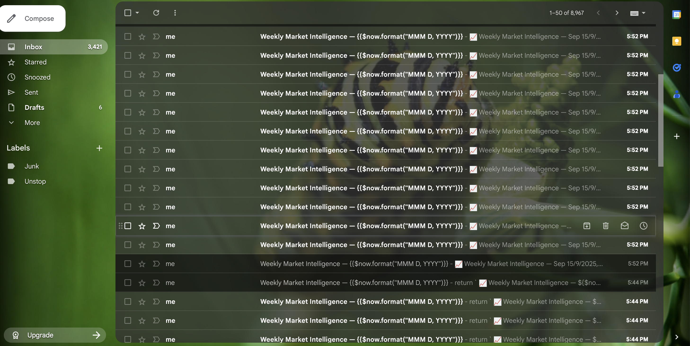

# Weekly Market Intelligence — n8n Guide (Cron → RSS → LLM → Email)

Follow it top‑to‑bottom once to build an automated weekly market brief that:
**(1) pulls new stock‑market articles → (2) summarizes with your LLM → (3) emails a beautiful HTML report.**

---

## Prerequisites
- You can access your n8n instance.
- Credentials created in **n8n → Credentials** for:
  - **Gmail** (or Email Send/SMTP) — for distribution
  - **Your LLM** (OpenAI / Anthropic / Google / Groq / etc.). The steps below work with any of them.
- (Optional) A Google account if you later want Google Docs/PDF output.

> Tip: You can test everything **manually** first; switch the Cron to “Specific times” later.

---

## 1) Create the workflow skeleton
1. Click **+ → Create workflow**, name it `Weekly Market Intelligence`.
2. Add **Cron** node.
   - **Mode:** Specific times
   - **Add time:** **Day = Friday**, **Hour = 16**, **Minute = 0**
   - **Timezone:** Your timezone (e.g., **Asia/Kolkata**)
   - Rename: `Cron — Friday 4PM`

---

## 2) Gather — RSS sources (Stock‑market news)
We’ll read two feeds and merge them. You can add/remove sources easily.

### 2.1 Add **RSS Read** (Node A)
- **URL:** `https://news.google.com/rss/search?q=stock+market&hl=en-IN&gl=IN&ceid=IN:en`
- Rename: `RSS — Google News`

### 2.2 Add **RSS Read** (Node B)
- **URL:** `https://www.moneycontrol.com/rss/MCtopnews.xml`
- Rename: `RSS — Moneycontrol`
- Connect **Cron → RSS — Google News** *and* **Cron → RSS — Moneycontrol** (two branches).

### 2.3 Merge the two RSS nodes
- Add **Merge** node → **Mode:** *Append*
- Connect **RSS — Google News** → **Merge (Input 1)**, **RSS — Moneycontrol** → **Merge (Input 2)**
- Rename: `Merge Feeds`

### 2.4 Remove duplicates (same links)
- Add **Remove Duplicates** node
  - **Fields to compare:** `link`
- Rename: `De‑dupe by Link`

### 2.5 Keep only the useful fields
- Add **Keep Fields**
  - **Mode:** `Keep`
  - **Fields:** `title`, `link`, `isoDate`, `pubDate`, `contentSnippet`
- Rename: `Keep Core Fields`

### 2.6 Filter to **last 7 days**
- Add **Function** node → Rename `Filter 7 Days`
- Paste this code:
```js
const sevenDaysAgo = new Date(Date.now() - 7*24*60*60*1000);
return items.filter(i => {
  const j = i.json;
  const d = new Date(j.isoDate || j.pubDate || j.date || j.published || '');
  return isFinite(d) && d >= sevenDaysAgo;
});
```

### 2.7 Limit how many to summarize (keeps costs down)
- Add **Limit** node
  - **Max items:** `15` (or your preference)
- Rename: `Limit 15`

> ✅ Up to here, the right panel should show a clean list of recent items with `title`, `link`, and `isoDate/pubDate`.

---

## 3) Prepare the LLM prompt (provider‑agnostic)
We’ll turn the RSS items into a compact input string for your LLM.

- Add **Function** node → Rename `Build Prompt`
- Code:
```js
const articles = $items().map(i => i.json);
const pretty = articles.map((a, idx) => {
  const d = a.isoDate || a.pubDate || '';
  return `${idx+1}. ${a.title} — ${d}\n${a.link}`;
}).join('\n\n');

const system = [
  "You are a senior market analyst writing a crisp executive brief.",
  "Audience: business leaders. Be factual, neutral, and concise.",
  "Structure: 1) Macro & Policy 2) Equities overview 3) Sectors/themes 4) Risks 5) What to watch next week.",
  "Use bullets where helpful. Include source mentions in parentheses only when relevant.",
].join(" ");

const user = `Summarize the last week in markets from these articles. Keep it under 300-500 words.\n\n${pretty}`;

return [{ json: { system, user } }];
```

---

## 4) Analyze — LLM summary (works with any provider)
Add your preferred **Chat** node (OpenAI / Anthropic / Google / Groq).

- **System message:** `={{ $json.system }}`
- **User message:** `={{ $json.user }}`
- **Temperature:** `0.3 – 0.5`
- **Max tokens:** `~600–900`
- Rename: `LLM — Executive Brief`

> **Provider‑agnostic extractor** (you’ll use it in the next step):
> ```
> {{$json.text
>   || $json.output
>   || ($json.choices && $json.choices[0] && ($json.choices[0].message?.content || $json.choices[0].text))
>   || $json.summary
>   || ''}}
> ```

---

## 5) Format — Build a polished HTML email body
- Add **Set** node → **Add Field**: `EMAIL_HTML` → **Type:** *String*
- Click **Expression** (fx) and paste the block below (it returns the full HTML string):

```js
{{
const summary =
  $json.text
  || $json.output
  || ($json.choices && $json.choices[0] && ($json.choices[0].message?.content || $json.choices[0].text))
  || $json.summary
  || '';

const articlesHtml = $items(0,15).map(i => {
  const j = i.json;
  const d = j.isoDate || j.pubDate || '';
  const t = (j.title || '').replaceAll('<','&lt;').replaceAll('>','&gt;');
  return `<li><a href="${j.link}">${t}</a> <small>— ${d}</small></li>`;
}).join('');

return `<!doctype html>
<html><head>
<meta charset="utf-8" />
<style>
 body{font:14px/1.65 -apple-system,BlinkMacSystemFont,Segoe UI,Arial;color:#1f2937;margin:0}
 .hdr{background:#0f172a;color:#fff;padding:22px}
 .wrap{max-width:900px;margin:0 auto;padding:24px}
 h1{margin:0;font-size:22px}
 h2{margin:20px 0 8px}
 .card{background:#f8fafc;border:1px solid #e5e7eb;border-radius:10px;padding:16px}
 .list li{margin:6px 0}
 a{color:#2563eb;text-decoration:none}
 small{color:#6b7280}
</style>
</head><body>
 <div class="hdr">
   <h1>📈 Weekly Market Intelligence — ${$now.format("MMM D, YYYY")}</h1>
 </div>
 <div class="wrap">
   <h2>Executive Brief</h2>
   <div class="card">${summary}</div>

   <h2>Articles (last 7 days)</h2>
   <ol class="list">${articlesHtml}</ol>
 </div>
</body></html>`;
}}
```

Rename this node: `Build HTML`.

---

## 6) Distribute — Email it
Add **Gmail** (or **Email Send**) node.

- **To:** your recipients (comma‑separated)
- **Subject:** `Weekly Market Intelligence — {{$now.format("MMM Do, YYYY")}}`
- **Body (HTML):** `={{ $json.EMAIL_HTML }}`
- Rename: `Email Brief`

> Optional add‑ons later:
> - Google Docs → Create & Append the summary
> - Google Drive → Export to PDF → Gmail → attach **binary**

---

## 7) Fail‑safes (optional but recommended)
- Add an **IF** node right after `Filter 7 Days`.
  - Condition: **“Number of Items” → “Greater than” → 0**
  - **True** path → continues to `Limit 15 → Build Prompt → LLM → Build HTML → Email`.
  - **False** path → **Gmail** node that sends a short “No relevant articles this week.” message.

---

## 8) Test it
1. Temporarily set **Cron → Every minute** and run once, or click **Execute workflow** starting at `RSS — Google News` to preview.
2. Check the right panel outputs at each step (RSS → Merge → De‑dupe → Filter → Prompt → LLM).
3. If the LLM returns under a different field (e.g., `choices[0].message.content`), the **provider‑agnostic extractor** in the Set node already handles that.

---


---

## That’s it!
Turn the workflow **Active** once you like the output. Your market brief will now arrive every Friday at 4 PM 🎉.
