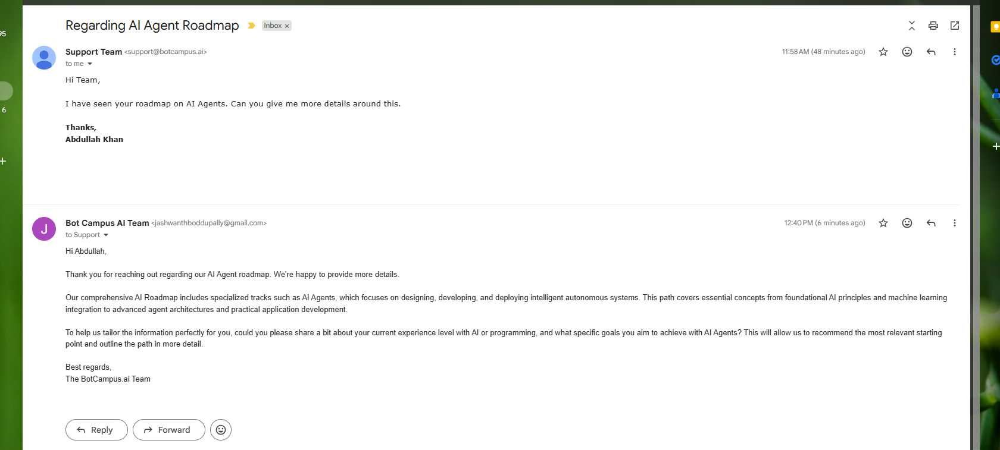

# Intelligent Email Assistant (n8n) — Guide

> **Uses Google Gemini 2.5 Flash (Chat Model)** to draft replies automatically from incoming Gmail messages, logs every email + AI response to Google Sheets, and replies in the same thread.


*Figure 1 — n8n canvas overview.*


---

## ⚠️ Authentication (Required Before You Start)

- **Gmail (OAuth2)** — enable Gmail API in Google Cloud → create OAuth2 credentials → set callback:  
  `http://localhost:5678/rest/oauth2-credential/callback` → connect **Gmail Trigger** and **Gmail (Reply to a message)** nodes.
- **Google Sheets (OAuth2)** — enable Google Sheets + Drive APIs → connect **Google Sheets > Append** node. Share the sheet with the authorized Google account.
- **Gemini API Key** — create a key in Google AI Studio → configure **Google Gemini Chat Model** node (Model: `Gemini 2.5 Flash`).

> If you see “403 access_denied” during OAuth, double‑check the OAuth client, scopes, and redirect URI exactly as above.

---

## Workflow Flow (Input → Process → Output)

**Gmail Trigger** ➝ **Normalize Email (Set)** ➝ **Sheet Id (Set)** ➝ **Google Sheets: Append row** ➝ **AI Agent** *(Chat Model: Google Gemini 2.5 Flash)* ➝ **Code (JavaScript)** ➝ **Gmail: Reply to a message**

---

## Node‑by‑Node Setup (Drag, Drop, Configure)

> In n8n, drag each node onto the canvas in the order below. Connect them left ➝ right exactly as shown in Figure 1.

### 1) Gmail Trigger
- **Operation:** *Watch Emails*
- **Resource:** *Message*
- **Polling:** every 1 or 5 minutes (your choice)
- **Filters (optional but recommended):**
  - *Label IDs:* `INBOX`
  - *Only Unread:* `true`
- **Outputs you’ll use later:** `id`, `threadId`, `from`, `to`, `subject`, `textPlain` (or `textHtml`).

### 2) Normalize Email (Set)
Create a **Set** node to standardize fields for all downstream nodes.

- **Keep Only Set:** `true`
- **Add Fields → String:**

  | Field | Expression (copy‑paste) |
  |---|---|
  | `ID` | `{{$json.id || $json.ID}}` |
  | `To Reply` | `{{($json.to || '').split(',')[0]}}` |
  | `Subject` | `{{$json.subject}}` |
  | `Body` | `{{$json.textPlain || $json.textHtml || $json.body}}` |
  | `FromEmail` | `{{($json.from || '').split('<').pop().replace('>','')}}` |
  | `ThreadId` | `{{$json.threadId}}` |

> This gives us a consistent payload: **ID**, **To Reply**, **Subject**, **Body**, **FromEmail**, **ThreadId**.

### 3) Sheet Id (Set)
Another **Set** node that holds your Google Sheet information.

- **Keep Only Set:** `false`
- **Add Fields → String:**

  | Field | Value |
  |---|---|
  | `SheetDocId` | `1AbCdEfGhIjKlMnOpQrStUvWxYz` *(replace with your real Google Sheet ID)* |
  | `SheetTab` | `emails` |

> Share this Sheet with the same account used in n8n’s Google credentials.

### 4) Google Sheets — Append row
Node: **Google Sheets** → **Operation:** *Append*

- **Document ID:** `={{$json.SheetDocId}}`
- **Sheet Name:** `={{$json.SheetTab}}`
- **Data to Send → Use Fields Below:**

  | Column | Expression |
  |---|---|
  | `timestamp` | `={{$now}}` |
  | `from` | `={{$json.FromEmail}}` |
  | `to` | `={{$json['To Reply']}}` |
  | `subject` | `={{$json.Subject}}` |
  | `body` | `={{$json.Body}}` |
  | `threadId` | `={{$json.ThreadId}}` |

> This logs every inbound message before AI processing.

### 5) AI Agent + Google Gemini Chat Model
- **AI Agent** node: use the **Google Gemini Chat Model** as the **Chat Model** input.
- **Model:** `Gemini 2.5 Flash`
- **System Prompt (copy‑paste):**

```
You are BotCampus.ai, an AI assistant that replies to emails about learning resources and roadmaps.
Offerings at a high level:
- Roadmaps: AI, N8n Automation (no‑code), Python, Java, ML, NLP, Deep Learning, Web (HTML/CSS), and related tracks.
- Courses: Beginner → Advanced paths in the same domains (concepts, prerequisites, outcomes, typical time commitment).

GOALS
1) Understand the user's intent from Subject + Body: roadmap request, course info, enrollment/schedule, pricing/billing, troubleshooting/support, or other.
2) Match tone: friendly, concise, professional.
3) Answer clearly and helpfully, propose next steps or a call to action.

FORMAT (strict)
REPLY:
<write the email reply in plain text>

SUBJECT:
<short subject line without prefixes>
```

- **User Message Template (copy‑paste):**

```
Incoming Email
ID: {{$json.ID}}
To Reply: {{$json['To Reply']}}
Subject: {{$json.Subject}}
Body: {{$json.Body}}
```

> The agent returns a single string with `REPLY:` and `SUBJECT:` sections.

### 6) Code (JavaScript)
Parses the AI output into fields needed by Gmail.

> **Execute Once**: `false` (default). Paste the code below into the **Function** field.

```javascript
// Expects the AI Agent's text in $json.data or $json.text (n8n models vary).
// Normalizes and extracts REPLY and SUBJECT blocks.

const raw =
  $json.output
  || $json.text
  || $json.data
  || $json.choices?.[0]?.message?.content
  || $json.choices?.[0]?.text
  || '';

let body = String(raw || '').trim();

// Optional first line JSON (e.g., {"needs_human": true})
const firstLine = body.split('\n',1)[0].trim();
let needs_human = false;
if (firstLine.startsWith('{') && firstLine.endsWith('}')) {
  try {
    const meta = JSON.parse(firstLine);
    if (typeof meta.needs_human === 'boolean') needs_human = meta.needs_human;
    body = body.slice(firstLine.length).trim();
  } catch {}
}

function pick(tag) {
  const rx = new RegExp(`${tag}:[\s\S]*?(?=\n\w+:|$)`, 'i');
  const m = body.match(rx);
  return m ? m[0].split(':').slice(1).join(':').trim() : '';
}

const replyText = pick('REPLY');
let replySubject = pick('SUBJECT');

// Fallbacks
const originalSubject = $json.Subject || '';
if (!replySubject) replySubject = originalSubject.replace(/^\s*re:\s*/i, '') || 'Re: Your email';
const finalSubject = originalSubject?.match(/^\s*re:/i) ? originalSubject : `Re: ${replySubject}`;

// Output for next node
return [
  {
    json: {
      replyText,
      replySubject: finalSubject,
      needs_human,
      threadId: $json.ThreadId,
      to: $json['To Reply']
    }
  }
];
```

### 7) Gmail — Reply to a message
- **Resource:** *Message*
- **Operation:** *Reply*
- **Thread ID:** `={{$json.threadId}}`
- **To:** `={{$json.to}}`
- **Subject:** `={{$json.replySubject}}`
- **Message:** `={{$json.replyText}}`

> This sends the AI‑generated reply back in the same Gmail thread (see Figure 2).
---


*Figure 2 — Example reply generated by the Gemini Chat model.*

---

## Test Checklist
1. Send a test email to the mailbox connected in the Gmail Trigger.
2. In n8n, **Activate** the workflow, then click **Execute workflow** once to prime OAuth if needed.
3. Confirm a new row appears in Google Sheets with the email details.
4. Check the Gmail thread for the AI reply.

---

## Troubleshooting
- **OAuth “access_denied”**: verify redirect URI and scopes; restart OAuth.
- **No reply sent**: ensure the **Code** node outputs `replyText`, `replySubject`, `threadId`, `to`.
- **Sheet not updating**: confirm Document ID, Sheet name, and that the n8n Google account can edit the sheet.
- **Wrong label/poll settings**: adjust **Gmail Trigger** filters so new email is captured.

