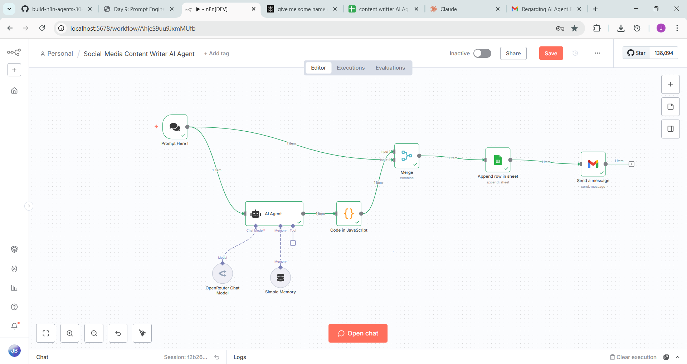
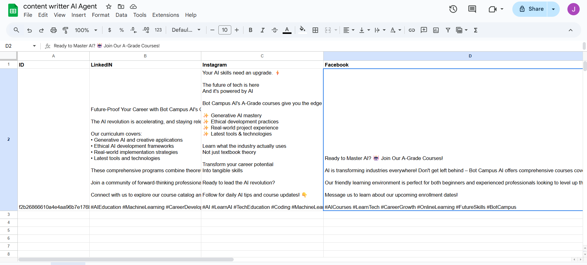
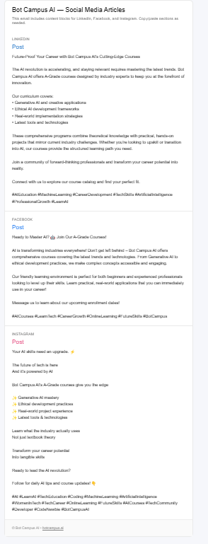

# Social‑Media Content Writer AI Agent (n8n) — OpenRouter Route
One‑line goal: Turn one prompt into platform‑perfect posts (LinkedIn, Facebook, Instagram), log to Google Sheets, and email an HTML bundle.

## At‑a‑glance outcomes
- Chat in **n8n Chat Trigger** → 3 posts generated & split → saved to **Google Sheets** → sent via **Gmail (HTML)**
- Clean JSON from LLM; resilient parsing in a **Code** node
- Ready to expand to image upload and schedulers

## ⚠️ Prereqs & Auth (do this first)
- **OpenRouter API Key**: create at openrouter.ai → add **Credentials → OpenRouter** in n8n.
- **Google Sheets (OAuth2)**: enable **Sheets + Drive** → add **Credentials → Google** with both scopes.
- **Gmail (OAuth2)**: enable **Gmail API** → add **Credentials → Gmail**.

## Architecture snapshot (nodes/tools)
1) **Chat Trigger** → 2) **OpenRouter Chat Model** → 3) **AI Agent (System Prompt)** → 4) **Simple Memory** → 5) **Code (split JSON)** → 6) **Merge (Combine All)** → 7) **Google Sheets: Append** → 8) **Gmail: Send a message (HTML)**

---

## Figure — Workflow canvas


---

## Step‑by‑Step (with inline copy‑paste blocks)

### 1) Chat Trigger — “Prompt Here!”
- Welcome message: `Tell me your topic, audience, tone, and (optional) link.`
- Provides a stable `sessionId` for logging.

**Expression to reuse in Sheets → `ID` column:**
```
={{ $('Prompt Here!').item.json.sessionId }}
```

---

### 2) OpenRouter Chat Model (LLM call)
- **Credentials:** your OpenRouter key
- **Model/Route:** `deepseek/deepseek-chat-v3.1:free` *(or any Mistral/DeepSeek route)*
- **Temperature:** `0.7`
- **User Message**:
```
={{ $('Prompt Here!').item.json.message }}
```

---

### 3) AI Agent — System Prompt
Paste the **System Prompt** into the node's **System** field.

```text
You are a Social Media Content Writer AI Agent for LinkedIn, Facebook, and Instagram.

MISSION
Turn the user's PROMPT into three platform-specific posts (separate articles) that are clear, actionable, and brand-safe. Optimize for each platform’s tone, structure, and character norms. Output must be clean JSON only (no markdown, no code fences).

INPUTS (from n8n JSON)
- PROMPT_TEXT: {{ $json.message || '' }}
- BRAND: {{ $json.brand || '' }}
- AUDIENCE: {{ $json.audience || '' }}
- LINK_URL: {{ $json.link || '' }}
- TONE: {{ $json.tone || '' }}
- LANGUAGE: {{ $json.language || 'English' }}
- EXTRA_TAGS: {{ $json.extra_tags || '' }}

CONSTRAINTS & STYLE BY PLATFORM
1) LinkedIn
   - 120–220 words, 1–3 short paragraphs (may include a tight bullet list)
   - Professional, value-led, minimal emojis (0–2 total), 3–8 hashtags at end
   - Add 1 clear CTA; mention LINK_URL once if provided
2) Facebook
   - 60–120 words, conversational
   - Up to 1 emoji per sentence (optional), 3–6 hashtags
   - CTA with LINK_URL if provided
3) Instagram
   - 80–150 words, strong hook in first 120 chars
   - Line breaks, 8–15 hashtags; CTA (“Save”, “Follow”, “DM”)
   - If LINK_URL provided: say “Link in bio” unless your style allows the link

WHAT TO INCLUDE IN EVERY POST
- Title/headline that fits the platform
- Core value/insight customized to AUDIENCE
- One specific CTA
- 3–5 image_ideas
- Hashtags as an ARRAY (not inline text)
- Keep brand-safe; don’t invent facts; use LANGUAGE
- If LINK_URL exists, integrate naturally

SECTION: PROMPT
Echo the user’s prompt in the final JSON as "prompt_echo" so we can archive it in Sheets.

OUTPUT FORMAT (STRICT JSON ONLY)
{
  "project": "social-posts",
  "prompt_echo": "<verbatim copy of PROMPT_TEXT>",
  "brand": "<BRAND>",
  "tone": "<TONE>",
  "language": "<LANGUAGE>",
  "posts": [
    {
      "platform": "LinkedIn",
      "title": "<headline>",
      "body": "<post text>",
      "hashtags": ["#Example", "#Another"],
      "cta": "<one CTA>",
      "image_ideas": ["<idea1>", "<idea2>", "<idea3>"],
      "link": "<LINK_URL or ''>",
      "word_count": <integer>
    },
    {
      "platform": "Facebook",
      "title": "<headline>",
      "body": "<post text>",
      "hashtags": ["#Example"],
      "cta": "<one CTA>",
      "image_ideas": ["<idea1>", "<idea2>", "<idea3>"],
      "link": "<LINK_URL or ''>",
      "word_count": <integer>
    },
    {
      "platform": "Instagram",
      "title": "<hook-style headline>",
      "body": "<post text with line breaks>",
      "hashtags": ["#Example"],
      "cta": "<one CTA>",
      "image_ideas": ["<idea1>", "<idea2>", "<idea3>"],
      "link": "<LINK_URL or ''>",
      "word_count": <integer>
    }
  ],
  "rows": [
    {
      "timestamp": "{{ $now }}",
      "platform": "LinkedIn",
      "title": "<title>",
      "body": "<body>",
      "hashtags_joined": "#tag1 #tag2 #tag3",
      "cta": "<cta>",
      "link": "<LINK_URL or ''>",
      "image_ideas_joined": "<idea1> | <idea2> | <idea3>",
      "tone": "<TONE>",
      "language": "<LANGUAGE>",
      "prompt_echo": "<PROMPT_TEXT>"
    },
    {
      "timestamp": "{{ $now }}",
      "platform": "Facebook",
      "title": "<title>",
      "body": "<body>",
      "hashtags_joined": "#tag1 #tag2 #tag3",
      "cta": "<cta>",
      "link": "<LINK_URL or ''>",
      "image_ideas_joined": "<idea1> | <idea2> | <idea3>",
      "tone": "<TONE>",
      "language": "<LANGUAGE>",
      "prompt_echo": "<PROMPT_TEXT>"
    },
    {
      "timestamp": "{{ $now }}",
      "platform": "Instagram",
      "title": "<title>",
      "body": "<body>",
      "hashtags_joined": "#tag1 #tag2 #tag3",
      "cta": "<cta>",
      "link": "<LINK_URL or ''>",
      "image_ideas_joined": "<idea1> | <idea2> | <idea3>",
      "tone": "<TONE>",
      "language": "<LANGUAGE>",
      "prompt_echo": "<PROMPT_TEXT>"
    }
  ]
}
VALIDATION
- Return ONLY valid JSON. No explanations, no markdown, no backticks.
- Arrays must be arrays, not strings.
- If unknown, use "".
```

---

### 4) Simple Memory
- **Type:** Buffer Window, **Window length:** `15`.

---

### 5) Code (Function) — Split AI Output
Paste into a **Function** node:
```javascript
/** n8n Function node: split AI output into LinkedIn/Facebook/Instagram */
function getRaw(llm){if(!llm)return'';if(typeof llm==='string')return llm;if(llm.output)return String(llm.output);if(llm.text)return String(llm.text);if(llm.data)return String(llm.data);if(Array.isArray(llm.choices)){const c0=llm.choices[0];if(c0?.message?.content)return String(c0.message.content);if(c0?.text)return String(c0.text)}return''}
function stripCodeFences(s){const t=String(s).trim();if(t.startsWith('```')){let x=t.replace(/^```[\w-]*\s*/,'');if(x.endsWith('```'))x=x.slice(0,-3);return x.trim()}return t}
function tryParseJson(s){try{return JSON.parse(s)}catch(_){const f=s.indexOf('{'),l=s.lastIndexOf('}');if(f!==-1&&l!==-1&&l>f){const cut=s.slice(f,l+1);try{return JSON.parse(cut)}catch{}}}return null}
function pickId(j){return j.ID??j.Id??j.id??j.Id_??''}
function normTags(h){if(!h)return'';return Array.isArray(h)?h.join(' '):String(h)}
function composeFromPost(p){if(!p)return'';const title=p.title?`${p.title}\n\n`:'';const body=p.body?`${p.body}`:'';const tags=normTags(p.hashtags);const cta=p.cta?`\n\n${p.cta}`:'';const link=p.link?`\n${p.link}`:'';const hashtags=tags?`\n\n${tags}`:'';return `${title}${body}${cta}${link}${hashtags}`.trim()}
function fromJson(obj){const out={LinkedIn:'',Facebook:'',Instagram:''};const posts=Array.isArray(obj?.posts)?obj.posts:[];const rows=Array.isArray(obj?.rows)?obj.rows:[];if(posts.length){const m={};for(const p of posts){const n=String(p.platform||'').toLowerCase();m[n]=composeFromPost(p)}out.LinkedIn=m.linkedin||'';out.Facebook=m.facebook||'';out.Instagram=m.instagram||''}
if((!out.LinkedIn||!out.Facebook||!out.Instagram)&&rows.length){const m={};for(const r of rows){const n=String(r.platform||'').toLowerCase();const tags=r.hashtags_joined||normTags(r.hashtags);const body=r.body||'';const title=r.title?`${r.title}\n\n`:'';const cta=r.cta?`\n\n${r.cta}`:'';const link=r.link?`\n${r.link}`:'';const text=`${title}${body}${cta}${link}${tags?`\n\n${tags}`:''}`.trim();m[n]=text}out.LinkedIn||=m.linkedin||'';out.Facebook||=m.facebook||'';out.Instagram||=m.instagram||''}return out}
function fromHeadings(raw){const out={LinkedIn:'',Facebook:'',Instagram:''};const pat=/^\s*(LinkedIn|Facebook|Instagram)\s*:?\s*$/i;const lines=raw.split(/\r?\n/);const sect=[];for(let i=0;i<lines.length;i++){if(pat.test(lines[i])){const name=lines[i].match(pat)[1];sect.push({name,start:i})}}sect.push({name:'__END__',start:lines.length});for(let i=0;i<sect.length-1;i++){const name=sect[i].name;const start=sect[i].start+1;const end=sect[i+1].start;const text=lines.slice(start,end).join('\n').trim();if(/^linkedin$/i.test(name))out.LinkedIn=text;if(/^facebook$/i.test(name))out.Facebook=text;if(/^instagram$/i.test(name))out.Instagram=text}return out}
const out=[];for(const item of items){const j=item.json||{};const ID=pickId(j);let raw=getRaw(j);raw=stripCodeFences(raw);let obj=tryParseJson(raw);let L='',F='',I='';if(obj){const s=fromJson(obj);L=s.LinkedIn;F=s.Facebook;I=s.Instagram}if(!L&&!F&&!I&&raw){const s=fromHeadings(raw);L=s.LinkedIn;F=s.Facebook;I=s.Instagram}out.push({json:{ID,LinkedIn:L||'',Facebook:F||'',Instagram:I||''}})}return out;
```

---

### 6) Merge — Combine All
- **Mode:** **Combine** → **Combine All**.

---

### 7) Google Sheets — Append
- **Spreadsheet:** your Sheet URL
- **Sheet name:** `Sheet1`
- **Map columns**:

`ID`:
```
={{ $('Prompt Here!').item.json.sessionId }}
```
`LinkedIn`:
```
={{ $json.LinkedIn }}
```
`Facebook`:
```
={{ $json.Facebook }}
```
`Instagram`:
```
={{ $json.Instagram }}
```

**Figure — Google Sheets rows**


---

### 8) Gmail — Send a message (HTML)
- **To:** you@yourmail.com
- **Subject:** `AGENTIC AI – Social Content Pack`
- **Email Type:** **HTML**
- **Body HTML** (bind post outputs):

```html
<!doctype html>
<html>
  <body style="margin:0;padding:24px;background:#f6f7f9;font-family:Inter,Arial,sans-serif;">
    <table role="presentation" width="100%" cellspacing="0" cellpadding="0">
      <tr><td align="center">
        <table role="presentation" width="680" cellspacing="0" cellpadding="0" style="max-width:680px;background:#ffffff;border:1px solid #e5e7eb;border-radius:12px;overflow:hidden;">
          <tr>
            <td style="background:#0ea5e9;color:#fff;padding:18px 22px;font-size:18px;font-weight:600;">
              Social Content Bundle (LinkedIn • Facebook • Instagram)
            </td>
          </tr>
          <tr>
            <td style="padding:20px 22px;">
              <h3 style="margin:0 0 8px;font-size:16px;">LinkedIn</h3>
              <pre style="white-space:pre-wrap;font-family:inherit;line-height:1.5;margin:0 0 16px;">{{ $json.LinkedIn }}</pre>

              <h3 style="margin:0 0 8px;font-size:16px;">Facebook</h3>
              <pre style="white-space:pre-wrap;font-family:inherit;line-height:1.5;margin:0 0 16px;">{{ $json.Facebook }}</pre>

              <h3 style="margin:0 0 8px;font-size:16px;">Instagram</h3>
              <pre style="white-space:pre-wrap;font-family:inherit;line-height:1.5;margin:0;">{{ $json.Instagram }}</pre>
            </td>
          </tr>
          <tr>
            <td style="padding:16px 22px;color:#64748b;font-size:12px;border-top:1px solid #e5e7eb;">
              Generated by n8n • OpenRouter • {{ $now }}
            </td>
          </tr>
        </table>
      </td></tr>
    </table>
  </body>
</html>
```

**Figure — HTML email preview**


---

## How to Run
1) Test all three credentials.  
2) **Activate** workflow → **Open chat**.  
3) Send a prompt (topic + audience + tone + optional link).  
4) Verify **Function** node output.  
5) Confirm Sheet row + Inbox email.

## Troubleshooting
- **LLM returns markdown/fences:** handled by code; keep JSON‑only in System Prompt.
- **Empty posts:** ensure Agent returns `posts[]` or `rows[]`.
- **Sheets not updating:** share access, correct tab name, use **Append**.
- **Email shows raw `{{ }}`:** set **Email Type** to **HTML**.

---

## Files in this package
- `workflow.json` — importable n8n skeleton with all nodes wired.
- `Guide.md` — this step‑by‑step guide.
- `images/` — screenshots (canvas, email preview, sheet rows).
