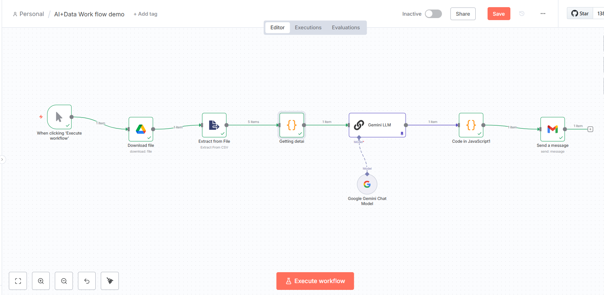
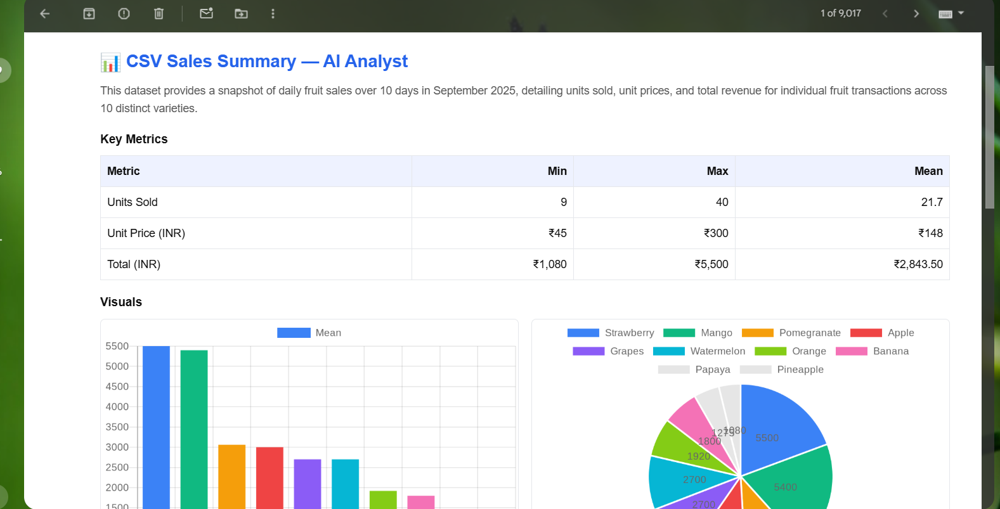
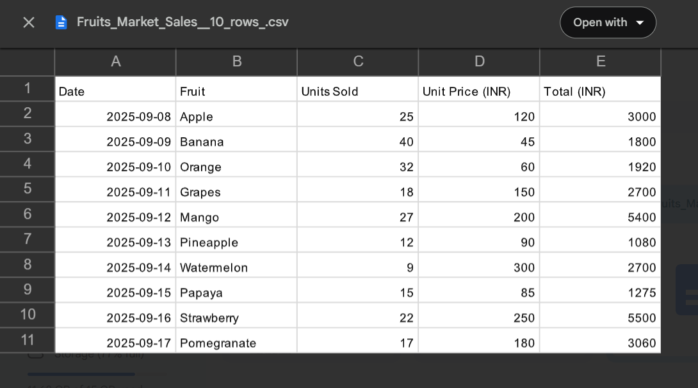

# AI + Data: CSV → LLM → Charts → Gmail (n8n)

> Ultra‑clean, copy‑paste ready guide to build your workflow that downloads a CSV from Google Drive, summarizes it with an AI agent, renders **Bar/Pie/Line** charts via QuickChart, and emails a polished report in Gmail.

---

## Flow Overview



**Nodes (left → right)**  
`Manual Trigger` → `Google Drive: Download file` → `Extract from File` → `Code (build summaryContext)` → `Gemini LLM` → `Code (charts + email fields)` → `Gmail: Send message`

---

## 0) Prerequisites

- An n8n instance
- Google Drive & Gmail creds connected
- (Optional) Gemini/OpenAI cred for your LLM node
- A public **CSV in Drive** (any file works; grant “Anyone with the link – Viewer”). Copy its **fileId** from the URL:  
  `https://drive.google.com/file/d/<FILE_ID>/view?...`

---

## 1) Google Drive → Download file

**Node:** *Google Drive* → *Operation: Download*  
**fileId:** your Drive `FILE_ID` (make file publicly accessible)

> Tip: If you’re switching to an “on upload” automation, use Google Drive Trigger or Poll changes; the rest stays the same.

---

## 2) Extract from File (CSV → JSON)

**Node:** *Extract from File*  
No special settings. This emits 1 JSON item per CSV row.

---

## 3) Code (build `summaryContext` for the AI)

**Node:** *Code (JavaScript)* → **Run Once for All Items**  
Paste this code:

```js
// Input: many items from "Extract From File"
// Output: ONE item with {summaryContext, columns, rowCount}

const rows = items.map(i => i.json);
const rowCount = rows.length;
if (rowCount === 0) {
  return [{ json: { summaryContext: "No rows found.", columns: [], rowCount: 0 } }];
}

// derive columns from first row
const columns = Object.keys(rows[0]);

// detect numeric columns
const numericCols = columns.filter(c =>
  rows.every(r => r[c] === null || r[c] === undefined || r[c] === "" || !isNaN(Number(r[c])))
);

// quick stats
const stats = {};
for (const c of numericCols) {
  const nums = rows.map(r => Number(r[c])).filter(v => !isNaN(v));
  if (nums.length) {
    const sum = nums.reduce((a,b)=>a+b,0);
    stats[c] = {
      count: nums.length,
      min: Math.min(...nums),
      max: Math.max(...nums),
      mean: Number((sum/nums.length).toFixed(2))
    };
  }
}

// sample up to 10 rows to keep prompt small
const sample = rows.slice(0, 10);

const summaryContext = {
  meta: {
    rowCount,
    columns,
    numericColumns: numericCols
  },
  quickStats: stats,
  sampleRows: sample
};

return [{
  json: {
    columns,
    rowCount,
    summaryContext: JSON.stringify(summaryContext, null, 2)
  }
}];
```

---

## 4) Gemini LLM (Prompt Template)

**Node:** *LLM Chain (Gemini)* → *Prompt type: Define*  
Paste the following prompt text:

```text
You are a precise data analyst. Produce a compact, Gmail‑friendly analysis of a CSV dataset.

INPUT
The variable {{ $json.summaryContext }} is a JSON string containing:
- meta.rowCount, meta.columns, meta.numericColumns
- quickStats: for each numeric column → {count, min, max, mean}
- sampleRows: up to 10 example rows

OBJECTIVE
Return a single JSON object (no prose) with the keys:
{
  "overview": "1 short paragraph (~1–2 lines) that states rowCount and (if visible) the date range",
  "keyMetrics": [
    {"metric":"Units Sold","min":...,"max":...,"mean":...},
    {"metric":"Unit Price (INR)","min":...,"max":...,"mean":...},
    {"metric":"Total (INR)","min":...,"max":...,"mean":...}
  ],
  "insights": ["bullet 1","bullet 2","bullet 3"],
  "nextSteps": ["action 1","action 2"],
  "chartData": {
    "bar":  { "labels": [...], "values": [...] },
    "pie":  { "labels": [...], "values": [...] },
    "line": { "labels": [...], "values": [...] }
  }
}

RULES
- Use INR formatting where appropriate (₹ with thousand separators) for text values in overview/insights.
- Do NOT include any schema/columns listing.
- Keep wording neutral and business‑like.
- If a chart series is unclear, infer sensible labels/values from sampleRows and quickStats.
- Return ONLY valid JSON (no backticks, no explanations).
```

**Output format:** JSON (string or object is fine; next step is robust).

---

## 5) Code (build charts + normalize AI JSON)

**Node:** *Code (JavaScript)* → **Run Once for All Items**  
Paste this resilient builder. It accepts either **structured** or **stringified** LLM output, and **falls back** to `summaryContext` if needed. It also fabricates **QuickChart** URLs for Bar/Pie/Line.

```js
// Robust charts builder from LLM output (string or object) with graceful fallback.
// Place this Code node immediately AFTER the LLM node.

function extractAIJson(payload) {
  // 1) Already structured?
  if (payload && typeof payload === 'object' && (payload.overview || payload.keyMetrics || payload.chartData)) {
    return payload;
  }
  const s = String(payload?.text ?? payload?.output ?? payload?.completion ?? '').trim();
  if (!s) return null;

  // 2) Remove code fences if present
  let raw = s.replace(/^```(?:json)?\s*/i, '').replace(/```$/i, '').trim();

  // 3) Normalize smart quotes and trailing commas
  raw = raw.replace(/[“”]/g, '"').replace(/[‘’]/g, "'")
           .replace(/,\s*([}\]])/g, '$1');

  // 4) Try JSON parse
  try { return JSON.parse(raw); } catch {}

  // 5) Try extracting largest {...} block
  const start = raw.indexOf('{'); const end = raw.lastIndexOf('}');
  if (start !== -1 && end !== -1) {
    const block = raw.slice(start, end + 1);
    try { return JSON.parse(block); } catch {}
  }

  // 6) One more attempt: convert single‑quoted strings to double quotes
  try {
    const fixed = raw.replace(/'([^'\\]*?)'/g, (_, g) => `"${g.replace(/"/g, '\\"')}"`);
    return JSON.parse(fixed);
  } catch {}

  return null;
}

function num(v) { const n = Number(v); return Number.isFinite(n) ? n : null; }
function makeChart(type, data, options = {}) {
  const chart = {
    type,
    data,
    options: Object.assign({
      plugins: {
        legend: { labels: { font: { size: 14 }, color: "#111" } },
        title: { display: true, text: type.toUpperCase() + " Chart", color: "#111" }
      },
      scales: (type !== "pie") ? { x: { ticks: { color: "#111" } }, y: { ticks: { color: "#111" } } } : undefined
    }, options)
  };
  // Small footprint for email rendering. Tweak width/height as desired.
  const base = "https://quickchart.io/chart";
  const query = "c=" + encodeURIComponent(JSON.stringify(chart)) + "&width=640&height=360&devicePixelRatio=2";
  return `${base}?${query}`;
}

// ---------- INPUT ----------
const payload = items[0]?.json ?? {};
let ai = extractAIJson(payload);

// ---------- FALLBACK from summaryContext ----------
let summary = {};
if (!ai) {
  if (typeof payload.summaryContext === "string") {
    try { summary = JSON.parse(payload.summaryContext) || {}; } catch {}
  }
  const rowCount = summary?.meta?.rowCount ?? 'N';
  const cols = summary?.meta?.columns ?? [];
  const quick = summary?.quickStats ?? {};

  const keyMetrics = Object.keys(quick).map(k => ({
    metric: k, min: quick[k]?.min, max: quick[k]?.max, mean: quick[k]?.mean
  }));

  ai = {
    overview: `Dataset with ${rowCount} rows and ${cols.length} columns.`,
    keyMetrics,
    insights: [],
    nextSteps: [],
    sampleRows: summary?.sampleRows ?? []
  };
}

// ---------- Build chart series ----------
const keyMetrics = Array.isArray(ai.keyMetrics) ? ai.keyMetrics : [];
let sampleRows = Array.isArray(ai.sampleRows) ? ai.sampleRows : [];

// BAR (means from keyMetrics, or provided chartData)
const barLabels = ai?.chartData?.bar?.labels ?? keyMetrics.map(m => m.metric).filter(Boolean);
const barValues = ai?.chartData?.bar?.values ?? keyMetrics.map(m => num(m.mean)).filter(v => v !== null);

// PIE (category/fulfillment distribution or provided)
let pieLabels = ai?.chartData?.pie?.labels;
let pieValues = ai?.chartData?.pie?.values;
if (!pieLabels || !pieValues) {
  if (sampleRows.length) {
    const pick = (r) => r.Category ?? r["Product Category"] ?? r.Fulfillment ?? r["Fulfillment"] ?? "Other";
    const counts = {};
    for (const r of sampleRows) counts[pick(r)] = (counts[pick(r)] ?? 0) + 1;
    const entries = Object.entries(counts);
    if (entries.length) {
      pieLabels = entries.map(([k]) => k);
      pieValues = entries.map(([, v]) => v);
    }
  }
  if (!pieLabels || !pieValues) { pieLabels = barLabels.slice(); pieValues = barValues.slice(); }
}

// LINE (date vs total/price/units or provided)
let lineLabels = ai?.chartData?.line?.labels;
let lineValues = ai?.chartData?.line?.values;
if (!lineLabels || !lineValues) {
  if (sampleRows.length) {
    const keys = Object.keys(sampleRows[0] ?? {});
    const dateKey = keys.find(k => /date/i.test(k));
    const candidates = ["Total (INR)", "Sales (INR, incl. GST)", "Item Price (INR)", "Units Sold"];
    const valKey = candidates.find(k => k in (sampleRows[0] ?? {})) ?? keys.find(k => num(sampleRows[0][k]) !== null);
    if (valKey) {
      const series = sampleRows.slice(0, 30).map((r, i) => ({
        label: String(dateKey ? r[dateKey] : `#${i + 1}`),
        value: num(r[valKey])
      })).filter(p => p.value !== null);
      if (series.length) {
        lineLabels = series.map(p => p.label);
        lineValues = series.map(p => p.value);
      }
    }
  }
  if (!lineLabels || !lineValues) { lineLabels = barLabels.slice(); lineValues = barValues.slice(); }
}

// ---------- Use existing chart URLs if LLM already made them ----------
let chartUrls = ai.chartUrls && ai.chartUrls.bar && ai.chartUrls.pie && ai.chartUrls.line
  ? ai.chartUrls
  : {
      bar: makeChart("bar", {
        labels: barLabels,
        datasets: [{
          label: "Mean",
          data: barValues,
          backgroundColor: ["#3b82f6","#10b981","#f59e0b","#ef4444","#8b5cf6","#06b6d4","#84cc16","#f472b6"]
        }]
      }),
      pie: makeChart("pie", {
        labels: pieLabels,
        datasets: [{
          data: pieValues,
          backgroundColor: ["#3b82f6","#10b981","#f59e0b","#ef4444","#8b5cf6","#06b6d4","#84cc16","#f472b6"]
        }]
      }),
      line: makeChart("line", {
        labels: lineLabels,
        datasets: [{ label: "Trend", data: lineValues, borderColor: "#3b82f6", fill: false, tension: 0.25 }]
      })
    };

return [{
  json: {
    overview: ai.overview ?? "",
    keyMetrics,
    insights: ai.insights ?? [],
    nextSteps: ai.nextSteps ?? [],
    chartUrls
  }
}];
```

---

## 6) Gmail — HTML Body (Expression Mode **ON**)

Use **Send as HTML = ON**. Paste the HTML **exactly** as below into the Gmail node body (with `{{ }}` expressions). It renders a clean table and **side‑by‑side charts** (Bar ↔ Pie) with Line below.

```html
<!-- Gmail node Body (Send as HTML = ON) -->
<table role="presentation" width="100%" cellpadding="0" cellspacing="0" style="background:#ffffff;font-family:Arial,Helvetica,sans-serif;color:#111;line-height:1.6;">
  <tr>
    <td style="padding:24px;">

      <!-- Header -->
      <h2 style="margin:0 0 8px 0;font-size:20px;color:#3b82f6;">📊 CSV Sales Summary — AI Analyst</h2>
      <p style="margin:0 0 16px 0;font-size:14px;color:#555;">{{ $json.overview || 'Summary not provided.' }}</p>

      <!-- Key Metrics -->
      <h3 style="margin:16px 0 8px 0;color:#111;">Key Metrics</h3>
      <table cellpadding="0" cellspacing="0" style="border-collapse:collapse;width:100%;font-size:14px;margin:0 0 12px 0;">
        <tr style="background:#eef2ff;">
          <th align="left"  style="border:1px solid #e5e7eb;padding:8px;">Metric</th>
          <th align="right" style="border:1px solid #e5e7eb;padding:8px;">Min</th>
          <th align="right" style="border:1px solid #e5e7eb;padding:8px;">Max</th>
          <th align="right" style="border:1px solid #e5e7eb;padding:8px;">Mean</th>
        </tr>
        {{
          ($json.keyMetrics || [])
            .map(m => `
              <tr>
                <td style="border:1px solid #e5e7eb;padding:8px;">${m.metric || '—'}</td>
                <td align="right" style="border:1px solid #e5e7eb;padding:8px;">${(m.min ?? '—')}</td>
                <td align="right" style="border:1px solid #e5e7eb;padding:8px;">${(m.max ?? '—')}</td>
                <td align="right" style="border:1px solid #e5e7eb;padding:8px;">${(m.mean ?? '—')}</td>
              </tr>
            `)
            .join('')
        }}
      </table>

      <!-- Visuals: two columns -->
      <h3 style="margin:16px 0 8px 0;color:#111;">Visuals</h3>
      <table role="presentation" width="100%" cellpadding="0" cellspacing="0">
        <tr>
          <td valign="top" style="width:50%;padding-right:10px;">
            <!-- Bar -->
            
            <div style="font-size:12px;color:#555;margin-top:4px;">
              <a href="{{ $json.chartUrls && $json.chartUrls.bar ? $json.chartUrls.bar : '#' }}" style="color:#3b82f6;text-decoration:none;">Open bar chart</a>
            </div>
          </td>
          <td valign="top" style="width:50%;padding-left:10px;">
            <!-- Pie -->
            
            <div style="font-size:12px;color:#555;margin-top:4px;">
              <a href="{{ $json.chartUrls && $json.chartUrls.pie ? $json.chartUrls.pie : '#' }}" style="color:#3b82f6;text-decoration:none;">Open pie chart</a>
            </div>
          </td>
        </tr>
      </table>

      <!-- Line chart -->
      <div style="margin:12px 0 16px 0;">
        
        <div style="font-size:12px;color:#555;margin-top:4px;">
          <a href="{{ $json.chartUrls && $json.chartUrls.line ? $json.chartUrls.line : '#' }}" style="color:#3b82f6;text-decoration:none;">Open line chart</a>
        </div>
      </div>

      <!-- Insights -->
      <h3 style="margin:16px 0 8px 0;color:#111;">Notable Insights</h3>
      <ul style="margin:0 0 12px 18px;padding:0;">
        <li>{{ ($json.insights && $json.insights[0]) ? $json.insights[0] : '—' }}</li>
        <li>{{ ($json.insights && $json.insights[1]) ? $json.insights[1] : '—' }}</li>
        <li>{{ ($json.insights && $json.insights[2]) ? $json.insights[2] : '—' }}</li>
      </ul>

      <!-- Next Steps -->
      <h3 style="margin:16px 0 8px 0;color:#111;">Next Steps</h3>
      <ul style="margin:0 0 12px 18px;padding:0;">
        <li>{{ ($json.nextSteps && $json.nextSteps[0]) ? $json.nextSteps[0] : '—' }}</li>
        <li>{{ ($json.nextSteps && $json.nextSteps[1]) ? $json.nextSteps[1] : '—' }}</li>
      </ul>

      <hr style="border:none;border-top:1px solid #e5e7eb;margin:16px 0;">
      <p style="font-size:12px;color:#555;margin:0;">Auto-generated by AI Analyst • {{ new Date().toISOString().slice(0,10) }}</p>
    </td>
  </tr>
</table>
```

**Resize the Line chart**  
- Change the `` width (e.g., `width="640"`), and/or  
- Add `&width=640&height=260` to the QuickChart URL (already included by the builder).

---

## Output Examples

### Email


### Source CSV


---

## Troubleshooting

- **“Cannot read properties of undefined (reading 'bar')”** in the charts Code node: your LLM returned no `chartData`. The builder already falls back to `keyMetrics`/`sampleRows`. Ensure this Code node is **after** the LLM.
- **Gmail images too big**: reduce the `` width, or in the chart URL, lower `width/height/devicePixelRatio`.
- **Duplicate metric rows**: use the *dynamic map* in the HTML (provided) rather than hardcoding 3–4 rows.

---

## Done ✅

Run the workflow. You should get a neat, Gmail-friendly briefing with KPIs + charts.
