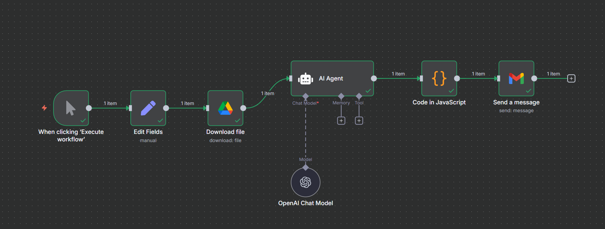
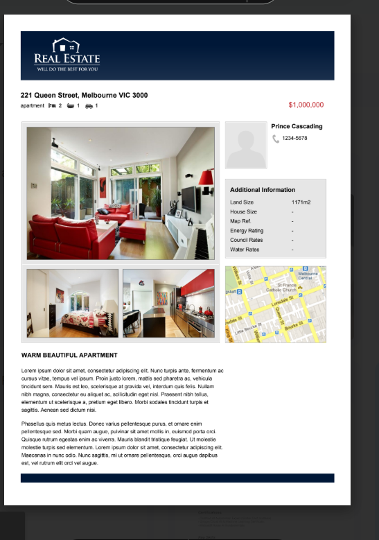
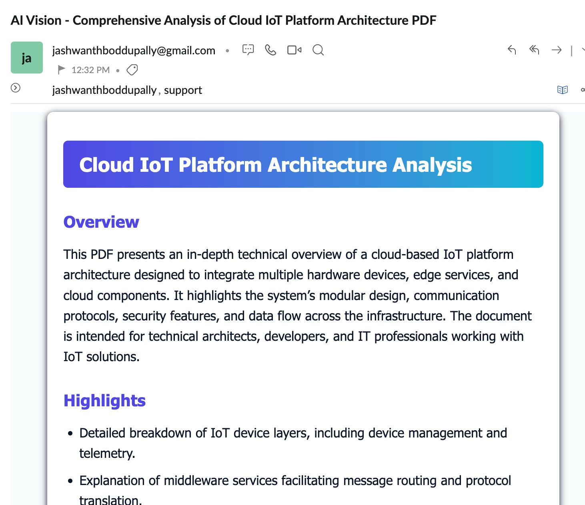

# PDF Vision — n8n (PDF → HTML Email) —

This kit builds a workflow that:
**1)** accepts a Google Drive PDF → **2)** uses **AI Agent + OpenAI Chat Model** to produce a polished HTML email (title/overview/highlights/image descriptions) → **3)** uses **Code (JS)** to normalize the output → **4)** emails it with **Gmail**.


---

## Canvas workflow 


---

## 0) Required Authentication
- **Google Drive OAuth2** — for **Download file**.
- **Gmail OAuth2** — for **Send a message**.
- **OpenAI API Key** — used by **OpenAI Chat Model**.

> n8n → Credentials: create the above and select them on the nodes after importing.

---

## 1) Node‑by‑Node Build (with drag‑and‑drop)

### A) Manual Trigger
1. **Drag** `Manual Trigger`.
2. Rename to **When clicking ‘Execute workflow’**.

### B) Set → “Edit Fields” (input the PDF link)
1. **Drag** `Set` (rename to **Edit Fields**).
2. **Add Field** → **String** → Name **pdf URL**.
3. Paste your sharable Drive link (or any public PDF URL).

### C) Google Drive — **Download file**
1. **Drag** `Google Drive` → Operation: **Download**.
2. **File ID** → click the ⓘ and paste the ID part of your Drive URL:
   `https://drive.google.com/file/d/<FILE_ID>/view` → copy `<FILE_ID>`.
3. Leave Options default.
4. **Wire**: Manual Trigger → Edit Fields → Download file.



### D) AI Agent (with **OpenAI Chat Model**)
1. **Drag** `AI Agent` → **Prompt Type**: `Define`.
2. Paste the **System Prompt** (below).
3. **Drag** `OpenAI Chat Model` → pick a cost‑efficient model (e.g. `gpt-4.1-mini`).
4. **Wire** the model to the Agent via the **Chat Model** port.
5. **Wire**: Download file → AI Agent.

**System Prompt (copy‑paste):**
```text
You are "PDF Vision Explainer," an AI agent that analyzes PDFs containing BOTH text and images.

## Inputs (passed by the workflow)
- pdf_url: {{ $json.pdfUrl || $json.PDF_URL || '' }}{{ $('Edit Fields').item.json['pdf URL'] }}
- ocr_text: {{ $json.ocr_text || '' }}   // full text extracted from the PDF (page order preserved)
- images: {{ Array.isArray($json.images) ? 'array of page images provided as attachments or URLs' : 'may be missing' }} 
- meta: {{ $json.meta || '' }}           // optional metadata such as title, author, date, page count

## Objectives
1) Comprehensively describe the PDF:
   - Summarize overall purpose and key takeaways.
   - Extract important sections, headings, lists, tables (as text summaries).
   - For each page with an image, write a short but specific visual description (objects, charts, diagrams, colors, layout).
   - Tie images to the surrounding text (e.g., “Page 3 image illustrates the ‘Architecture Diagram’ section”).
2) Be factual. If something cannot be confirmed from content, say "Unknown".
3) Produce a premium HTML email body with inline CSS (no external CSS):
   - Professional color palette, soft gradient header, readable fonts.
   - Mobile-friendly (single-column, max-width container, generous line-height).
   - Include key sections: Title, Overview, Highlights (bullets), Image Descriptions (by page), Notable Quotes/Stats (if any), and a clear “Open PDF” button linking to pdf_url.
4) Also produce a concise email SUBJECT line (<= 80 chars).
5) Output STRICTLY in compact JSON only (no markdown, no extra commentary), using this schema:

{
  "subject": "string - concise email subject",
  "pdf_url": "https://... (must echo back the pdf_url input)",
  "html_body": "<!doctype html> ... inline-styled premium HTML ..."
}

## Style & Constraints
- Tone: clear, confident, helpful; no fluff.
- Avoid hallucinations; never invent data not present.
- Use short, scannable bullet points.
- Ensure links are absolute.
- HTML must be valid, self-contained, and renderable in common email clients (Gmail/Outlook). Use inline CSS only.
- Color palette suggestion (you may adapt as needed):
  - Primary: #4F46E5
  - Accent:  #06B6D4
  - Text:    #0F172A
  - Muted:   #64748B
- The primary CTA button text: “Open PDF”.

## Example section titles for the HTML BODY
- “Overview”
- “Highlights”
- “Image Descriptions by Page”
- “Notable Quotes & Stats” (only if present)
- “Open PDF” (button)

Return ONLY the JSON object (no leading/trailing prose).

```

### E) Code (JavaScript) — normalize SUBJECT/HTML
1. **Drag** `Code` → Language: **JavaScript**.
2. Paste this code:
```js
// Robustly parse the agent's output for PDF summary emails.
//
// Expected ideal JSON shape:
// { "subject": "...", "pdf_url": "https://...", "html_body": "<html>...</html>" }
//
// Fallbacks: if JSON parsing fails, try labeled sections:
// SUBJECT: ...
// PDF_URL: ...
// HTML_BODY: ...   (or BODY: ...)

function take(obj, keys, def='') {
  for (const k of keys) {
    if (obj && typeof obj === 'object' && obj[k] != null) return String(obj[k]);
  }
  return def;
}

function extractMarkedSections(raw) {
  const out = { subject: '', body: '', pdf_url: '' };
  const mSub = raw.match(/(?:^|\n)SUBJECT:\s*([\s\S]*?)(?=\n[A-Z_]+:|$)/i);
  if (mSub) out.subject = mSub[1].trim();

  const mPdf = raw.match(/(?:^|\n)(PDF_URL|PDF|URL):\s*(https?:\/\/\S+)/i);
  if (mPdf) out.pdf_url = mPdf[2].trim();

  let mBody = raw.match(/(?:^|\n)HTML_BODY:\s*([\s\S]*?)(?=\n[A-Z_]+:|$)/i);
  if (!mBody) mBody = raw.match(/(?:^|\n)BODY:\s*([\s\S]*?)(?=\n[A-Z_]+:|$)/i);
  if (mBody) out.body = mBody[1].trim();

  return out;
}

const raw =
  $json.output
  || $json.text
  || $json.data
  || ($json.choices && $json.choices[0]?.message?.content)
  || ($json.choices && $json.choices[0]?.text)
  || '';

let subject = '';
let body = '';
let pdf_url = '';

// 1) JSON first
let parsed = null;
if (typeof raw === 'string') {
  const trimmed = raw.trim();
  if (trimmed.startsWith('{') && trimmed.endsWith('}')) {
    try { parsed = JSON.parse(trimmed); } catch {}
  }
} else if (typeof raw === 'object' && raw !== null) {
  parsed = raw;
}

if (parsed) {
  subject  = take(parsed, ['subject','SUBJECT','title']);
  body     = take(parsed, ['html_body','HTML_BODY','body','BODY']);
  pdf_url  = take(parsed, ['pdf_url','pdfURL','PDF_URL','PDF','url','URL']);
}

// 2) Markers fallback
if (!subject || !body || !pdf_url) {
  const m = extractMarkedSections(String(raw || ''));
  subject = subject || m.subject;
  body    = body    || m.body;
  pdf_url = pdf_url || m.pdf_url;
}

// 3) Final PDF URL fallback from inbound data
if (!pdf_url) {
  pdf_url = $json.pdfUrl || $json.PDF_URL || $json['PDF URL'] || '';
}

// 4) If BODY is not HTML, wrap it in a premium HTML shell
const looksHtml = /<\s*html[\s>]/i.test(body) || /<\s*body[\s>]/i.test(body);
if (!looksHtml) {
  const safe = String(body || '').replace(/</g,'&lt;').replace(/>/g,'&gt;').replace(/\n/g,'<br/>');
  body = `<!doctype html>
<html lang="en">
  <head><meta charset="utf-8"><meta name="viewport" content="width=device-width, initial-scale=1">
    <title>${subject || 'PDF Summary'}</title></head>
  <body style="margin:0;padding:0;background:#F8FAFC;color:#0F172A;font-family:Inter,Arial,Helvetica,sans-serif;">
    <div style="background:linear-gradient(90deg,#4F46E5,#06B6D4);padding:24px;">
      <h1 style="margin:0;color:#fff;font-size:22px;line-height:1.3;">${subject || 'PDF Summary'}</h1>
    </div>
    <div style="max-width:720px;margin:0 auto;padding:24px;">
      <div style="background:#fff;border:1px solid #E2E8F0;border-radius:12px;padding:20px;box-shadow:0 6px 20px rgba(15,23,42,0.06);">
        <div style="font-size:15px;line-height:1.7;">${safe}</div>
        ${pdf_url ? `<div style="margin-top:20px;text-align:center;">
          <a href="${pdf_url}" style="display:inline-block;padding:12px 18px;background:#4F46E5;color:#fff;text-decoration:none;border-radius:10px;font-weight:600;">Open PDF</a>
        </div>` : ``}
      </div>
      <div style="text-align:center;color:#64748B;font-size:12px;padding:20px 10px;">Generated automatically — review for accuracy.</div>
    </div>
  </body>
</html>`;
}

return [{ json: { subject: subject || 'PDF Summary', body, pdf_url, raw } }];

```
3. **Wire**: AI Agent → Code.

### F) Gmail — **Send a message**
1. **Drag** `Gmail` → Operation: **Send a message**.
2. **To**: your email(s).
3. **Subject**: `=AI Vision - {$json.subject}`
4. **Message**: `={$json.body}` (HTML enabled; turn **Append Attribution** off.)
5. **Wire**: Code → Gmail.

---

## 2) Test
1. Click **Execute workflow**.
2. Watch nodes turn green.
3. Open your inbox — you should see a premium HTML email with an **Open PDF** button.
---
## Gmail Output 



---

## 3) Troubleshooting
- **Drive 404 / permission**: verify File ID and that your OAuth account can access the PDF.
- **Gmail 403**: finish OAuth consent; ensure correct Gmail account.
- **Broken HTML**: the Code node wraps plain text in a styled HTML shell.
- **Model errors**: confirm API key and model name.

---

## Import‑Ready Workflow
Use **Import from File** in n8n and select `workflow.json`, then re‑assign credentials.
