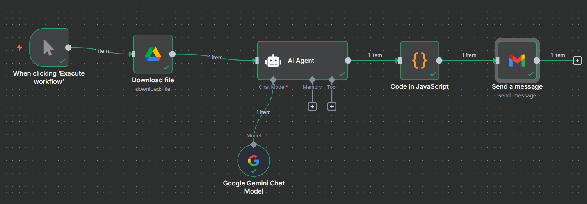
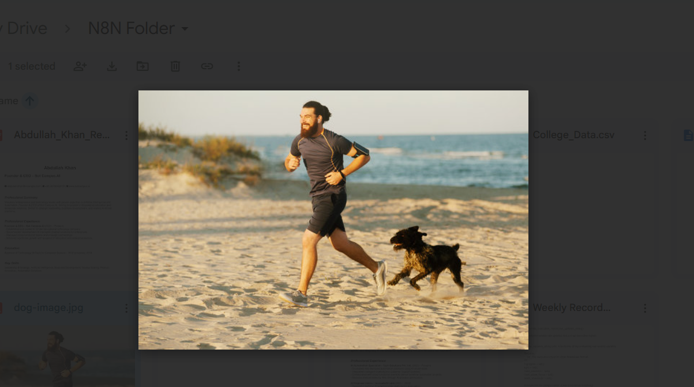
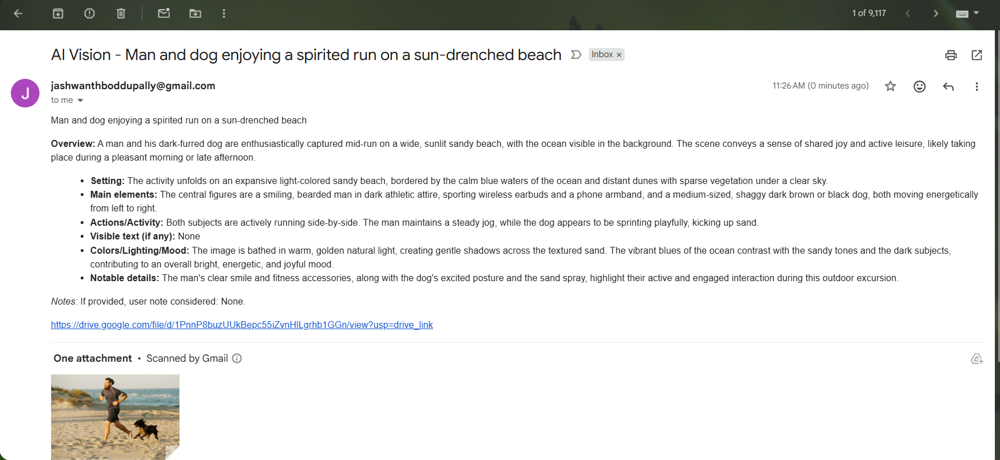
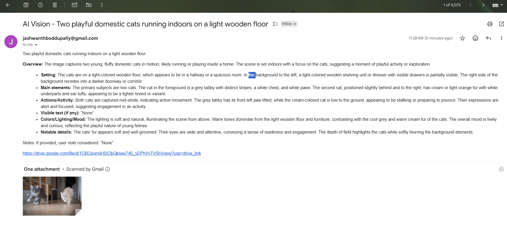

# AI Vision — n8n “Image → Summary → Email” (Pin‑to‑Pin Guide)

A one‑click workflow that downloads an image from **Google Drive**, asks a **Gemini Chat Model** (via an **AI Agent**) to describe it, splits the result into **SUBJECT** and **HTML BODY**, and sends it via **Gmail**.


## 0) Required Authentication (set before running)
1. **Google Drive OAuth2** – for the **Google Drive → Download** node.
2. **Gmail OAuth2** – for the **Gmail → Send a message** node.
3. **Gemini API Key** (Google AI Studio) – used by **Google Gemini Chat Model**.

_In n8n → Credentials: create the three creds above. Ensure the Google account can access the target Drive file._

---

## 1) Workflow Overview
Manual Trigger → **Google Drive (Download file)** → **AI Agent (uses Gemini)** → **Code (JavaScript)** → **Gmail (Send a message)**



---

## 2) Build It (drag‑and‑drop + exact params)

### A) **Manual Trigger**
- **Drag**: `Manual Trigger`
- Rename: **When clicking ‘Execute workflow’**

### B) **Google Drive — Download file**
- **Drag**: `Google Drive`
- **Operation**: `Download`
- **File ID**: Paste from Drive link `https://drive.google.com/file/d/<FILE_ID>/view`
- Leave **Options** default.
- **Wire**: Manual Trigger → Google Drive

> Output: binary image at `$binary.data` for the next node.

### C) **AI Agent — Summarize the image**
- **Drag**: `AI Agent`
- **Wire**: Google Drive → AI Agent
- **Prompt Type**: `Define` → paste the **System Prompt** below.
- **Chat Model port**: connect to **Google Gemini Chat Model**.

#### Add **Google Gemini Chat Model**
- **Drag**: `Google Gemini Chat Model`
- **Model**: a fast model (e.g., *Gemini 2.5‑flash*)
- **Credentials**: your Gemini API key
- **Wire**: Gemini node → AI Agent (dotted “Chat Model” port)

> The Agent reads `$binary.data` from the previous node automatically. If you prefer a public `image_url`, the prompt supports that too.

**AI Agent System Prompt (copy‑paste):**
```
SYSTEM PROMPT — Image Reader → Medium Summary (HTML SUBJECT/BODY)

ROLE
You are an AI agent that inspects a single image and returns a concise, medium-length summary. Your output must contain exactly two sections in this order:
1) SUBJECT: <one-line subject text, no HTML tags>
2) BODY: <valid HTML snippet containing the summary>

INPUTS (may come in any of these forms)
- image_url: a direct, fetchable image URL (e.g., Google Drive “shareable direct link”, S3, CDN).
- image_binary: an attached/binary image payload (e.g., n8n $binary.data).
- optional: user_note (free text from the user giving context or a question).
If multiple inputs are present, prefer image_binary over image_url.

OBJECTIVES
- Inspect the image and produce a clear, factual summary (6–10 sentences).
- Describe: scene, notable objects/entities, visible text (if legible), actions, emotions/mood, colors/lighting, and any relevant context.
- If text is clearly readable in the image, include a brief OCR-style excerpt inside the BODY (short and relevant).
- If user_note is provided, address it briefly in the BODY (e.g., clarify or answer a question) without deviating from the image facts.

STYLE & TONE
- Neutral, precise, and helpful.
- No speculation about identities (e.g., do not assert real names, private data, or sensitive attributes).
- If something is uncertain, say “appears to” or “likely”.
- Avoid unsafe/medical/legal conclusions.

OUTPUT FORMAT (STRICT)
Return exactly these two labeled blocks in this order. Do NOT add extra sections, JSON, or markdown fences.

SUBJECT:
<plain text line — max ~90 characters>

BODY:
<html>
  <p><strong>Overview:</strong> …</p>
  <ul>
    <li><strong>Setting:</strong> …</li>
    <li><strong>Main elements:</strong> …</li>
    <li><strong>Actions/Activity:</strong> …</li>
    <li><strong>Visible text (if any):</strong> “…short excerpt or None…”</li>
    <li><strong>Colors/Lighting/Mood:</strong> …</li>
    <li><strong>Notable details:</strong> …</li>
  </ul>
  <p><em>Notes:</em> If provided, user note considered: “…brief mention or None…”.</p>
</html>

ERROR HANDLING
- If no usable image is provided (neither image_url nor image_binary), output:
  SUBJECT:
  Image not provided

  BODY:
  <html><p>No image was received. Please supply a direct image URL or attach an image file.</p></html>

- If the image cannot be read (corrupt/inaccessible), output:
  SUBJECT:
  Unable to read the image

  BODY:
  <html><p>The image appears inaccessible or corrupted. Check the link permissions or re-upload.</p></html>

VALIDATION RULES
- SUBJECT must be a single plain-text line (no HTML tags).
- BODY must be valid, minimal HTML (only simple tags like <p>, <ul>, <li>, <strong>, <em>, <br>).
- Never include the raw image, EXIF, or private data.
- Do not include the words “markdown”, “json”, or code fences in the response.

IMPLEMENTATION HINTS (for n8n or similar)
- Accept either: {{$json.image_url}} OR $binary.data from previous node.
- If using Google Drive links, ensure the link is a direct file link with public/readable access.
- Keep the final output exactly as the SUBJECT/BODY blocks above; the next node (e.g., Email/Respond) will use SUBJECT for the email subject and BODY as the HTML body.
```

### D) **Code (JavaScript) — split SUBJECT/BODY**
- **Drag**: `Code` → `JavaScript`
- **Wire**: AI Agent → Code
- **Paste** the code below:

```js
// Input: raw text from AI Agent (with SUBJECT: and BODY: sections)
// Example:
// SUBJECT:
// A street with cars and buildings
//
// BODY:
// <html>...</html>

const raw = $json.output || $json.text || '';

let subject = '';
let body = '';

const subjectMatch = raw.match(/SUBJECT:\s*([\s\S]*?)(?=\nBODY:|$)/i);
if (subjectMatch) {
  subject = subjectMatch[1].trim();
}

const bodyMatch = raw.match(/BODY:\s*([\s\S]*)/i);
if (bodyMatch) {
  body = bodyMatch[1].trim();
}

return [
  {
    json: {
      subject,
      body
    }
  }
];
```

### E) **Gmail — Send a message**
- **Drag**: `Gmail`
- **Operation**: `Send a message`
- **To**: your email (e.g., `you@example.com`)
- **Subject**: `={{ $json.subject }}`
- **Message**: `={{ $json.body }}`
- **Options → Append Attribution**: Off
- **Wire**: Code → Gmail

---

## 3) Test Run
1. Click **Execute Workflow**.
2. Confirm the Drive node turns green (file downloaded).
3. Check the **AI Agent** output preview: it must contain `SUBJECT:` and `BODY:` sections.
4. Verify the **Code** node output has `subject` and `body` fields.
5. Open your inbox — an HTML email should appear.

**Example results:**  
  
  


---

## 4) Troubleshooting
- **Drive “not found/permission”**: Verify File ID & that the OAuth account can access the file.
- **Gmail 403**: Complete OAuth consent; ensure the Gmail account used in credentials matches your target mailbox.
- **Empty subject/body**: Ensure the Agent printed the exact labels `SUBJECT:` and `BODY:` each on their own line.
- **Malformed HTML**: Keep BODY as minimal, valid HTML. The prompt enforces simple tags only.
- **Gemini errors**: Check API key, quota, and model name.

---

## 5) Importing the Ready Workflow
- In n8n → **Import from File** → select `workflow.json` from this kit.
- Open the workflow and re‑select your **Credentials** on each node (Drive, Gemini, Gmail).

---

## Credits & Notes
- Screenshots included for clarity; replace with your own as needed.
- Safe use guidelines: do not attempt to identify real individuals in photos.
