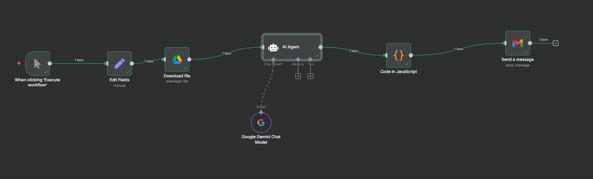
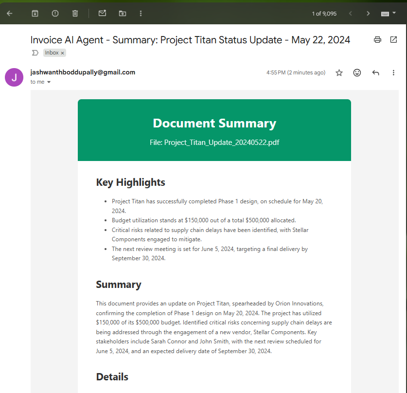

# AI Invoice Demo — Drive → AI Summary → Gmail (n8n)

> **Goal:** Take a file from **Google Drive**, let an **AI Agent (Gemini)** generate a **subject** and a **premium HTML email**, split it into **Subject** and **Body**, and send via **Gmail**.

---

## ✅ Authentication (set before wiring)
- **Google Drive OAuth2** – for the **Download file** node.
- **Google Gemini** – for the **Google Gemini Chat Model** node.
- **Gmail OAuth2** – for the **Send a message** node.

In n8n: **Credentials** → add each provider. Do **not** paste secrets into nodes.

---

## 🔎 Power Pattern (Input → Process → Output)
1) **Input:** File from **Google Drive**  
2) **Process:** **AI Agent (Gemini)** creates **SUBJECT + HTML BODY**  
3) **Output:** **Code** splits fields → **Gmail** sends email

---

## Canvas



---

## 🧩 Node-by-node (exact steps)

### 1) Manual Trigger
- **Node:** *When clicking ‘Execute workflow’*
- **Why:** Run the flow on demand from the editor.

### 2) Edit Fields (optional)
- **Node:** *Set*
- Add a String field (optional) for reference:
  - **Name:** `Invoice URL`
  - **Value:** your public Drive link (not required; Drive node handles fileId).

### 3) Download file (Google Drive)
- **Node:** *Google Drive → Operation: Download*
- **File ID:** paste from your Drive link  
  Example: `https://drive.google.com/file/d/1xsEyWTEqbif07l5zF1tHjWrYCCKgdPif/view` → **File ID:** `1xsEyWTEqbif07l5zF1tHjWrYCCKgdPif`
- **Share setting:** Drive file must be **Anyone with link – Viewer**.

### 4) Google Gemini Chat Model
- **Node:** *Google Gemini Chat Model*
- Select your **Gemini** credentials.
---

## 🧠 Copy‑paste — AI Agent → **System Prompt**
```
You are “DriveDoc Mailer,” an AI that reads a document from Google Drive and produces an email-ready summary.

INPUTS (provided via n8n fields/expressions)
- pdf_url: {{$json.webViewLink || ('https://drive.google.com/file/d/' + $json.fileId + '/view')}}
- file_name: {{$json.name || $json.fileName || ''}}
- mime_type: {{$json.mimeType || ''}}
- ocr_text: {{$json.ocr_text || ''}}   // optional pre-extracted text
- palette_hint: {{$json.palette_hint || 'slate'}}  // teal | emerald | amber | violet | rose | slate

WHAT TO READ
- If a file is attached (PDF/image), read it.
- If text is provided in ocr_text, use it as additional context.
- If nothing is readable, still produce a graceful email with “Unknown” where needed.

OBJECTIVE
Create a professional executive summary of the document with a clean HTML email body and a short, informative subject.

COLOR THEME
Use the palette_hint to theme the email header and button.
  teal  = #0d9488
  emerald = #059669
  amber = #d97706
  violet = #7c3aed
  rose   = #e11d48
  slate  = #334155

OUTPUT FORMAT — EXACTLY TWO SECTIONS (no extra text, no code fences):
SUBJECT:
<one concise line — include file_name when useful>

BODY:
<html>…</html>

HTML REQUIREMENTS
- Self-contained HTML (inline CSS), width 600px max.
- Sections: header (title + file_name), key highlights (bullets), short paragraph summary, optional details (dates, entities, amounts), and a CTA button:
  - Button text: “View Document”
  - Button href: use pdf_url if present; otherwise omit the button.
- If a value is unclear, print “Unknown”.
- Do not include JSON. Do not include “PDF_URL:” lines. Only the two sections above.
```

### 5) AI Agent
- **Node:** *AI Agent*
- Attach **Google Gemini Chat Model** as the **Language Model**.
- Paste the **System Prompt** below (exact).  
- The agent will read the previous node’s JSON + binary and output **two sections**: `SUBJECT:` and `BODY:` (HTML).

### 6) Code in JavaScript
- **Node:** *Code*
- Paste the **Function code** below. It extracts `subject`, `bodyHtml`, and a best-effort `pdfUrl`.
---

## 🧩 Copy‑paste — **Code (JavaScript) node**
```javascript
// n8n Code node (JavaScript)
// Input: the previous AI Agent node's output
// Output: { subject, bodyHtml, pdfUrl }

function getRaw(aiOut) {
  // Be defensive: support various shapes
  return (
    aiOut?.output ||
    aiOut?.text ||
    aiOut?.data ||
    aiOut?.content ||
    aiOut?.choices?.[0]?.message?.content ||
    aiOut?.choices?.[0]?.text ||
    aiOut?.message ||
    aiOut ||
    ''
  );
}

function stripFences(s) {
  let t = String(s || '').trim();
  if (t.startsWith('```')) {
    // remove first fence
    t = t.replace(/^```[a-zA-Z0-9]*\s*/, '');
    // remove trailing fence
    t = t.replace(/```$/, '');
  }
  return t.trim();
}

function parseSections(raw) {
  const text = stripFences(raw);

  // Find SUBJECT then BODY
  const subjRe = /^\s*SUBJECT:\s*([\s\S]*?)\n\s*BODY:\s*/i;
  const m = text.match(subjRe);

  let subject = '';
  let body = '';

  if (m) {
    subject = (m[1] || '').trim();
    body = text.slice(m.index + m[0].length).trim();
  } else {
    // Fallback: try simpler split
    const idx = text.toUpperCase().indexOf('BODY:');
    if (idx > -1) {
      subject = text.slice(0, idx).replace(/^\s*SUBJECT:\s*/i, '').trim();
      body = text.slice(idx + 5).trim();
    } else {
      // Nothing matched: put everything into body
      body = text;
    }
  }
  return { subject, body };
}

function ensureHtml(html) {
  const t = String(html || '').trim();
  if (t.startsWith('<') && t.includes('</')) return t;
  // Wrap plain text as preformatted HTML if the model failed to send HTML
  return (
    '<!DOCTYPE html><html><head><meta charset="utf-8">' +
    '<meta name="viewport" content="width=device-width, initial-scale=1">' +
    '</head><body style="font-family:Arial,Segoe UI,Helvetica,Roboto,sans-serif; padding:16px;">' +
    '<pre style="white-space:pre-wrap; word-break:break-word; font:inherit;">' +
    t.replace(/</g, '&lt;').replace(/>/g, '&gt;') +
    '</pre></body></html>'
  );
}

function extractPdfUrl(html) {
  // Try to pull a likely PDF/document link from anchors first
  const hrefMatch = html.match(/href=["']([^"']+)["']/i);
  if (hrefMatch) return hrefMatch[1];

  // Fallback: any http(s) link in text
  const urlMatch = html.match(/https?:\/\/[^\s"'<>]+/i);
  return urlMatch ? urlMatch[0] : '';
}

// ---- Main ----
const item = $input.first();
const raw = getRaw(item.json);

// Parse the two sections
const { subject, body } = parseSections(raw);

// Guarantee HTML body
const bodyHtml = ensureHtml(body);

// Best-effort PDF URL extraction (handy if you want to log or reuse it)
const pdfUrl = extractPdfUrl(bodyHtml);

// Return single clean payload
return [
  {
    json: {
      subject: subject || 'Document Summary',
      bodyHtml,
      pdfUrl
    }
  }
];
```

---

### 7) Send a message (Gmail)
- **Node:** *Gmail → Send a message*
- **To:** your email  
- **Subject:** `=Invoice AI Agent -  {{ $json.subject }}`  
- **Message (HTML):** `={{ $json.bodyHtml }}`


## 🔗 Gmail field mapping
- **Subject:** `=Invoice AI Agent -  {{ $json.subject }}`  
- **Message (HTML):** `={{ $json.bodyHtml }}`

---
## Output 


---


## ▶️ Test
1. Click **Execute workflow**.  
2. Confirm the **AI Agent** prints `SUBJECT` + `BODY`.  
3. The **Code** node returns `subject` and `bodyHtml`.  
4. Check your inbox for the HTML email with **“View Document”**.

---

## 🧰 Troubleshooting
- **File won’t open:** In Drive, set **Anyone with link – Viewer**.  
- **Empty email:** Agent must output both labels `SUBJECT:` and `BODY:`.  
- **Plain text:** The Code node wraps plain text into valid HTML automatically.  
- **Broken link:** Verify `fileId` from **Download file** output.
