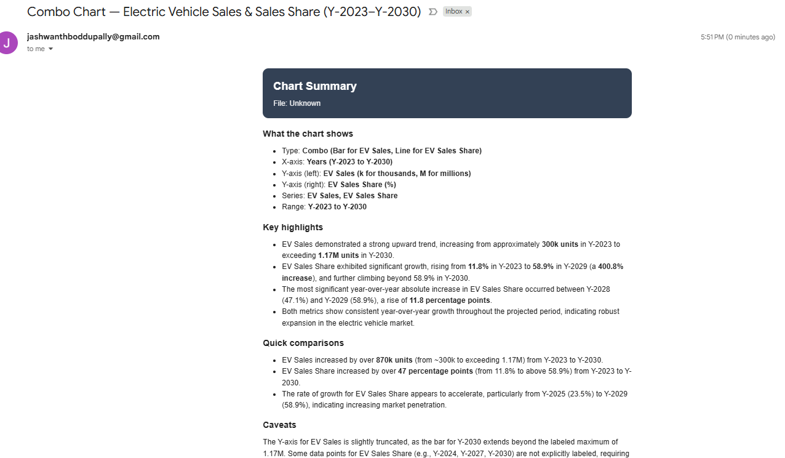

# Chart → AI Agent (Gemini) → Gmail (n8n)

**Goal:** Download a chart from Google Drive, have an AI Agent (Gemini) write an executive summary, split it into `Subject` + HTML `Body`, and send via Gmail.

## Canvas



---

## Prereqs (Auth)
- **Google Drive OAuth2** (scope: Drive)
- **Gmail OAuth2** (scope: Gmail send)
- **Gemini API Key** (Google PaLM/Gemini credentials)

---

## Node Map (exact order + modes)

1) **Manual Trigger** — *(start run)*  
2) **Set** — *Add value* → String field **`Chart URL`** with your Drive view link.  
3) **Google Drive** — **Operation:** `download` → returns **binary.data** (image).  
4) **AI Agent** — **Prompt Type:** `Define` → **Chat Model:** *Google Gemini Chat Model*.  
   - Inputs: JSON from **Set** + Binary from **Google Drive (download)**.  
5) **Code** — **Language:** `JavaScript` → split `SUBJECT:` / `BODY:` into `subject`, `bodyHtml`.  
6) **Gmail** — **Operation:** `send message` → **Message Type:** `HTML` → map fields from Code node.

---

## Step 2 — Set (Edit Fields)

Add a String field named **`Chart URL`** and paste your public Drive link.

```text
https://drive.google.com/file/d/1WBcrbiecn1qWlHD3Sav4h9zQSBFhANe5/view?usp=drive_link
```

---

## Step 3 — Google Drive (Download)

- **Operation:** `download`  
- **File:** pick from UI or paste ID.

**Optional (if ID comes from JSON)**

```text
={{ $json["id"] }}
```

*After Execute → Binary tab must contain `data` with a filename.*

---

## Step 4 — AI Agent (Gemini) Prompt

Paste this into **AI Agent → Define prompt**. Ensure the node receives both **binary** and **JSON** inputs.

```text
You are “ChartSense,” an AI that inspects a chart/graph image and writes a crisp executive summary.

INPUTS (provided by the workflow)
- chart_url: {{$json.chart_url || $json.image_url || ''}}  {{ $json['Chart URL'] }}
- chart_binary: (optional image attached as binary)
- ocr_text: {{$json.ocr_text || ''}}                  // optional extracted text
- title_hint: {{$json.title || ''}}                   // optional
- palette_hint: {{$json.palette_hint || 'slate'}}     // teal | emerald | amber | violet | rose | slate

YOUR TASK
1) Identify what you SEE in the visual (no guessing beyond the pixels/labels):
   - Chart type (line, bar, stacked, area, pie/donut, scatter, heatmap, etc.).
   - Axes titles, units, scales; legend/series names; time range or categories.
   - Data encodings (color, size, position). If ambiguous → “Unknown”.
2) Analyze and quantify:
   - Overall trend(s) per series (↑/↓/flat), start vs end values, absolute & % change.
   - Peaks/troughs with labels (name/date/category & value) and notable inflection points.
   - Outliers/anomalies, seasonality, comparisons between series, correlations (if visually clear).
   - For stacked/100% charts, distinguish total vs composition shares.
3) Interpret (briefly & safely):
   - What it suggests operationally (e.g., “growth accelerating”, “share shifting”, “volatility high”).
   - Call out caveats: missing units, truncated axes, small samples, unclear legend, etc.
4) Accessibility:
   - Provide 1–2 sentence ALT text describing the chart content.

STRICT RULES
- Derive ONLY from visible/derivable information (image + ocr_text). If unsure → “Unknown”.
- Do NOT fabricate numbers; read them from labels/ticks if legible. Otherwise use qualitative phrases (“rises sharply”).
- Keep numbers in the units shown on the chart; include units in-line.
- Be concise; avoid jargon unless present in the chart.

OUTPUT FORMAT — EXACTLY TWO SECTIONS (no extra text, no code fences in your response):
SUBJECT:
<one line, e.g., “Line Chart — Revenue vs. Cost (Jan–Jun 2025)”>

BODY:
<html>
  <!-- Inline CSS only -->
  <head><meta charset="utf-8"></head>
  <body style="font-family:Arial,Segoe UI,Helvetica,Roboto,sans-serif;max-width:640px;margin:0 auto;padding:16px;">
    <header style="background:#334155;color:#fff;border-radius:10px;padding:16px 18px;margin-bottom:16px;">
      <h2 style="margin:0 0 6px 0;">Chart Summary</h2>
      <div style="opacity:.9;">File: {{title_hint || 'Unknown'}}</div>
    </header>

    <section style="margin-bottom:14px;">
      <h3 style="margin:0 0 8px 0;">What the chart shows</h3>
      <ul style="margin:0 0 0 18px;padding:0;">
        <li>Type: <b>[type]</b></li>
        <li>X-axis: <b>[label / categories]</b></li>
        <li>Y-axis: <b>[label & unit]</b></li>
        <li>Series: <b>[series names]</b></li>
        <li>Range: <b>[time/categories]</b></li>
      </ul>
    </section>

    <section style="margin-bottom:14px;">
      <h3 style="margin:0 0 8px 0;">Key highlights</h3>
      <ul style="margin:0 0 0 18px;padding:0;">
        <li>[Series A] moves from <b>[start]</b> to <b>[end]</b> (<b>[Δ, %Δ]</b>).</li>
        <li>Peak at <b>[value]</b> on <b>[label]</b>; trough at <b>[value]</b> on <b>[label]</b>.</li>
        <li>[Notable pattern: seasonality/trend/volatility/ crossover / share shift].</li>
        <li>[Outlier/anomaly] observed at <b>[label]</b> with <b>[value]</b>.</li>
      </ul>
    </section>

    <section style="margin-bottom:14px;">
      <h3 style="margin:0 0 8px 0;">Quick comparisons</h3>
      <ul style="margin:0 0 0 18px;padding:0;">
        <li>Top performer: <b>[series/category]</b> at <b>[value, unit]</b>.</li>
        <li>Lagging: <b>[series/category]</b> at <b>[value, unit]</b>.</li>
        <li>Relative gap: <b>[abs/%, unit]</b> between <b>[A]</b> and <b>[B]</b> at <b>[label]</b>.</li>
      </ul>
    </section>

    <section style="margin-bottom:14px;">
      <h3 style="margin:0 0 8px 0;">Caveats</h3>
      <p style="margin:0;">[Axis starts not at zero / units unclear / labels unreadable / sampling unknown / “Unknown” where applicable].</p>
    </section>

    <section style="margin-bottom:18px;">
      <h3 style="margin:0 0 8px 0;">Accessibility</h3>
      <p style="margin:0;"><b>ALT:</b> [1–2 sentence plain-language description of the visual].</p>
    </section>

    {{ chart_url ? (
      '<div style="margin-top:10px;"><a href="' + chart_url + '" style="background:#0d9488;color:#fff;text-decoration:none;padding:10px 14px;border-radius:8px;display:inline-block;">View Chart</a></div>'
    ) : '' }}
  </body>
</html>

THEME
- Replace header/button color using palette_hint:
  teal #0d9488, emerald #059669, amber #d97706, violet #7c3aed, rose #e11d48, slate #334155.
- If palette_hint missing, default to slate.

VALIDATION
- Ensure the two required sections are present and the BODY is valid HTML.
```

---

## Step 5 — Code (JavaScript)

Paste into the **Code** node. It splits the Agent’s response and ensures HTML.

```javascript
// Split an AI message with:
//   SUBJECT:\n<one line>\nBODY:\n<html>...</html>
// into { subject, bodyHtml }.

function getRaw(obj) {
  return (
    obj?.output ??
    obj?.text ??
    obj?.data ??
    obj?.content ??
    obj?.message ??
    obj?.choices?.[0]?.message?.content ??
    obj?.choices?.[0]?.text ??
    ''
  );
}

function unwrapFences(s) {
  let t = String(s || '').trim();
  if (t.startsWith('```')) {
    t = t.replace(/^```[a-zA-Z0-9]*\s*/, '').replace(/```$/, '');
  }
  return t.trim();
}

function parseSections(raw) {
  const text = unwrapFences(raw);
  const re = /^\s*SUBJECT:\s*([\s\S]*?)\n\s*BODY:\s*/i;
  const m = text.match(re);

  let subject = '';
  let body = '';

  if (m) {
    subject = (m[1] || '').trim();
    body = text.slice(m.index + m[0].length).trim();
  } else {
    const idx = text.toUpperCase().indexOf('BODY:');
    if (idx > -1) {
      subject = text.slice(0, idx).replace(/^\s*SUBJECT:\s*/i, '').trim();
      body = text.slice(idx + 5).trim();
    } else {
      body = text.trim(); // fallback
    }
  }
  return { subject, body };
}

function ensureHtml(html) {
  const t = String(html || '').trim();
  if (t.startsWith('<') && t.includes('</')) return t; // already HTML
  const esc = t.replace(/[<>&]/g, c => ({'<':'&lt;','>':'&gt;','&':'&amp;'}[c]));
  return (
    '<!DOCTYPE html><html><head><meta charset="utf-8">' +
    '<meta name="viewport" content="width=device-width, initial-scale=1"></head>' +
    '<body style="font-family:Arial,Segoe UI,Helvetica,Roboto,sans-serif;padding:16px;">' +
    '<pre style="white-space:pre-wrap;word-break:break-word;margin:0;">' + esc + '</pre>' +
    '</body></html>'
  );
}

const out = $input.all().map(item => {
  const raw = getRaw(item.json);
  const { subject, body } = parseSections(raw);
  return {
    json: {
      subject: subject || 'Document Summary',
      bodyHtml: ensureHtml(body)
    }
  };
});

return out;
```

---

## Step 6 — Gmail (HTML)

- **Operation:** `send message`
- **Message Type:** `HTML`
- **To:** your email

**Subject**
```text
={{ $json.subject }}
```

**Message (HTML)**
```text
={{ $json.bodyHtml }}
```

---

## Quick Checks
- After **Google Drive → download**: Binary tab shows `data` with filename.
- **AI Agent** returns two sections: `SUBJECT:` then `BODY:` with `<html>`.
- **Code** node outputs `subject`, `bodyHtml`.
- **Gmail** sends and renders HTML properly.

