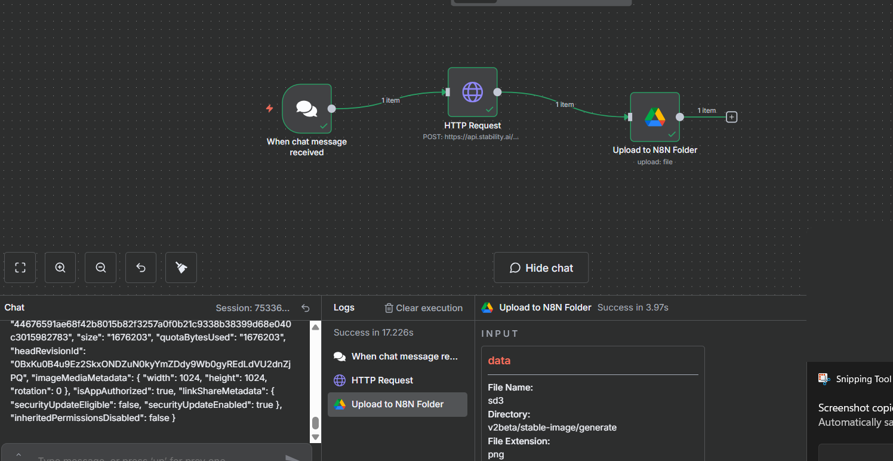
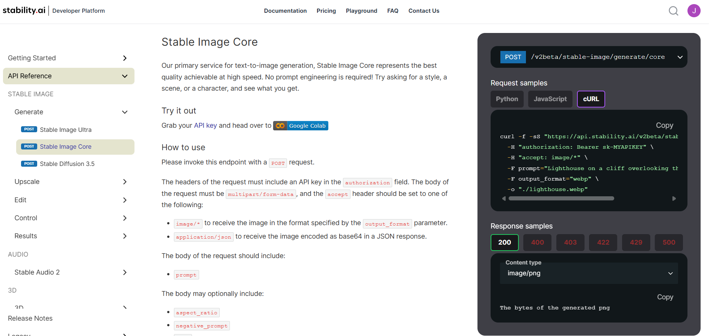
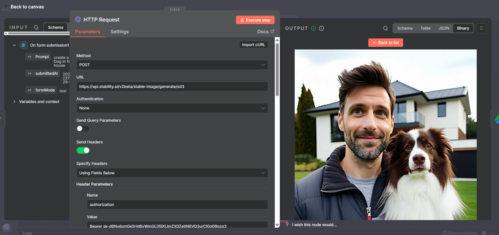
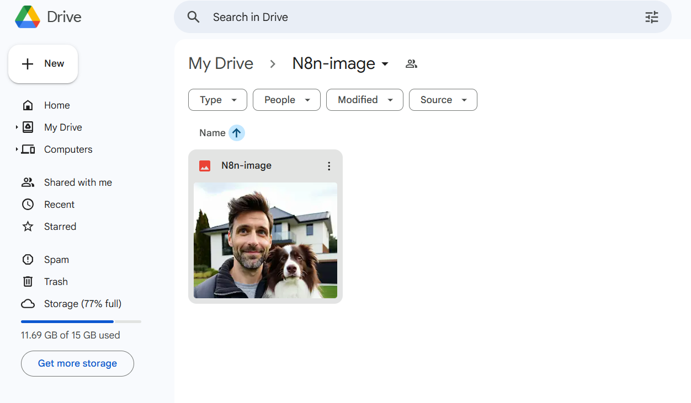

# Stability.ai → n8n (Chat Trigger) → Google Drive — Final Illustrated Guide

This guide shows how to: **copy the official cURL from Stability.ai**, **import it into n8n’s HTTP Request node**, make the **prompt dynamic from the Chat Trigger**, and **upload the generated image to Google Drive**.
---
### canvas
  
---

## 🔐 Required authentication (start here)
- **Stability.ai API Key** — create in your Stability account (it starts with `sk-…`).  
- **Google Drive OAuth2** — connect your Google account in the **Google Drive** node’s **Credentials**.

> Tip: Prefer saving the Stability key inside **n8n → Credentials (HTTP Header Auth)** rather than hard‑coding it in the node.

---

## A) Copy the official cURL from Stability.ai

Open this link → **Core endpoint**:  
**https://platform.stability.ai/docs/api-reference#tag/Generate/paths/~1v2beta~1stable-image~1generate~1core/post**

1. **Sign in** (top-right) → go to **API Keys** → **Create key** → copy your key (`sk-…`).  
2. On the same page, switch **Request samples** to **cURL** and click **Copy**.

**Screenshot (docs page):**  


### cURL sample (replace `sk-MYAPIKEY` with your real key)
```bash
curl -f -sS "https://api.stability.ai/v2beta/stable-image/generate/core"   -H "authorization: Bearer sk-MYAPIKEY"   -H "accept: image/*"   -F prompt="Lighthouse on a cliff overlooking the ocean"   -F output_format="webp"   -o "./lighthouse.webp"
```
> You can change the path to **sd3** (`/v2beta/stable-image/generate/sd3`) or **ultra** (`/v2beta/stable-image/generate/ultra`).

(Optional) **Local test**: run the cURL to verify the key—an image file should be created with a non‑zero size.

---

## B) Build the n8n workflow (Chat → HTTP → Drive)

### 1) **When chat message received** (Trigger)
- No extra configuration. Your text becomes `{$json.chatInput}`.

### 2) **HTTP Request** — *Import the cURL and adjust*
1. Add **HTTP Request** → click **Import cURL** → paste the cURL from Stability → **Import**.
2. **Body → Form‑Data → `prompt`** → click gears → **Add Expression** →  
   `={ $json.chatInput }`
3. **Response → Response Format** = **File**; **Binary Property Name** = `data`  
4. **Headers:** keep only
   - `authorization: Bearer sk-…`
   - `accept: image/*`
   - **Do NOT** add `Content‑Type`; n8n will set the multipart boundary.
5. *(Optional)* Add `aspect_ratio` (e.g., `1:1`, `3:2`) and `negative_prompt`.  
6. *(Optional)* Settings → **Timeout (ms)** = `120000`, **Retry On Fail** = `2`.

**Screenshot (node output preview):**  
The binary image should appear under `binary.data`.


### 3) **Google Drive — Upload** (to your “N8N Folder”)
- **Operation:** `Upload`  
- **Binary Data:** ✅  
- **Binary Property:** `data`  
- **File Name (Expression):**
  ```
  ={ 
    ($json.chatInput || 'image')
      .slice(0,60)
      .replace(/[^a-z0-9-_ ]/gi,'_')
      .trim()
  }-{ $now }.png
  ```
  *(Use `.webp`/`.jpeg` if you changed `output_format` in HTTP node.)*
- **Parent Folder:** select your **N8N Folder**  
- **Options → Resolve Data:** ✅

**Screenshot (flow and Drive result):**  



---

## C) Wiring (left → right)
`When chat message received` → `HTTP Request (Stable Image)` → `Google Drive (Upload)`  
*(Optional)* `Google Drive (Create or update share)` → *(Optional)* `Respond to chat message`

---

## D) Copy blocks

**HTTP → Body (Form‑Data)**
```
prompt = { $json.chatInput }
output_format = png
# optional
# aspect_ratio = 1:1
# negative_prompt = blurry, low quality
```

**Google Drive → File Name (Expression)**
```
={ 
  ($json.chatInput || 'image')
    .slice(0,60)
    .replace(/[^a-z0-9-_ ]/gi,'_')
    .trim()
}-{ $now }.png
```

**Respond to chat → Message**
```
✅ Image created!
View: { $json.webViewLink }
```

---

## E) Troubleshooting (pin‑to‑pin)
- **401**: wrong/expired key → rotate and re‑paste.  
- **415/422**: remove any custom `Content‑Type`; ensure Form‑Data & non‑empty `prompt`.  
- **Empty Drive file**: HTTP node must return **Response Format = File** with **Binary Property = `data`**.  
- **Extension mismatch**: filename extension must match `output_format`.
