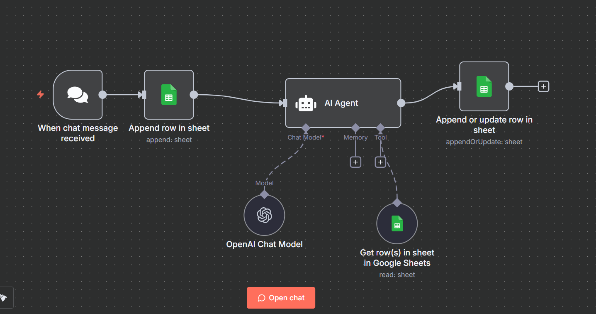

# Alternative “Tool Memory” without a DB (Google Sheets) — n8n Beginner Guide

This guide explains how to build a memory-enabled AI chat assistant that **stores & recalls context in Google Sheets** (no database required). It’s written for someone totally new to n8n.

We’ll recreate the exact flow from your workflow file (names, wiring, and expressions match your JSON). fileciteturn7file0

---

## What you’ll build

**Flow:**  
**When chat message received** → **Google Sheets (Append row in sheet)** → **AI Agent**  
…with **OpenAI Chat Model** attached as the model and **Get row(s) in sheet in Google Sheets** attached as the tool → **Google Sheets (Append or update row in sheet)**

  


---

## Prerequisites (do these once)

1) **n8n** running (Cloud or Desktop).  
2) **Google account** with access to Google Sheets.  
3) In n8n, create credentials:
   - **Google Sheets OAuth2** (for both Sheets nodes and the Sheets tool).  
   - **OpenAI API** (for the **OpenAI Chat Model** node).  
4) Create a Google Sheet, name it **`N8N-memory`**, add a tab named **`Chat_memory`** with **headers in row 1**:
   ```
   Session_ID | Input | AI_response
   ```
   Make sure the n8n Google account can access/edit the sheet.


### 1) **When chat message received** (type: `@n8n/n8n-nodes-langchain.chatTrigger`)
**What it does:** Starts a run whenever a chat message comes in (for Chat UI, webhooks, etc.).  
**Outputs it provides:**  
- `{{$json.sessionId}}` — a unique ID for the user/session  
- `{{$json.chatInput}}` — the user’s message text

**How to add:**
1. Drag **When chat message received** onto the canvas.
2. No extra configuration required for this tutorial.

**Wire:** _This node’s main output → next node (Append row in sheet)._

---

### 2) **Google Sheets** — **Append row in sheet** (type: `n8n-nodes-base.googleSheets`)
**What it does:** Logs each incoming message so we don’t lose anything.

**Parameters (match these):**
- **Operation:** `Append`
- **Document:** *By URL* → paste your Sheet URL
- **Sheet Within Document:** choose **`Chat_memory`**
- **Columns** → **Define below**:
  - `Session_ID` → `={{ $json.sessionId }}`
  - `Input` → `={{ $json.chatInput }}`
- Leave **Options** empty.

**Wire:** _When chat message received → Append row in sheet._

> These expressions and mapping are identical to your workflow JSON. fileciteturn7file0

---

### 3) **AI Agent** (type: `@n8n/n8n-nodes-langchain.agent`)
**What it does:** Reads memory from the Sheet (via tool), then replies using the LLM.


**3A — Attach a Language Model**
- Add **OpenAI Chat Model** (type: `@n8n/n8n-nodes-langchain.lmChatOpenAi`).
- **Model**: `gpt-4.1-mini` (or any available).  
- Choose your **OpenAI API** credential.
- **Wire:** _OpenAI Chat Model → AI Agent_ on the **Chat Model** port (the special dotted port under the agent).

**3B — Attach a Tool (Google Sheets reader)**
- Add **Get row(s) in sheet in Google Sheets** (type: `n8n-nodes-base.googleSheetsTool`).
- **Document:** pick the same **N8N-memory** sheet (by ID or from list).
- **Sheet:** `Chat_memory`
- Choose the **Google Sheets OAuth2** credential.
- **Wire:** _Get row(s) in sheet in Google Sheets → AI Agent_ on the **Tool** port.

> With this wiring, the agent can **call the tool at runtime** to look up Sheet rows by `Session_ID`. (No manual filter needed; the prompt tells the agent how to use the tool.)

**3C — Paste the System Prompt**  
Set **Prompt Type = Define**, then paste the following **system prompt** exactly into the **AI Agent**:

```text
SYSTEM ROLE
You are “Memory Chat Agent”. You MUST use Google Sheets as the long-term memory (“the brain”).
Each conversation is keyed by Session_ID. Always try to read memory first, then respond.

INPUTS (from n8n JSON)
- Session_ID: {{ $json.Session_ID }}
- User_Input: {{ $json.Input }}

TOOLS AVAILABLE
- Google Sheets: “Get row(s) in sheet”
  • Use it to fetch memory where Session_ID == {{ $json.Session_ID }}.
  • The sheet contains columns like: Session_ID, Conversation_History, AI_response (and optionally Title, Notes, etc.).
  • If no rows are found, assume empty history.

MEMORY POLICY
1) Before answering, attempt to load the row for the given Session_ID.
2) If Conversation_History exists, summarise it mentally and use it for context.
3) Append the new turn to the end of history in this textual format:
   User: <latest user message>
   Assistant: <your final reply>
4) Keep responses concise, friendly, and helpful. If the user asks to recall earlier info, use the loaded history.

YOUR OBJECTIVE
Given (Session_ID, User_Input) and the loaded Conversation_History (if any), produce the best possible reply using the prior context.
- If context is helpful, incorporate it.
- If there is no prior row, treat this as the first turn and start the history cleanly.

STYLE
- Professional, clear, friendly.
- Use simple, direct sentences.
- If something is ambiguous, ask one short clarifying question.

OUTPUT (STRICT CONTRACT)
Return ONLY a single plain-text field named AI_response (no markdown fencing, no extra keys).
The value must be the final message you want to send to the user.

EXAMPLES

Example A — no prior history:
INPUT:
  Session_ID = 9f12
  User_Input = “Hi, what can you do?”
SHEET:
  (no rows found)
YOU RETURN:
  AI_response = "Hi! I’m your memory-enabled assistant. I can answer questions, remember past context in this session, and summarize notes. How can I help today?"

Example B — with prior history:
INPUT:
  Session_ID = 9f12
  User_Input = “Remind me what we planned for tomorrow?”
SHEET (Conversation_History excerpt):
  User: Help me draft a study plan for Monday.
  Assistant: Sure—morning: calculus; afternoon: ML…
YOU RETURN:
  AI_response = "Yesterday we planned: morning—calculus practice; afternoon—machine learning reading. Do you want me to add time blocks or send this to your email?"

IMPORTANT RULES
- Always try to load memory from Google Sheets first using the provided Session_ID.
- Never invent the history; if the sheet returns nothing, proceed as a first message.
- Output must be ONLY the AI_response text (no JSON, no keys besides AI_response in the final n8n field).
- Do not alter Session_ID.
```

**Wire:** _Append row in sheet → AI Agent (main)._  
(So the agent receives the latest user input, calls the tool if needed, and produces `{{$json.output}}`.)

---

### 4) **Google Sheets** — **Append or update row in sheet** (type: `n8n-nodes-base.googleSheets`)
**What it does:** Saves the agent’s reply to the same **Session_ID** line—creating the row if it doesn’t exist.

**Parameters:**
- **Operation:** `AppendOrUpdate`
- **Document / Sheet:** same **N8N-memory** / **Chat_memory**
- **Matching columns:** `Session_ID`
- **Columns** → **Define below**:
  - `Session_ID` → `={{ $('When chat message received').item.json.sessionId }}`
  - `AI_response` → `={{ $json.output }}`

**Wire:** _AI Agent → Append or update row in sheet._

> These mappings match your uploaded workflow, so you’ll get an upsert (append if new; update if existing) on the `Session_ID`. fileciteturn7file0

---

## Optional: Normalizer **Code** (JavaScript) before the first Sheets node
If your trigger sometimes sends different field names, drop a **Code** node after the trigger and paste this. It maps everything to the exact fields our flow expects:

```js
// Code (JavaScript) — Normalizer (optional)
const id = $json.sessionId || $json.Session_ID || $json.chatSessionId || 'demo-' + Date.now();
const input = ($json.chatInput || $json.Input || '').toString().trim();
return [{ json: { Session_ID: id, Input: input } }];
```

Then in **Append row in sheet**, change the mappings to:
- `Session_ID` → `={{ $json.Session_ID }}`
- `Input` → `={{ $json.Input }}`

---

## Test the flow (first run)

1) Open your sheet **N8N-memory → Chat_memory** (headers in Row 1).
2) In n8n, click **Execute workflow** (or send a message through your chat entrypoint).
3) **First message**:
   - A new row is **appended** with your `Session_ID` and `Input`.
   - The **AI Agent** replies (no prior history).
   - The final node **upserts** `AI_response` for the same `Session_ID`.
4) **Second message (same session)**:
   - The agent **reads** from the sheet via the tool and **uses past context** before replying.
   - The final node **updates** the same `Session_ID` with the new `AI_response`.

---

## Troubleshooting (most common)

- **Sheet permission/404** → Confirm your Google Sheets OAuth credential has access to the sheet and you pasted the right URL/ID.  
- **No memory used** → Ensure the **tool** node “Get row(s) in sheet in Google Sheets” is connected to the **AI Agent** via the **Tool** port, and the prompt explicitly tells the agent to query by `Session_ID`.  
- **Nothing written to sheet** → Re-check mappings in both Sheets nodes (exact column names, and expressions shown above).  
- **Agent output empty** → The **AI Agent** must return text in the field `output` (that’s what the last Sheets node reads as `{{$json.output}}`). Keep the **OUTPUT (STRICT CONTRACT)** part of the prompt.  
- **Multiple users** → Each distinct user or tab should have a unique `sessionId` so rows don’t overwrite each other.

---

## Why this is a “DB-less” memory

We’re not running or maintaining a database. **Google Sheets** acts as a simple, durable key-value store keyed by `Session_ID`. It’s transparent, easy to audit, share, and back up.

---

### Summary

- **Store** each incoming message (`Session_ID`, `Input`).  
- **Agent** fetches memory via the **Sheets Tool** and replies.  
- **Upsert** the agent’s final message as `AI_response` for that `Session_ID`.

This mirrors and explains your uploaded workflow exactly—node names, wiring, and expressions—so you can copy/paste with confidence. fileciteturn7file0
