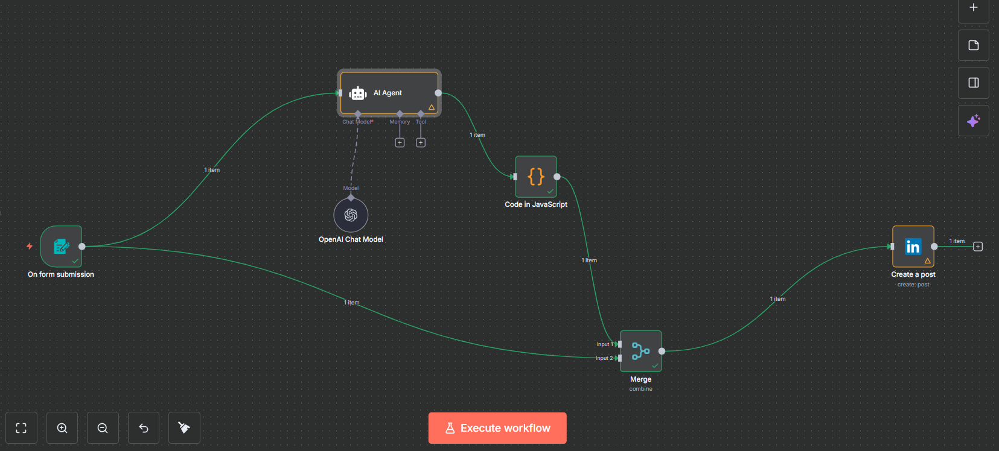

# AI LinkedIn Auto‑Post (Form → AI Agent → Code → Merge → LinkedIn)
**One‑line goal:** Type a short brief + image → get a polished LinkedIn post → (optionally schedule) → publish to your personal feed.



---

## At‑a‑glance outcomes
- A working n8n workflow that **turns a short prompt into a LinkedIn‑ready post** (with emoji + bullets).
- Optional **time‑aware scheduling** via a **Wait Until** step.
- **Personal account posting** by default; **organization/page posting** optional.
- Clear **LinkedIn OAuth2** setup for n8n (Community Management OAuth2).
- You’ll wire a **file upload** from the Form to LinkedIn (images).

---

## Prereqs & Auth (keys / scopes / accounts)
- **n8n** (Cloud or self‑hosted; needs a public URL for OAuth callback).
- **OpenAI** key (if not using n8n credits).
- **LinkedIn Developer App**:
  - Personal feed: add scope **`w_member_social`**.
  - Organization/Page posting (optional): add **`w_organization_social`** and your LinkedIn user must be **Admin** on that page.

### n8n Credentials to create
- **LinkedIn → Community Management OAuth2**  \
  Turn **OFF** any **Organization/Page** support toggle if you want to post to **personal profile** only.
- **OpenAI API** (if needed).

---

## Architecture snapshot (nodes & flow)
- **On form submission** → **AI Agent** (uses **OpenAI Chat Model**) → **Code (JavaScript)** → **Merge** (combine AI text + form image) → **LinkedIn: Create a post**
- **Optional**: **Wait Until** (between Merge → LinkedIn) to schedule using the AI‑computed time.

**Why each node exists**
- **Form**: collects Prompt, Schedule Time (human‑friendly), and Image.
- **AI Agent**: expands your brief into polished LinkedIn copy (**JSON output**).
- **Code**: parses AI JSON, normalizes schedule to `scheduled_iso`, preserves line breaks.
- **Merge**: combines AI text with the form’s uploaded image/binary.
- **LinkedIn**: posts to your account (text + image).
- **Wait Until (optional)**: posts at `scheduled_iso`.

---

## Step‑by‑Step (with sub‑steps)

### 1) Create LinkedIn OAuth (n8n side)
➜ a. In n8n, go to **Credentials → New → LinkedIn → Community Management OAuth2**.  
➜ b. **Turn OFF** the **Organization/Page** support toggle if you want **personal posting**.  
➜ c. Keep this tab open—you’ll paste **Client ID/Secret** after creating the app.

### 2) Create / Configure LinkedIn App (LinkedIn Developers)
➜ a. Open **LinkedIn Developers → My Apps → Create app**.  
➜ b. **Products / Scopes**:
   - Personal feed: **`w_member_social`**
   - Organization posting (optional): **`w_organization_social`**
➜ c. **OAuth 2.0 settings**:
   - **Redirect URL**: copy the **Callback URL** from the n8n LinkedIn credential and paste here.
   - Save.
➜ d. Copy **Client ID** & **Client Secret** → paste into n8n credential → **Connect** → approve (use the LinkedIn account you will post from).

> **Fix tip:** “redirect_uri mismatch” → re‑copy the exact callback URL from n8n and paste into your LinkedIn app OAuth settings.

### 3) Build the workflow skeleton (n8n editor)
➜ a. Add **Form Trigger** (name: **On form submission**).  
   - Fields: **Prompt** (Text, required), **Schedule Time** (Text, required), **image** (File, required).
➜ b. Add **AI Agent** (name: **AI Agent**).  
➜ c. Add **OpenAI Chat Model** and connect it to **AI Agent** under **Chat Model**.  
➜ d. Add **Code** (JavaScript).  
➜ e. Add **Merge** (Mode: **Combine**, **Combine All**).  
➜ f. Add **LinkedIn → Create a post**.  
➜ g. Wire:
   - **Form → AI Agent** (main)
   - **AI Agent → Code**
   - **Code → Merge (Input 1)**
   - **Form → Merge (Input 2)**
   - **Merge → LinkedIn: Create a post**

---

### 4) Configure the AI Agent (**put this prompt here**)
Paste the prompt below into **AI Agent → Prompt → User prompt**.

#### Copy‑Paste Block — AI Agent “User Prompt”
_Purpose: generate LinkedIn‑ready text + loose schedule in JSON._
```text
You are “PlannerBot”, an assistant that converts a short human brief into Long LinkedIn-ready post texts, with emojis and bullet points (multiple short lines).

Rules:
1) Platform-friendly: concise, skimmable, no hashtag spam (≤3).
2) If a link is provided, add a 1-line hook before it.
3) If an image URL is provided, mention “[image attached]” (we attach separately).
4) Return STRICT JSON only.

Inputs:
- prompt (string from form)
- tone (friendly/professional) [optional]
- count (1–5) [optional]
- Schedule_time (human text like “1:30 PM IST” or “tomorrow 10 AM”)
- link (optional)
- media (optional)

Output schema:
{
  "posts": [
    {
      "text": "string",
      "scheduled_ist": "YYYY-MM-DD HH:mm or hh:mm AM/PM",
      "link": "optional",
      "image_url": "optional"
    }
  ]
}
```

---

### 5) Configure OpenAI Chat Model
- **Model**: `gpt-4.1-mini` (or your choice).
- **Credentials**: your OpenAI key or n8n built‑in credits.

---

### 6) Code (JavaScript) — **paste this in the Code node**
_Purpose: parse AI JSON, normalize time → `scheduled_iso`, preserve text line breaks._

#### Copy‑Paste Block — Code node (JavaScript)
```javascript
/**
 * SINGLE POST — use AI schedule time (no errors).
 * Supports:
 * - scheduled_iso (UTC ISO)
 * - scheduled_ist ("YYYY-MM-DD HH:mm" or "hh:mm AM/PM")
 * - Schedule_time ("HH:mm" or "hh:mm AM/PM" with optional "IST")
 * - date + time
 * Falls back to now+3min if time can't be parsed.
 */
const TZ_OFFSET_MIN = 330; // IST
function parseMaybeJSON(v){ if(typeof v==='string'){ try{ return JSON.parse(v);}catch(_){} const m=v.match(/^\s*```(?:json)?\s*([\s\S]*?)\s*```/i); if(m){ try{ return JSON.parse(m[1]); }catch(_){} } } return v; }
function unescapeNewlines(s){ return String(s).replace(/\n/g,'\n').replace(/\r\n/g,'\n'); }
function istWallToUTCISO(yyyy_mm_dd,timeStr){
  let t=timeStr.replace(/\s*IST\s*$/i,'').trim();
  const pm=/\bpm\b/i.test(t), am=/\bam\b/i.test(t);
  t=t.replace(/\s*(am|pm)\s*$/i,'').trim();
  let [hh,mm]=t.split(':').map(Number);
  if(!isFinite(hh)||!isFinite(mm)) return null;
  if(pm && hh<12) hh+=12;
  if(am && hh===12) hh=0;
  const [Y,M,D]=yyyy_mm_dd.split('-').map(Number);
  if(![Y,M,D].every(n=>isFinite(n))) return null;
  const ist=new Date(Date.UTC(Y,M-1,D,hh,mm));
  const utc=new Date(ist.getTime()-TZ_OFFSET_MIN*60*1000);
  return utc.toISOString();
}
function todayIST(){
  const now=new Date();
  const ist=new Date(now.getTime()+TZ_OFFSET_MIN*60*1000);
  const Y=ist.getUTCFullYear(), M=ist.getUTCMonth()+1, D=ist.getUTCDate();
  return `${Y}-${String(M).padStart(2,'0')}-${String(D).padStart(2,'0')}`;
}
function addDaysISO(iso, days){ const d=new Date(iso); d.setUTCDate(d.getUTCDate()+days); return d.toISOString(); }

// ---------- read AI output ----------
let ai=parseMaybeJSON($json);
if(typeof ai?.output!=='undefined') ai=parseMaybeJSON(ai.output);
if(Array.isArray(ai?.posts) && ai.posts.length) ai=ai.posts[0];

const textRaw=ai?.text ?? '';
const link=ai?.link || undefined;
const image_url=ai?.image_url || ai?.imageUrl || undefined;

// ---------- choose schedule ----------
let scheduled_iso=null;
if(typeof ai?.scheduled_iso==='string' && ai.scheduled_iso.includes('T')){
  const d=new Date(ai.scheduled_iso); if(!isNaN(d)) scheduled_iso=d.toISOString();
}
if(!scheduled_iso && typeof ai?.scheduled_ist==='string'){
  const m=ai.scheduled_ist.trim().match(/^(\d{4}-\d{2}-\d{2})\s+(\d{1,2}:\d{2}(?:\s?[APMapm]{2})?)$/);
  if(m) scheduled_iso=istWallToUTCISO(m[1], m[2]);
}
if(!scheduled_iso && typeof ai?.date==='string' && typeof ai?.time==='string'){
  scheduled_iso=istWallToUTCISO(ai.date.trim(), ai.time.trim());
}
if(!scheduled_iso && typeof ai?.Schedule_time==='string'){
  const today=todayIST();
  scheduled_iso=istWallToUTCISO(today, ai.Schedule_time.trim());
  if(scheduled_iso && new Date(scheduled_iso).getTime() <= Date.now()){
    scheduled_iso=addDaysISO(scheduled_iso, 1);
  }
}
if(!scheduled_iso){ scheduled_iso=new Date(Date.now()+3*60*1000).toISOString(); }

// ---------- text (preserve formatting) ----------
const post_text=unescapeNewlines(textRaw);

// ---------- output ----------
return [{ json: { post_text, link, image_url, scheduled_iso } }];
```

---

### 7) Merge (Combine → Combine All)
- Keep defaults; this merges AI output (text, `scheduled_iso`) with the **Form payload** (binary `image`).

### 8) (Optional) Wait Until — for schedule
Insert **Wait Until** between **Merge → LinkedIn**.

#### Copy‑Paste Block — Wait Until date/time expression
_Purpose: let the post go live at the AI‑normalized time._
```text
={{ $json["scheduled_iso"] }}
```

### 9) LinkedIn: Create a post
- **Credentials**: your LinkedIn OAuth2 (created earlier).
- **Person**: select **your account** (or paste your member URN).
- **Share media category**: **IMAGE**.
- **Binary property name**: `image` (must match the Form file field).
- **Text**:
  #### Copy‑Paste Block — LinkedIn text field
  _Purpose: post body from AI._
  ```text
  ={{ $json.post_text }}
  ```

---

## Testing & Validation
1) **Execute workflow**.
2) Open **Form URL** (from the Form Trigger).
3) Fill:
   - **Prompt**: “Announcing our automation win — 3 tips”
   - **Schedule Time**: “1:30 PM IST” (future)
   - **image**: upload a JPG/PNG
4) Submit → check n8n run.
5) If **Wait Until** present, it posts at the scheduled time; else it posts now.
6) Verify on LinkedIn.

**Example final result (personal feed):**


---

## Troubleshooting (fast fixes)
- **redirect_uri mismatch** → paste the exact callback URL from n8n into your LinkedIn app.
- **401/403 permissions** → check scopes: `w_member_social` (personal) and optionally `w_organization_social` (org) + you are **Admin**.
- **Binary property not found: image** → Form file field must be named `image`; LinkedIn node **Binary property name** = `image`.
- **Immediate posting** → ensure **Wait Until** node exists and uses `={{ $json["scheduled_iso"] }}`.
- **Undefined `post_text`** → the AI didn’t return expected JSON; review the **AI Agent** prompt and **Code** node.

---

## What to Deliver
- **README.md** (this file)
- **workflow.json** (n8n export)
- **images/** folder with screenshots

> Import the workflow.json in n8n (**Import from file**) and connect your credentials.

---
