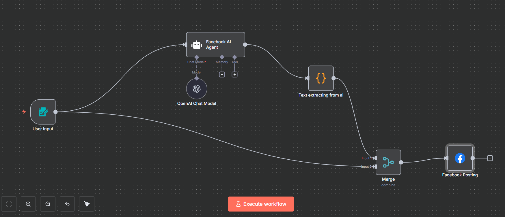

# Facebook Page Auto‑Poster (n8n + Meta OAuth2)
One‑line goal: Post text + an uploaded image to a **Facebook Page** from an n8n form, using Meta OAuth2 to obtain a Page access token.

## At‑a‑glance outcomes
- Live Meta app with Privacy Policy URL set
- Page access token generated via Meta OAuth2 (Graph API Explorer)
- n8n **Facebook Graph API** credential configured
- Working workflow: **Form → AI Agent (OpenAI) → Code (JS) → Merge → Facebook Graph API** (uploads photo + caption)

## Prereqs & Auth (do this first)
**Note:** Facebook Graph API posts to **Pages** (personal profiles are not supported).
1) **Create Meta app** → App Dashboard → Create app → *Business* → add Privacy Policy URL → switch **App Mode: Live**.
2) **Get Page access token (OAuth2)** via **Graph API Explorer**:
   - Pick your App → **Get User Access Token** with scopes: `pages_manage_posts`, `pages_read_engagement`, `pages_show_list` → approve.
   - Call **/me/accounts** → copy the **Page Access Token** for your target Page.
3) **n8n credential** → **Facebook Graph API** → paste the **Page Access Token** → Save.

## Architecture snapshot (nodes/tools)
- **Form Trigger** → collects `Prompt` (text) and `image` (file, becomes *binary* `image`)
- **AI Agent (OpenAI Chat Model)** → drafts caption
- **Code (JavaScript)** → normalizes AI JSON → `post_text`
- **Merge (combineAll)** → merges JSON from *Code* with the **binary** from the *Form*
- **Facebook Graph API** → `POST me/photos`, **Send Binary File = true**, **Input Binary Field = image**, `caption = {{$json.post_text}}`

--- 
### canvas 


## Step‑by‑Step

### 1) Credential
➜ a. **Credentials → New → Facebook Graph API**  
➜ b. Name: `Facebook Graph account`  
➜ c. **Access Token:** paste the **Page Access Token** → **Save**

### 2) Nodes (order & wiring)
1. **Form Trigger**  
2. **OpenAI Chat Model** → **AI Agent**  
3. **Code (JavaScript)**  
4. **Merge (combineAll)**  
5. **Facebook Graph API**  
Wire: Form → (AI Agent & Merge Input 2); AI Agent → Code → Merge Input 1; Merge → Facebook Graph API.

### 3) Form Trigger (fields)
➜ **Prompt**: text, *Required ON*  
➜ **image**: file, *Required optional* (creates **binary** under key `image`)

### 4) AI Agent (caption writer)
- Model: your OpenAI credential
- **System Prompt** (paste below)
- **User**: `={{ $json["Prompt"] }}`

#### Copy‑Paste — *AI Agent System Prompt* (purpose: write a clean Page caption)
```text
You are “PlannerBot”, a precise Facebook Page caption writer.
Rules:
- Output JSON only: {{ "posts":[{{ "text": "<caption>" }}] }}
- Max length 2000 chars. Use tasteful emojis and 5–8 bullet points if relevant.
- If a URL is provided upstream, include it once at the end.
- Don’t invent dates; no promises; no personal data.
Temperature: low.
```

### 5) Code (JavaScript)
Paste this in the **Code** node.

#### Copy‑Paste — *Code (JS)* (purpose: normalize AI output)
```js
// Read AI output (agent may return {posts:[{text:"..."}]})
const out = Array.isArray($json.posts) ? $json.posts[0] : $json;
const post_text = (out && out.text) ? String(out.text).replace(/\n/g, '\n') : '';
// Optional: pass through a link if upstream provided one
const link = out && (out.link || out.image_url) ? (out.link || out.image_url) : undefined;
// Optional: schedule now + 3 minutes (UTC ISO)
const scheduled_iso = new Date(Date.now() + 3 * 60 * 1000).toISOString();
return [{ json: { post_text, link, scheduled_iso } }];
```

### 6) Merge
- **Mode:** `combine`
- **Combine by:** `combineAll`
(Ensures the JSON from *Code* and the **binary** `image` from the *Form* travel together.)

### 7) Facebook Graph API
- **Method:** `POST`
- **Node:** `me`
- **Edge:** `photos`
- **Send Binary File:** `true`
- **Input Binary Field:** `image`
- **Query → caption:** `={{ $json.post_text }}`
- **Credentials:** select `Facebook Graph account`

## Copy‑Paste Quick refs
**Caption expression**
```
={{ $json.post_text }}
```

**Binary field name (Facebook node)**
```
image
```

**Form file field (must match)**
```
image
```
---
### Posted Output 


## Testing & Validation
1) Execute workflow → submit prompt + image.
2) Open **Merge** output → confirm `json.post_text` and `binary.image` exist.
3) Check your **Facebook Page** → photo + caption should appear.

## Troubleshooting
- **(#200) permissions** → Re‑mint Page token with `pages_manage_posts` + `pages_read_engagement`.
- **190 OAuthException** → Token expired/wrong app → generate new token in Graph API Explorer.
- **Binary not found** → Ensure form file field = `image` and node *Input Binary Field* = `image`.
- **Posting to personal profile** → Not supported; use a **Page**.

---
