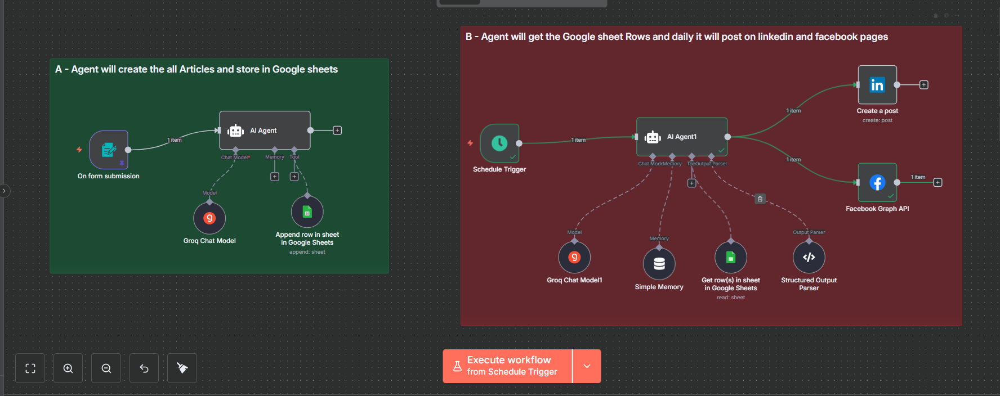
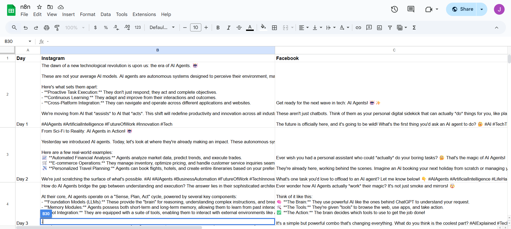
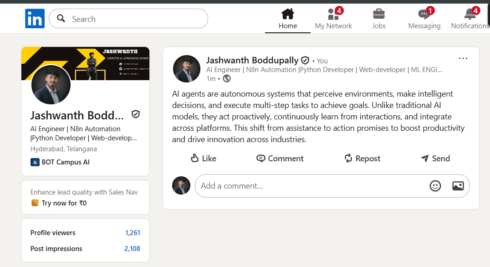
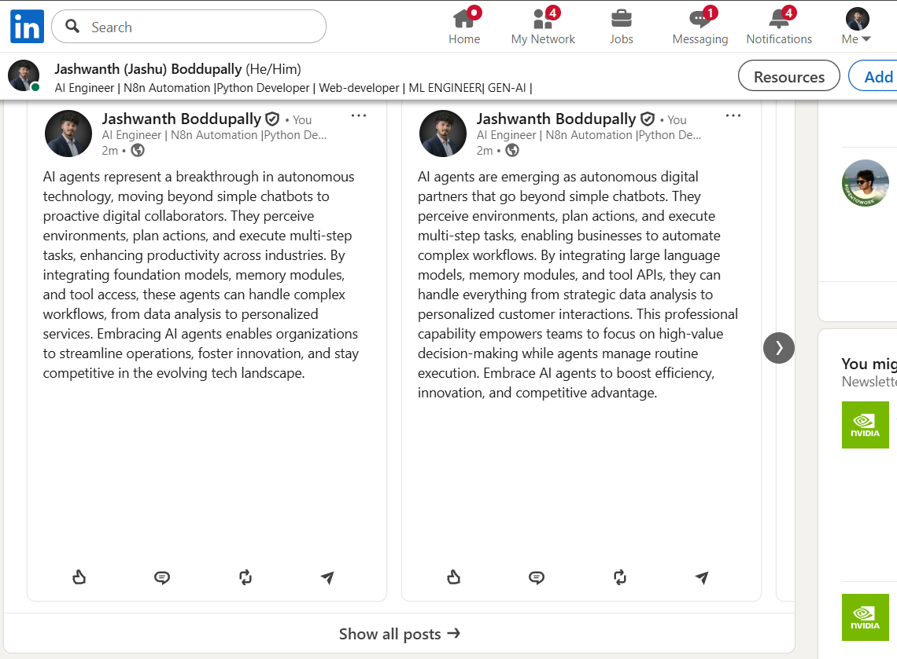
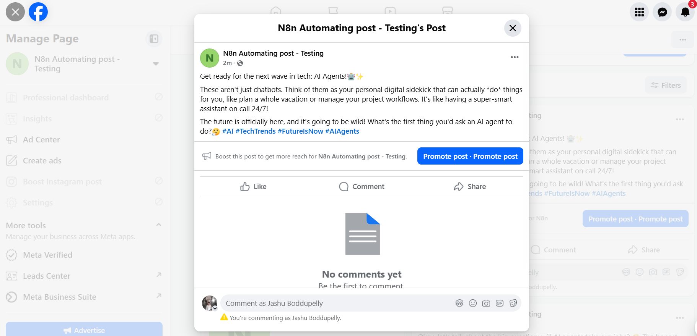
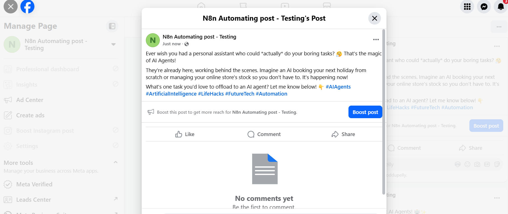

# The Social Media Orchestrator — n8n Workflow Guide
This README is aligned **exactly** to the canvas layout you provided. It is written for a **new candidate** and focuses on **clear node instructions**, **mode**, **operation**, **drag-and-drop directions**, and **copyable code blocks**. No emojis.

---

## 0) Wire map (match the canvas)


### Canvas layout (reference)


> Layout rule satisfied: in both parts, place the **Agent directly to the right of the Trigger**. Place the LLM, Memory, Tools and Output Parser **under the Agent** and connect via their labeled ports.

---

## 1) Prerequisites

Create the following credentials in **n8n → Settings → Credentials**:

- **Google Sheets OAuth2:** `Google Sheets account`
- **Groq API:** `Groq account` (model `openai/gpt-oss-120b`)
- **LinkedIn OAuth2:** `LinkedIn account` (scope `w_member_social`)
- **Facebook Graph API:** `Facebook Graph account`

Google Sheet used by both parts:
- **Spreadsheet ID:** `1JfUJ3E0hevU3laYzaGUxULYT-SbBmxOEJVK-tD71qVI`
- **Sheet name:** `Social Media Orchestrator` (gid `1841027503`)

---

## 2) Part-A — Create content from a form and store to Google Sheets

> Place and wire **in this exact order and layout**: Trigger (left), **AI Agent** immediately to the right, supporting nodes **below** Agent.

### A1) On form submission (Form Trigger)
**Drag & drop:** Form Trigger → rename **On form submission**.  
**Mode:** Trigger  
**Operation:** Form

**Form settings:**
- **Form Title:** ` The Social Media Orchestrator`
- **Fields:**
  1. `Enter the prompt` (Required)
  2. `Days` (Dropdown, Required) — Options: `5 Days`, `7 Days`, `14 days`, `30 days`
  3. `Select a Social Media ` (Dropdown, Required) — Options: `LinkedIn`, `Facebook`, `Both - Linkedin & Facebook`

**Connection:** On form submission → **AI Agent**.

---

### A2) AI Agent (Agent / LangChain Agent)
**Drag & drop:** Agent (LangChain Agent) → rename **AI Agent**.  
**Mode:** Agent

**Connections:**
- **Main input:** from **On form submission**
- **ai_languageModel:** from **Groq Chat Model** (A3)
- **ai_tool:** from **Append row in sheet in Google Sheets** (A4)

**Prompt (define) — paste exactly:**
```txt
=Your job is to write platform-specific daily posts based on a topic and return the content in a structured format for Google Sheets. The Google Sheet has three columns:
- "day" ( Day 1.... Day N (text))
- "linkedin" (text)
- "facebook" (text)

Each request corresponds to one day (Day 1, Day 2, etc.). Posts must be unique and increasingly insightful across days.

- **LinkedIn** content: professional tone, professional  and points wise with emojis.
- **Facebook** content: casual tone, professional and pointwise with emojis.


I attched the google sheet tool to agent so append into that 

{{(() => {
  const day = $json.Days ;
  const prompt = $json["Enter the prompt"];
  const platform = ($json['Select a Social Media '] || "Both - LinkedIn & Facebook").toLowerCase();

  const base = `Generate social media posts for Day $json.Days , based on this topic: "${prompt}".`;

  if (platform.includes("both")) {
    return base + `\nWrite two outputs:\n1. LinkedIn (professional)\n2. Facebook (casual)\nReturn JSON like: { "day": ${day}, "linkedin": "...", "facebook": "..." }`;
  }

  if (platform.includes("linkedin")) {
    return base + `\nWrite one output:\nLinkedIn (professional, 3-5 sentences)\nReturn JSON like: { "day": ${day}, "linkedin": "..." }`;
  }

  if (platform.includes("facebook")) {
    return base + `\nWrite one output:\nFacebook (casual, 2-3 sentences)\nReturn JSON like: { "day": ${day}, "facebook": "..." }`;
  }

  // Fallback if platform is unrecognized
  return base + `\nWrite two outputs:\n1. LinkedIn (professional)\n2. Facebook (casual)\nReturn JSON like: { "day": ${day}, "linkedin": "...", "facebook": "..." }`;
})()}}
```

**System message (Options → systemMessage):**
```txt
=You are a professional social media content creator, integrated into an automated content generation system.

Your job is to write platform-specific daily posts based on a topic and return the content in a structured format for Google Sheets. The Google Sheet has three columns:
- "day" (number)
- "linkedin" (text)
- "facebook" (text)

Always return your response as valid JSON with keys matching exactly: `day`, `linkedin`, and `facebook`. Leave a field blank if it's not required.

Each request corresponds to one day (Day 1, Day 2, etc.). Posts must be unique and increasingly insightful across days.

- LinkedIn content: professional tone, 3–5 sentences.
- Facebook content: casual tone, 2–3 sentences.
```

---

### A3) Groq Chat Model (LLM for Part-A)
**Drag & drop:** Groq Chat Model → rename **Groq Chat Model**.  
**Mode:** Chat model  
**Credentials:** `Groq account`  
**Model:** `openai/gpt-oss-120b`

**Connection:** Groq Chat Model → **AI Agent** (port: `Chat Model`).

---

### A4) Append row in sheet in Google Sheets (write tool)
**Drag & drop:** Google Sheets Tool → rename **Append row in sheet in Google Sheets**.  
**Mode:** Tool  
**Operation:** Append  
**Credentials:** `Google Sheets account`  
**Spreadsheet:** ID `1JfUJ3E0hevU3laYzaGUxULYT-SbBmxOEJVK-tD71qVI`  
**Sheet:** `Social Media Orchestrator` (gid `1841027503`)

**Auto Map Input Data** — use exactly this mapping:
```json
{
  "Day": "={{ /*n8n-auto-generated-fromAI-override*/ $fromAI('Day', ``, 'string') }}",
  "Instagram": "={{ /*n8n-auto-generated-fromAI-override*/ $fromAI('Instagram', ``, 'string') }}",
  "Facebook": "={{ /*n8n-auto-generated-fromAI-override*/ $fromAI('Facebook', ``, 'string') }}"
}
```

**Connection:** Append row in sheet in Google Sheets → **AI Agent** (port: `Tool`).

**Result evidence (sheet after Part‑A writes):**


---

## 3) Part-B — Pick next day from Sheets and post to LinkedIn/Facebook

> Place and wire **in this exact order and layout**: Trigger (left), **AI Agent1** immediately to the right, supporting nodes **below** Agent; outputs to LinkedIn and Facebook on the far right.

### B1) Schedule Trigger
**Drag & drop:** Schedule Trigger → rename **Schedule Trigger**.  
**Mode:** Trigger  
**Rule:** every **7 days** at **02:00** (server time, from JSON).

**Connection:** Schedule Trigger → **AI Agent1**.

---

### B2) AI Agent1 (Agent / LangChain Agent)
**Drag & drop:** Agent (LangChain Agent) → rename **AI Agent1**.  
**Mode:** Agent

**Connections:**
- **Main input:** from **Schedule Trigger**
- **ai_languageModel:** from **Groq Chat Model1** (B3)
- **ai_memory:** from **Simple Memory** (B4)
- **ai_tool:** from **Get row(s) in sheet in Google Sheets** (B5)
- **ai_outputParser:** from **Structured Output Parser** (B6)
- **Main outputs:** to **Create a post (LinkedIn)** (B7) and **Facebook Graph API** (B8)

**Prompt (define) — paste exactly:**
```txt
=ROLE
You are the Daily Social Media Orchestrator Agent. Once per day you must fetch rows from the connected Google Sheets tool and output exactly one row per run in a very simple format.

HOW TO CHOOSE THE ROW
1) CALL the “Get row(s) in Google Sheets” tool to retrieve ALL rows (array of objects).
2) Identify the day column (try, in order): Day → day → days.
   - Accept values like "Day 1", "Day 2", … or plain numbers 1, 2, …
3) Determine LAST handled day by scanning your memory (past outputs). 
   - Find the highest N that appeared in a previous line matching: `Day: Day N`.
   - If none found, set LAST = 0.
4) Compute NEXT = the smallest day number strictly greater than LAST.
   - If none exists (i.e., LAST is already the max day in the sheet), wrap to the smallest day number present.
5) Select exactly ONE row whose day == NEXT.
6) If linkedin/facebook fields are empty, generate concise, good copy:
   - linkedin: professional tone (≤ 120 words)
   - facebook: casual, friendly (≤ 120 words)

STRICT OUTPUT FORMAT (no JSON, no markdown, no extra text)
Day: Day <NEXT>
linkedin: <linkedin text>
facebook: <facebook text>

RULES
- Use the Google Sheets tool once per run.
- Be tolerant of header case/spaces.
- If multiple rows share the same day number, pick the first.
- If the sheet/column cannot be read, still return the three lines with:
  Day: ERROR
  linkedin:
  facebook:
```


---

### B3) Groq Chat Model1 (LLM for Part-B)
**Drag & drop:** Groq Chat Model → rename **Groq Chat Model1**.  
**Mode:** Chat model  
**Credentials:** `Groq account`  
**Model:** `openai/gpt-oss-120b`

**Connection:** Groq Chat Model1 → **AI Agent1** (port: `Chat Model`).

---

### B4) Simple Memory (Buffer Window Memory)
**Drag & drop:** Buffer Window Memory → rename **Simple Memory**.  
**Mode:** Memory  
**Context window length:** `15`  
**Session key (Expression):**
```txt
={{ $('Schedule Trigger').item.json.timestamp }}
```

**Connection:** Simple Memory → **AI Agent1** (port: `Memory`).

---

### B5) Get row(s) in sheet in Google Sheets (read tool)
**Drag & drop:** Google Sheets Tool → rename **Get row(s) in sheet in Google Sheets**.  
**Mode:** Tool  
**Operation:** Read rows  
**Credentials:** `Google Sheets account`  
**Spreadsheet:** ID `1JfUJ3E0hevU3laYzaGUxULYT-SbBmxOEJVK-tD71qVI`  
**Sheet:** `Social Media Orchestrator` (gid `1841027503`)

**Connection:** Get row(s) in sheet in Google Sheets → **AI Agent1** (port: `Tool`).

---

### B6) Structured Output Parser
**Drag & drop:** Structured Output Parser → rename **Structured Output Parser**.  
**Mode:** JSON schema example  
**Schema:**
```json
{
  "selected_day": "string",
  "day_label": "string",
  "linkedin": "string",
  "facebook": "string"
}
```

**Connection:** Structured Output Parser → **AI Agent1** (port: `Output Parser`).

---

### B7) Create a post (LinkedIn)
**Drag & drop:** LinkedIn → rename **Create a post**.  
**Mode:** Create post  
**Credentials:** `LinkedIn account`  
**Person/URN:** `lOKWmA6wrH` (replace with your identifier)  
**Text (Expression):**
```txt
={{ $json.output.linkedin }}
```

**Connection:** **AI Agent1 → Create a post**.

**LinkedIn posting evidence**
- Day 1:
  
- Day 2:
  

---

### B8) Facebook Graph API
**Drag & drop:** Facebook Graph API → rename **Facebook Graph API**.  
**Mode:** HTTP POST to Graph edge  
**Credentials:** `Facebook Graph account`  
**Graph version:** `v23.0`  
**Node:** `me`  
**Edge:** `feed`  
**Query parameter `message` (Expression):**
```txt
={{ $json.output.facebook }}
```

**Connection:** **AI Agent1 → Facebook Graph API**.

**Facebook posting evidence**
- Day 1:
  
- Day 2:
  

---

## 4) Testing quickstart

- **Part-A:** Open the form preview and submit values for the three fields. Verify a new row appears in the target Google Sheet.  
- **Part-B:** Manually execute **AI Agent1** to simulate the scheduler and confirm a LinkedIn post and a Facebook post are produced using the agent output.

---

## 5) Notes to keep wiring faithful
- Keep the **Agent immediately to the right of its Trigger** in both panels.
- Place LLM, Memory, Tools, and Output Parser **under** the Agent and connect via the labeled ports.
- Keep credential names and spreadsheet IDs exactly as listed unless you also update all nodes accordingly.
- If LinkedIn or Facebook calls fail, verify scopes/permissions and the target identifiers first.
