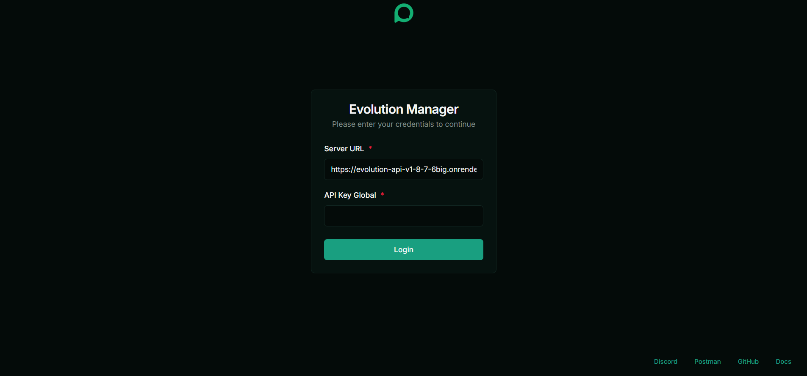
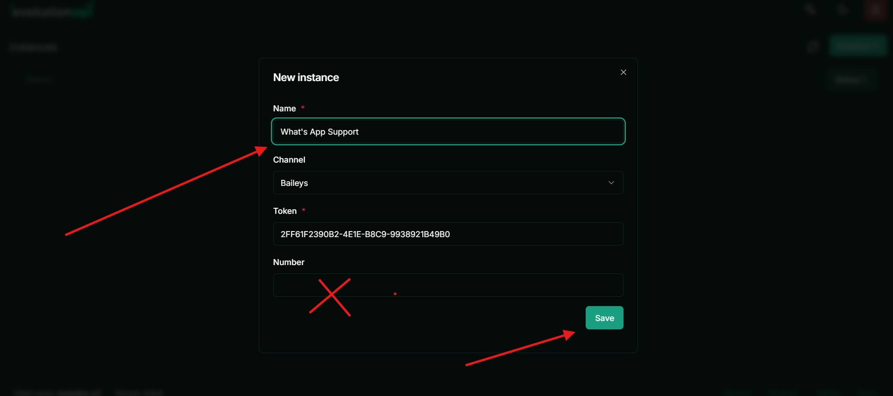
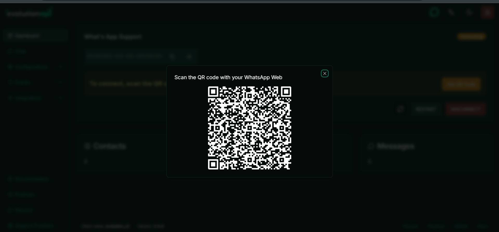
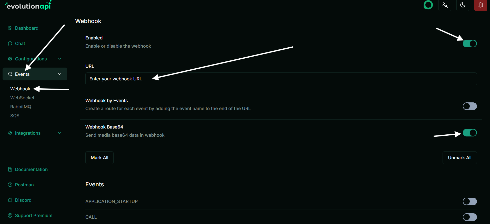
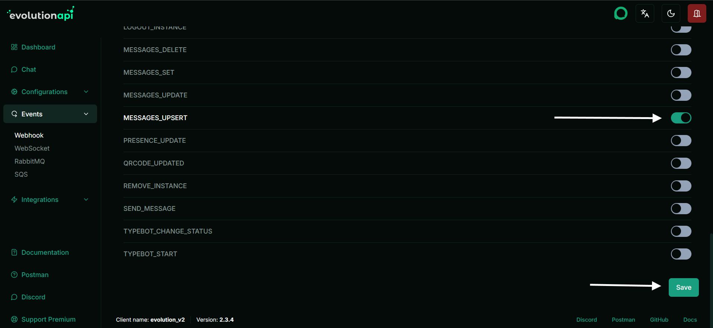

# Evolution Manager (WhatsApp) — Quick Start

Use the **already hosted** Evolution Manager to get WhatsApp running in minutes.

---

## 1) Log in
Open: `https://evolution-api-v1-8-7-6big.onrender.com/manager/`  
Fill the form and click **Login**:

- **Server URL:** `https://evolution-api-v1-8-7-6big.onrender.com`  
- **API Key Global:** `21uk1a66a121uk1a66a1`

---

## 2) Create an instance
Click **Instance +** (top-right).

---

## 3) Fill instance details → Save
- **Name:** e.g. `WhatsApp Support`  
- **Channel:** `Baileys`  
- **Token:** use the generated value (keep it)  
- **Number:** **leave blank** (Baileys links via QR)

Click **Save**.

---

## 4) Link your WhatsApp (QR)
On the instance dashboard, click **Get QR Code**.

On your phone: **WhatsApp → Settings → Linked devices → Link a device**, then scan the QR.  
Wait until the instance shows **Connected**.

---

## 5) Set up Webhook (to receive messages)
Go to **Events → Webhook** and configure:

- **Enabled:** ON  
- **URL:** your receiver (e.g., n8n)  
  - Example: `https://YOUR_N8N_HOST/webhook/my-whats-app`  
- **Webhook Base64:** ON (helps with media)

Scroll down:

- Enable the event **`MESSAGES_UPSERT`**
- Click **Save**

---

## 6) Test
Send a WhatsApp message to the linked number and confirm your webhook (e.g., n8n) receives the event.

**Notes**
- If the QR expires, click **Restart** then **Get QR Code** again.
- Keep the instance **Token** secret; it’s required for API calls from clients.
