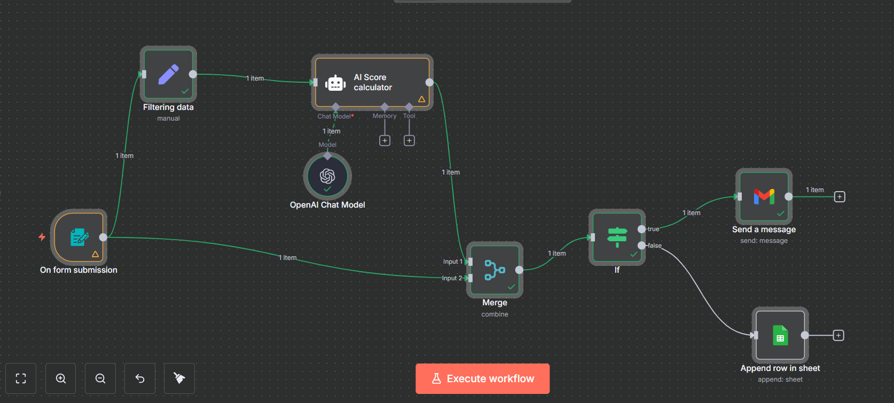
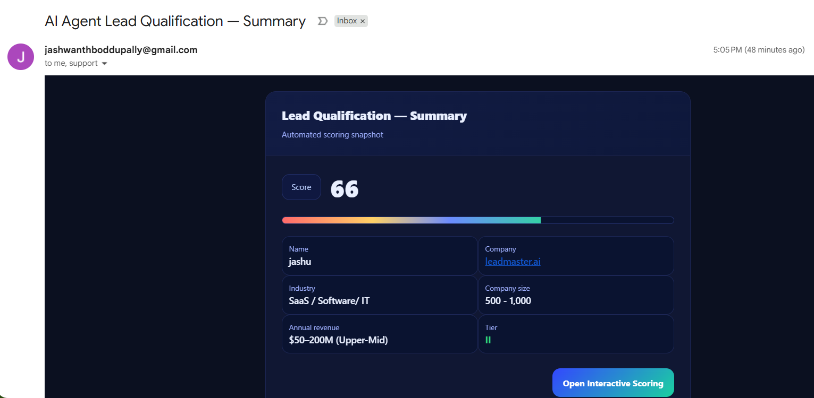
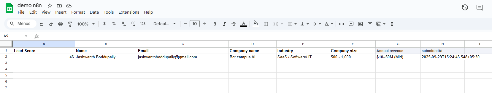

# AI Lead Scoring Agent (n8n) — Professional Build Guide

**Goal:** Collect a lead via a form, calculate a **0–100 score** using an AI rubric, and route:
- **Score ≥ 60** → send a rich HTML **email** to your team.
- **Score < 60** → **append** the lead to **Google Sheets** for nurture.

---

## 1) Prerequisites
- **n8n** (Cloud or self‑hosted).
- **Credentials in n8n → Settings → Credentials:**
  - **OpenAI** (API key).
  - **Gmail OAuth2** (to send the summary email).
  - **Google Sheets OAuth2** (to append rows).
- **Google Sheet headers (row 1) — create these exactly:**
  ```text
  Lead Score | Name | Email | Company name | Industry | Company size | Annual revenue | submittedAt
  ```
- Keep your form dropdown labels tidy (no trailing spaces). We handle minor differences in-flow.

---

## 2) Architecture (high level)
1. **Form Trigger** collects the lead.
2. **Set** normalizes fields for the model.
3. **OpenAI Chat Model** provides the LLM.
4. **Agent** computes the score (single integer).
5. **Merge** combines score + original form data.
6. **If** gates on the score.
7. **Gmail** sends the summary email (true branch).
8. **Google Sheets** appends the lead (false branch).

**Canvas preview**  


---

## 3) Build the workflow (drag & drop + exact settings)

### Step 1 — Form Trigger
- **Drag**: *Form Trigger* to the canvas.
- **Form title:** `Lead scoring Agent`
- **Fields (use these labels):**
  - `Name ` *(note: a trailing space may already exist in your form — keep or remove; we read both)*
  - `Email` *(type: Email, Required)*
  - `Company name` *(Required)*
  - `Industry` *(Dropdown, Required — use your list)*
  - `Company size` *(Dropdown, Required — use your list)*
  - `Annual revenue` *(Dropdown — use your list)*

---

### Step 2 — Set (Filtering data)
- **Drag**: *Set* → rename to **Filtering data**.
- **Connect**: *Form Trigger → Filtering data*.
- **Mode:** **Keep Only Set**.
- **Assignments** (⚙️ → **Add Expression** for each value):
```js
// New keys the model will use + passthrough fields
industry             = {{ String($json.Industry || '').trim() }}
company_size_label   = {{ String($json['Company size'] || '').trim() }}
annual_revenue_label = {{ String($json['Annual revenue'] || '').trim() }}
name                 = {{ $json['Name '] || $json.Name || '' }}
email                = {{ $json.Email }}
company_name         = {{ $json['Company name'] }}
submittedAt          = {{ $json.submittedAt || $now.toISO() }}
```

---

### Step 3 — OpenAI Chat Model
- **Drag**: *OpenAI Chat Model*.
- **Model:** `gpt-4` (or `gpt-4o-mini`).
- **Temperature:** `0.0` (deterministic).
- You’ll connect this to the Agent’s **AI model** port in the next step.

---

### Step 4 — Agent (AI Score calculator)
- **Drag**: *Agent (LangChain)* → rename **AI Score calculator**.
- **Connect**:
  - *Filtering data → AI Score calculator* (main).
  - *OpenAI Chat Model → AI Score calculator* (dotted **AI model** port).
- **Prompt type:** **Define**.
- **Text** (paste exactly):
```txt
You are a deterministic lead-scoring assistant. You will receive exactly three fields: 
industry, company_size_label, and annual_revenue_label. Compute a single integer final score 
from 0–100 using the rubric below. Clamp to 0–100. Output only the integer (no words, no JSON, 
no punctuation).

Scoring (additive):

Industry
- “SaaS / Software / IT”: +20
- Anything else: +10

Company size
- 1–10: +10
- 11–50: +18
- 51–200: +20
- 201–500: +26
- 500–1,000: +36
- 1,001–5,000: +45
- 5,001–10,000: +50
- 10,000+: +60

Annual revenue
- <$1M: +0
- $1–10M: +5
- $10–50M: +10
- $50–200M: +12
- $200M+: +15

INPUT:
{
  "industry": "{{ $json.industry }}",
  "company_size_label": "{{ $json.company_size_label }}",
  "annual_revenue_label": "{{ $json.annual_revenue_label }}"
}
```
- **System message (optional):**
```txt
Return only a single integer 0–100. No words, no symbols, no JSON.
```

> The Agent’s output will be in `{{$json.output}}`. If your model ever returns extra text, add the optional “Coerce score” step below.

---

### (Optional) Step 5 — Code (Coerce score)
- **Drag**: *Code* → rename **Coerce score**.
- **Connect**: *AI Score calculator → Coerce score* → then use **Coerce score** as input to **Merge** (instead of the Agent directly).
- **Language:** JavaScript.
- **Code:**
```javascript
// Accepts agent output like "85", "85\\n", or "Score: 85" and produces a clean integer 0–100
const out = [];
for (const item of items) {
  const raw = String(item.json?.output ?? item.json?.text ?? item.json ?? '').trim();
  const m = raw.match(/-?\\d+/);
  let score = m ? parseInt(m[0], 10) : 0;
  if (isNaN(score)) score = 0;
  score = Math.min(100, Math.max(0, score));
  out.push({ json: { ...item.json, output: score } });
}
return out;
```

---

### Step 5 (or 6 if using Code) — Merge (combine)
- **Drag**: *Merge*.
- **Connect**:
  - **If you used “Coerce score”** → *Coerce score → Merge (Input 1)*
  - **Otherwise** → *AI Score calculator → Merge (Input 1)*
  - *On form submission → Merge (Input 2)*
- **Mode:** `Combine`  
- **Combine by:** `Combine All`

---

### Step 6 (or 7) — If (route by score)
- **Drag**: *If*.
- **Connect**: *Merge → If*.
- **Type validation:** **Strict**.
- **Condition:** **Number** `>=`
```txt
Left  = {{ $json.output }}
Right = 60
```

---

### Step 7 (or 8) — Gmail (Send a message) — TRUE branch
- **Drag**: *Gmail* → rename **Send a message**.
- **Connect**: *If (true) → Send a message*.
- **To**: comma-separated recipients.
- **Subject**: `AI Agent Lead Qualification — Summary`
- **Message (HTML)**: paste your template; keep these expressions:
```txt
{{ $json.output }}
{{ $('On form submission').item.json['Name '] || $('On form submission').item.json.Name }}
{{ $('On form submission').item.json['Company name'] }}
{{ $('On form submission').item.json.Industry }}
{{ $('On form submission').item.json['Company size'] }}
{{ $('On form submission').item.json['Annual revenue'] }}
```

**Email example**  


---

### Step 8 (or 9) — Google Sheets (Append) — FALSE branch
- **Drag**: *Google Sheets* → rename **Append row in sheet**.
- **Connect**: *If (false) → Append row in sheet*.
- **Operation:** `Append`.
- **Mapping (Define Below)** — use these expressions:
```txt
Lead Score     = {{ $json.output }}
Name           = {{ $('On form submission').item.json['Name '] || $('On form submission').item.json.Name }}
Email          = {{ $('On form submission').item.json.Email }}
Company name   = {{ $('On form submission').item.json['Company name'] }}
Industry       = {{ $('On form submission').item.json.Industry }}
Company size   = {{ $('On form submission').item.json['Company size'] }}
Annual revenue = {{ $('On form submission').item.json['Annual revenue'] }}
submittedAt    = {{ $('On form submission').item.json.submittedAt }}
```

**Sheet example**  


---

## 4) Test & Troubleshoot
- Submit 2–3 test leads to hit both branches.
- If the **If** node never routes TRUE, inspect the value of `output` on **Merge**; ensure the model temperature is `0.0`. Add the **Coerce score** node if needed.
- If **Sheets** append fails, share the Sheet with your Sheets credential and verify header names.
- If the **email** shows blanks, double‑check the expressions (especially `Name ` vs `Name`).

---

**Go live:** Click **Execute workflow** to validate, then toggle **Active** (top‑right).
