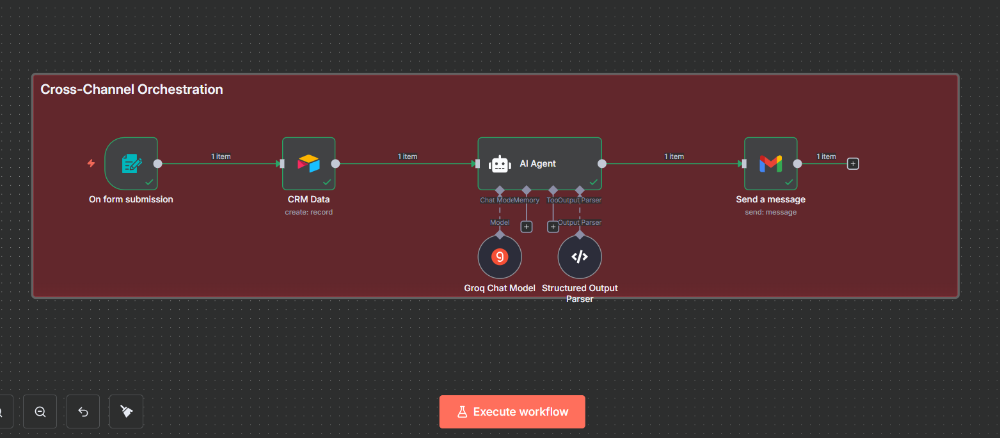
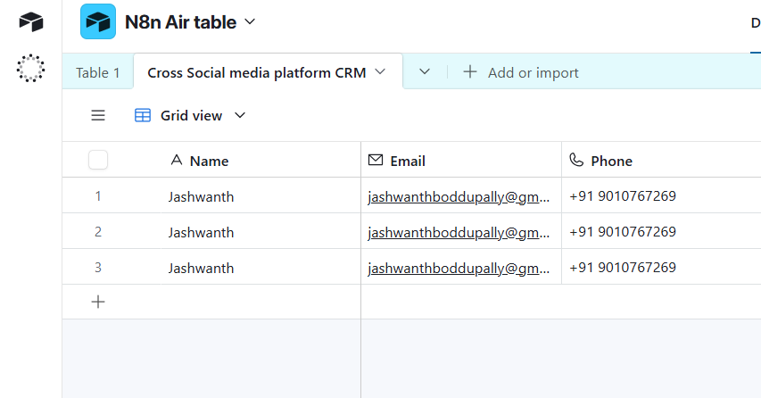
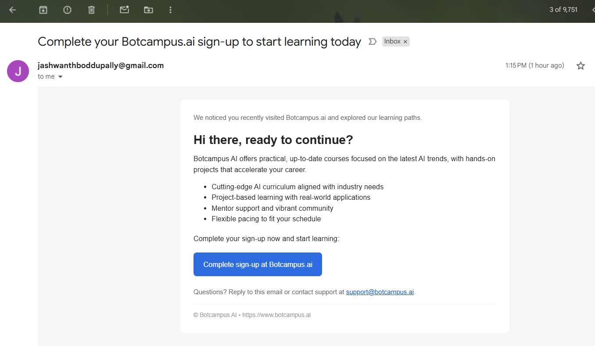

# Cross‑Channel Re‑Engagement Orchestrator — n8n (Single Workflow)


---

## 0) Wire diagram (what you’ll build)



**Flow:** Form ▶ Airtable ▶ AI Agent (with Groq model + Structured Output Parser) ▶ Gmail

---

## 1) What this workflow does

- Captures prospect details via an **n8n Form**
- Stores them in **Airtable** (CRM table)
- Calls an **AI Agent** (LangChain Agent) using **Groq** as the LLM and a **Structured Output Parser**
- Sends a **production‑ready HTML email** with **Gmail** to the prospect

---

## 2) Prerequisites (accounts & access)

1. **n8n**: Self‑hosted or cloud workspace with credential storage.
2. **Airtable**: Base and table ready. You’ll need an **Airtable access token** with write access to the table.
3. **Groq**: A **Groq API key** (for the `openai/gpt-oss-120b` model used here; you can swap later if needed).
4. **Gmail**: An OAuth2 connection with permission to send emails.

> Tip: Add credentials first (left sidebar ▸ **Credentials**) so you can select them during node setup.

---

## 3) Quick import (optional)
If you prefer, you can import the workflow JSON directly (n8n ▸ **Workflows** ▸ **Import from File**). Then skim Sections 4–7 to understand and verify each node.

---

## 4) Build from scratch — Drag‑and‑Drop Steps

Follow the exact order below. After placing every node, **drag a connection** from the small right dot of the previous node to the left dot of the next node.

### Node 1 — **On form submission** (Form Trigger)
- **How to add:** Press **+** ▸ search **Form Trigger** ▸ add **On form submission**.
- **Operation:** Form trigger (built‑in)
- **Mode:** Trigger on form submit
- **Configure:**
  - **Form Title:** `CRM Sample user Data`
  - **Form Description:** `Re-contact the interested (unregistered) user across platforms to complete Botcampus.ai sign-up.`
  - **Form Fields:**
    - Field 1: **Name** (Text)
    - Field 2: **Email** (Email)
    - Field 3: **Phone number** (Number) — **Placeholder:** `+91 `
- **Save**. Click **Copy Public URL** if you want to open the form directly for testing later.

> Output: The node emits one item with keys `Name`, `Email`, `Phone number`.

---

### Node 2 — **CRM Data** (Airtable)
- **How to add:** **+** ▸ search **Airtable** ▸ add **Airtable** and rename it to **CRM Data**.
- **Operation:** `Create`
- **Mode:** `Columns ▸ Define Below` (mapping)
- **Credentials:** Select your **Airtable access token**.
- **Base:** Choose your base (e.g., **N8n Air table**)
- **Table:** Choose your table (e.g., **Cross Social media platform CRM**)



- **Column Mapping (copy & paste):**
```json
{
  "Name": "={{ $json.Name }}",
  "Email": "={{ $json.Email }}",
  "Phone": "={{ $json['Phone number'] }}"
}
```
- **Connect:** Drag from **On form submission** → **CRM Data**.

> Output: Passes through the same item (plus Airtable response meta) for the next node.

---

### Node 3 — **AI Agent** (LangChain Agent)
This node hosts the **system prompt**, calls a **Groq Chat Model**, and validates output with a **Structured Output Parser**.

- **How to add:** **+** ▸ search **AI Agent** ▸ add **AI Agent**.
- **Operation:** Agent (planner/executor)
- **Mode:** `Prompt ▸ Define` (paste the system prompt)
- **Output Parser:** Enable and attach a **Structured Output Parser** node (below).
- **Language Model:** Attach a **Groq Chat Model** node (below).
- **Connections:**
  - From **CRM Data** → **AI Agent** (main input)
  - From **Groq Chat Model** → **AI Agent** (Language Model port)
  - From **Structured Output Parser** → **AI Agent** (Output Parser port)
  
#### **System Prompt** for AI Agent (copy & paste)
Paste the following into **AI Agent ▸ Prompt ▸ Define**:

```text
SYSTEM PROMPT — Cross-Channel Orchestrator (Email + LinkedIn + Facebook)

ROLE
You are the Cross-Channel Re-Engagement Orchestrator for Botcampus AI. Your goal is to convert an “interested but unregistered” prospect into a completed sign-up at https://www.botcampus.ai by sending:
1) A re-engagement HTML email.

CONTEXT ABOUT BOTCAMPUS AI
- Company: Botcampus AI (Botcampus.ai)
- What we offer: Practical, up-to-date courses across multiple domains with a strong focus on the latest trends in AI, industry projects, and career acceleration.
- Primary URL: https://www.botcampus.ai
- Core promise: Learn faster with curated, current AI content and guided pathways that help learners apply skills in real projects.

INPUT (provided to you each run)
- name: string (prospect’s first name; may be empty)
- email: string (prospect’s email)
- phone: string (prospect’s phone; optional)
- linkedin: string (prospect’s LinkedIn profile URL; optional)
- facebook: string (prospect’s Facebook profile URL; optional)

OPTIONAL ENRICHMENT (may or may not be present — handle gracefully)
- browsing_insights: object with any of:
  - pages_viewed: array of strings (e.g., ["Courses", "AI Trends", "Pricing"])
  - last_visit_iso: ISO 8601 string of last website visit
  - time_on_site_seconds: integer
  - interested_categories: array of strings (e.g., ["Generative AI", "Data Engineering"])
  - device: string (e.g., "mobile", "desktop")
If browsing_insights is missing, still mention that the prospect visited the website in a generic, truthful way without fabricating specifics.

TONE & COMPLIANCE
- Be professional, concise, and helpful. No emojis.
- Personalize with the user’s first name if available.
- Reference that they recently visited our website; include insights if provided (do not invent details).
- Clear CTA: “Complete your Botcampus.ai sign-up” with the site link.
- Avoid spammy language; keep LinkedIn/Facebook messages short and conversational.

EMAIL REQUIREMENTS
- Produce a production-ready HTML email (Gmail-safe, table-based or simple, responsive-friendly).
- Include:
  - Subject line (compelling but not click-baity).
  - Preheader (in the first line as hidden text or visible short intro).
  - Company intro (what Botcampus AI is).
  - A short “You recently visited our website” line. If insights exist, summarize briefly (e.g., pages viewed, last visit date, categories of interest). If not, use a generic mention (“We noticed you recently checked out Botcampus.ai…”).
  - 2–4 key benefits or offers.
  - Primary CTA button linking to https://www.botcampus.ai (add UTM params).
  - Secondary reassurance or support contact.
  - Footer with company name and basic contact text.
- Keep the whole email body compact and skimmable.

LINKEDIN & FACEBOOK REQUIREMENTS
- Direct, respectful, brief.
- Mention the recent site visit (with insights if available).
- One clear CTA to complete sign-up at https://www.botcampus.ai.
- Plain text only.

OUTPUT FORMAT (return exactly ONE JSON object; keys must match verbatim)
{
  "email subject": string,
  "Email Body": string
}

TEMPLATING / PERSONALIZATION RULES
- Use the prospect’s first name when available: {{ $json.fields.Name }}; fallback to “Hi there,”.
- Insights: summarize only if provided; never invent values.
- Always include the canonical site link and ask to complete sign-up.

CHANNEL-SPECIFIC UTM (suggested)
- Email: utm_source=reengagement&utm_medium=email&utm_campaign=botcampus_orchestrator

VALIDATION CHECKS BEFORE YOU RETURN
1) Both JSON keys exist with non-empty strings.
2) Email body is valid HTML (<!doctype html><html>…).
3) https://www.botcampus.ai appears in the email CTA.
4) Mentions website visit (generic or with actual insights).
5) Professional tone; no emojis.
```

  

#### 3A) **Groq Chat Model** (helper node)
- **How to add:** **+** ▸ search **Groq Chat Model**.
- **Credentials:** Select your **Groq account**.
- **Model:** `openai/gpt-oss-120b`
- **No extra options required**. Connect **Groq Chat Model** → **AI Agent** (Language Model input).

#### 3B) **Structured Output Parser** (helper node)
- **How to add:** **+** ▸ search **Structured Output Parser**.
- **Schema (copy & paste):**
```json
{
  "email subject": "string",
  "Email Body": "string"
}
```
- Connect **Structured Output Parser** → **AI Agent** (Output Parser input).


---

### Node 4 — **Send a message** (Gmail)
- **How to add:** **+** ▸ search **Gmail** ▸ add **Send a message**.
- **Operation:** `send` (message)
- **Mode:** Single email from fields/expressions
- **Credentials:** Select your **Gmail OAuth2** account.
- **Fields (copy & paste):**
  - **To:**
    ```text
    ={{ $('On form submission').item.json.Email }}
    ```
  - **Subject:**
    ```text
    ={{ $json.output['email subject'] }}
    ```
  - **Message (HTML):**
    ```text
    ={{ $json.output['Email Body'] }}
    ```
- **Connect:** **AI Agent** → **Send a message**.

---

## 5) Execution order (confirm)
`On form submission` → `CRM Data (Airtable)` → `AI Agent` → `Send a message (Gmail)`

In the canvas, ensure each preceding node’s **green check** appears before the next runs.

---

## 6) Test the whole flow
1. **Open the Form URL** from **On form submission** (public link).
2. Submit sample data:
   - Name: `Aarav Test`
   - Email: `aarav@example.com`
   - Phone number: `+91 90000 00000`
3. Watch the execution:
   - **Airtable**: Confirm a new record appears (Name, Email, Phone).
   - **AI Agent**: Inspect output (should include `email subject` and `Email Body`).
   - **Gmail**: Check **Sent** mailbox and confirm the email arrived at the recipient.

**Email preview:**



---

## 7) Troubleshooting
- **Airtable: 401/403 or base/table not found**
  - Re‑select credentials; verify token scopes; pick the correct Base & Table.
- **Groq model errors or long latency**
  - Check API key and model name; reduce prompt size or switch to another supported model.
- **Parser: Missing keys**
  - Ensure the **Structured Output Parser** schema lists `email subject` and `Email Body` exactly; confirm AI Agent uses it.
- **Gmail: HTML not rendering**
  - Ensure the AI output starts with `<!doctype html><html>…` and you mapped it to **Message** (HTML body) field.
- **Form not loading**
  - If self‑hosted behind SSL/proxy, confirm external URL and n8n’s `WEBHOOK_URL` are correct.

---

## 8) Final checklist (before you hand off)
- [ ] Form opens and collects `Name`, `Email`, `Phone number`
- [ ] Airtable record created with correct mapping
- [ ] AI Agent receives data and returns JSON with **two keys**
- [ ] Gmail sends to the exact **submitted Email**
- [ ] All credentials stored in n8n and working
- [ ] One run from form ➜ email takes under a minute

---

## 9) Appendix — Expressions & references
- **Airtable mapping object** used in this guide:
```json
{
  "Name": "={{ $json.Name }}",
  "Email": "={{ $json.Email }}",
  "Phone": "={{ $json['Phone number'] }}"
}
```
- **Gmail field expressions** (To, Subject, Message):
```text
={{ $('On form submission').item.json.Email }}
={{ $json.output['email subject'] }}
={{ $json.output['Email Body'] }}
```
- **Parser schema** (minimal):
```json
{
  "email subject": "string",
  "Email Body": "string"
}
```
