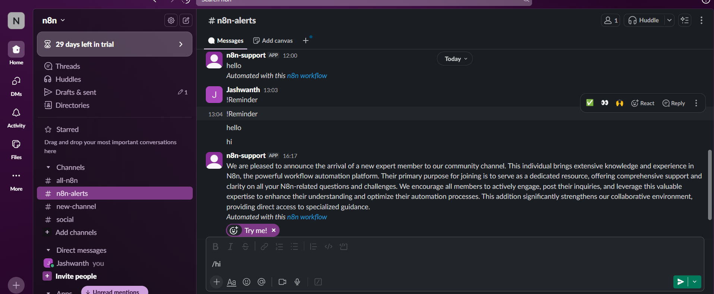

# Universal Form Intelligence (n8n) — Reminder / Database / Broadcast (Beginner Workshop)

**Goal:** turn a single form into three actions—create a Google Calendar event, insert a MySQL row, or broadcast to Slack—with LLM assistance.

---

## 1) What you will build
- One **Form Trigger** fans out via a **Switch** to three branches: **Reminder**, **Database**, **Broadcast**.
- Reminder → **Gemini** formats time → **Code** normalizes JSON → **Google Calendar** creates the event.
- Database → **MySQL** inserts `name/email/data/created_at`.
- Broadcast → **Gemini** rewrites the note → **Slack** posts it.

**Canvas preview**  


---

## 2) Prerequisites
- n8n (Cloud or self‑hosted) with access to the node panel.
- Credentials configured in **Settings → Credentials**:
  - **Google Calendar OAuth2** (scope `https://www.googleapis.com/auth/calendar.events`)
  - **Slack** (Bot token with `chat:write` or OAuth2)
  - **MySQL** (host/user/password/db reachable from n8n)
  - **Google PaLM (Gemini)** API key (model e.g., *Gemini 2.5‑flash*)
- Timezone default we will assume: **Asia/Kolkata (IST)**.
- For setup videos: Slack → https://www.botcampus.ai/lessons/slack-authentication-and-workflow    
- MySQL → https://www.botcampus.ai/lessons/mysql-authentication-and-workflow

---

## 3) Quick n8n glossary (1 min)
- **Node panel**: left sidebar where you search nodes and drag them to the canvas.
- **Main output / input**: white dots on the right/left side of nodes used to connect flows.
- **Expression**: values wrapped like `{{ $json.field }}` (click the small gear → *Add Expression*).

---

## 4) Build the workflow — step by step

### Step 1 — Add the **Form Trigger**
1. In the node panel search **“Form Trigger”** → **drag** it to the canvas.
2. In the right panel set:
   - **Form title**: `Universal Form Intelligence`
   - **Fields** (exact labels):
     - `Name` *(Text)*
     - `Action` *(Dropdown → options: `Reminder`, `Database`, `Broadcast`; Required = On)*
     - `Event description` *(Text)*  *(If you already have `Event description ` with a trailing space, keep it; we will read both.)*
     - `Email` *(Email)*
3. Click **Save**.

### Step 2 — Add a **Switch** to route by Action
1. Drag **Switch** to the canvas.
2. Connect: **Form Trigger → Switch** (main output to main input).
3. In Switch **Mode** choose **Rules**.
4. Add **three rules** (case‑sensitive equals). Use the gear icon → *Add Expression* for the left‑hand side:
```
Left:  {{$json.Action}}   Operator: equals   Right: Reminder
Left:  {{$json.Action}}   Operator: equals   Right: Broadcast
Left:  {{$json.Action}}   Operator: equals   Right: Database
```
*(Tip: a 4th “Default” output can show a friendly error.)*

---

### Step 3 — Build the **Reminder** branch (Calendar)
**Nodes you will add and connect in order (top branch):**
`Switch: Output #1` → **Basic LLM Chain** → **Code** → **Google Calendar**

#### 3.1 Add **Basic LLM Chain**
1. Drag **Basic LLM Chain** to the canvas (LangChain category).
2. Connect **Switch → Basic LLM Chain** from output #1.
3. In **Model input**, drag a dotted line from **Google Gemini Chat Model** (see next step) to this chain.
4. Open the chain, set **Prompt type** = *Define*, and paste into **Text**:
```
You convert ONE natural-language reminder into ONE Google Calendar–ready payload.

OUTPUT: RETURN EXACTLY 1 JSON OBJECT ON ONE LINE. NO MARKDOWN. NO FENCES. NO EXTRA TEXT.
SCHEMA (exact keys):
{
  "startDateTime": "YYYY-MM-DDTHH:mm:ss.SSS±HH:mm",
  "endDateTime":   "YYYY-MM-DDTHH:mm:ss.SSS±HH:mm",
  "summary":       "string",
  "description":   "string"
}

RULES:
- Timezone default: Asia/Kolkata (+05:30) unless another TZ/city is explicitly given.
- If only a time is given (no date) → use TODAY in Asia/Kolkata.
- Relative words:
  • today/tonight/this evening/morning/afternoon → today (IST)
  • tomorrow → tomorrow (IST)
  • next <weekday> → next occurrence after NOW_IST (IST)
- Durations:
  • If “for N minutes/hours” → end = start + duration
  • Else default duration = 60 minutes
- Summary: short, capitalized; remove date/time words.
- Description: concise remaining context; no date/time strings.

INPUT_TEXT: "{{ $json['Event description'] || $json['Event description '] }}"
NOW_IST: "{{ $now.setZone('Asia/Kolkata').toISO() }}"
Return only the JSON object.
```

#### 3.2 Add **Google Gemini Chat Model**
1. Drag **Google Gemini Chat Model**.
2. In **Credentials**, select your Gemini key (model *Gemini 2.5‑flash*).
3. Connect the **dotted “AI Model” port** of the model to the **Basic LLM Chain**.

#### 3.3 Add **Code** (JavaScript normalizer)
1. Drag **Code**.
2. Connect **Basic LLM Chain → Code**.
3. Open Code → **Language** = JavaScript → paste:
```javascript
function coalesce(...v){ for (const x of v) if (x!==undefined && x!==null && String(x).trim()!=='') return x }
function stripFences(s){ return String(s).replace(/^\s*```[a-zA-Z]*\s*|\s*```\s*$/g,'').trim() }
function tryJson(s){
  s = stripFences(String(s));
  try { return JSON.parse(s) } catch {}
  const m = s.match(/\{[\s\S]*\}/); if (m) { try { return JSON.parse(m[0]) } catch {} }
  return null
}
function bracketDT(s){ const m = String(s).match(/\[DateTime:\s*([^\]]+)\]/i); return m ? m[1] : null }
function pad(n){ return String(n).padStart(2,'0') }
function ms3(n){ return String(n).padStart(3,'0') }
function addMinutesKeepOffset(iso, mins){
  const off = (String(iso).match(/([+-]\d{2}:\d{2})$/) || [,'+05:30'])[1];
  const sign = off.startsWith('-') ? -1 : 1;
  const [H,M] = off.slice(1).split(':').map(Number);
  const offMin = sign*(H*60+M);
  const start = new Date(iso);
  const endUtc = new Date(start.getTime() + mins*60*1000);
  const endLocal = new Date(endUtc.getTime() + offMin*60*1000);
  const yyyy = endLocal.getUTCFullYear(), MM = pad(endLocal.getUTCMonth()+1), dd = pad(endLocal.getUTCDate());
  const HH = pad(endLocal.getUTCHours()), mm = pad(endLocal.getUTCMinutes()), ss = pad(endLocal.getUTCSeconds()), SSS = ms3(endLocal.getUTCMilliseconds());
  return `${yyyy}-${MM}-${dd}T${HH}:${mm}:${ss}.${SSS}${off}`;
}
function titleCase(s){ return String(s||'').trim().replace(/\s+/g,' ').replace(/\b\w/g,c=>c.toUpperCase()) }

const out = [];
for (const [i, item] of items.entries()){
  const input = item.json || {};
  const originalText = coalesce(input['Event description'], input['Event description '], input.event_description, input.prompt, input.query, '');
  const rawAi = coalesce(
    input.ai, input.answer, input.text, input.output, input.response, input.message,
    input.content, input.result, input.data, input.choices?.[0]?.message?.content,
    typeof input === 'string' ? input : JSON.stringify(input)
  );

  let p = (typeof rawAi === 'object') ? rawAi : tryJson(rawAi);
  let startDateTime, endDateTime, summary, description;

  if (p && typeof p === 'object'){
    ({ startDateTime, endDateTime, summary, description } = p);
  } else {
    const b = bracketDT(rawAi);
    if (!b) throw new Error('AI output not JSON and no [DateTime: …] found.');
    startDateTime = b;
  }

  if (!startDateTime || isNaN(new Date(startDateTime).getTime())) throw new Error('Invalid startDateTime');

  if (!summary) summary = titleCase((originalText||'').split(/[.!?]/)[0] || 'Reminder');
  if (!description) description = String(originalText||'').trim();

  if (!endDateTime) endDateTime = addMinutesKeepOffset(startDateTime, 60);
  else if (isNaN(new Date(endDateTime).getTime())) throw new Error('Invalid endDateTime');

  out.push({ json: { startDateTime, endDateTime, summary, description }, pairedItem: { item: i }});
}
return out;
```

#### 3.4 Add **Google Calendar**
1. Drag **Google Calendar** node.
2. **Operation** = *Create an event*.
3. Connect **Code → Google Calendar**.
4. Set fields (use **Add Expression**):
```
Calendar     = (your calendar id)
Start        = {{ $json.startDateTime }}
End          = {{ $json.endDateTime }}
Summary      = {{ $json.summary }}
Description  = {{ $json.description }}
```
**Result**  


---

### Step 4 — Build the **Broadcast** branch (Slack)
**Nodes in order (middle branch):**
`Switch: Output #2` → **Basic LLM Chain1** → **Slack: Send a message**

#### 4.1 Add **Basic LLM Chain1**
- Drag, connect from **Switch output #2**.
- Connect **Google Gemini Chat Model1** to the chain’s **AI Model** port.
- In **Text**, paste:
```
Rewrite the user’s short note into a professional, medium-length Slack update (80–150 words).
Tone: formal yet approachable. Focus on purpose, context, stakeholders, next steps.

Input:
"{{ $json['Event description'] || $json['Event description '] }}"

Guidelines:
- Expand acronyms if unclear.
- Clarify missing context (what/why/who/when) if implied by the text.
- Avoid fluff; keep it factual and helpful.
- End with an explicit call-to-action or next step when relevant.

Return only the rewritten paragraph as plain text (no markdown).
```

#### 4.2 Add **Slack → Send a message**
- **Select** = *Channel*; choose your **Channel** or paste the ID.
- **Text** (Add Expression):
```
{{ $json.text || $json.response || $json.output }}
```

**Result**  


---

### Step 5 — Build the **Database** branch (MySQL)
**Nodes in order (bottom branch):**
`Switch: Output #3` → **MySQL: Insert rows in a table**

#### 5.1 Add **MySQL**
- **Operation** = *Insert*  
- **Data Mode** = *Define Below*  
- **Table** = `slack`  
- **Values to send** (Add rows):
```
name        = {{ $json.Name }}
email       = {{ $json.Email || '' }}
data        = {{ $json['Event description'] || $json['Event description '] || '' }}
created_at  = {{ $json.submittedAt || $now.toISO() }}
```

**Result**  


---

## 5) Test & go live
1. Click **Execute workflow** to test. Try three submissions: `Reminder`, `Database`, `Broadcast`.
2. Verify: Calendar event (22:00–23:00 if “10 PM tonight”), Slack message, MySQL row.
3. When happy, toggle **Active** (top-right) to run on your n8n instance.

**Common fixes**
- Switch not routing → values must be exactly `Reminder`, `Database`, `Broadcast` (no `=`).
- Calendar “invalid datetime” → ensure **Code** is between LLM and Calendar; check keys.
- Empty Slack text → use `{{ $json.text || $json.response || $json.output }}`.
- MySQL errors → run the DDL, verify credentials, ensure `data` is non‑NULL.
- Field mismatch → if a field is `Event description ` (with space), reference both keys as shown.

---

## Appendix — MySQL DDL (run once)
```sql
CREATE TABLE IF NOT EXISTS slack (
  id BIGINT UNSIGNED NOT NULL AUTO_INCREMENT PRIMARY KEY,
  name VARCHAR(255) NOT NULL,
  email VARCHAR(320) NULL,
  data LONGTEXT NOT NULL,
  created_at TIMESTAMP NOT NULL DEFAULT CURRENT_TIMESTAMP,
  INDEX idx_email (email)
) ENGINE=InnoDB DEFAULT CHARSET=utf8mb4;
-- Optional upgrades
-- ALTER TABLE slack DROP INDEX email;
-- ALTER TABLE slack MODIFY COLUMN data LONGTEXT NOT NULL;
-- CREATE INDEX idx_email ON slack (email);
```
