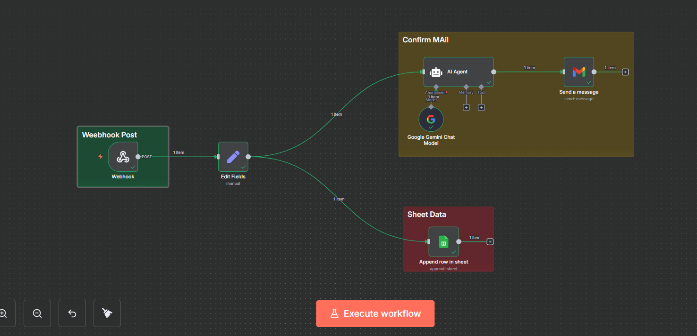
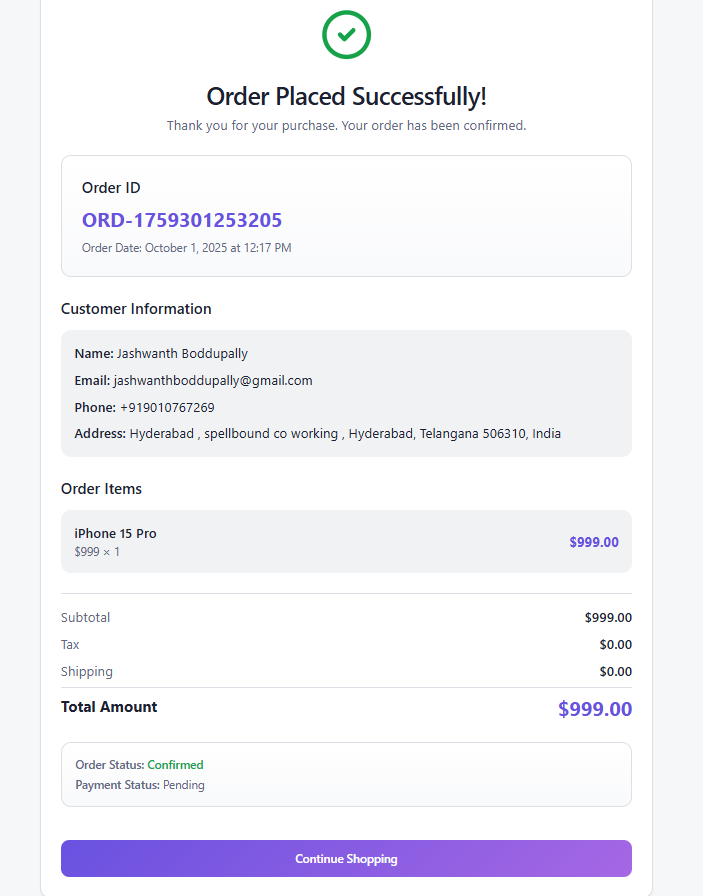
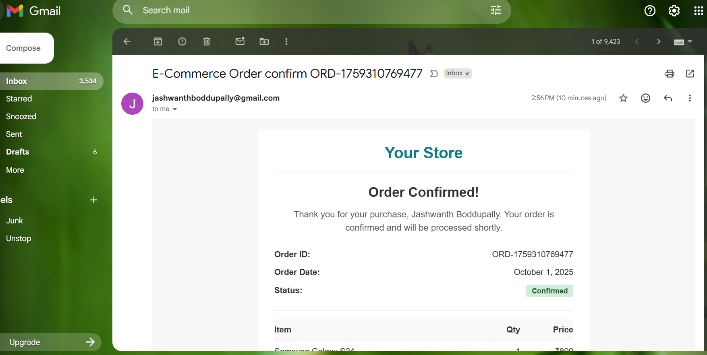
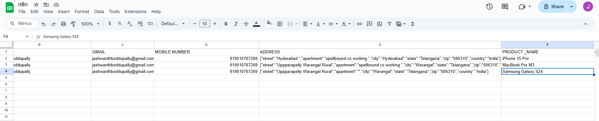

# E-Commerce → n8n Cloud Intake (Lovable Frontend) — **SUPER RULES Final Guide**

**Goal (1-liner):** Launch a Lovable.dev storefront that posts validated orders to **n8n Cloud (Production Webhook)**, where n8n normalizes data and (optionally) sends an HTML email + logs to Google Sheets.

---

## At-a-glance outcomes
- ✅ **n8n Cloud** workspace is live and the workflow is **Active**
- ✅ You’re using the **Production Webhook URL** (path contains `/webhook/…`)
- ✅ Lovable storefront **POSTs** full order JSON to n8n
- ✅ n8n **maps** fields → can **email** confirmation & **append** to Sheets

> **PINNED NOTE:** Never ship `/webhook-test/…` in frontend code. Use **Production** URL only (`…/webhook/…`). Keep the workflow **Active**.

---

## Prereqs & Auth (do this first)
- **n8n Cloud** account + workspace URL  
- **Lovable.dev** account  
- n8n **Credentials** (create in **Credentials**):
  - **Gmail (OAuth2)** — send confirmation email  
  - **Google Sheets (OAuth2)** — append order rows  
  - **Gemini API** — generate email `<body>` HTML

---

## Architecture snapshot
**Lovable (Checkout “Place Order”)** → **POST** → **n8n Webhook (Production)** → **Set / Edit Fields** →  
➜ **AI Agent (Gemini)** → **Gmail: Send a message**  
➜ **Google Sheets: Append row**



---

## Part 1 — Lovable E-commerce (Production-safe)

### 1) Get on **n8n Cloud**
- Sign up/log in → open your workspace  
- **Workflows → New** → name: **E-commerce Intake**

### 2) Create the **Webhook** in n8n
**Operation / Mode (drag & drop):**
- Node: **Webhook**  
- **HTTP Method:** `POST`  
- **Path:** keep generated or set `ecommerce-intake`  
- **Activate** the workflow (top-right toggle → **ON**)

### 3) Copy the **Production Webhook URL**
- Open the Webhook node → copy **Production URL** (contains `/webhook/…`)  
- **Do NOT** use the **Test URL** (`/webhook-test/…`)

**Instant copy (pin this):**
```
Always use n8n Production Webhook:
- Must contain: /webhook/
- Never ship:   /webhook-test/
- Keep workflow Active in n8n Cloud
```

### 4) Create the **E-commerce site** in Lovable
- Open **Lovable.dev** → create new project  
- Paste the **prompt** below (replace URL with your **Production** webhook)  
- Generate app → set its config var to your **Production** Webhook URL  
- Publish (preview OK for testing)

**Lovable Prompt — paste as is, replace URL**
```
Professional Prompt for Lovable.dev - E-Commerce with N8N Webhook
Project Title: Complete E-Commerce Store with Customer Data Collection & N8N Integration

NOTE (MANDATORY):
- Backend automation is on n8n Cloud (public).
- Use my n8n Production Webhook URL only (path must be /webhook/…; do not use /webhook-test/…).
- After checkout validation, send the payload via POST to this URL:
  https://YOUR-WORKSPACE.app.n8n.cloud/webhook/xxxxxxxx-xxxx-xxxx-xxxx-xxxxxxxxxxxx

Core Requirements:
Create a modern, fully functional e-commerce website that collects complete customer information and sends all order data to the N8N webhook.

1. Product Catalog
Display at least 9 products across three categories:
Mobiles: iPhone 15 Pro ($999), Samsung Galaxy S24 ($899), Google Pixel 8 ($699)
Laptops: MacBook Pro M3 ($1999), Dell XPS 15 ($1499), HP Spectre x360 ($1299)
Tablets: iPad Pro 12.9" ($1099), Samsung Galaxy Tab S9 ($799), Microsoft Surface Pro ($999)

Each product card must display:
- Product image/icon
- Product name
- Category
- Price
- "Add to Cart" button
- "Buy Now" button

2. Shopping Cart System
Persistent shopping cart with:
- Add to cart
- Quantity +/- controls
- Remove item
- Real-time subtotal per item
- Grand total display
- Cart badge with total count in header
- "Proceed to Checkout" button

3. Customer Information Form (MANDATORY - CRITICAL)
On "Proceed to Checkout" or "Buy Now", show a checkout form that collects:

Required Fields & Validation:
- Full Name → text, required, min 3 chars
- Email Address → type=email, required, valid format (name@example.com)
- Phone Number → type=tel, required, 10+ digits (placeholder: "+1 (123) 456-7890")
- Full Delivery Address → fields for Street (Line 1), Apartment/Suite (Line 2 optional), City, State/Province, ZIP/Postal, Country (all required except Line 2)

Item Quantity Summary:
- Auto-populated from cart
- Read-only list in the form
Form Layout:
- Clean labels and error text
- Sidebar order summary with items, quantities, line prices, subtotals, grand total
- "Place Order" button enabled only when all fields are valid

4. N8N Webhook Integration — POST (MOST CRITICAL)
- URL (Production only): https://YOUR-WORKSPACE.app.n8n.cloud/webhook/xxxxxxxx-xxxx-xxxx-xxxx-xxxxxxxxxxxx
- Trigger: On "Place Order" click, after form validation
- Method: POST
- Headers: {"Content-Type":"application/json"}
- Exact Payload Shape to send:
{
  "order_id": "ORD-1696234567890",
  "order_date": "2025-10-01T14:30:45.000Z",
  "customer_details": {
    "name": "John Doe",
    "email": "john.doe@example.com",
    "phone": "+1-234-567-8900",
    "address": {
      "street": "123 Main Street, Apt 4B",
      "city": "New York",
      "state": "NY",
      "zip": "10001",
      "country": "United States"
    }
  },
  "order_items": [
    {
      "product_id": 1,
      "product_name": "iPhone 15 Pro",
      "category": "Mobile",
      "unit_price": 999,
      "quantity": 2,
      "item_subtotal": 1998
    },
    {
      "product_id": 4,
      "product_name": "MacBook Pro M3",
      "category": "Laptop",
      "unit_price": 1999,
      "quantity": 1,
      "item_subtotal": 1999
    }
  ],
  "order_summary": {
    "total_items": 3,
    "subtotal": 3997,
    "tax": 0,
    "shipping": 0,
    "total_amount": 3997
  },
  "payment_status": "pending",
  "order_status": "confirmed"
}

5. Order Placement Flow (Step-by-Step)
- User browses products → adds to cart
- User clicks "Proceed to Checkout"
- Checkout shows empty customer form + pre-filled order summary
- User fills Name, Email, Phone, Address
- User reviews quantities in summary
- User clicks "Place Order"
- Validate all fields
- If valid:
  - Show loading spinner
  - Generate unique order ID
  - Construct JSON payload with ALL data
  - POST to the N8N Production Webhook URL
  - Wait for response
- On success:
  - Show: "Order Placed Successfully! Your Order ID is: ORD-xxxxx"
  - Show confirmation page with details
  - Clear shopping cart
  - (Optional) Send confirmation email
- On error:
  - Show error message and keep form data
  - Allow user to retry

6. Data Validation Requirements
- Name: not empty, min 3
- Email: valid format
- Phone: 10–15 digits
- Address: all required except apartment/suite
- Cart: at least 1 item
- Quantities: all > 0
- Show red borders and inline error text; block submission until valid

7. Order Confirmation Page
- Success message with prominent Order ID
- Customer info summary
- Items list with quantities
- Total amount
- (Optional) Expected delivery date
- "Continue Shopping" and (optional) "Download Invoice"

8. Design & UX Requirements
- Modern, clean, responsive
- Blue/purple gradient or professional theme
- Product card hover effects
- Clear navigation, persistent cart icon with count
- Loading states, toasts, focus states, keyboard navigation, ARIA
- Progress indicator during checkout; success/error animations

9. Technical Implementation Notes
- React + TypeScript (or JS), Tailwind CSS
- React Hook Form or Formik for validation
- Fetch or Axios for POST
- React Router for pages
- LocalStorage for cart persistence
- State for cart/form/order (loading/success/error)
- Error handling for network/validation/server/timeout (30s)
- Security: sanitize inputs, HTTPS, avoid sensitive data in LocalStorage

10. Testing Checklist
- 9 products render
- Cart add/remove/adjust works, persists on refresh
- Form validations enforced
- Webhook receives complete payload
- Unique Order ID generated
- Success message & cart clears on success
- Error handling shown on webhook failure
- Mobile responsive
- Quantities passed correctly

Success Criteria (ALL MUST PASS)
- Product Display, Cart Functionality, Form Collection, Quantity Tracking,  
- Webhook Integration (POST to Production URL),  
- Complete Payload, Full Order Flow, Validation, User Feedback, Cart Reset
```
###  place a Order in E-commerce website 

- place a order  
- enter the details  
- After placing a order that all details will be sent to n8n WEBHOOL_URL .  
- NOTE :- make sure before placing order turn on your webhook is on OR Running .


```
---

## Part 2 — n8n Workflow (intake → email → sheets)

### Node list (order)
1) **Webhook** (POST)  
2) **Set** (rename to **Edit Fields**)  
3) **Google Gemini Chat Model** (LM)  
4) **AI Agent** (return only `<body>…</body>`)  
5) **Gmail: Send a message**  
6) **Google Sheets: Append row**

### Key parameters
| Node | Operation | Mode | Critical fields |
|---|---|---|---|
| Webhook | POST | — | Path any; **use Production URL** |
| Set (Edit Fields) | Add Fields | Define fields | Map nested JSON → flat keys |
| Gemini Chat Model | — | — | Attach credential |
| AI Agent | Define | System + Prompt | Output must be **only** `<body>…</body>` |
| Gmail | Send | — | To, Subject (expr), Message = `{{$json.output}}` |
| Google Sheets | Append | Define columns | Map columns to flat keys |

### 1) Webhook (Production)
- **HTTP Method:** `POST`  
- **Path:** `ecommerce-intake` (or random)  
- **Activate** workflow → copy **Production URL** (contains `/webhook/…`)
```
Use Production only → /webhook/
Do NOT use Test → /webhook-test/
```

### 2) Normalize payload — **Set** → “**Edit Fields**”
Add these assignments (paste values in expression boxes):
```js
OrderID      = {{ $json.body.order_id }}
Name         = {{ $json.body.customer_details.name }}
Gmail        = {{ $json.body.customer_details.email }}
Mobile       = {{ $json.body.customer_details.phone }}
Address      = {{ $json.body.customer_details.address }}
Product_name = {{ $json.body.order_items[0].product_name }}
Qunatity     = {{ $json.body.order_items[0].quantity }}   // keep as-is or rename everywhere
Category     = {{ $json.body.order_items[0].category }}
Item_Amount  = {{ $json.body.order_items[0].item_subtotal }}
Order_status = {{ $json.body.order_status }}
```

**Wire:** **Webhook → Edit Fields (Main)**

### 3) AI email `<body>` — **Gemini** + **AI Agent**
- **Google Gemini Chat Model** → select credential  
- **AI Agent** → **Prompt Type: Define**; connect **Gemini → AI Agent (Language Model)** and **Edit Fields → AI Agent (Main)**

**AI Agent — System Message (paste this)**
```
You are a senior E-commerce Communications AI that crafts production-ready EMAIL HTML bodies.

PRIMARY GOAL
• Generate a polished, brand-safe, responsive HTML email BODY (return ONLY <body>…</body>, no <html>, no <head>, no Markdown, no code fences).

INPUTS YOU MAY RECEIVE
• order_id, order_date, order_status
• customer: name, email, phone
• address: street, apartment, city, state, zip, country (may arrive as a JSON string—parse it safely)
• items: product_name, category, quantity, unit_price (or item_amount/total); currency (default "INR")
• links: view_order_url, help_center_url, support_email, support_phone
• brand: brand_name, logo_url, brand_color (hex), address_block

RULES
1) Return ONLY <body>…</body> with inline CSS and a 600px table layout.
2) Use email-safe markup (role="presentation", proper alt text, accessible contrast).
3) Omit missing fields; never show "N/A".
4) Format numbers with separators; prefix currency symbol when known (₹).
5) Tone: concise and courteous; never echo raw JSON or placeholders.
6) Add: <!-- PREHEADER: Your order {{ $json.OrderID }} is confirmed. -->
7) Include a "View your order" CTA only if a URL is provided.
8) Add a footer with brand address & support if provided.

FINAL CONTRACT
• Output must be ONLY the <body>…</body> HTML. No explanations, no wrappers.
```

**AI Agent — Prompt Template (Define → Text)**
```
Use the normalized payload to generate the email BODY HTML now.

Brand:
- brand_name: {{ $json.brand_name || "Your Store" }}
- logo_url: {{ $json.logo_url || "" }}
- brand_color: {{ $json.brand_color || "#0E7C86" }}

Order:
- order_id: {{ $json.OrderID || $json.order_id }}
- order_date: {{ $json.order_date || $now }}
- order_status: {{ $json.Order_status || $json.order_status || "confirmed" }}

Customer:
- name: {{ $json['Name '] }}
- email: {{ $json.Gmail || $json.customer_email }}
- phone: {{ $json.Mobile || $json.customer_phone }}

Shipping Address (may be a JSON string in $json.Address):
- address_raw: {{ $json.Address }}
- street: {{ $json.address?.street || "" }}
- apartment: {{ $json.address?.apartment || "" }}
- city: {{ $json.address?.city || "" }}
- state: {{ $json.address?.state || "" }}
- zip: {{ $json.address?.zip || "" }}
- country: {{ $json.address?.country || "" }}

Item (single example; loop upstream if multiple):
- product_name: {{ $json.Product_name || $json.product_name }}
- category: {{ $json.Category || $json.category }}
- quantity: {{ $json.Qunatity || $json.quantity || 1 }}
- item_amount: {{ $json.Item_Amount || $json.unit_price || $json.total }}
- currency: {{ $json.currency || "INR" }}

Links & Support:
- view_order_url: {{ $json.view_order_url || "" }}
- help_center_url: {{ $json.help_center_url || "" }}
- support_email: {{ $json.support_email || "support@example.com" }}
- support_phone: {{ $json.support_phone || "" }}
- brand_address_block: {{ $json.brand_address_block || "" }}

Return ONLY the <body>…</body> HTML per the System rules.
```

**Expected output (Gmail-ready email body):**  


### 4) Email — **Gmail: Send a message**
- **To:** your test email  
- **Subject:**
```
=E-Commerce Order confirm  {{ $('Edit Fields').item.json.OrderID }}
```
- **Message (HTML):**
```
={{ $json.output }}
```

### 5) Log — **Google Sheets: Append row**
Map columns to flat keys:
```
ORDER_ID      → {{ $json.OrderID }}
NAME          → {{ $json['Name '] }}
GMAIL         → {{ $json.Gmail }}
MOBILE NUMBER → {{ $json.Mobile }}
ADDRESS       → {{ $json.Address }}
PRODUCT _NAME → {{ $json.Product_name }}
QUANTITY NO   → {{ $json.Qunatity }}
CATEGORY      → {{ $json.Category }}
TOTAL AMOUNT  → =₹{{ $json.Item_Amount }}
ORDER STATUS  → {{ $json.Order_status }}
```

**Result in Sheets:**  


---

## Copy-Paste Blocks

### A) Sample checkout payload (`payload.json` already included)
```json
{
  "order_id": "ORD-10027",
  "order_date": "2025-10-01T12:20:00.000Z",
  "customer_details": {
    "name": "Asha Varma",
    "email": "asha@example.com",
    "phone": "+91-90000-12345",
    "address": {
      "street": "42 MG Road",
      "apartment": "Flat 5B",
      "city": "Bengaluru",
      "state": "KA",
      "zip": "560001",
      "country": "IN"
    }
  },
  "order_items": [
    { "product_id": 1, "product_name": "Wireless Keyboard", "category": "Accessories", "unit_price": 1899, "quantity": 1, "item_subtotal": 1899 }
  ],
  "order_summary": { "total_items": 1, "subtotal": 1899, "tax": 0, "shipping": 0, "total_amount": 1899 },
  "payment_status": "pending",
  "order_status": "confirmed"
}
```

### B) cURL test (replace with your **Production** Webhook)
```bash
curl -X POST "https://YOUR-WORKSPACE.app.n8n.cloud/webhook/xxxxxxxx-xxxx-xxxx-xxxx-xxxxxxxxxxxx"   -H "Content-Type: application/json"   -d @payload.json
```

---

## Testing & Validation
1) **Activate** workflow → copy **Production** Webhook URL  
2) POST `payload.json` (cURL/Postman)  
3) Confirm:
   - **Edit Fields** shows flattened keys  
   - **AI Agent** returns **only** `<body>…</body>`  
   - **Gmail** received an HTML email (optional)  
   - **Sheets** has a new row (optional)

---

## Troubleshooting
- **404/401** → Using `/webhook-test/` or workflow not **Active** → switch to **/webhook/** and activate  
- **Email shows raw HTML** → Ensure Gmail **Message** maps to `{{$json.output}}` from **AI Agent**  
- **No row in Sheets** → Re-select Spreadsheet/Sheet; ensure *Define columns* mode and header names match  
- **Agent returns full `<html>`** → Tighten system message: “Return ONLY `<body>…</body>`”  
- **Wrong quantity/amount** → Mapping uses `order_items[0]`; add loop/item-table logic if you have multiple items

---

## What to Deliver
- ✅ Lovable app pointed to **Production Webhook**  
- ✅ Active n8n workflow with Webhook → Edit Fields → AI Agent → (Gmail/Sheets optional)  
- ✅ Successful test (payload posted, email & sheet verified)
