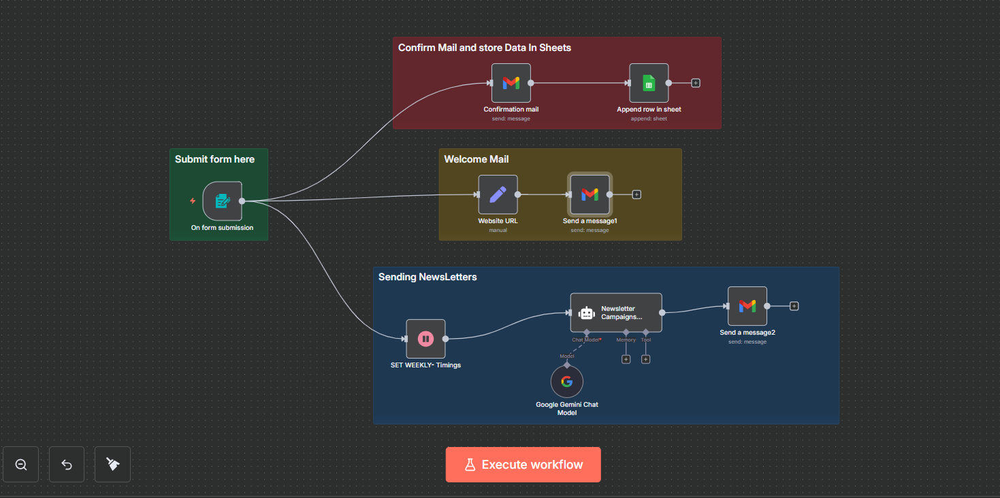
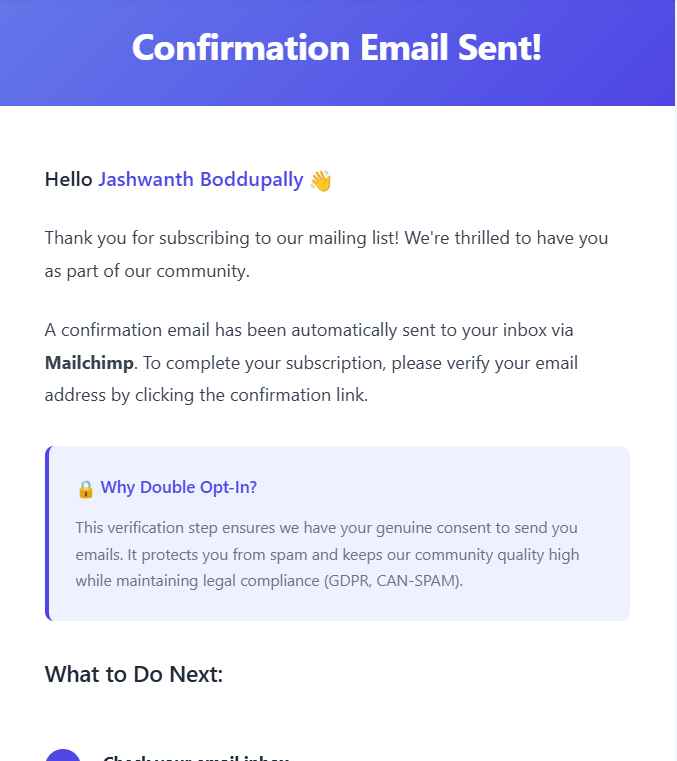
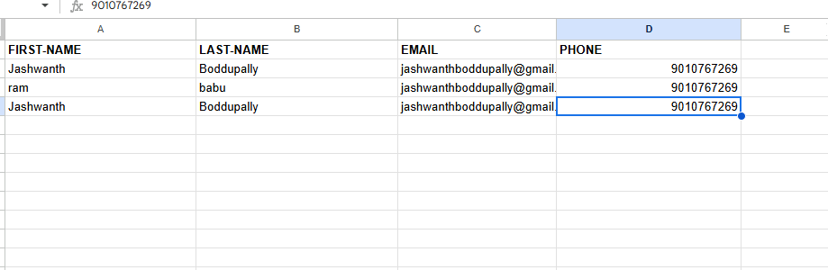
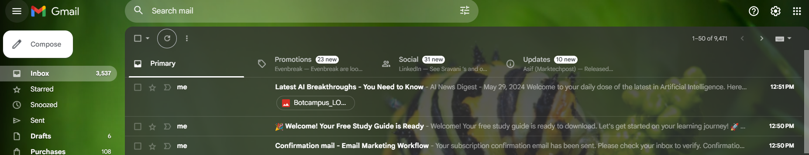

# Newsletter Intake → Welcome + Weekly AI Newsletter (n8n)

This README shows how to rebuild the workflow exactly as in the screenshot, with **clear node instructions**, **modes and operations**, **drag‑and‑drop guidance**, and **copy‑paste blocks embedded in each step**.  
Images are referenced by relative paths so you can keep them in an `images/` folder beside this README.

---

## 1) Workflow

  
*Figure 1 — Canvas layout: Form Trigger feeds three lanes (Confirm & Store, Welcome Mail, Weekly Newsletter).*

**Trigger**
- **On form submission** (Form Trigger)

**Branch 1 — Confirm & Store**
- **Confirmation mail** (Gmail → Send message) → **Append row in sheet** (Google Sheets → Append)

**Branch 2 — Welcome Mail**
- **Website URL** (Set) → **Send a message1** (Gmail → Send message)

**Branch 3 — Weekly Newsletter**
- **SET WEEKLY- Timings** (Wait) → **Newsletter Campaigns Agent** (LangChain Agent with **Google Gemini Chat Model**) → **Send a message2** (Gmail → Send message)

---

## 2) Prerequisite

1. **n8n**: Cloud or self-hosted.
2. **Gmail OAuth2** credential in n8n with permission to send emails.
3. **Google Sheets OAuth2** credential in n8n with access to your spreadsheet:
   - Document ID: `1JfUJ3E0hevU3laYzaGUxULYT-SbBmxOEJVK-tD71qVI`
   - Sheet name: `NewsLetter-Details`
4. **Google Gemini (Generative Language) API** credential in n8n (used by the LangChain Agent).
5. A place to store images for this README, e.g., put `canvas.png`, `confirm.png`, `sheet.png`, `email.png` under `images/`.

---

## 3) Step-by-Step (very detailed)

### Step 1 — Form Trigger (collect subscriber data)

**What to drag:** From the left panel, drag **Form Trigger** onto the canvas.  
**Node name:** `On form submission`  
**Mode / Operation:** Form Trigger (no operation selector).

**How to wire later:** This node will connect to **Confirmation mail**, **Website URL**, and **SET WEEKLY- Timings**.

**Configure fields (copy-paste below):**

```json
{
  "values": [
    { "fieldLabel": "First Name", "requiredField": true },
    { "fieldLabel": "Last Name",  "requiredField": true },
    { "fieldLabel": "Email",      "fieldType": "email",  "requiredField": true },
    { "fieldLabel": "phone number","fieldType": "number","requiredField": true }
  ]
}
```

---

### Step 2 — Confirmation Email (Gmail: send message)

  
*Figure 2 — “Confirmation mail” node configuration (Message → Send).*

**What to drag:** **Gmail**  
**Node name:** `Confirmation mail`  
**Mode / Operation:** **Resource:** Message → **Operation:** Send  
**Credentials:** your Gmail OAuth2 credential

**Fields to set:**
- **To** (expression):
  ```n8n
  ={{ $json.Email }}
  ```
- **Subject:** `Confirmation mail - Email Marketing Workflow`
- **Message (HTML body):** use the accessible HTML below (emoji-free):

```html
<!DOCTYPE html>
<html lang="en">
<head><meta charset="utf-8"><title>Confirm your subscription</title></head>
<body>
  <h1>Confirmation email sent</h1>
  <p>Hello {{ $json["First Name"] }} {{ $json["Last Name"] }},</p>
  <p>Thank you for subscribing. Please open your inbox and confirm your email address to activate your subscription.</p>
  <ol>
    <li>Open the confirmation email</li>
    <li>Click the confirmation link</li>
    <li>You are all set</li>
  </ol>
  <p>If you did not request this, you can ignore this message.</p>
</body>
</html>
```

**Drag-and-drop wiring:** Connect `On form submission → Confirmation mail`.

---

### Step 3 — Append the contact to Google Sheets (Append)

  
*Figure 3 — “Append row in sheet” mapping (Operation: append).*

**What to drag:** **Google Sheets**  
**Node name:** `Append row in sheet`  
**Operation:** `append`  
**Credentials:** your Google Sheets OAuth2 credential

**Fields to set:**
- **Document ID:** `1JfUJ3E0hevU3laYzaGUxULYT-SbBmxOEJVK-tD71qVI`
- **Sheet name:** `NewsLetter-Details`
- **Column mapping:**

  - `FIRST-NAME`
    ```n8n
    ={{ $('On form submission').item.json['First Name'] }}
    ```
  - `LAST-NAME`
    ```n8n
    ={{ $('On form submission').item.json['Last Name'] }}
    ```
  - `EMAIL`
    ```n8n
    ={{ $('On form submission').item.json.Email }}
    ```
  - `PHONE `
    ```n8n
    ={{ $('On form submission').item.json['phone number'] }}
    ```

**Drag-and-drop wiring:** Connect `Confirmation mail → Append row in sheet`.

---

### Step 4 — Provide a website link for the welcome email (Set)

**What to drag:** **Set**  
**Node name:** `Website URL`  
**Mode:** Set values

**Add one field:**
- Name: `link` | Type: `string` | Value: `https://www.botcampus.ai/`

**Drag-and-drop wiring:** `On form submission → Website URL`.

---

### Step 5 — Welcome Email (Gmail: send message)

  
*Figure 4 — “Send a message1” node (Message → Send).*

**What to drag:** **Gmail**  
**Node name:** `Send a message1`  
**Mode / Operation:** **Resource:** Message → **Operation:** Send  
**Credentials:** your Gmail OAuth2 credential

**Fields to set:**
- **To** (expression):
  ```n8n
  ={{ $('On form submission').item.json.Email }}
  ```
- **Subject:** `Welcome — your guide is ready`  (plain subject)
- **Message (HTML body):** copy-paste:

```html
<!DOCTYPE html>
<html lang="en">
<head><meta charset="utf-8"><title>Welcome</title></head>
<body>
  <h1>Welcome to our community</h1>
  <p>Hi {{ $('On form submission').item.json['First Name'] }} {{ $('On form submission').item.json['Last Name'] }},</p>
  <p>Thanks for joining. Your starter resources are available at the link below.</p>
  <p><a href="{{ $json.link }}" target="_blank" rel="noopener">Open the study guide</a></p>
  <hr>
  <p>If you have questions, reply to this email and we will help.</p>
</body>
</html>
```

**Drag-and-drop wiring:** `Website URL → Send a message1`.

---

### Step 6 — Delay or schedule before the weekly newsletter (Wait)

**What to drag:** **Wait**  
**Node name:** `SET WEEKLY- Timings`  
**Mode:** Wait for an amount of time (start with a small amount for testing, for example 2 seconds).  
**Production hint:** switch this to a **Cron** schedule later to run weekly on a specific day/time.

**Drag-and-drop wiring:** `On form submission → SET WEEKLY- Timings`.

---

### Step 7 — Language Model (Google Gemini Chat Model)

**What to drag:** **Google Gemini Chat Model**  
**Node name:** `Google Gemini Chat Model`  
**Temperature:** `0.4`  
**Credentials:** your Gemini credential  
**Connection:** This node connects via the **AI/model port** to the LangChain Agent (next step). There is no main (left/right) data connection.

---

### Step 8 — Newsletter Agent (LangChain Agent)

**What to drag:** **LangChain Agent**  
**Node name:** `Newsletter Campaigns Agent`  
**Prompt type:** **Define**

**System Prompt (paste into the Define text box):**
```text
You are a Newsletter AI Agent specialized in curating and generating the latest AI news. Your purpose is to research current AI developments, breakthroughs, and industry updates, then compile them into a clean, professional newsletter format.

Core Responsibilities:
1. Search for the most recent AI news, developments, and breakthroughs
2. Identify credible sources and significant updates from the past 24-48 hours
3. Organize information into clear, digestible sections
4. Generate a newsletter in plain HTML format without graphics or colors
5. Ensure each newsletter contains fresh, unique content

Search Strategy:
- Always search for "AI news today" or "latest artificial intelligence news" with current date
- Look for news from the past 24-48 hours
- Focus on: major AI model releases, research breakthroughs, industry announcements, policy updates, and significant applications
- Verify information from multiple sources when possible

Newsletter Structure:
- Use simple HTML formatting only (h1, h2, h3, p, ul, li, strong, em)
- No CSS styling, colors, or inline styles
- No images or graphics
- Clear hierarchy with headers
- Concise summaries with source citations
- Include 4-6 news items per newsletter
- Add a brief intro and closing

Quality Standards:
- Accuracy: Only include verified information
- Recency: Prioritize news from the last 24-48 hours
- Relevance: Focus on significant AI developments
- Clarity: Write in clear, professional language
- Attribution: Always cite sources properly

Output Format:
Deliver ONLY the HTML body content, starting with opening tags and ending with closing tags. No additional commentary or formatting outside the HTML.
```

**System Message (Options → systemMessage):**
```text
Generate today's AI newsletter with the latest news. Search for the most recent AI developments, breakthroughs, and announcements from the past 24-48 hours. Create a clean HTML newsletter with 4-6 significant news items. Remember: HTML body only, no graphics or colors.
```

**AI/model wiring:** Drag the small **AI/model port** from **Google Gemini Chat Model** into the **Newsletter Campaigns Agent** AI input.  
**Main flow wiring:** `SET WEEKLY- Timings → Newsletter Campaigns Agent`.

---

### Step 9 — Send the newsletter (Gmail: send message)

**What to drag:** **Gmail**  
**Node name:** `Send a message2`  
**Mode / Operation:** **Resource:** Message → **Operation:** Send

**Fields to set:**
- **To** (expression):
  ```n8n
  ={{ $('On form submission').item.json.Email }}
  ```
- **Subject:** `Latest AI Breakthroughs — Weekly Newsletter`
- **Message (HTML body)** — feed the Agent output:
  ```n8n
  ={{ $json.output }}
  ```
  *(Optional: add your own footer URL after the output.)*

**Drag-and-drop wiring:** `Newsletter Campaigns Agent → Send a message2`.

---

## 4) Final wiring checklist

Your canvas should match Figure 1:

- **On form submission** → **Confirmation mail** → **Append row in sheet**  
- **On form submission** → **Website URL** → **Send a message1**  
- **On form submission** → **SET WEEKLY- Timings** → **Newsletter Campaigns Agent** → **Send a message2**  
- **Google Gemini Chat Model** connected to **Newsletter Campaigns Agent** via the AI/model port

---

## Testing

1. Click **Execute workflow**.  
2. Open the **Form Trigger** URL and submit sample data.  
3. Verify:
   - Confirmation email arrives and a row is appended in Google Sheets.
   - Welcome email arrives with the link from the Set node.
   - After the wait, the Agent generates an HTML newsletter that is sent by the final Gmail node.

---

### Notes

- Instructions are emoji-free. Subjects in the examples are plain text.  
- Convert the Wait node to a **Cron** schedule for weekly sending after end-to-end testing.  
- If Gmail or Sheets fails, check credentials and expression mappings.
