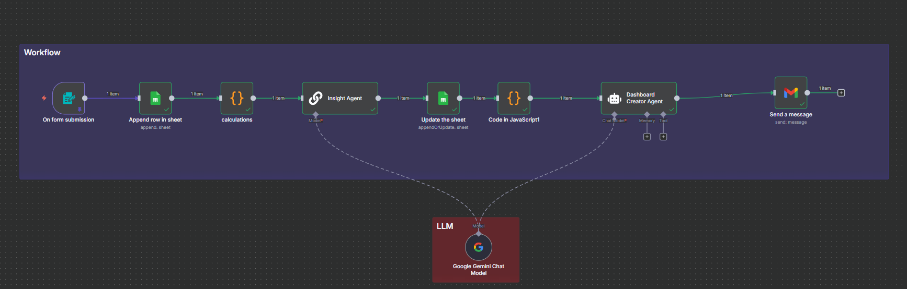
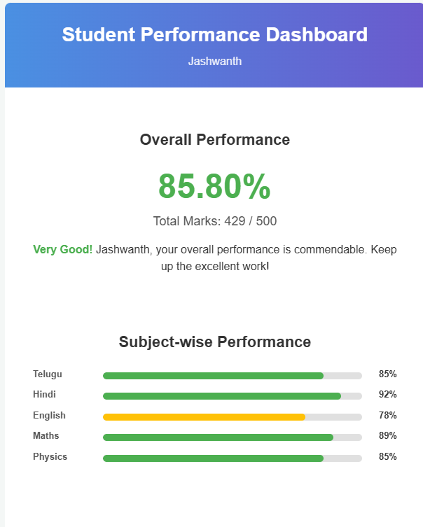
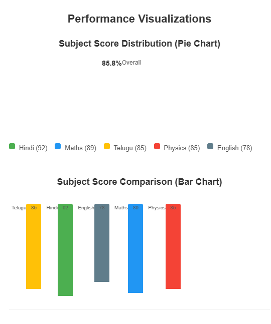

# Student Marks → Gmail HTML Dashboard (n8n)
---

## Cnavas Wiring 
`Form Trigger → Append row in sheet → calculations → Insight Agent → Update the sheet → Build Dashboard Prompt → Dashboard Creator Agent → Send a message`  
`Gemini Model → (ai_languageModel) → Insight Agent & Dashboard Creator Agent`


---

## Workflow Overview


### Step by step Guide :
---

## Step 1 — Form Trigger (collect inputs)
- **Node:** Form Trigger
- **Name:** `Form Trigger`
- **Title:** `Data Form`
- **Description:** `Enter all Subjects marks`
- **Fields** (labels are exact; type in backticks):
  - **Name of Student** `text` (Required)
  - **Telugu  Marks** `number` (Required)
  - **Hindi Marks** `number` (Required)
  - **English Marks** `number` (Required)
  - **Maths Marks** `number` (Required)
  - **Physics Marks** `number` (Required)
  - **Gmail** `email` (Required)

**Wire:** `Form Trigger → Append row in sheet`

---

## Step 2 — Google Sheets (append raw marks)
- **Node:** Google Sheets
- **Name:** `Append row in sheet`
- **Operation:** `Append`
- **Spreadsheet/Sheet:** select your target (e.g., `Dashboard`)
- **Columns → Mapping Mode:** `Define Below`
- **Mappings (Sheet Column ← Expression):**
  - `Name` ← `={{ $json['Name of Student'] }}`
  - `Telugu` ← `={{ $json['Telugu  Marks'] }}`
  - `Hindi` ← `={{ $json['Hindi Marks'] }}`
  - `English` ← `={{ $json['English Marks'] }}`
  - `Maths` ← `={{ $json['Maths Marks'] }}`
  - `Physics ` ← `={{ $json['Physics Marks'] }}` *(note the trailing space if your sheet uses it)*

**Wire:** `Form Trigger → Append row in sheet`

---

## Step 3 — Code (compute totals & percentage)
- **Node:** Code
- **Name:** `calculations`
- **Mode:** `Run Once for Each Item`

```js
// Compute subject totals and percentage from the appended row
const data = $input.first().json;

// Handle optional "Physics " (with trailing space) vs "Physics"
const telugu  = parseFloat(data.Telugu) || 0;
const hindi   = parseFloat(data.Hindi) || 0;
const english = parseFloat(data.English) || 0;
const maths   = parseFloat(data.Maths) || 0;
const physics = parseFloat(data["Physics "] ?? data.Physics ?? 0) || 0;

const totalMarks = telugu + hindi + english + maths + physics;
const maxMarks = 500;
const percentage = Number(((totalMarks / maxMarks) * 100).toFixed(2));

return [{
  json: {
    Name: data.Name,
    Gmail: $('Form Trigger').item.json.Gmail, // keep email from the form
    Telugu: telugu,
    Hindi: hindi,
    English: english,
    Maths: maths,
    Physics: physics,
    TotalMarks: totalMarks,
    MaxMarks: maxMarks,
    Percentage: percentage,           // numeric
    PercentageLabel: percentage + "%" // pretty
  }
}];
```

**Wire:** `Append row in sheet → calculations`

---

## Step 4 — Google Gemini Chat Model (shared LLM)
- **Node:** Google Gemini Chat Model
- **Name:** `Gemini Model`
- **Options → Temperature:** `0.2`
- **Use:** Connect its **ai_languageModel** port to both LLM nodes below.

---

## Step 5 — LLM Chain (one-line performance insight)
- **Node:** LLM Chain
- **Name:** `Insight Agent`
- **Prompt Type:** `Define`
- **Prompt:**

```text
Student {{ $json.Name }} scored {{ $json.Telugu }} (Telugu), {{ $json.Hindi }} (Hindi),
{{ $json.English }} (English), {{ $json.Maths }} (Maths), {{ $json.Physics }} (Physics).
Total = {{ $json.TotalMarks }}/{{ $json.MaxMarks }} → {{ $json.PercentageLabel }}.

In one clear sentence: highlight strong subjects, weak subjects (<75), and one actionable tip.
```

**Wire:** `calculations → Insight Agent` and connect **ai_languageModel** → `Gemini Model`

---

## Step 6 — Google Sheets (append/update aggregates + AI insight)
- **Node:** Google Sheets
- **Name:** `Update the sheet`
- **Operation:** `Append or Update`
- **Matching Column(s):** `Name`
- **Columns → Define Below:**
  - `Name` ← `={{ $('Append row in sheet').item.json.Name }}`
  - `TOTAL MARKS` ← `={{ $('calculations').item.json.TotalMarks }}`
  - `MAX MARKS` ← `={{ $('calculations').item.json.MaxMarks }}`
  - `PERCENTAGE` ← `={{ $('calculations').item.json.PercentageLabel }}`
  - `AI_Insights` ← `={{ $json.output }}`

**Wire:** `Insight Agent → Update the sheet`

---

## Step 7 — Code (build Dashboard prompt)
- **Node:** Code
- **Name:** `Build Dashboard Prompt`
- **Mode:** `Run Once for Each Item`

```js
// Get the student data from previous node
const studentData = $input.item.json;

// Extract all the data
const name = studentData.Name || 'Student';
const telugu = studentData.Telugu || 0;
const hindi = studentData.Hindi || 0;
const english = studentData.English || 0;
const maths = studentData.Maths || 0;
const physics = studentData.Physics || 0;
const totalMarks = studentData.TotalMarks || 0;
const maxMarks = studentData.MaxMarks || 500;
const percentage = studentData.Percentage || '0%';

// Create a comprehensive prompt with all data merged
const mergedPrompt = `Create a comprehensive student performance dashboard based on the following data:

**Student Name:** ${name}

**Subject Scores:**
- Telugu: ${telugu} / 100
- Hindi: ${hindi} / 100
- English: ${english} / 100
- Maths: ${maths} / 100
- Physics: ${physics} / 100

**Overall Performance:**
- Total Marks: ${totalMarks} / ${maxMarks}
- Percentage: ${percentage}

Generate a beautiful HTML dashboard that:
1. Shows an overview card with overall performance and percentage
2. Displays subject-wise performance with visual indicators (progress bars or score cards)
3. Highlights top performing subjects (strengths) in green
4. Identifies subjects needing improvement (below 75%) in orange/red with specific recommendations
5. Includes a motivational message based on performance level:
   - 90%+: Excellent/Outstanding
   - 80-89%: Very Good
   - 70-79: Good
   - 60-69: Satisfactory
   - Below 60: Needs Improvement
6. Uses inline CSS styling for Gmail compatibility (no external stylesheets)
7. Is responsive and visually appealing with modern design
8. Includes a professional header with student name
9. Uses a clean color scheme (blue/green for good, orange/yellow for average, red for poor)

**Design Requirements:**
- Use inline CSS only (for email compatibility)
- Include a gradient header
- Use cards or sections for each subject
- Add percentage-based progress bars
- Make it mobile-responsive
- Use professional fonts (Arial, Helvetica, sans-serif)
- Add subtle shadows and rounded corners for modern look

Return ONLY the complete HTML code (starting with <!DOCTYPE html>), ready to be sent via email. Do not include any explanation or markdown code blocks.`;

// Return the merged prompt
return {
  json: {
    chatInput: mergedPrompt,
    studentName: name,
    totalMarks: totalMarks,
    percentage: percentage,
    allScores: {
      Telugu: telugu,
      Hindi: hindi,
      English: english,
      Maths: maths,
      Physics: physics
    }
  }
};
```

**Wire:** `Update the sheet → Build Dashboard Prompt`

---

## Step 8 — Agent (generate HTML dashboard)
- **Node:** Agent
- **Name:** `Dashboard Creator Agent`
- **Prompt Type:** `Define`
- **System Prompt:**

```text
You are an expert data analyst and web developer specializing in creating beautiful, interactive HTML dashboards. Your role is to:

1. Analyze student performance data including scores across multiple subjects (Telugu, Hindi, English, Maths, Physics) and overall performance metrics
2. Extract meaningful insights from the data such as:
   - Overall performance percentage and grade
   - Subject-wise strengths and weaknesses
   - Areas needing improvement
   - Comparison against maximum marks
3. Create a modern, responsive HTML dashboard that:
   - Uses clean, professional design with proper color coding (green for strengths, orange/red for areas needing improvement)
   - Includes visual elements like progress bars, charts, or score cards
   - Is mobile-friendly and works well in email clients
   - Uses inline CSS for Gmail compatibility
   - Presents data in an easy-to-understand format for students and parents
4. Ensure the dashboard is self-contained (no external dependencies) and can be directly embedded in Gmail

Focus on clarity, visual appeal, and actionable insights. Use encouraging language while being honest about areas needing improvement.
```

- **User Message:** `={{ $json.chatInput }}`
- **Options → System Message:**

```text
{{ $json.chatInput }}

Create a comprehensive student performance dashboard based on the following data:

NOTE :- Add the pie chart , line graph for better visualiaztion 
**Student Name:** {{ $json.studentName }}

Inputs :
{{ $json.chatInput }}

**Overall Performance:**
- Total Marks: {{ $('calculations').item.json.TotalMarks }}/{{ $('calculations').item.json.MaxMarks }}
- Percentage: {{ $('calculations').item.json.Percentage }}

Generate a beautiful HTML dashboard that:
1. Shows an overview card with overall performance and percentage
2. Displays subject-wise performance with visual indicators
3. Highlights top performing subjects (strengths)
4. Identifies subjects needing improvement with specific recommendations
5. Includes a motivational message based on performance
6. Uses inline CSS styling for Gmail compatibility
7. Is responsive and visually appealing

Return ONLY the complete HTML code, ready to be sent via email.
```

**Connections:**
- **Data:** `Build Dashboard Prompt → Dashboard Creator Agent`
- **Model:** Connect **ai_languageModel** `Dashboard Creator Agent → Gemini Model`

---

## Step 9 — Gmail (send HTML)
- **Node:** Gmail
- **Name:** `Send a message`
- **Operation:** `Send`
- **To:** `={{ $('Form Trigger').item.json.Gmail }}`
- **Subject:** `Student Dashboard + Insights`
- **Message:** `={{ $json.output }}`
- **Options → Send HTML:** `true`
- **Options → Append attribution:** `false`

**Wire:** `Dashboard Creator Agent → Send a message`

---
###  Output
Reference outputs:
- 
- 

