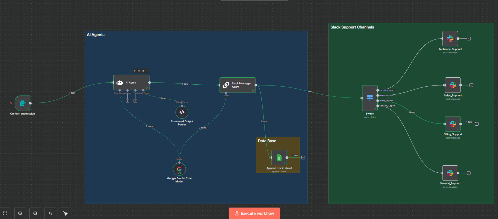
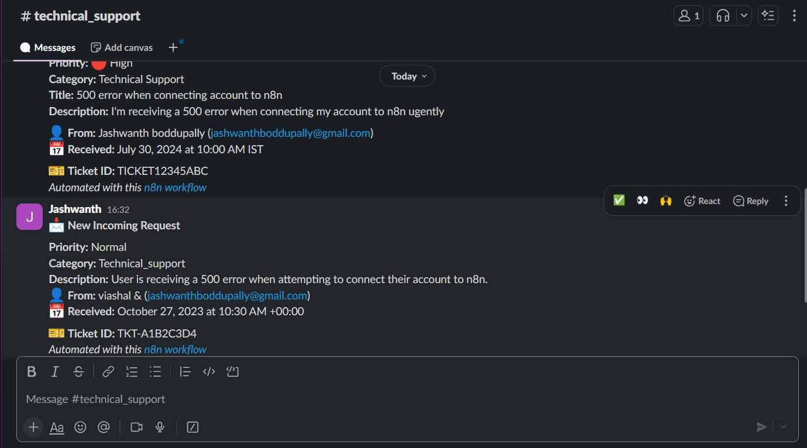
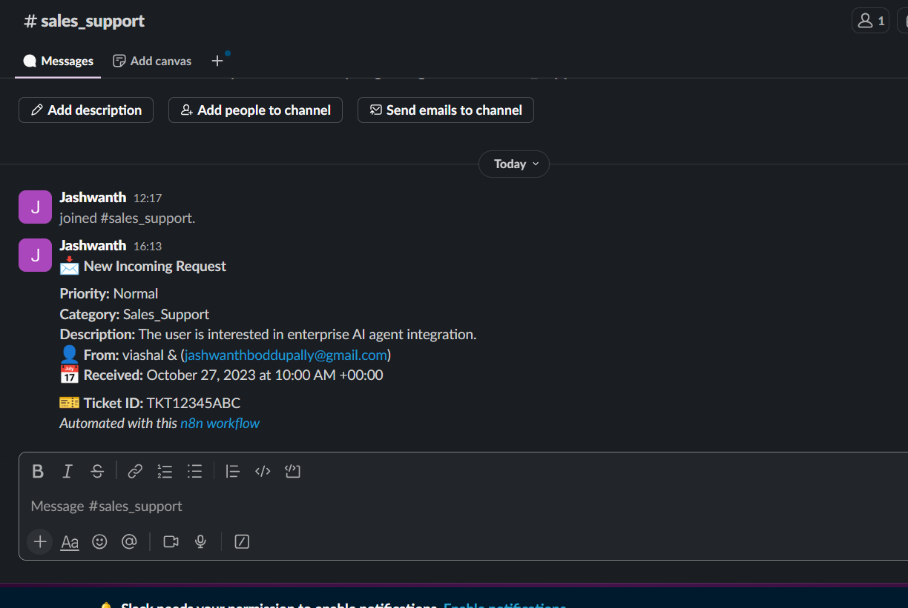
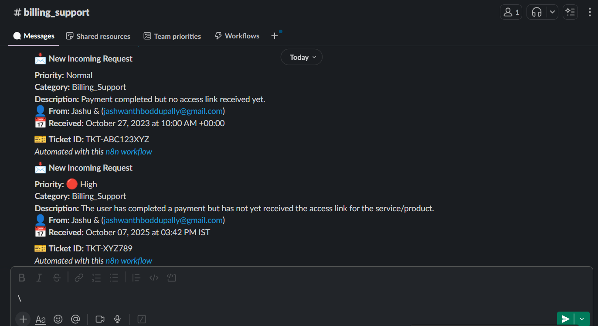
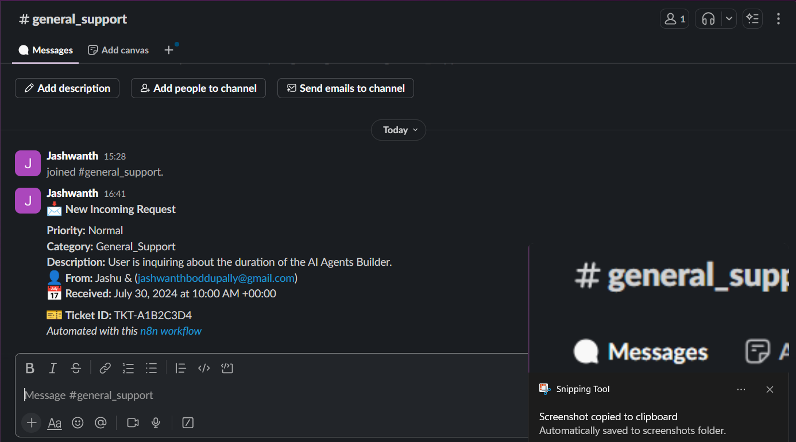
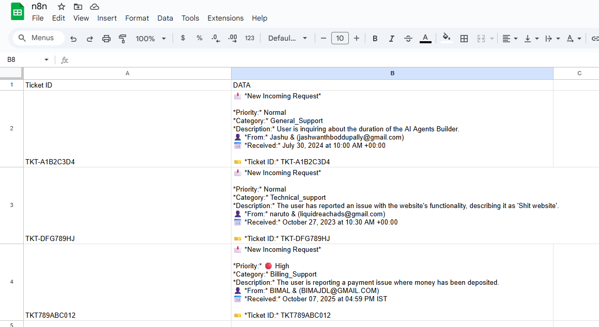

# The-Unified-Operations-Platform  Multi-Support AI Agent — n8n Workflow (Step-by-Step README)

This guide is tailored for new team members. It explains how to rebuild the workflow from scratch with clear node instructions, operations, modes, drag‑and‑drop directions, and copyable code blocks inside each step. No emojis. The AI Agent section strictly follows the order: **Agent → Chat Model → Output Parser**.

---

## 1) Canvas
**LLM & Parser wiring**
- **Google Gemini Chat Model** → connect as **ai_languageModel** to both **AI Agent** and **Slack Message Agent**
- **Structured Output Parser** → connect as **ai_outputParser** to **AI Agent**



## 2) Prerequisites & Auth
- n8n (Cloud or self-hosted).
- **Google Gemini** API credentials in n8n → **Google Palm API** credential named: `Gemini Api`.
- **Slack OAuth2** credentials in n8n named: `Slack account` with access to target channels.
- **Google Sheets OAuth2** credentials in n8n named: `Google Sheets account` with access to your spreadsheet.

---

## 3) Architecture Snapshot (Nodes & Flow)
1. **Form Trigger** → collects `Name`, `Gmail`, `problem / Issue  `
2. **AI Agent** (LangChain Agent) → classifies ticket, sets `priority`, creates `subject/description`, emits structured JSON
3. **Slack Message Agent** (LLM Chain) → converts the agent JSON to a Slack‑ready text block
4. **Switch** → routes by `category` to one of four Slack channels
5. **Slack** x4 → posts to Technical / Sales / Billing / General channels
6. **Google Sheets** → appends a row with Ticket ID and Slack text


---

## 4) Workflow Steps (drag‑and‑drop + exact settings)

### Step A — Form Trigger (Start)
**Drag-and-drop:** **Form Trigger** → place at the far left.

**Node settings**
- **Name:** `On form submission`
- **Mode / Operation:** Webhook form (trigger on submit)
- **Form fields:**
  - `Name` (required)
  - `Gmail` (type: `email`, required)
  - `problem / Issue  ` (type: `textarea`, required)  ← keep this label exactly (with spaces)

**Copyable config (fields only)**
```json
{
  "formTitle": "Bot Campus Contact Form",
  "formDescription": "Please drop your issue / problems here ...",
  "formFields": [
    {"fieldLabel": "Name", "placeholder": "Please Enter your name ", "requiredField": true},
    {"fieldLabel": "Gmail", "fieldType": "email", "placeholder": "Enter your Email", "requiredField": true},
    {"fieldLabel": "problem / Issue  ", "fieldType": "textarea", "placeholder": "Enter your Issue !", "requiredField": true}
  ]
}
```

**Wire:** `On form submission.main → AI Agent.main`

---

### Step D — AI Agent (Agent → then attach Chat Model → then attach Output Parser)
**Drag-and-drop:** **AI Agent**. Place this node to the right of the Form Trigger.

**Set up in this order**
1) **Agent node & prompt** (add the prompt below now)  
2) Attach the **Chat Model** (Step B) to **ai_languageModel**  
3) Attach the **Output Parser** (Step C) to **ai_outputParser**

**Node basics**
- **Name:** `AI Agent`
- **Mode / Operation:** Agent (LangChain Agent)
- **Enable:** “Has Output Parser” (so it emits structured `output`)

**Copyable Agent Prompt (paste into the node)**
```txt
You are an intelligent message classification assistant that formats messages for Slack.

Your task is to analyze the user's message and create a structured output with:

1) "category": Choose EXACTLY one of the following support teams:
   - "Sales_Support" → partnership, marketing, or sales-related
   - "Technical_support" → bugs, product issues, errors, technical support
   - "Billing_Support" → invoice, refund, subscription, payment-related questions
   - "General_Support" → general information, miscellaneous, or unclear

2) "priority": Assign urgency
   - Default: "Normal"
   - If text includes "urgent", "asap", "immediately", "payment", "emergency", or "critical", set "High"

3) Extract relevant information from the form

Inputs:
- Name = {{ $json.Name }}
- Gmail = {{ $json.Gmail }}
- Issue/Problem Raised = {{ $json['problem / Issue  '] }}
- category = Decide based on Issue/Problem Raised
- subject = Create from Issue/Problem Raised
- description = Create from Issue/Problem Raised
- timestamp = Use {{ $json.submittedAt }} if available; otherwise generate ISO
- ticketId = Create a random alphanumeric ID

Return ONLY valid JSON in this exact structure (no explanations):

{
  "channel": "string",       // one of: Sales_Support | Technical_support | Billing_Support | General_Support
  "priority": "string",      // High | Normal | Low (default Normal)
  "category": "string",      // short label like "Bug Report", "Billing Issue", "Partnership"
  "subject": "string",
  "description": "string",
  "name": "{{ $json.Name }}",
  "email": "{{ $json.Gmail }}",
  "timestamp": "{{ $json.submittedAt }}",
  "ticketId": "AB12CD34"
}

Examples:
- "I want to partner with your company" → channel: Sales_Support, priority: Normal, category: Partnership
- "Urgent! Website is not loading!" → channel: Technical_support, priority: High, category: Bug Report
- "I was charged twice this month!" → channel: Billing_Support, priority: High, category: Billing Issue
```

**Expected output shape**
```json
{
  "output": {
    "channel": "Technical_support",
    "priority": "High",
    "category": "Bug Report",
    "subject": "Website not loading",
    "description": "User reports the site is not loading.",
    "name": "John Doe",
    "email": "john@example.com",
    "timestamp": "2025-10-07T10:00:00Z",
    "ticketId": "AB12CD34"
  }
}
```

**Wire for now:**  
`On form submission.main → AI Agent.main`  
(Complete language model and parser wiring after Steps B and C.)

---

### Step B — Google Gemini Chat Model (LLM)
**Drag-and-drop:** **Google Gemini Chat Model**. Place this node below AI Agent.

**Node settings**
- **Name:** `Google Gemini Chat Model`
- **Mode / Operation:** Chat model (default)
- **Temperature:** `0.5`
- **Credentials:** `Gemini Api` (Google Palm API)

**Wire**
- Connect its **ai_languageModel** output to:
  - `AI Agent.ai_languageModel`
  - `Slack Message Agent.ai_languageModel`

---

### Step C — Structured Output Parser
**Drag-and-drop:** **Structured Output Parser**. Place this node near AI Agent.

**Node settings**
- **Name:** `Structured Output Parser`
- **Mode / Operation:** JSON schema example

**Copyable schema**
```json
{
  "channel": "string",
  "priority": "string",
  "category": "string",
  "subject": "string",
  "description": "string",
  "name": "string",
  "email": "string",
  "timestamp": "string",
  "ticketId": "string"
}
```

**Wire**  
`Structured Output Parser.ai_outputParser → AI Agent.ai_outputParser`

---

### Step E — Slack Message Agent (LLM Chain → formats final Slack text)
**Drag-and-drop:** **Chain: LLM**. Place to the right of AI Agent.

**Node settings**
- **Name:** `Slack Message Agent`
- **Operation/Mode:** Single LLM prompt → returns plain text
- **Input:** From `AI Agent.main`
- **Model:** Connect **Google Gemini Chat Model** via **ai_languageModel**

**Copyable Chain Prompt (outputs only the final text block)**
```txt
You are a professional Slack message formatter. Convert incoming support ticket JSON into a single Slack message. Output ONLY the final message text (no explanations, no code fences).

Data Source
- Use fields from {$json.output}. If any field is missing/empty, use "Not provided".

Required Output Template (exact structure and spacing)

New Incoming Request

Priority: {{ $json.output.priority }}
Category: {{ $json.output.category }}
Title: {{ $json.output.subject }}
Description: {{ $json.output.description }}
From: {{ $json.output.name }} ({{ $json.output.email }})
Received: {{ $json.output.timestamp }}
Ticket ID: {{ $json.output.ticketId }}

Formatting Rules
1) Priority mapping (case-insensitive):
   - "high"   → "High"
   - "medium" → "Medium"
   - "low"    → "Low"

2) Category: print {{ $json.output.category }} as-is.

3) Title: use {{ $json.output.subject }}; fallback "Not provided".

4) Description:
   - Use {{ $json.output.description }} as-is.
   - If length > 500, truncate to 500 chars and append "...".
   - If missing → "Not provided".

5) Timestamp: prefer ISO in {{ $json.output.timestamp }}. If parsing fails → "Not provided".

6) Output Contract:
   - Produce ONLY the filled template block above.
   - No extra characters, no markdown, no emojis.
```

**Output field:** returns a single string in `text`.

**Wire:**  
`AI Agent.main → Slack Message Agent.main`

---

### Step F — Switch (Route by Category)
**Drag-and-drop:** **Switch**. Place to the right of Slack Message Agent.

**Purpose:** Compare the Agent’s category and route to the matching Slack node.

**Input:** From `Slack Message Agent.main`

**Rules (4 outputs):** `AND` combinator, operator `equals`, case‑sensitive `true`.

**Right-value expression (use in each rule)**
```js
={{ $('AI Agent').item.json.output.category }}
```

**Rule table**
| Output # | Output Key         | Left value (literal)  | Right value (expression above) |
|----------|---------------------|-----------------------|---------------------------------|
| 1        | Technical_support   | `Technical_support`   | Agent category                  |
| 2        | Sales_Support       | `Sales_Support`       | Agent category                  |
| 3        | Billing_Support     | `Billing_Support`     | Agent category                  |
| 4        | General_Support     | `General_Support`     | Agent category                  |

**Wire:**  
`Slack Message Agent.main → Switch.main`

---

### Step G — Slack nodes (send message)

#### G1) Technical Support
**Drag-and-drop:** **Slack**
- **Name:** `Techinical Support`
- **Credentials:** `Slack account`
- **Select:** `Channel`
- **Channel ID:** `C09K1N9QS7Q`
- **Text:**
```js
={{ $json.text }}
```
**Wire:** `Switch.output #1 → Techinical Support.main`



#### G2) Sales Support
**Slack**
- **Name:** `Sales_Support`
- **Credentials:** `Slack account`
- **Select:** `Channel`
- **Channel ID:** `C09KGTXR2NM`
- **Text:**
```js
={{ $json.text }}
```
**Wire:** `Switch.output #2 → Sales_Support.main`



#### G3) Billing Support
**Slack**
- **Name:** `Billing_Support`
- **Credentials:** `Slack account`
- **Select:** `Channel`
- **Channel ID:** `C09JNHFSL9M`
- **Text:**
```js
={{ $('Slack Message Agent ').item.json.text }}
```
**Wire:** `Switch.output #3 → Billing_Support.main`



#### G4) General Support
**Slack**
- **Name:** `General_Support`
- **Credentials:** `Slack account`
- **Select:** `Channel`
- **Channel ID:** `C09KJ0PGF97`
- **Text:**
```js
={{ $('Slack Message Agent ').item.json.text }}
```
**Wire:** `Switch.output #4 → General_Support.main`



---

### Step H — Google Sheets (Append Ticket Log)
**Drag-and-drop:** **Google Sheets**
- **Name:** `Append row in sheet`
- **Operation:** `Append`
- **Spreadsheet:** select by ID (e.g., `1JfUJ3E0hevU3laYzaGUxULYT-SbBmxOEJVK-tD71qVI`)
- **Sheet:** `Sheet2`
- **Columns → Define below → Mapping**
  - **Ticket ID**
    ```js
    ={{ $('AI Agent').item.json.output.ticketId }}
    ```
  - **DATA**  (Slack message text)
    ```js
    ={{ $json.text }}
    ```

**Wire:**  
`Slack Message Agent.main → Append row in sheet.main`



---

## 5) Final Wiring Checklist
- `On form submission.main → AI Agent.main`
- `Google Gemini Chat Model.ai_languageModel → AI Agent.ai_languageModel`
- `Structured Output Parser.ai_outputParser → AI Agent.ai_outputParser`
- `AI Agent.main → Slack Message Agent.main`
- `Google Gemini Chat Model.ai_languageModel → Slack Message Agent.ai_languageModel`
- `Slack Message Agent.main → Switch.main`
- `Switch.out1 → Techinical Support.main`
- `Switch.out2 → Sales_Support.main`
- `Switch.out3 → Billing_Support.main`
- `Switch.out4 → General_Support.main`
- `Slack Message Agent.main → Append row in sheet.main`

---

## 6) Quick Reference (copy‑paste expressions)

**Form values**
```js
{{$json.Name}}
{{$json.Gmail}}
{{$json['problem / Issue  ']}}
```

**Agent output**
```js
{{$('AI Agent').item.json.output.category}}
{{$('AI Agent').item.json.output.priority}}
{{$('AI Agent').item.json.output.subject}}
{{$('AI Agent').item.json.output.description}}
{{$('AI Agent').item.json.output.ticketId}}
```

**Slack text**
```js
{{$json.text}}
```
or explicitly
```js
{{$('Slack Message Agent ').item.json.text}}
```
