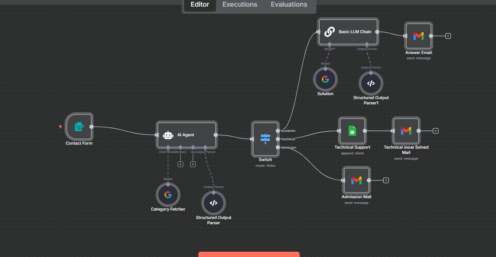
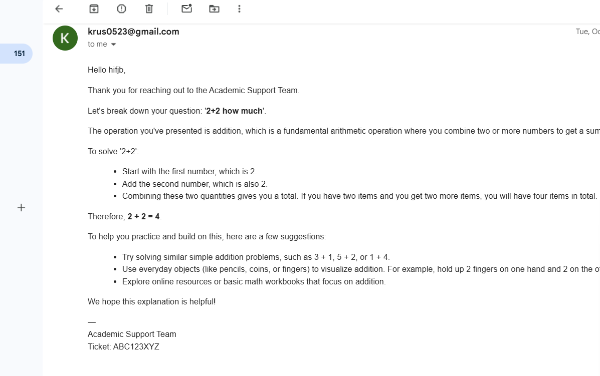
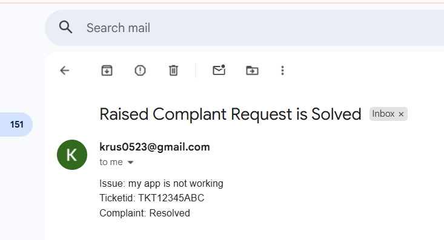
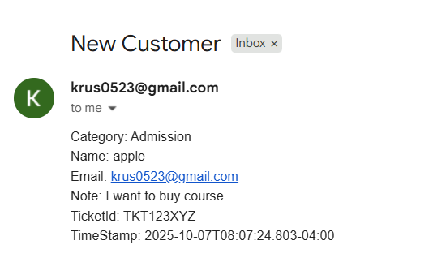

# Bot Campus Contact Classifier & Academic Auto-Reply — n8n Workflow Guide

Goal: Turn a contact form submission into a classified ticket (Academic / Technical / Admission), route it by category, auto‑answer academic queries via email, log technical cases to Google Sheets, and notify admissions by email.

---

## Architecture Snapshot


*Figure 1: End‑to‑end wiring in n8n.*

### Paths and Outcomes
- Academic → LLM builds explained answer → Gmail reply to the student.
- Technical → Append to Google Sheet → Send a status email.
- Admission → Email notification to admissions inbox.

---

## Prerequisites & Authentication
- n8n 1.1xx+
- Credentials in n8n:
  - Google Gemini (PaLM) API → credential name: `Google Gemini(PaLM) Api account`
  - Gmail OAuth2 → credential name: `Gmail account`
  - Google Sheets OAuth2 → credential name: `Google Sheets account`
- Google Sheet available with access granted to the Gmail/Sheets credentials.

---

## Node List and Flow

1) Contact Form → collects Name, Gmail, Problem/Issue  
2) AI Agent → classifies to Academic / Technical / Admission and creates a JSON payload  
3) Structured Output Parser (for AI Agent) → enforces JSON shape  
4) Switch → routes by `category`  
   - Academic:
     5) Basic LLM Chain → produces `{ subject, body_text, body_html }`
     6) Structured Output Parser1 → enforces email JSON shape
     7) Answer Email → sends academic solution to the user
   - Technical:
     5) Technical Support (Google Sheets Append) → logs the case
     6) Technical issue Solved Mail → status mail
   - Admission:
     5) Admission Mail → sends details to admissions

Wiring (exact as in JSON):
- Contact Form → AI Agent
- Structured Output Parser → AI Agent (ai_outputParser)
- Category Fetcher → AI Agent (ai_languageModel)
- AI Agent → Switch
- Switch[Academic] → Basic LLM Chain → Answer Email
- Structured Output Parser1 → Basic LLM Chain (ai_outputParser)
- Solution → Basic LLM Chain (ai_languageModel)
- Switch[Technical] → Technical Support → Technical issue Solved Mail
- Switch[Admission] → Admission Mail

---

## Step‑by‑Step Setup

### 1) Contact Form
Type: `n8n-nodes-base.formTrigger`  
Mode: Form Trigger (webhook)  
Drag & drop: Triggers → Form Trigger → place on canvas → connect to AI Agent.

Config:
- Title: `Bot Campus Contact Form`
- Description: `Please drop your issue / problems here ...`
- Fields:
  - Name (required)
  - Gmail (email, required)
  - problem / Issue   (textarea, required)

**Sample output**
```json
{
  "Name": "John Example",
  "Gmail": "john@example.com",
  "problem / Issue  ": "Portal not opening",
  "submittedAt": "2025-10-08T09:15:00Z"
}
```

### 2) AI Agent (Classifier)
Type: `@n8n/n8n-nodes-langchain.agent`  
Mode: Agent with custom prompt + structured output  
Drag & drop: AI → AI Agent → connect Contact Form → AI Agent.  
Model: connect **Category Fetcher** to AI Agent as `ai_languageModel`.  
Output parser: connect **Structured Output Parser** to AI Agent as `ai_outputParser`.

**Prompt**
```
You are an intelligent message classification assistant that formats messages for Slack.

Your task is to analyze the user's message and create a structured output with:

1. "category": Choose EXACTLY one of the following support teams:

   - "Academic" → for study-related, subject doubts, or academic guidance
   - "Technical" → for bugs, errors, software/platform issues, or technical questions
   - "Admission" → for enrollment, registration, application, or admission-related queries

2. "priority": Assign the urgency level
   - Default: "Normal"
   - If the message includes words such as "urgent", "asap", "immediately", or "critical", set to "High"

3. Extract all relevant information from the incoming form submission
----
Inputs :

- Name = {{ $json.Name }}
- Gmail = {{ $json.Gmail }}
- Issue/Problem Raised = {{ $json['problem / Issue  '] }}
- category = AI should decide the Category 
- Subject = Create a subject based on Issue/Problem Raised → {{ $json['problem / Issue  '] }}
- description = Create a description based on Issue/Problem Raised → {{ $json['problem / Issue  '] }}
- Ticket

---
Return ONLY valid JSON in this exact structure (no explanations, no comments):

{
  "channel": "string",
  "priority": "string",
  "category": "string",
  "subject": "string",
  "description": "string",
  "name": "{{ $json.Name }}",
  "email": "{{ $json.Gmail }}",
  "timestamp": "{{ $json.submittedAt }}",
  "ticketId": "Create Random ID with number + Alphabets"
}

---
Classification examples:
- "Need help with semester syllabus" → { "channel": "Academic", "priority": "Normal", "category": "Academic" }
- "Urgent! My portal is not opening" → { "channel": "Technical", "priority": "High", "category": "Technical" }
- "How can I apply for admission?" → { "channel": "Admission", "priority": "Normal", "category": "Admission" }
```

### 3) Structured Output Parser (for AI Agent)
Type: `@n8n/n8n-nodes-langchain.outputParserStructured`  
Mode: Structured schema  
Drag & drop: AI → Structured Output Parser → connect to AI Agent as `ai_outputParser`.

**Schema**
```json
{
  "category": "string",
  "subject": "string",
  "priority": "string",
  "description": "string",
  "name": "string",
  "email": "string",
  "timestamp": "string",
  "ticketId": "string"
}
```

### 4) Switch (Route by Category)
Type: `n8n-nodes-base.switch`  
Mode: Rules (string equals)  
Drag & drop: Flow → Switch → connect AI Agent → Switch.

**Rules (equals on `{{ $json.output.category }}`)**
```json
{
  "rules": [
    {
      "conditions": [
        { "leftValue": "Academic", "rightValue": "={{ $json.output.category }}", "operator": "equals" }
      ],
      "renameOutput": true,
      "outputKey": "Academic"
    },
    {
      "conditions": [
        { "leftValue": "Technical", "rightValue": "={{ $json.output.category }}", "operator": "equals" }
      ],
      "renameOutput": true,
      "outputKey": "Technical"
    },
    {
      "conditions": [
        { "leftValue": "Admission", "rightValue": "={{ $json.output.category }}", "operator": "equals" }
      ],
      "renameOutput": true,
      "outputKey": "Admission"
    }
  ]
}
```

---

## Academic Path

### 5) Basic LLM Chain (Answer Builder)
Type: `@n8n/n8n-nodes-langchain.chainLlm`  
Mode: LLM Chain with custom prompt + structured output  
Drag & drop: AI → LLM Chain → connect Switch(Academic) → Basic LLM Chain.  
Model: connect **Solution** to this node as `ai_languageModel`.  
Output parser: connect **Structured Output Parser1** as `ai_outputParser`.

**Prompt**
```
You are an Academic Support Email Assistant.

Scope:
- ONLY handle academic questions (concepts, exercises, explanations, study tips).
- If the input is not academic, politely say it’s out of scope and recommend contacting the appropriate team.

Inputs :

Input format (JSON keys you will receive):
- category (expected: "Academic")
- subject : {{ $json.output.subject }}
- priority :{{ $json.output.priority }}
- description: {{ $json.output.description }}
- name :{{ $json.output.name }}
- email :{{ $json.output.email }}
- timestamp :{{ $json.output.timestamp }}
- ticketId:{{ $json.output.ticketId }}

Your tasks:
1) Understand the academic question from the JSON (prefer description/subject).
2) Provide a concise, correct solution or explanation with clear steps.
3) Offer 1–3 short practice suggestions or next steps.

Output:

Output strictly as a single JSON object with EXACTLY these fields:
{
  "subject": "Give me exact sunject based on question",
  "body_text": "string",
  "body_html": "string"
}

Formatting rules:
- subject: "Question [{{ $('Contact Form').item.json['problem / Issue  '] }}]-Ticket {{ $json.output.ticketId }}"
- body_text: plain text, short paragraphs, no markdown.
- body_html: simple HTML only (<p>, <ul>, <li>, <strong>).
- Keep tone supportive and clear.
- End both bodies with this sign-off block exactly:
  —
  Academic Support Team
  Ticket: {{ $json.output.ticketId }}

Guardrails:
- If category != "Academic" or the question is not academic, do NOT solve it; reply that it’s out of scope and suggest contacting the correct team.
- Do not include any other keys or commentary outside the required JSON fields.
```

### 6) Structured Output Parser1 (for Basic LLM Chain)
Type: `@n8n/n8n-nodes-langchain.outputParserStructured`  
Mode: Structured schema  

**Schema**
```json
{
  "subject": "string",
  "body_text": "string",
  "body_html": "string"
}
```

### 7) Answer Email (Academic)
Type: `n8n-nodes-base.gmail`  
Operation: send message  
Fields:
- Send To: `{{ $('Switch').item.json.output.email }}`
- Subject: `{{ $json.output.subject }}`
- Message: `{{ $json.output.body_html }}`
- Options → Append Attribution: `false`


*Figure 2: Academic auto‑reply email.*

---

## Technical Path

### Technical Support (Google Sheets Append)
Type: `n8n-nodes-base.googleSheets`  
Operation: `append`  
Fields:
- Document ID: `1Ckpi4oZNWVSappQaOkcNZl5AtimN7gLsY27xl1qSD5M`
- Sheet: `Sheet1` (gid=0)
- Columns (mapping):
```json
{
  "description": "={{ $json.output.description }}",
  "email": "={{ $json.output.email }}",
  "timestramp": "={{ $json.output.timestamp }}",
  "ticketid": "={{ $json.output.ticketId }}",
  "statues": "not yet cleared"
}
```

### Technical issue Solved Mail
Type: `n8n-nodes-base.gmail`  
Operation: send message (text)  
Fields:
- Send To: `{{ $json.email }}`
- Subject: `Raised Complant Request is Solved`
- Message (text):
```
Issue: {{ $json.description }}
Ticketid: {{ $json.ticketid }}
Complaint: Resolved
```

*Figure 3: Technical status email.*

---

## Admission Path


### Admission Mail
Type: `n8n-nodes-base.gmail`  
Operation: send message (text)  
Fields:
- Send To: `krus0523@gmail.com`
- Subject: `New Customer`
- Message (text):
```
Category: {{ $json.output.category }}
Name: {{ $json.output.name }}
Email: {{ $json.output.email }}
Note: {{ $json.output.subject }}
TicketId: {{ $json.output.ticketId }}
TimeStamp: {{ $json.output.timestamp }}
```

*Figure 4: Admission notification email.*

---

## Language Models

### Category Fetcher (for AI Agent)
Type: `@n8n/n8n-nodes-langchain.lmChatGoogleGemini`  
Options: Temperature = 0.5

### Solution (for Basic LLM Chain)
Type: `@n8n/n8n-nodes-langchain.lmChatGoogleGemini`

---

## Final Check
- Switch rules match keys exactly: Academic, Technical, Admission.
- Gmail nodes accept HTML where expected.
- Google Sheet column keys align with your sheet headers.

---
