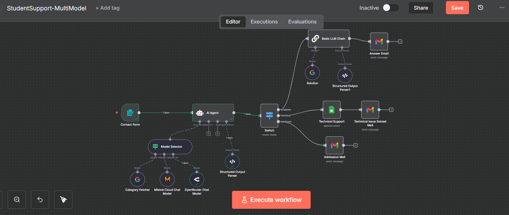
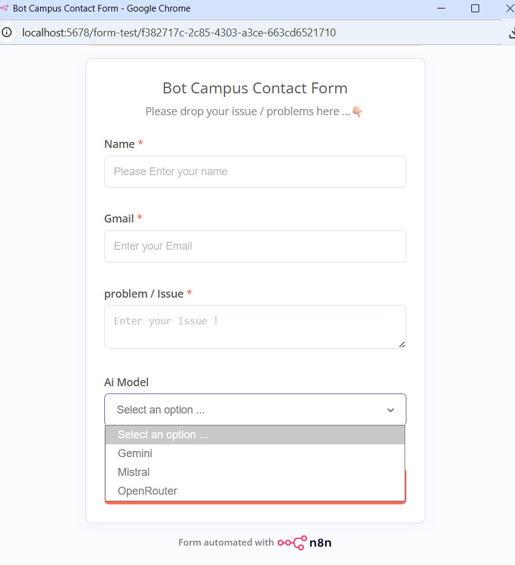

# StudentSupport-MultiModel — n8n Workflow Guide

Purpose: Build a student support intake that classifies form submissions with an AI Agent, routes by category, generates academic answers via an LLM chain, logs technical issues to Sheets, and emails users/staff.

---

## Screenshots

*Figure 1 — Editor canvas of the complete workflow.*


---

## Architecture (Nodes and Wiring)

1) **Contact Form** (Trigger) →  
2) **Model Selector** (LangChain)
   - **Gemini Chat** → feeds Model Selector
   - **Mistral Cloud Chat Model** → feeds Model Selector
   - **OpenRouter Chat Model** → feeds Model Selector
3) **AI Agent** (LangChain Agent) + **Structured Output Parser** (classification schema) →  
4) **Switch** on `output.category` → three branches:
   - **Academic** → **Basic LLM Chain** (with **Solution: Gemini Chat** + **Structured Output Parser1**) → **Answer Email** (Gmail)
   - **Technical** → **Technical Support** (Google Sheets Append) → **Technical issue Solved Mail** (Gmail)
   - **Admission** → **Admission Mail** (Gmail)

---

## Prerequisites and Credentials

- **Google Gemini (PaLM) API** credentials in n8n.
- **Mistral Cloud** API credentials in n8n.
- **OpenRouter** API credentials in n8n.
- **Google Sheets** credentials in n8n.
- **Gmail** credentials in n8n.

Keep all keys in n8n Credentials. Do not hardcode secrets in nodes.

---

## Step-by-Step Build (Workflow Steps Only)

### 1) Contact Form — Trigger
- **Node:** Contact Form
- **Mode / Operation:** Trigger on form submission
- **Drag & Drop:** Nodes → Triggers → Contact Form
- **Configure:**
  - **Form Title:** `Bot Campus Contact Form`
  - **Form Description:** `Please drop your issue / problems here ...`
  - **Fields:** `Name` (required), `Gmail` (email, required), `problem / Issue  ` (textarea, required), `Ai Model` (dropdown: Gemini, Mistral, OpenRouter)

**Copyable field options:**

```json
{
  "fields": [
    { "label": "Name", "required": true },
    { "label": "Gmail", "type": "email", "required": true },
    { "label": "problem / Issue  ", "type": "textarea", "required": true },
    { "label": "Ai Model", "type": "dropdown", "options": ["Gemini","Mistral","OpenRouter"] }
  ]
}
```

**Wiring:** `Contact Form (main)` → `AI Agent (main)`


*Figure 2 — Public form with model picker.*

---

### 2) Model Selector — Choose LLM from form
- **Node:** Model Selector (LangChain Utility)
- **Mode / Operation:** Route to selected chat model
- **Drag & Drop:** LangChain → Utilities → Model Selector
- **Attach available chat models:**
  - `Category Fetcher` (Google Gemini Chat Model)
  - `Mistral Cloud Chat Model` (Mistral)
  - `OpenRouter Chat Model` (model e.g. `qwen/qwen3-coder:free`)
- **Wire:** Each chat model → Model Selector `ai_languageModel` inputs 0/1/2

**Rules (copy and adapt inside the node):**
```json
{
  "rules": [
    { "if": "$json['Ai Model'] == 'Gemini'",   "modelIndex": 0 },
    { "if": "$json['Ai Model'] == 'Mistral'",  "modelIndex": 1 },
    { "if": "$json['Ai Model'] == 'OpenRouter'", "modelIndex": 2 }
  ]
}
```

**Wiring to Agent:** `Model Selector (ai_languageModel)` → `AI Agent (ai_languageModel)`

---

### 3) Structured Output Parser — Classification schema
- **Node:** Structured Output Parser
- **Mode / Operation:** Schema for classifier result
- **Drag & Drop:** LangChain → Output Parsers → Structured Output Parser
- **Schema:**

```json
{
  "category": "string",
  "subject": "string",
  "priority": "string",
  "description": "string",
  "name": "string",
  "email": "string",
  "timestamp": "string",
  "ticketId": "string"
}
```

**Wiring:** `Structured Output Parser (ai_outputParser)` → `AI Agent (ai_outputParser)`

---

### 4) AI Agent — Message Classifier
- **Node:** AI Agent (LangChain Agent)
- **Mode / Operation:** Agent with custom prompt + structured parser
- **Drag & Drop:** LangChain → Agents → AI Agent
- **Inputs:** `Contact Form (main)` + `Model Selector (ai_languageModel)` + `Structured Output Parser (ai_outputParser)`

**Prompt (paste in the Agent):**
```text
You are an intelligent message classification assistant that formats messages for Slack.

Your task is to analyze the user's message and create a structured output with:

1. "category": Choose EXACTLY one of the following support teams:
   - "Academic" → for study-related, subject doubts, or academic guidance
   - "Technical" → for bugs, errors, software/platform issues, or technical questions
   - "Admission" → for enrollment, registration, application, or admission-related queries

2. "priority": Assign the urgency level
   - Default: "Normal"
   - If the message includes words such as "urgent", "asap", "immediately", or "critical", set to "High"

3. Extract all relevant information from the incoming form submission
----
Inputs :
- Name = { $json.Name }
- Gmail = { $json.Gmail }
- Issue/Problem Raised = { $json['problem / Issue  '] }
- category = AI should decide the Category
- Subject = Create a subject based on Issue/Problem Raised → { $json['problem / Issue  '] }
- description = Create a description based on Issue/Problem Raised → { $json['problem / Issue  '] }

Return ONLY valid JSON in this exact structure (no explanations, no comments):
{
  "channel": "string",
  "priority": "string",
  "category": "string",
  "subject": "string",
  "description": "string",
  "name": "{ $json.Name }",
  "email": "{ $json.Gmail }",
  "timestamp": "{ $json.submittedAt }",
  "ticketId": "Create Random ID with number + Alphabets"
}
```

**Wiring:** `AI Agent (main)` → `Switch (main)`

---

### 5) Switch — Route by category
- **Node:** Switch
- **Mode / Operation:** Compare `={ $json.output.category }` equals
- **Drag & Drop:** Core → Flow → Switch
- **Cases:** `Academic`, `Technical`, `Admission`
- **Outputs:**
  - Case `Academic` → Output 1
  - Case `Technical` → Output 2
  - Case `Admission` → Output 3

Example rule expression used in comparisons:
```
={ $json.output.category }
```

---

## Branch A — Academic

### A1) Structured Output Parser1 — Email schema
- **Node:** Structured Output Parser
- **Mode / Operation:** Enforce email JSON
- **Schema:**
```json
{
  "subject": "string",
  "body_text": "string",
  "body_html": "string"
}
```

### A2) Solution — Gemini Chat
- **Node:** Google Gemini Chat Model
- **Mode / Operation:** Chat model provider for Basic LLM Chain

### A3) Basic LLM Chain — Generate academic answer
- **Node:** Basic LLM Chain
- **Inputs:** `Switch (Academic)` → main, `Solution` → ai_languageModel, `Structured Output Parser1` → ai_outputParser
- **Prompt:**
```text
You are an Academic Support Email Assistant.

Scope:
- ONLY handle academic questions (concepts, exercises, explanations, study tips).
- If the input is not academic, say it’s out of scope and recommend contacting the appropriate team.

Inputs :
- subject : { $json.output.subject }
- priority : { $json.output.priority }
- description: { $json.output.description }
- name : { $json.output.name }
- email : { $json.output.email }
- timestamp : { $json.output.timestamp }
- ticketId : { $json.output.ticketId }

Output strictly as JSON with fields:
{
  "subject": "Give me exact sunject based on question",
  "body_text": "string",
  "body_html": "string"
}
```

### A4) Answer Email — Gmail
- **Node:** Gmail
- **Mode / Operation:** Send email (HTML)
- **To:** `={ $('Switch').item.json.output.email }`
- **Subject:** `={ $json.output.subject }`
- **Message:** `={ $json.output.body_html }`

---

## Branch B — Technical

### B1) Technical Support — Google Sheets Append
- **Node:** Google Sheets
- **Mode / Operation:** Append
- **Mappings:**
```json
{
  "description": "={ $json.output.description }",
  "email": "={ $json.output.email }",
  "timestramp": "={ $json.output.timestamp }",
  "ticketid": "={ $json.output.ticketId }",
  "statues": "not yet cleared"
}
```

### B2) Technical issue Solved Mail — Gmail
- **Node:** Gmail
- **Mode / Operation:** Send text email
- **To:** `={ $json.email }`
- **Subject:** `Raised Complant Request is Solved`
- **Message:**
```
Issue: { $json.description }
Ticketid: { $json.ticketid }
Complaint: Resolved
```

---

## Branch C — Admission

### C1) Admission Mail — Gmail
- **Node:** Gmail
- **Mode / Operation:** Send text email
- **To:** `your gmail@gmail.com`
- **Subject:** `=New Customer`
- **Message:**
```
Category: { $json.output.category }
Name: { $json.output.name }
Email: { $json.output.email }
Note: { $json.output.subject }
TicketId: { $json.output.ticketId }
TimeStamp: { $json.output.timestamp }
```

---

## Final Wiring Summary

- Contact Form → AI Agent
- Category Fetcher, Mistral Cloud Chat Model, OpenRouter Chat Model → Model Selector (ai_languageModel)
- Model Selector (ai_languageModel) → AI Agent (ai_languageModel)
- Structured Output Parser → AI Agent (ai_outputParser)
- AI Agent → Switch
- Academic path: Switch → Basic LLM Chain → Answer Email; plus Solution → Basic LLM Chain (ai_languageModel); Structured Output Parser1 → Basic LLM Chain (ai_outputParser)
- Technical path: Switch → Technical Support (Sheets) → Technical issue Solved Mail (Gmail)
- Admission path: Switch → Admission Mail (Gmail)

---

## Useful Expressions (copy/paste)

```
{ $json['Ai Model'] }
{ $json['problem / Issue  '] }
{ $json.output.category }
{ $json.output.subject }
{ $json.output.description }
{ $json.output.email }
{ $json.output.name }
{ $json.output.timestamp }
{ $json.output.ticketId }
{ $('Switch').item.json.output.email }
```
