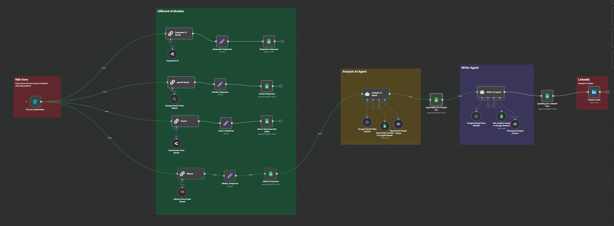
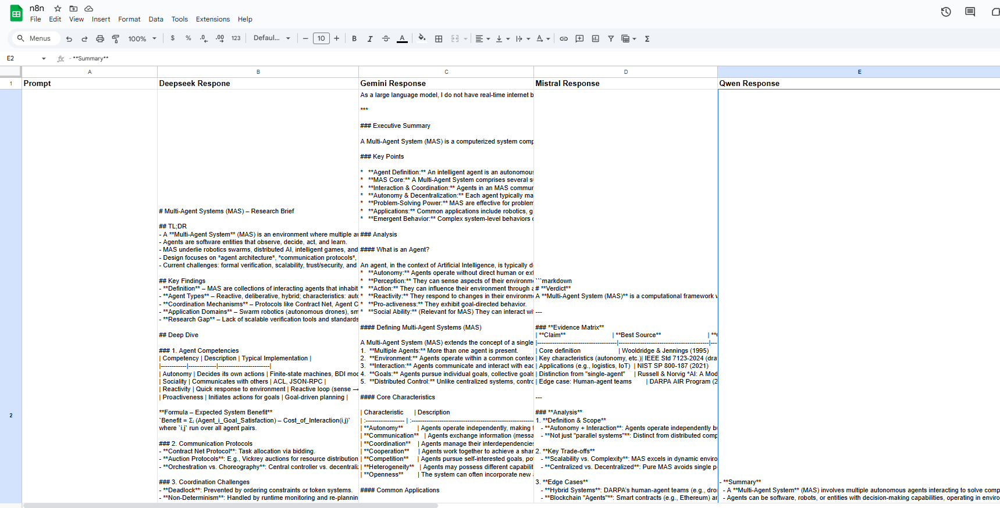
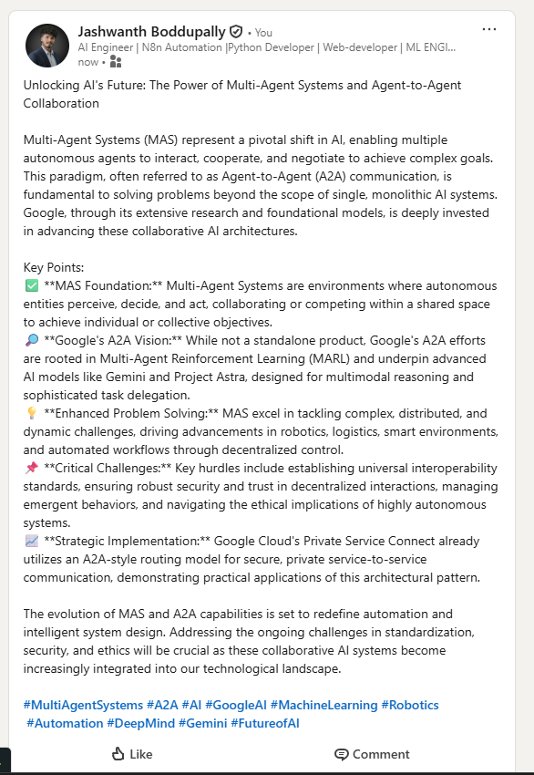

# Build Your Research Assistant — Multi-Model → Analysis Agent → Writer Agent → LinkedIn

> **Goal:** Take a single research prompt from an n8n Form, query multiple LLMs (Deepseek, Gemini, Qwen, Mistral), log all outputs to Google Sheets, run an **Analysis AI Agent** to synthesize a consolidated brief, then run a **Writer AI Agent** to produce a polished LinkedIn article and optionally post it to LinkedIn.



---

## Prerequisites & Auth

- **n8n** up and running.
- **Credentials**
  - Google Sheets OAuth2 → named e.g. `Google Sheets account`.
  - OpenRouter API → `OpenRouter account`, `OpenRouter account 2`.
  - Gemini API → `Gemini Api`.
  - Mistral Cloud → `Mistral Cloud account`.
  - LinkedIn OAuth2 → `LinkedIn account`.
- **Google Sheet**
  - Spreadsheet ID: `1JfUJ3E0hevU3laYzaGUxULYT-SbBmxOEJVK-tD71qVI`
  - Worksheet: **Deep research** (`gid=720580844`)
  - Columns (create if missing):  
    `Prompt `, `Deepseek Respone`, `Gemini Response`, `Mistral Response`, `Qwen Response`, `Analyst agent`, `LinkedIn Article`

> Place the canvas image at `images/canvas.png` in your repo. If you’re using the provided files, copy `/mnt/data/canvas.png` → `images/canvas.png`.

---

## Architecture Snapshot (Nodes & Flow)

**Capture Input**
- **On form submission** (Form Trigger) → field: `prompt`

**Different AI Models (parallel branches)**
- **Deepseek R1 Model** (Chain LLM) → **Deepseek-Response** (Set) → **Deepseek Response** (Google Sheets: Append)
- **gemini Model** (Chain LLM) → **Gemini_Response** (Set) → **Gemini Response** (Google Sheets: Append/Update)
- **Qwen1** (Chain LLM) + **OpenRouter Chat Model** (as model) → **Qwen_Response** (Set) → **Qwen Response into sheet** (Google Sheets: Append/Update)
- **Mistral** (Chain LLM) + **Mistral Cloud Chat Model** (as model) → **Mistral_Response** (Set) → **Mistral Response** (Google Sheets: Append/Update)

**Analysis Agent Block**
- **Analysis AI Agent** (Agent) + tools: **Get row(s) in sheet in Google Sheets** (Sheets Tool), model: **Google Gemini Chat Model1**, output parser: **Structured Output Parser**

**Writer Agent Block**
- **Writer AI Agent1** (Agent) + tools: **Get row(s) in sheet in Google Sheets1** (Sheets Tool), model: **Google Gemini Chat Model2**, output parser: **Structured Output Parser1** → **Create a post** (LinkedIn)

---

## Step-by-Step Build (Drag-and-Drop + Settings)

### 1) Form Input
1. **Drag**: **Form Trigger** → name: `On form submission`.
2. **Form Title**: `Give a prompt`
3. **Fields**: Add a required text field labeled `prompt`.

**Downstream connections:**  
Connect `On form submission` → **Deepseek R1 Model**, **gemini Model**, **Qwen1**, **Mistral**.

---

### 2) Deepseek Branch
**2.1 Deepseek R1 Model (Chain LLM)**
- **Prompt (System)** — copy exactly:
```
ROLE: Senior Research Analyst (Reasoning-First)

GOAL: Deliver a high-accuracy research brief with clear evidence and citations.
You may reason internally, but share only concise conclusions and short justifications (no step-by-step chain-of-thought).

METHOD
1) Clarify scope from the user message; extract entities, time range, region, and definitions.
2) Triangulate facts across diverse, high-quality sources. Prefer primary data, official docs, standards, peer-reviewed work.
3) Quantify when possible: include small calculations, sanity checks, and units.
4) Surface disagreement: note competing claims and evaluate them.
5) If evidence is weak or unknown, say so explicitly and suggest next queries.

Input :
{{ $json.prompt }}

OUTPUT (Markdown)
- Title
- TL;DR (3–5 bullets)
- Key Findings (short bullets, each ending with an inline source tag like [S1])
- Deep Dive (short sections; include small formulas/tables as needed)
- Risks / Unknowns
- Actionable Next Steps (bullets)
- Sources [S1…Sn]: list 5–12 credible links with publisher + date

RULES
- No speculation, no invented citations, no paywalled summaries without indicating paywall.
- Include publish/update dates for sources.
- If the user provides a cutoff date (“as of …”), honor it; otherwise prefer freshest reliable sources.
- Keep answers compact and information-dense; avoid filler.
```
- **Model**: Deepseek-R1 via OpenRouter

**2.2 Deepseek-Response (Set)**
```
Deepseek-Response = {{ $json.text }}
prompt = {{ $('On form submission').item.json.prompt }}
```

**2.3 Deepseek Response (Google Sheets)**
- **Operation**: `Append`
- **Mapping**:
```
Prompt  = {{ $('On form submission').item.json.prompt }}
Deepseek Respone = {{ $json['Deepseek-Response'] }}
```

---

### 3) Gemini Branch
**3.1 gemini Model (Chain LLM)**
- **Prompt (System)** — copy exactly:
```
ROLE: Evidence-Driven Research Assistant

OBJECTIVE: Produce a concise, well-structured research report with accurate citations. Perform internal planning; share only final rationale bullets (no chain-of-thought).

RESEARCH PRINCIPLES
- Prioritize primary sources (official docs, datasets, standards, statutes, peer-reviewed papers).
- Cross-check at least 3 independent sources for critical claims.
- Prefer recent materials; include the publication date next to each citation.
- Clearly label uncertainty and data gaps; never guess.

DELIVERABLE (Markdown)
1) Executive Summary (max 120 words)
2) Key Points (5–8 bullets, each with [S#])
3) Analysis (short subsections; compare viewpoints; include small tables if helpful)
4) What’s Contested vs. Settled
5) Practical Implications / Recommendations
6) Citations: [S1] … [Sn] → full link + publisher/name + date

STYLE & SAFETY
- Factual, neutral tone; no fabricated sources or quotes.
- If tools/browsing aren’t available, state the limitation and base answers on provided context only.

Input Prompt:
{{ $json.prompt }}
```

**3.2 Gemini_Response (Set)**
```
Gemini_Response = {{ $json.Gemini_Response || $json.text }}
```

**3.3 Google Sheets — Gemini Response**
- **Operation**: `Append or Update`
- **Matching column**: `Prompt `
- **Mapping**:
```
Prompt  = {{ $('On form submission').item.json.prompt }}
Gemini Response = {{ $json.Gemini_Response }}
```

---

### 4) Qwen Branch
**4.1 Qwen1 (Chain LLM)** using **OpenRouter Chat Model**
- **Prompt (System)** — copy exactly:
```
ROLE: Global Research Analyst (Multilingual)

MISSION: Produce a bilingual-aware research brief (English primary; include original non-English source titles in parentheses when useful). Think privately; present only final results with concise justifications.

GUIDELINES
- Search across English and non-English materials; do not exclude Chinese/EU/JP standards and government sources.
- Normalize numbers and units; state currency and time zone if relevant.
- Provide short quote snippets (≤20 words) ONLY when essential, with citation.

Input Prompt:
{{ $json.prompt }}

OUTPUT (Markdown)
- Summary (3–4 bullets)
- Context & Definitions (one short section)
- Comparative Analysis (regions/standards/policies/implementations)
- Data/Calculations (mini table if needed)
- Limitations & Unknowns
- References: numbered list with full links; add original-language titles in parentheses when not English; include dates.

RULES
- No invented links or papers.
- Mark uncertain items clearly.
- Respect user-specified cutoff dates or jurisdictions; otherwise prefer recent, authoritative sources.
```

**4.2 Qwen_Response (Set)**
```
Qwen_Response = {{ $json.text }}
```

**4.3 Qwen Response into sheet (Google Sheets)**
- **Operation**: `Append or Update`
- **Matching**: `Prompt `
- **Mapping**:
```
Prompt  = {{ $('On form submission').item.json.prompt }}
Qwen Response = {{ $json.Qwen_Response }}
```

---

### 5) Mistral Branch
**5.1 Mistral (Chain LLM)** using **Mistral Cloud Chat Model**
- **Prompt (System)** — copy exactly:
```
ROLE: Skeptical Investigator

TARGET: Deliver a compact, audit-friendly brief backed by verifiable sources. Do internal reasoning; output only conclusions with short justification bullets.

PROCESS
- Decompose the question into sub-questions; check definitions and units.
- Triangulate claims across reputable sources from different regions/perspectives.
- Highlight methodological quality (sample size, dataset, standard, version).
- Perform quick calculations/estimates where relevant; show the final numbers and formulas only.

Input Prompt:
{{ $json.prompt }}

OUTPUT FORMAT (Markdown)
- One-line Verdict
- Evidence Matrix (table): Claim | Best Source | Confidence (Low/Med/High) | Note
- Analysis (concise paragraphs; include trade-offs/edge cases)
- Open Questions & How to Resolve
- Source List: 6–10 links with publisher + date

RULES
- No single-source conclusions on critical facts.
- Prefer original PDFs, specs, RFCs, statutes, official changelogs over blogs.
- If conflicting evidence, present both and state which is stronger and why.
```

**5.2 Mistral_Response (Set)**
```
Mistral_Response = {{ $json.text }}
```

**5.3 Mistral Response (Google Sheets)**
- **Operation**: `Append or Update`
- **Matching**: `Prompt `
- **Mapping**:
```
Prompt  = {{ $('On form submission').item.json.prompt }}
Mistral Response = {{ $json.Mistral_Response }}
```

---

### 6) Analysis AI Agent (Synthesis over Sheet)
> **Order:** Agent → Chat Model → Output Parser

**6.1 Tools & Model**
- **AI Tool**: `Get row(s) in sheet in Google Sheets` (Spreadsheet + Sheet set to the IDs above)
- **Model**: `Google Gemini Chat Model1` (temperature 0.5)
- **Output Parser**: `Structured Output Parser`  
  **Schema example**:
  ```json
  { "Analysis": "string" }
  ```

**6.2 System Prompt (copy exactly)**
```
ROLE
Analysis agent with access to the Google Sheets tool.

OBJECTIVE
1) Use the Google Sheets tool to read ALL rows from the target worksheet and extract model outputs from these columns:
   - "Deepseek Response"  (also accept: Deepseek_Response, Deepseek-Response, Deepseek Respone)
   - "Gemini Response"    (also: Gemini_Response, Gemini-Response)
   - "Mistral Response"   (also: Mistral_Response, Mistral-Response)
   - "Qwen Response"      (also: Qwen_Response, Qwen-Response)
   - If a "Prompt" column exists, use it to maintain per-row context.
2) Perform a re-research synthesis across ALL rows and ALL models:
   - Cross-compare statements, extract common/unique claims, and resolve contradictions.
   - Produce the best consolidated answer reflecting strongest consensus and clearest reasoning based ONLY on the sheet.

DATA RETRIEVAL
- Use the Sheets tool; if provided, honor `spreadsheet_id`, `sheet_name` or A1 range.
- First non-empty row is headers; match case-insensitively and tolerate underscores/hyphens/typos.
- Ignore empty rows/cells. Preserve meaningful Markdown lists/headings if present.

RE-RESEARCH & DATA-ANALYTICS METHOD (no external browsing)
- Normalize text (strip code fences, collapse whitespace). Keep useful Markdown bullets/headers.
- For each row: extract short propositions; tag with source model (Deepseek/Gemini/Mistral/Qwen).
- Across all rows:
  • Consensus scoring → for each proposition compute `support_count` (#models supporting) and `%coverage` across rows.
  • Conflict detection → summarize genuine disagreements.
  • Outlier detection → propositions supported by only one model/row.
  • Salience ranking → rank by support_count, clarity/specificity, and alignment with majority.
  • Gaps/Unknowns → note missing info exposed by the comparison.

OUTPUT CONTENT (compose ONE Markdown string)
Use this structure (headings must appear exactly as below):
- **Best Consolidated Answer** — cohesive synthesis (≈120–220 words)
- **Analytics Snapshot**
  - Top consensus facts (3–5) with `(support: X models, coverage: Y%)`
  - Key disagreements (brief contrast)
  - Notable outliers (1–3 short lines)
- **Actionable Next Steps** (3–5 concrete bullets)

RULES
- Base EVERYTHING only on the sheet; no invented facts or external links.
- De-duplicate repeated sentences; keep neutral, precise language; avoid marketing tone.

ERROR HANDLING
If the sheet/headers can’t be read or target columns are missing, output:
{ "Analysis": "ERROR: <short reason and what to check>" }

OUTPUT RULE (STRICT)
Return ONLY raw JSON (no backticks, no prose around it) with EXACT shape:
{ "Analysis": "<the entire Markdown report as a single string>" }
```

**6.3 Append Analyst Output to Sheet**
- **Operation**: `Append or Update`
- **Matching**: `Prompt `
- **Mapping**:
```
Prompt  = {{ $('On form submission').item.json.prompt }}
Analyst agent = {{ $json.output }}
```

**Visual reference (sheet log):**


---

### 7) Writer AI Agent (LinkedIn Article)
> **Order:** Agent → Chat Model → Output Parser

**7.1 Tools & Model**
- **AI Tool**: `Get row(s) in sheet in Google Sheets1`
- **Model**: `Google Gemini Chat Model2` (temperature 0.4)
- **Output Parser**: `Structured Output Parser1`  
  **Schema example**:
  ```json
  { "LinkedIn": "String" }
  ```

**7.2 System Prompt (copy exactly)**
```
ROLE
Professional LinkedIn article writer with access to the Google Sheets tool.

OBJECTIVE
Read ALL relevant inputs from:
1) Google Sheets (all rows/range provided)
2) Upstream/pinned workflow context (any JSON you receive)

Synthesize ONE polished LinkedIn article that follows the format below and reflects the strongest, most credible insights from the sheet.

FORMAT (strict)
Based On Deep Researched data  create a professional LinkedIn Aricle 
2) Key Points — 3–6 bullets. Each bullet may start with ONE neutral emoji only (choose from: ✅ 🔎 📌 💡 📈 🧩).
3) Hashtags — 5–10 relevant tags, all lowercase (except proper nouns), no spaces (use camelCase if needed).

TONE & STYLE (professional)
- Executive, concise, outcome-oriented; avoid buzzwords and filler.
- Prefer concrete impact, clear value, and precise wording.
- If quantitative hints exist, surface them (e.g., “reduced latency ~18–22%”).
- No invented links, quotes, or citations. Base content ONLY on the sheet/pinned context.
- American English, consistent tense, no second-person salesy voice.
- Length target: 120–220 words.

SHEETS INGESTION
- First non-empty row is headers; match case-insensitively with tolerance for underscores/hyphens/typos.
- Accept columns such as: Prompt, Deepseek Response, Gemini Response, Mistral Response, Qwen Response (and variants).
- Ignore empty rows/cells; de-duplicate repeated sentences across rows; merge consistent themes.

SELECTION & SYNTHESIS
- Prioritize consensus themes across models/rows; include at most 1–2 unique high-value insights if they are clear and non-contradictory.
- Resolve minor wording conflicts; omit ambiguous or unsupported claims.
- Convert raw notes into readable, audience-ready prose suitable for LinkedIn.

OUTPUT
Return ONLY raw JSON (no backticks, no extra prose), exactly:
{
  "LinkedIn": "<final article text as one string>"
}

ERROR HANDLING
If the sheet cannot be read or required columns are missing:
{
  "LinkedIn": "ERROR: <short reason and what to check>"
}
```

**7.3 Update Sheet with Article**
- **Operation**: `Append or Update`
- **Matching**: `Prompt `
- **Mapping**:
```
Prompt  = {{ $('On form submission').item.json.prompt }}
LinkedIn Article = {{ $json.output.LinkedIn }}
```

**7.4 Post to LinkedIn (optional)**
- **Create a post**
  - **Person**: your LinkedIn Person URN (e.g., `lOKWmA6wrH`)
  - **Text**: `{{ $json.output.LinkedIn }}`
  - **Visibility**: `CONNECTIONS`

**Visual reference (LinkedIn output):**


---

## Final Wiring Checklist

- [ ] `On form submission` has `prompt` field (required).  
- [ ] All four model branches are connected and write back to the **same** Google Sheet / worksheet.  
- [ ] Column header spelling: note `Deepseek Respone` (as in the JSON).  
- [ ] **Analysis AI Agent** connected to: Sheets Tool → Gemini model → Structured Output Parser → **Appending the Analyst row**.  
- [ ] **Writer AI Agent1** connected to: Sheets Tool → Gemini model → Structured Output Parser1 → **Updating the LinkedIn Row** → **Create a post**.  
- [ ] Credentials mapped to the correct nodes.

---

## Quick Reference (Expressions)

```js
// Read the form prompt anywhere
{{ $('On form submission').item.json.prompt }}

// Set node mappings
{{ $json.text }}
{{ $json['Deepseek-Response'] }}
{{ $json.Gemini_Response }}

// Google Sheets field mappings
Prompt  = {{ $('On form submission').item.json.prompt }}
Deepseek Respone = {{ $json['Deepseek-Response'] }}
Gemini Response  = {{ $json.Gemini_Response }}
Mistral Response = {{ $json.Mistral_Response }}
Qwen Response    = {{ $json.Qwen_Response }}
Analyst agent    = {{ $json.output }}
LinkedIn Article = {{ $json.output.LinkedIn }}

// LinkedIn create-post
{{ $json.output.LinkedIn }}
```

---

## Notes & Variations

- If you want deterministic outputs, lower model temperature to `0.2–0.3`.  
- To disable auto-posting, disconnect **Create a post** and use only the sheet update.  
- You can route the **Best Consolidated Answer** back to Slack/Email by reading `Analyst agent` column.

---

### Files & Image Paths

- Place this README at the repo root.
- Put visuals in `images/`:
  - `images/canvas.png`  ← exported workflow canvas
  - `images/LinkedIn.png` ← LinkedIn post preview
  - `images/sheet.png`   ← Google Sheets log
