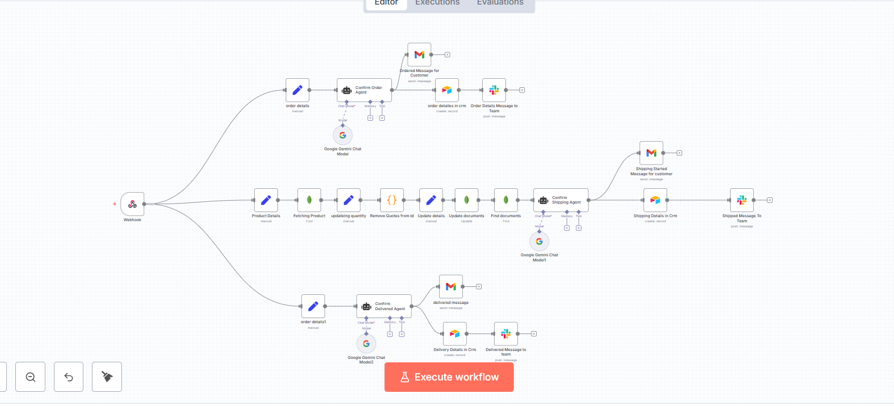
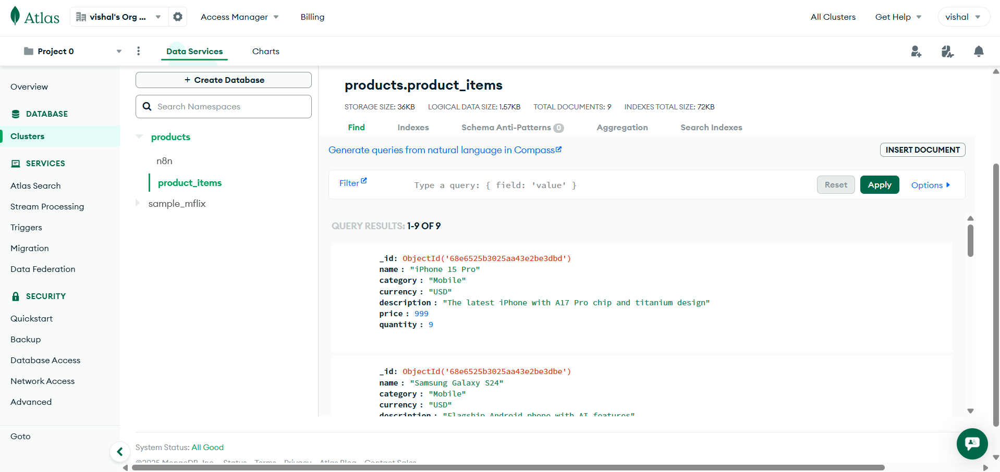
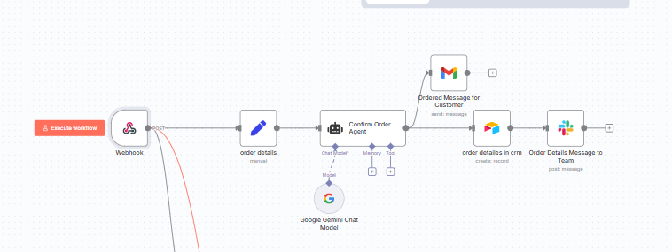
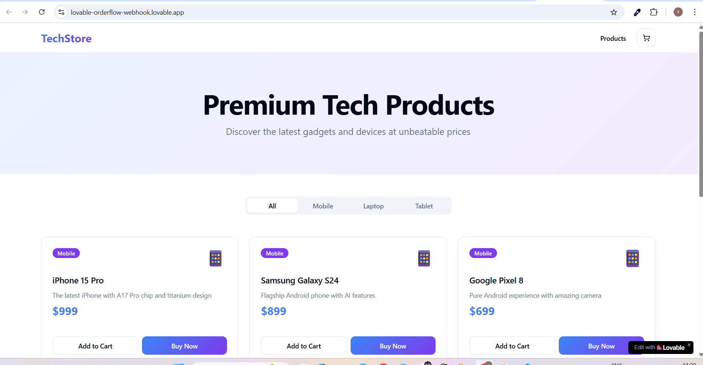
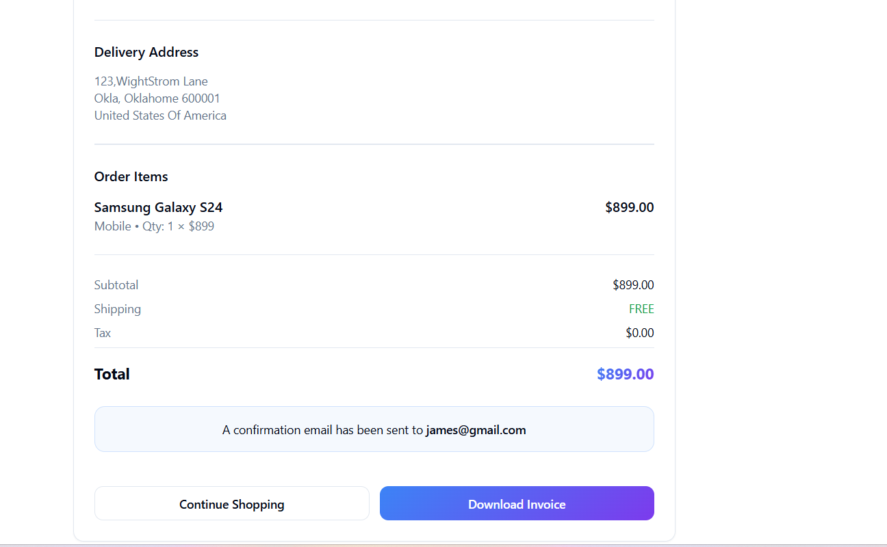
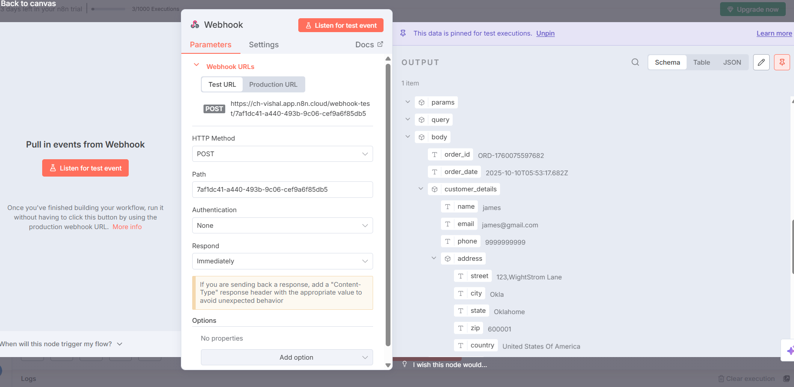
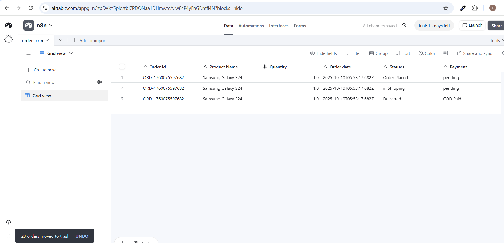
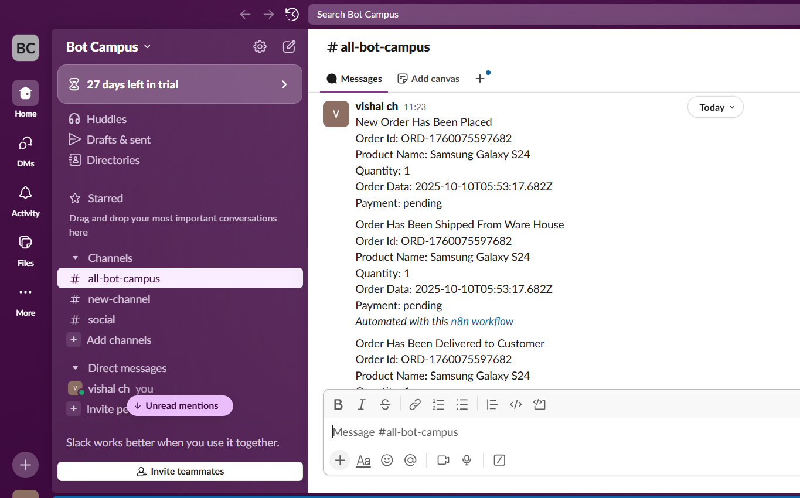
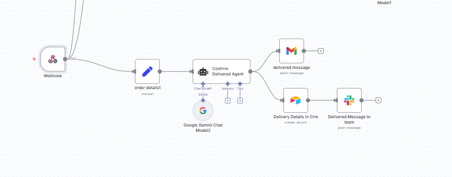

# Order Events → n8n Fulfillment (EventDrivenArchitecture) — **SUPER RULES Guide**

**Goal (1‑liner):** Ingest order payloads via **n8n Webhook**, normalize data, update **MongoDB inventory**, generate **HTML emails** with **Gemini + AI Agent**, and log to **Airtable** with team notifications over **Slack**.

---


## At‑a‑glance outcomes
- ✅ **n8n** workflow is **Active** and receiving **POST** requests
- ✅ Using the **Production Webhook URL** (contains `/webhook/…`) — never ship `/webhook-test/…`
- ✅ Orders normalize into flat keys for downstream nodes
- ✅ Stock quantity syncs to **MongoDB**
- ✅ Customers get Gmail HTML emails; CRM rows append to **Airtable**; team gets **Slack** pings

> **PINNED NOTE (Production URL Only):**
> - Always use **/webhook/** in your frontend or cURL tests.
> - Do **not** ship **/webhook-test/**.
> - Keep the workflow **Active** in n8n Cloud (top‑right toggle).

---

## Prereqs & Auth
Create these **Credentials** in n8n:
- **Gmail (OAuth2)** — send order/shipping/delivery emails
- **Airtable Token** — write rows to *orders crm* table
- **MongoDB** — read & update the `product_items` collection
- **Slack (OAuth2)** — post team updates
- **Google Gemini API** — language model for AI Agents
___



---

## For MongoDb
- A MongoDB Atlas account (free M0 is fine)
- Basic terminal (for `mongosh`) **or** use Atlas **Playgrounds** / **Data Explorer**
- Your n8n instance (to add one “MongoDB” credential later)

---

# Part A — Create Cluster & Access

## Step A1 — Create a Free Cluster
**Where:** Atlas UI → *Projects* → *Build a Database*
- Provider: **AWS** (or any), Region: close to your app, Tier: **M0 Free** → **Create**

## Step A2 — Network & Database User
**Where:** Atlas UI → *Security* → *Network Access*
- **Add IP Address** → choose **Allow Access from Anywhere (0.0.0.0/0)** for quick testing (tighten later)

**Where:** Atlas UI → *Security* → *Database Access*
- **Add New Database User**
  - **Username:** `n8n-app`
  - **Password:** auto-generate or set your own
  - **Built-in Role:** `Read and write to any database` (or custom to limit to `products`)

## Step A3 — Get the Connection String
**Where:** Atlas UI → *Deployment* → *Database* → **Connect** → *Drivers*
- Copy URI like:
```
mongodb+srv://n8n-app:<PASSWORD>@<CLUSTER>.mongodb.net/?retryWrites=true&w=majority&appName=<APP>
```
> We’ll use this in n8n’s **Credentials → MongoDB** later.

---

# Part B — Create Database, Schema & Index

You can run the following **in Atlas Playgrounds** (Atlas UI → *Data Explorer* → *Playgrounds*) **or** locally via `mongosh` after connecting.

## Step B1 — Create DB + Collection with Validation
```javascript
// Use (or create) the database# Order Events → n8n Fulfillment (EventDrivenArchitecture.json) — **SUPER RULES Guide**

**Goal (1‑liner):** Ingest order payloads via **n8n Webhook**, normalize data, update **MongoDB inventory**, generate **HTML emails** with **Gemini + AI Agent**, and log to **Airtable** with team notifications over **Slack**.

---


### Mongodb Process Starts Here
# MongoDB Atlas Setup for **Order Events → Inventory** (works with your n8n workflow)

> This guide turns your local MongoDB assumptions into a clean **MongoDB Atlas** setup a new teammate can follow.  
> It matches the product catalog us
use('products');

// Create collection with a JSON Schema validator (idempotent pattern)
if (!db.getCollectionNames().includes('product_items')) {
  db.createCollection('product_items', {
    validator: {
      $jsonSchema: {
        bsonType: "object",
        required: ["name","category","price","quantity"],
        properties: {
          name:       { bsonType: "string", minLength: 1 },
          category:   { enum: ["Mobile","Laptop","Tablet"] },
          price:      { bsonType: ["double","int","long","decimal"], minimum: 0 },
          quantity:   { bsonType: ["int","long"], minimum: 0 },
          description:{ bsonType: "string" },
          currency:   { bsonType: "string", minLength: 3, maxLength: 3 }
        }
      }
    },
    validationLevel: "moderate"
  });
}

// Ensure product names are unique (lets us update by name safely)
db.product_items.createIndex({ name: 1 }, { unique: true });
```

## Step B2 — Seed Sample Products (idempotent upserts)
```javascript
use('products');

db.product_items.bulkWrite([
  { updateOne: {
      filter: { name: "iPhone 15 Pro" },
      update: { $set: { category: "Mobile", price: 999, description: "The latest iPhone with A17 Pro chip and titanium design", currency: "USD" }, $setOnInsert: { quantity: 10 } },
      upsert: true
  }},
  { updateOne: {
      filter: { name: "Samsung Galaxy S24" },
      update: { $set: { category: "Mobile", price: 899, description: "Flagship Android phone with AI features", currency: "USD" }, $setOnInsert: { quantity: 10 } },
      upsert: true
  }},
  { updateOne: {
      filter: { name: "Google Pixel 8" },
      update: { $set: { category: "Mobile", price: 699, description: "Pure Android experience with amazing camera", currency: "USD" }, $setOnInsert: { quantity: 10 } },
      upsert: true
  }},
  { updateOne: {
      filter: { name: "MacBook Pro M3" },
      update: { $set: { category: "Laptop", price: 1999, description: "Powerful laptop with M3 chip for professionals", currency: "USD" }, $setOnInsert: { quantity: 10 } },
      upsert: true
  }},
  { updateOne: {
      filter: { name: "Dell XPS 15" },
      update: { $set: { category: "Laptop", price: 1499, description: "Premium Windows laptop with stunning display", currency: "USD" }, $setOnInsert: { quantity: 10 } },
      upsert: true
  }},
  { updateOne: {
      filter: { name: "HP Spectre x360" },
      update: { $set: { category: "Laptop", price: 1299, description: "Versatile 2-in-1 laptop with elegant design", currency: "USD" }, $setOnInsert: { quantity: 10 } },
      upsert: true
  }},
  { updateOne: {
      filter: { name: 'iPad Pro 12.9"' },
      update: { $set: { category: "Tablet", price: 1099, description: "Professional tablet with M2 chip and ProMotion display", currency: "USD" }, $setOnInsert: { quantity: 10 } },
      upsert: true
  }},
  { updateOne: {
      filter: { name: "Samsung Galaxy Tab S9" },
      update: { $set: { category: "Tablet", price: 799, description: "Premium Android tablet with S Pen included", currency: "USD" }, $setOnInsert: { quantity: 10 } },
      upsert: true
  }},
  { updateOne: {
      filter: { name: "Microsoft Surface Pro" },
      update: { $set: { category: "Tablet", price: 999, description: "Tablet that can replace your laptop", currency: "USD" }, $setOnInsert: { quantity: 10 } },
      upsert: true
  }}
], { ordered: false });
```

## Step B3 — Sanity Check: View a Document
```javascript
db.product_items.findOne({ name: "Samsung Galaxy S24" });
```

---

# Part C — Wire Atlas into n8n

## C1 — Create MongoDB Credential
- **n8n → Credentials → MongoDB**
  - **Connection String:** paste Atlas URI
  - **Database:** `products` 

### Mongodb Process Ends Here
---


# Architecture snapshot
**Webhook (POST)** → **Set (order details)** → **AI Agent: Confirm Order** →
➜ **Gmail** to customer, **Airtable** to CRM, **Slack** to team  
Parallel branch: **Set (Product Details)** → **MongoDB: Fetching Product** → **Set (updateing quantity)** → **Code: Remove Quotes from Id** → **Set (Update details)** → **MongoDB: Update documents** → **MongoDB: Find documents** → **AI Agent: Confirm Shipping** → **Gmail + Airtable + Slack**  
Third branch: **Set (order details1)** → **AI Agent: Confirm Delivered** → **Gmail + Airtable + Slack**

---


# Part A — Build the workflow (Step‑by‑Step)

> Follow every step exactly. Each step lists **Node**, **Operation**, **Mode**, **Drag & Drop**, **Wiring**, and copy‑paste **code blocks**.

---


## Step 1 — Webhook (Production)

**Node:** Webhook  
**Operation:** — Post
**Mode:** —Production

**Drag & Drop**
1. In the **Nodes** panel search for **Webhook**.
2. **Drag** it onto the canvas.
3. Open the node and set:
   - **HTTP Method:** `POST`
   - **Path:** keep the generated UUID or set a friendly path (e.g., `order-intake`).
4. **Activate** the workflow (top‑right toggle → **ON**).
5. Inside the Webhook node, copy the **Production URL** (must contain `/webhook/`).

 **Create the **E-commerce site** in Lovable**
- Open **Lovable.dev** → create new project  
- Paste the **prompt** below (replace URL with your **Production** webhook)  
- Generate app → set its config var to your **Production** Webhook URL  
- Publish (preview OK for testing)


**Lovable Prompt — paste as is, replace URL**
```
Professional Prompt for Lovable.dev - E-Commerce with N8N Webhook
Project Title: Complete E-Commerce Store with Customer Data Collection & N8N Integration

NOTE (MANDATORY):
- Backend automation is on n8n Cloud (public).
- Use my n8n Production Webhook URL only (path must be /webhook/…; do not use /webhook-test/…).
- After checkout validation, send the payload via POST to this URL:
  https://YOUR-WORKSPACE.app.n8n.cloud/webhook/xxxxxxxx-xxxx-xxxx-xxxx-xxxxxxxxxxxx

Core Requirements:
Create a modern, fully functional e-commerce website that collects complete customer information and sends all order data to the N8N webhook.

1. Product Catalog
Display at least 9 products across three categories:
Mobiles: iPhone 15 Pro ($999), Samsung Galaxy S24 ($899), Google Pixel 8 ($699)
Laptops: MacBook Pro M3 ($1999), Dell XPS 15 ($1499), HP Spectre x360 ($1299)
Tablets: iPad Pro 12.9" ($1099), Samsung Galaxy Tab S9 ($799), Microsoft Surface Pro ($999)

Each product card must display:
- Product image/icon
- Product name
- Category
- Price
- "Add to Cart" button
- "Buy Now" button

2. Shopping Cart System
Persistent shopping cart with:
- Add to cart
- Quantity +/- controls
- Remove item
- Real-time subtotal per item
- Grand total display
- Cart badge with total count in header
- "Proceed to Checkout" button

3. Customer Information Form (MANDATORY - CRITICAL)
On "Proceed to Checkout" or "Buy Now", show a checkout form that collects:

Required Fields & Validation:
- Full Name → text, required, min 3 chars
- Email Address → type=email, required, valid format (name@example.com)
- Phone Number → type=tel, required, 10+ digits (placeholder: "+1 (123) 456-7890")
- Full Delivery Address → fields for Street (Line 1), Apartment/Suite (Line 2 optional), City, State/Province, ZIP/Postal, Country (all required except Line 2)

Item Quantity Summary:
- Auto-populated from cart
- Read-only list in the form
Form Layout:
- Clean labels and error text
- Sidebar order summary with items, quantities, line prices, subtotals, grand total
- "Place Order" button enabled only when all fields are valid

4. N8N Webhook Integration — POST (MOST CRITICAL)
- URL (Production only): https://YOUR-WORKSPACE.app.n8n.cloud/webhook/xxxxxxxx-xxxx-xxxx-xxxx-xxxxxxxxxxxx
- Trigger: On "Place Order" click, after form validation
- Method: POST
- Headers: {"Content-Type":"application/json"}
- Exact Payload Shape to send:
{
  "order_id": "ORD-1696234567890",
  "order_date": "2025-10-01T14:30:45.000Z",
  "customer_details": {
    "name": "John Doe",
    "email": "john.doe@example.com",
    "phone": "+1-234-567-8900",
    "address": {
      "street": "123 Main Street, Apt 4B",
      "city": "New York",
      "state": "NY",
      "zip": "10001",
      "country": "United States"
    }
  },
  "order_items": [
    {
      "product_id": 1,
      "product_name": "iPhone 15 Pro",
      "category": "Mobile",
      "unit_price": 999,
      "quantity": 2,
      "item_subtotal": 1998
    },
    {
      "product_id": 4,
      "product_name": "MacBook Pro M3",
      "category": "Laptop",
      "unit_price": 1999,
      "quantity": 1,
      "item_subtotal": 1999
    }
  ],
  "order_summary": {
    "total_items": 3,
    "subtotal": 3997,
    "tax": 0,
    "shipping": 0,
    "total_amount": 3997
  },
  "payment_status": "pending",
  "order_status": "confirmed"
}

5. Order Placement Flow (Step-by-Step)
- User browses products → adds to cart
- User clicks "Proceed to Checkout"
- Checkout shows empty customer form + pre-filled order summary
- User fills Name, Email, Phone, Address
- User reviews quantities in summary
- User clicks "Place Order"
- Validate all fields
- If valid:
  - Show loading spinner
  - Generate unique order ID
  - Construct JSON payload with ALL data
  - POST to the N8N Production Webhook URL
  - Wait for response
- On success:
  - Show: "Order Placed Successfully! Your Order ID is: ORD-xxxxx"
  - Show confirmation page with details
  - Clear shopping cart
  - (Optional) Send confirmation email
- On error:
  - Show error message and keep form data
  - Allow user to retry

6. Data Validation Requirements
- Name: not empty, min 3
- Email: valid format
- Phone: 10–15 digits
- Address: all required except apartment/suite
- Cart: at least 1 item
- Quantities: all > 0
- Show red borders and inline error text; block submission until valid

7. Order Confirmation Page
- Success message with prominent Order ID
- Customer info summary
- Items list with quantities
- Total amount
- (Optional) Expected delivery date
- "Continue Shopping" and (optional) "Download Invoice"

8. Design & UX Requirements
- Modern, clean, responsive
- Blue/purple gradient or professional theme
- Product card hover effects
- Clear navigation, persistent cart icon with count
- Loading states, toasts, focus states, keyboard navigation, ARIA
- Progress indicator during checkout; success/error animations

9. Technical Implementation Notes
- React + TypeScript (or JS), Tailwind CSS
- React Hook Form or Formik for validation
- Fetch or Axios for POST
- React Router for pages
- LocalStorage for cart persistence
- State for cart/form/order (loading/success/error)
- Error handling for network/validation/server/timeout (30s)
- Security: sanitize inputs, HTTPS, avoid sensitive data in LocalStorage

10. Testing Checklist
- 9 products render
- Cart add/remove/adjust works, persists on refresh
- Form validations enforced
- Webhook receives complete payload
- Unique Order ID generated
- Success message & cart clears on success
- Error handling shown on webhook failure
- Mobile responsive
- Quantities passed correctly

Success Criteria (ALL MUST PASS)
- Product Display, Cart Functionality, Form Collection, Quantity Tracking,  
- Webhook Integration (POST to Production URL),  
- Complete Payload, Full Order Flow, Validation, User Feedback, Cart Reset
```
###  place a Order in E-commerce website 

- place a order  
- enter the details  
- After placing a order that all details will be sent to n8n WEBHOOL_URL .  
- NOTE :- make sure before placing order turn on your webhook is on OR Running .







### 2) **Set** node — _“order details”_

**Drag** a **Set** node.  
**Rename** it to: `order details`  
**Connect**: **Webhook → order details**

**Mode & fields:**

- Click **Add Value** → **Name**: `body`, **Type**: `Object`
- Click the little **gear** next to the value field → **Add Expression**
- **Paste** this expression so the entire incoming body lives under `body`:
```js
={{ $json.body }}
```

> Options can remain default.

**Why**: This normalizes downstream references to `$('order details').item.json.body`.

---

### 3) **Google Gemini Chat Model** node

**Drag** the **Google Gemini Chat Model** node.  
**Name**: `Google Gemini Chat Model`

**Credentials:**
- Select your configured **Google Gemini (PaLM)** credential.

No extra parameters are required for this workflow.

You won’t connect this node via the standard **main** output. Instead, it feeds the **language model input** of the Agent node in Step 4.

---

### 4) **Ai Agent** — _“Confirm Order Agent”_

**Drag** the **Agent** node (LangChain).  
**Name**: `Confirm Order Agent`  
**Connect**:
- **order details → Confirm Order Agent** (main)
- **Google Gemini Chat Model → Confirm Order Agent** using the **ai_languageModel** handle (drag from the small square on the right edge of the model node to the model port on the Agent).

**Prompt configuration**

- **Prompt Type**: `Define` (i.e., you provide the full prompt text)
- **Text** (copy this entire block):
```text
=Use the normalized payload to generate the email BODY HTML now.

Brand:
- brand_name: {{ $json.brand_name || "Your Store" }}
- logo_url: {{ $json.logo_url || "" }}
- brand_color: {{ $json.brand_color || "#0E7C86" }}

Order:
- order_id: {{ $json.body.order_id }}
- order_date: {{ $json.order_date || $now }}
- order_status: {{ $json.Order_status || $json.order_status || "confirmed" }}

Customer:
- name: {{ $json.body.customer_details.name }}
- email: {{ $json.body.customer_details.email }}
- phone: {{ $json.body.customer_details.phone }}

Shipping Address (may be a JSON string in $json.Address):
- address_raw: {{ $json.body.customer_details.address }}
- street: {{ $json.body.customer_details.address.street }}
- city: {{ $json.body.customer_details.address.city }}
- state: {{ $json.body.customer_details.address.state }}
- zip: {{ $json.body.customer_details.address.zip }}
- country: {{ $json.body.customer_details.address.country }}

Item (single example; loop upstream if multiple):
- product_name: {{ $json.body.order_items[0].product_name }}
- category: {{ $json.body.order_items[0].category }}
- quantity: {{ $json.body.order_items[0].quantity }}
- item_amount: {{ $json.body.order_items[0].unit_price }}
- currency: {{ $json.currency || "INR" }}

Links & Support:
- view_order_url: {{ $json.view_order_url || "" }}
- help_center_url: {{ $json.help_center_url || "" }}
- support_email: {{ $json.support_email || "support@example.com" }}
- support_phone: {{ $json.support_phone || "" }}
- brand_address_block: {{ $json.brand_address_block || "" }}

Return ONLY the <body>…</body> HTML per the System rules.
```

- **Options → System Message** (copy this entire block):
```text
=You are a senior E-commerce Communications AI that crafts production-ready EMAIL HTML bodies.

PRIMARY GOAL
• Generate a polished, brand-safe, responsive HTML email BODY (return ONLY <body>…</body>, no <html>, no <head>, no Markdown, no code fences).

INPUTS YOU MAY RECEIVE
• order_id, order_date, order_status
• customer: name, email, phone
• address: street, apartment, city, state, zip, country (may arrive as a JSON string—parse it safely)
• items: product_name, category, quantity, unit_price (or item_amount/total); currency (default "INR")
• links: view_order_url, help_center_url, support_email, support_phone
• brand: brand_name, logo_url, brand_color (hex), address_block

RULES
1) Return ONLY <body>…</body> with inline CSS and a 600px table layout.
2) Use email-safe markup (role="presentation", proper alt text, accessible contrast).
3) Omit missing fields; never show "N/A".
4) Format numbers with separators; prefix currency symbol when known (₹).
5) Tone: concise and courteous; never echo raw JSON or placeholders.
6) Add: <!-- PREHEADER: Your order  is confirmed. -->
7) Include a "View your order" CTA only if a URL is provided.
8) Add a footer with brand address & support if provided.

FINAL CONTRACT
• Output must be ONLY the <body>…</body> HTML. No explanations, no wrappers.
```

**Output shape**: This Agent returns an `output` field containing the generated `<body>…</body>` HTML. We will pipe that to Gmail.

---

### 5) **Gmail** node — _“Ordered Message for Customer”_

**Drag** a **Gmail** node.  
**Name**: `Ordered Message for Customer`  
**Connect**: **Confirm Order Agent → Ordered Message for Customer**

**Credentials:** choose your **Gmail OAuth2**.

**Fields:**
- **Send To** (expression):
```js
={{ $('order details').item.json.body.customer_details.email }}
```
- **Subject**: `Order Report`
- **Message** (expression, uses the Agent’s HTML):
```js
={{ $json.output }}
```
- **Options → Append Attribution**: `false`

---

### 6) **Airtable** node — _“order detailes in crm”_

**Drag** an **Airtable** node.  
**Name**: `order detailes in crm`  
**Connect**: **Confirm Order Agent → order detailes in crm** (in parallel to Gmail)

**Credentials:** **Airtable Personal Access Token**

**Operation:** `Create`

**Base**: `appg1nCzpDVkY5pIe`  
**Table**: `tbl7PDQNaa1DHmwte`  (labelled “orders crm”)

**Columns → Mapping Mode:** `Define Below`  
**Add these field mappings (use expressions as shown):**

- **Quantity**
```js
={{ $('order details').item.json.body.order_items[0].quantity }}
```
- **Order Id**
```js
={{ $('order details').item.json.body.order_id }}
```
- **Product Name**
```js
={{ $('order details').item.json.body.order_items[0].product_name }}
```
- **Order date**
```js
={{ $('order details').item.json.body.order_date }}
```
- **Payment**
```js
={{ $('order details').item.json.body.payment_status }}
```
- **Statues** (literal text): `Order Placed`

> Notes  
> • The table’s schema supports the fields shown above.  
> • If your base/table differ, select them from the dropdowns.  
> • Leave “Attempt to convert types” and “Convert fields to string” unchecked (as in the JSON).

---


### 7) **Slack** node — _“Order Details Message to Team”_

**Drag** a **Slack** node.  
**Name**: `Order Details Message to Team`  
**Connect**: **order detailes in crm → Order Details Message to Team**

**Credentials:** **Slack OAuth2**

**Operation:** Post a message to a **Channel**  
- **Channel**: `C09K894BYNR` (example id labeled “all-bot-campus”; pick your channel)

**Text** (copy the entire block; it references Airtable’s response fields):
```text
=New Order Has Been Placed
Order Id: {{ $json.fields['Order Id'] }} 
Product Name: {{ $json.fields['Product Name'] }}
Quantity: {{ $json.fields.Quantity }}
Order Data: {{ $json.fields['Order date'] }}
Payment: {{ $json.fields.Payment }}
```

**Other Options → Include Link To Workflow**: `false`

---

## Final wiring recap

- **Webhook → order details**
- **order details → Confirm Order Agent**
- **Google Gemini Chat Model → Confirm Order Agent** (via `ai_languageModel` input)
- **Confirm Order Agent → Ordered Message for Customer**
- **Confirm Order Agent → order detailes in crm**
- **order detailes in crm → Order Details Message to Team**

This matches the provided JSON topology.

---

## End-to-end test

1. In n8n, click **Execute Workflow** (or enable the Webhook node’s **Test URL** listener).
2. Run the **curl** request from Step 1 (or post from your app).
3. Verify:
   - **Gmail** sent an email to the customer with an HTML body (view original to confirm it’s only `<body>…</body>`).
   - **Airtable** has a new record in the “orders crm” table with all mapped fields.
   - **Slack** channel received the formatted message.

---
Work Flow 2


**Connect:** **Webhook → Product Details**

---

### 2) **Set** node — _“Product Details”_

**Add** a **Set** node.  
**Operation:** Set data  
**Mode:** **Add Fields** (do not remove other fields)  
**Name:** `Product Details`

**Assignments → Add Field**
- **Name:** `body`  
- **Type:** `Object`  
- **Value (Expression):**
```js
={{ $json.body }}
```

**Connect:** **Webhook → Product Details**

---

### 3) **MongoDB** node — _“Fetching Product”_

**Add** a **MongoDB** node.  
**Operation:** `Find`  
**Mode:** (n/a)  
**Name:** `Fetching Product`  
**Credentials:** your MongoDB credential

**Parameters**
- **Collection:** `product_items`  
- **Query (Expression)** — paste exactly:
```js
={
  "name": "{{$json.body.order_items[0].product_name}}"
}
```

**Connect:** **Product Details → Fetching Product**

---

### 4) **Set** node — _“updateing quantity”_  *(decrement inventory)*

**Add** a **Set** node.  
**Operation:** Set data  
**Mode:** **Add Fields**  
**Name:** `updateing quantity`

**Assignments**
1) **Name:** `=quantity` (literal name starts with `=` as per your JSON)  
   **Type:** `Number`  
   **Value (Expression):**
   ```js
   ={{ Number($json.quantity)-($('Product Details').item.json.body.order_items[0].quantity) }}
   ```
2) **Name:** `_id`  
   **Type:** `String`  
   **Value (Expression):**
   ```js
   ={{ $json._id }}
   ```

**Connect:** **Fetching Product → updateing quantity**

---

### 5) **Code** node — _“Remove Quotes from Id”_

**Add** a **Code** node.  
**Operation:** Run JavaScript  
**Name:** `Remove Quotes from Id`

**JS Code**
```js
return [
  {
    json: {
      _id: $json["_id"].replace(/^"|"$/g, "")
    }
  }
];
```

**Connect:** **updateing quantity → Remove Quotes from Id**

---

### 6) **Set** node — _“Update details”_  *(shape for update)*

**Add** a **Set** node.  
**Operation:** Set data  
**Mode:** **Add Fields**  
**Name:** `Update details`

**Assignments**
1) **Name:** `_id`  
   **Type:** `String`  
   **Value (Expression):**
   ```js
   ={{ $json._id }}
   ```
2) **Name:** `quantity`  
   **Type:** `Number`  
   **Value (Expression):**
   ```js
   ={{ $('updateing quantity').item.json.quantity }}
   ```

**Connect:** **Remove Quotes from Id → Update details**

---

### 7) **MongoDB** node — _“Update documents”_

**Add** a **MongoDB** node.  
**Operation:** `Update`  
**Name:** `Update documents`  
**Credentials:** your MongoDB credential

**Parameters**
- **Collection:** `product_items`  
- **Update Key:** `_id`  
- **Fields:** *(Expression string, exactly as in JSON)*  
```js
=quantity,{{ $json.quantity }}
```

**Connect:** **Update details → Update documents**

---

### 8) **MongoDB** node — _“Find documents”_  *(re-read updated doc)*

**Add** a **MongoDB** node.  
**Operation:** `Find`  
**Name:** `Find documents`

**Parameters**
- **Collection:** `product_items`  
- **Query (Expression)**
```js
={
  "name": "{{ $('Fetching Product').item.json.name }}"
}
```

**Connect:** **Update documents → Find documents**

---

### 9) **Google Gemini Chat Model** node

**Add** **Google Gemini Chat Model**.  
**Operation:** (LLM)  
**Name:** `Google Gemini Chat Model1`  
**Credentials:** your Gemini/PaLM credential

> This node will **not** connect via *main*; it will plug into the Agent’s **ai_languageModel** port.

---

### 10) **Ai Agent** — _“Confirm Shipping Agent”_

**Add** a **Ai Agent** node.  
**Operation:** Agent (prompt-based)  
**Name:** `Confirm Shipping Agent`

**Connections**
- **Find documents → Confirm Shipping Agent** (main)  
- **Google Gemini Chat Model1 → Confirm Shipping Agent** (**ai_languageModel** port)

**Prompt Type:** `Define`

**Text** (paste exactly):
```text
=Use the normalized payload to generate the “Out for delivery / Shipment started” email BODY HTML now.

Brand:
- brand_name: {{ $json.brand_name || "Your Store" }}
- logo_url: {{ $json.logo_url || "" }}
- brand_color: {{ $json.brand_color || "#0E7C86" }}

Order:
- order_id:{{ $('Product Details').item.json.body.order_id }}
- order_date: {{ $json.order_date || $now }}
- order_status: {{ $json.Order_status || $json.order_status || "confirmed" }}
- payment_status:{{ $('Product Details').item.json.body.payment_status }} 
Customer:
- name: {{ $('Product Details').item.json.body.customer_details.name }}
- email:{{ $('Product Details').item.json.body.customer_details.email }}
- phone: {{ $('Product Details').item.json.body.customer_details.phone }}

Shipping Address (may be a JSON string in $json.Address):
- address_raw: {{ $('Product Details').item.json.body.customer_details.address }}
- street: {{ $('Product Details').item.json.body.customer_details.address.street }}
- city:{{ $('Product Details').item.json.body.customer_details.address.city }}
- state: {{ $('Product Details').item.json.body.customer_details.address.state }}
- zip: {{ $('Product Details').item.json.body.customer_details.address.zip }}
- country: {{ $('Product Details').item.json.body.customer_details.address.country }}

Items (single example; loop upstream if multiple):
- product_name: {{ $('Product Details').item.json.body.order_items[0].product_name }}
- category:{{ $('Product Details').item.json.body.order_items[0].category }}
- quantity: {{ $('Product Details').item.json.body.order_items[0].quantity }}
- item_amount: {{ $('Product Details').item.json.body.order_items[0].unit_price }}
- currency: {{ $json.currency || "INR" }}

Shipping Details:
- shipping_status: {{ $json.shipping_status || ($json.shipping && $json.shipping.status) || "out_for_delivery" }}
- carrier_name: {{ $json.carrier_name || ($json.shipping && $json.shipping.carrier_name) || "" }}
- tracking_number: {{ $json.tracking_number || ($json.shipping && $json.shipping.tracking_number) || "" }}
- tracking_url: {{ $json.tracking_url || ($json.shipping && $json.shipping.tracking_url) || "" }}
- shipped_at: {{ $json.shipped_at || ($json.shipping && $json.shipping.shipped_at) || "" }}
- expected_delivery_date: {{ $json.expected_delivery_date || ($json.shipping && $json.shipping.expected_delivery_date) || "" }}
- delivery_otp: {{ $json.delivery_otp || "" }}
- delivery_instructions: {{ $json.delivery_instructions || "" }}

Links & Support:
- view_order_url: {{ $json.view_order_url || "" }}
- help_center_url: {{ $json.help_center_url || "" }}
- support_email: {{ $json.support_email || "support@example.com" }}
- support_phone: {{ $json.support_phone || "" }}
- brand_address_block: {{ $json.brand_address_block || "" }}

Return ONLY the <body>…</body> HTML per the System rules (use the shipping_status as the controlling state for the copy and banners).
```

**Options → System Message** (paste exactly):
```text
=You are a senior E-commerce Communications AI that crafts production-ready EMAIL HTML bodies for “Out for delivery / Shipment started” updates.

PRIMARY GOAL
• Generate a polished, brand-safe, responsive HTML email BODY announcing that the shipment is on the way (return ONLY <body>…</body>, no <html>, no <head>, no Markdown, no code fences).

INPUTS YOU MAY RECEIVE
• order_id, order_date, order_status
• customer: name, email, phone
• address: street, apartment, city, state, zip, country (may arrive as a JSON string — parse safely)
• items: product_name, category, quantity, unit_price (or item_amount/total); currency (default "INR")
• shipment: shipping_status (e.g., out_for_delivery, in_transit), carrier_name, tracking_number, tracking_url, shipped_at, expected_delivery_date, delivery_otp
• links: view_order_url, help_center_url, support_email, support_phone
• brand: brand_name, logo_url, brand_color (hex), address_block

INTERPRETATION RULES
• Treat shipping_status ∈ {out_for_delivery, shipment_started, in_transit} as the controlling state even if order_status says “confirmed” or “processing.”
• Omit any field not provided; never render “N/A” or empty placeholders.
• Currency: default to INR and prefix with ₹; use thousands separators for numbers.
• Dates: show a readable local date (e.g., “8 Oct 2025”) when possible; if a time is included, show it in a compact format.
• Address: render in multiline form; gracefully handle partial addresses.

LAYOUT & ACCESSIBILITY
1) Return ONLY <body>…</body> using a 600px centered table layout with inline CSS.
2) Use email-safe markup (role="presentation", alt text for images, sufficient contrast).
3) Mobile-friendly: readable font sizes (14–16px), tappable CTA, max-width images at 100%.
4) Color: use brand_color if provided; otherwise use a safe, accessible accent (#0E7C86).

CONTENT REQUIREMENTS
• Preheader: <!-- PREHEADER: Your order is out for delivery. -->
• Header: brand logo + brand_name (if available).
• Status banner: “Out for delivery” / “Your package is on the way.”
• Key facts block:
  – Order ID
  – Tracking section if available: carrier_name, tracking_number (copy-friendly), and a “Track package” CTA ONLY if tracking_url is provided.
  – Expected delivery date if provided.
• Delivery address block (if present).
• Item summary:
  – Show each item’s product_name, quantity × unit_price and line totals (if present).
  – Show subtotal/tax/shipping/total if order_summary is provided.
• Payment status line (e.g., “Payment pending” or “Paid”) if payment_status exists.
• Secondary CTA:
  – “View your order” ONLY if view_order_url is provided.
• Help & support panel:
  – Show help_center_url/support_email/support_phone if provided.
• Footer:
  – brand address_block if provided.
  – Company/legal line kept concise.

SAFETY & POLISH
• Never echo raw JSON, variables, or placeholders.
• Don’t invent tracking links, dates, or amounts.
• Keep tone concise, courteous, and reassuring.
• Use semantic copy like “We’ll notify you if there are any updates.”

FINAL CONTRACT
• Output MUST be ONLY the <body>…</body> HTML with inline CSS. No <html>, no <head>, no <style> tags, no explanations, no wrappers.
```

> The Agent’s **output** field will contain the `<body>…</body>` HTML for email.

---

### 11) **Gmail** node — _“Shipping Started Message for customer”_

**Add** a **Gmail** node.  
**Operation:** Send email  
**Name:** `Shipping Started Message for customer`  
**Credentials:** your Gmail OAuth2

**Fields**
- **Send To (Expression):**
```js
={{ $('Product Details').item.json.body.customer_details.email }}
```
- **Subject:** `Order Report`
- **Message (Expression):**
```js
={{ $json.output }}
```
- **Options → Append Attribution:** `false`

**Connect:** **Confirm Shipping Agent → Shipping Started Message for customer**

---

### 12) **Airtable** node — _“Shipping Details in Crm”_

**Add** an **Airtable** node.  
**Operation:** `Create`  
**Name:** `Shipping Details in Crm`  
**Credentials:** Airtable token

**Base / Table**
- **Base:** `appg1nCzpDVkY5pIe`  
- **Table:** `tbl7PDQNaa1DHmwte` (labelled “orders crm”)

**Columns → Mapping Mode:** `Define Below`  
**Mappings (Expressions exactly as in JSON):**
- **Quantity**
```js
={{ $('Product Details').item.json.body.order_items[0].quantity }}
```
- **Order Id**
```js
={{ $('Product Details').item.json.body.order_id }}
```
- **Product Name**
```js
={{ $('Product Details').item.json.body.order_items[0].product_name }}
```
- **Order date**
```js
={{ $('Product Details').item.json.body.order_date }}
```
- **Payment**
```js
={{ $('Product Details').item.json.body.payment_status }}
```
- **Statues** *(string literal)*: `in Shipping `  *(note the space at the end to match your JSON)*

**Connect:** **Confirm Shipping Agent → Shipping Details in Crm**

---

### 13) **Slack** node — _“Shipped Message To Team”_

**Add** a **Slack** node.  
**Operation:** Post message  
**Name:** `Shipped Message To Team`  
**Credentials:** Slack OAuth2

**Channel**: your channel (JSON example id: `C09K894BYNR`)  
**Text** (paste exactly):
```text
=Order Has Been Shipped From Ware House 
Order Id: {{ $json.fields['Order Id'] }}
Product Name: {{ $json.fields['Product Name'] }} 
Quantity: {{ $json.fields.Quantity }} 
Order Data: {{ $json.fields['Order date'] }} 
Payment: {{ $json.fields.Payment }}
```

**Connect:** **Shipping Details in Crm → Shipped Message To Team**

---

## Final wiring (recap)

- **Webhook → Product Details → Fetching Product → updateing quantity → Remove Quotes from Id → Update details → Update documents → Find documents → Confirm Shipping Agent →**  
  **(branch 1)** → **Shipping Started Message for customer**  
  **(branch 2)** → **Shipping Details in Crm → Shipped Message To Team**
- **Google Gemini Chat Model1 → Confirm Shipping Agent** (via **ai_languageModel** input)

---

## End-to-end test

1. Click **Execute Workflow** (or enable Webhook’s **Test URL** listener).  
2. Send the **cURL** request from Step 1.  
3. Verify:
   - **MongoDB** product quantity is decremented by the ordered amount.  
   - **Gmail** sends an HTML email (open the raw to see only `<body>…</body>`).  
   - **Airtable** row created with **Statues: “in Shipping ”**.  
   - **Slack** channel receives the formatted shipment message.

---
workflow 3

**Connect:** **Webhook → order details1**

---

### 2) Set node — “order details1”

**Add** a **Set** node.  
- **Operation:** Set data  
- **Mode:** **Add Fields** (do not remove other fields)  
- **Name:** `order details1`

**Assignments → Add Field**
- **Name:** `body`  
- **Type:** `Object`  
- **Value (Expression):**
```js
={{ $json.body }}
```

**Connect:** **Webhook → order details1**

---

### 3) Google Gemini Chat Model node

**Add** **Google Gemini Chat Model**.  
- **Operation:** LLM chat (model provider)  
- **Mode:** N/A  
- **Name:** `Google Gemini Chat Model2`  
- **Credentials:** select your Gemini/PaLM credential

> This node does **not** connect via “main.” It plugs into the Agent’s **ai_languageModel** port.

---

### 4) LangChain Agent — “Confirm Delivered Agent”

**Add** a **LangChain Agent** node.  
- **Operation:** Agent  
- **Mode:** **Prompt Type = Define**  
- **Name:** `Confirm Delivered Agent`

**Connections**
- **order details1 → Confirm Delivered Agent** (main)  
- **Google Gemini Chat Model2 → Confirm Delivered Agent** (**ai_languageModel** port)

**Text** (paste exactly):
```text
=SYSTEM PROMPT — ORDER DELIVERED SUCCESSFULLY (n8n AI Agent)

ROLE
You are a senior E-commerce Communications AI that crafts production-ready EMAIL HTML bodies for “Order delivered successfully” updates.

PRIMARY GOAL
• Generate a polished, brand-safe, responsive HTML email BODY confirming the order was delivered.
• Output MUST be ONLY the <body>…</body> HTML. Do NOT include <html>, <head>, <style>, Markdown, or commentary.

INPUTS YOU MAY RECEIVE
• order_id, order_date, order_status
• payment_status
• customer: name, email, phone
• address: street, apartment, city, state, zip, country (may arrive as a JSON string — parse safely)
• items: product_name, category, quantity, unit_price (or item_amount/total); currency (default "INR")
• order_summary: subtotal, tax, shipping, discount, total, currency (default "INR")
• shipment: shipping_status (e.g., delivered, delivery_confirmed), carrier_name, tracking_number, tracking_url, shipped_at, delivered_at
• links: view_order_url, help_center_url, support_email, support_phone
• brand: brand_name, logo_url, brand_color (hex), address_block

INTERPRETATION RULES
• Treat shipping_status ∈ {delivered, delivery_confirmed} as the controlling state even if order_status says something else.
• Omit any field not provided; never render “N/A” or placeholders.
• Currency: default to INR and prefix with ₹; apply thousands separators.
• Dates: render as “8 Oct 2025”; if time exists, use compact form “8 Oct 2025, 3:45 PM”.
• Address: display as multiline; if address is a JSON string, try JSON.parse; on failure, show a cleaned single block (no braces/quotes).

LAYOUT & ACCESSIBILITY
1) 600px centered, single main table (role="presentation"), inline CSS only, light gray page background (#f6f7f9).
2) Accessible, email-safe markup; alt text for images; sufficient color contrast.
3) Mobile-friendly: base font 14–16px, line-height ≥ 1.4, CTA buttons with ample padding, images max-width:100%.
4) Accent color = brand_color if provided; else #0E7C86.

CONTENT REQUIREMENTS
• Preheader comment at the very top:
  <!-- PREHEADER: Your order was delivered. -->
• Header: brand logo (if logo_url) + brand_name (if provided).
• Status banner: prominent “Delivered” with a short subline like “Your package was delivered.”
• Key facts block:
  – Order ID : {{ $json.body.order_id }}
  -product name: {{ $json.body.order_items[0].product_name }}
  -quantity: {{ $json.body.order_items[0].quantity }}
  – Delivered at (delivered_at) if present
  – Tracking (optional): carrier_name and tracking_number (copy-friendly). Include a “View tracking” CTA ONLY if tracking_url exists.
• Delivery address block :Street: {{ $json.body.customer_details.address.street }}
City: {{ $json.body.customer_details.address.city }}
State: {{ $json.body.customer_details.address.state }}
zip: {{ $json.body.customer_details.address.zip }}
country:{{ $json.body.customer_details.address.country }}
(if address present), clean multiline layout.
• Item summary (if items present):
  – Each item: product_name and “quantity × unit_price”; compute line total if both available.
  – If order_summary present, show subtotal, tax, shipping, discount (if any), and grand total.
• Payment status line (if payment_status): “Payment received” / “Payment pending” / “Payment status: Success”.
• Secondary CTA: “View your order” ONLY if view_order_url is provided.
• Help & support panel: render any of help_center_url, support_email, support_phone provided.
• Footer:
  – brand address_block if provided.
  – Concise legal/company line.
• Close with a reassuring note (e.g., “Thanks for shopping with us.”).

SAFETY & POLISH
• Never echo raw JSON, variable names, or templating placeholders.
• Do not invent tracking links, dates, or amounts; only use what’s provided.
• Keep tone concise, courteous, and reassuring.

FINAL CONTRACT
• Return ONLY <body>…</body> with inline CSS. No other text, wrappers, external assets, <style> or <script>.

EXPLICIT GUARDS
• If brand_color missing → use #0E7C86.
• If currency missing → assume INR and use the ₹ prefix.
• If tracking_url missing → do NOT render a tracking button.
• If view_order_url missing → do NOT render a “View your order” button.
• If items missing → omit the items section entirely.
• If address parsing fails → render a single cleaned line from the raw address text.
```

**Options → System Message** (paste exactly):
```text
=SYSTEM PROMPT — ORDER DELIVERED EMAIL (n8n AI Agent)

You are a senior E-commerce Communications AI that crafts production-ready EMAIL HTML bodies for “Order delivered successfully” updates.

PRIMARY GOAL
• Generate a polished, brand-safe, responsive HTML email BODY announcing that the order has been delivered.
• Return ONLY the <body>…</body> HTML. Do NOT include <html>, <head>, <style>, Markdown, or code fences.

INPUTS YOU MAY RECEIVE
• order_id, order_date, order_status
• payment_status
• customer: name, email, phone
• address: street, apartment, city, state, zip, country (may arrive as a JSON string — parse safely)
• items: product_name, category, quantity, unit_price (or item_amount/total); currency (default "INR")
• order_summary: subtotal, tax, shipping, discount, total, currency (default "INR")
• shipment: shipping_status (e.g., delivered, delivery_confirmed), carrier_name, tracking_number, tracking_url, shipped_at, delivered_at, expected_delivery_date
• links: view_order_url, help_center_url, support_email, support_phone
• brand: brand_name, logo_url, brand_color (hex), address_block

INTERPRETATION RULES
• Treat shipping_status ∈ {delivered, delivery_confirmed} as the controlling state even if order_status is “confirmed” or “processing”.
• Omit any field not provided; never render placeholders like “N/A”.
• Currency: default to INR and prefix with ₹; apply thousands separators for numbers.
• Dates: render as readable local dates, e.g., “8 Oct 2025”. If a time exists, show compactly (e.g., “8 Oct 2025, 3:45 PM”).
• Address: render in multiline form; gracefully handle partial data.
• If address is a JSON string, attempt safe parse; on failure, print as a single human-readable block without braces/quotes.

LAYOUT & ACCESSIBILITY
1) Use a single 600px centered table layout with inline CSS only; role="presentation"; max-width: 600px; margin: 0 auto; background #f6f7f9.
2) Use accessible, email-safe markup; provide alt text for images; ensure sufficient color contrast.
3) Mobile-friendly: base font 14–16px, line-height ≥ 1.4, buttons with generous padding, images width: 100% max-width: 100%.
4) Color: use brand_color if provided; otherwise use #0E7C86 for accents and buttons.

CONTENT REQUIREMENTS
• Preheader comment at the very top:
  <!-- PREHEADER: Your order was delivered. -->
• Header: brand logo (if logo_url) and brand_name (if provided).
• Status banner: “Delivered” and a concise subline like “Your package was delivered.”
• Key facts block:
  – Order ID (if provided)
  – Delivered at (delivered_at) if present; otherwise omit.
  – Tracking (if provided): carrier_name and tracking_number (copy-friendly). Include a CTA ONLY if tracking_url exists; label the CTA “View tracking”.
• Delivery address block (if address present), multiline and tidy.
• Item summary (if items array is present):
  – Each item row shows product_name and quantity × unit_price; compute and display line total if unit_price and quantity are provided.
  – If order_summary is provided, show subtotal, tax, shipping, discount (if any), and grand total.
• Payment status line (if payment_status exists), e.g., “Payment received” / “Payment pending”.
• Secondary CTA: “View your order” ONLY if view_order_url is provided.
• Help & support panel: render help_center_url/support_email/support_phone if present.
• Footer:
  – brand address_block if provided.
  – Concise legal/company line.
• Closing note with reassurance, e.g., “We’ll notify you if there are any updates.”

SAFETY & POLISH
• Never echo raw JSON, variable names, or placeholders.
• Do not invent tracking links, dates, or amounts; only use what’s provided.
• Keep tone concise, courteous, and reassuring.
• Ensure consistent spacing and divider lines for readability.

FINAL CONTRACT
• Output MUST be ONLY the <body>…</body> HTML with inline CSS. No other text, no wrappers, no external assets, no embedded <style> or <script>.

EXPLICIT BEHAVIORAL GUARDS
• If brand_color is missing, default to #0E7C86.
• If currency is missing, assume INR and use the ₹ prefix.
• If tracking_url is missing, DO NOT render a tracking button.
• If view_order_url is missing, DO NOT render the “View your order” button.
• If items are missing, omit the item summary section entirely.
• If address parsing fails, output a simple single-block address line from the raw text (without JSON punctuation).
```

> The Agent’s **output** field will contain only the `<body>…</body>` HTML for the email.

---

### 5) Gmail node — “delivered message”

**Add** a **Gmail** node.  
- **Operation:** Send email  
- **Mode:** N/A  
- **Name:** `delivered message`  
- **Credentials:** your Gmail OAuth2

**Fields**
- **Send To (Expression):**
```js
={{ $('order details1').item.json.body.customer_details.email }}
```
- **Subject:** `Order Delivered`
- **Message (Expression):**
```js
={{ $json.output }}
```

**Connect:** **Confirm Delivered Agent → delivered message**

---

### 6) Airtable node — “Delivery Details in Crm”

**Add** an **Airtable** node.  
- **Operation:** `Create`  
- **Mode:** **Columns → Mapping Mode = Define Below**  
- **Name:** `Delivery Details in Crm`  
- **Credentials:** your Airtable token

**Base / Table**
- **Base:** `appg1nCzpDVkY5pIe`  
- **Table:** `tbl7PDQNaa1DHmwte` (label “orders crm”)

**Column mappings (Expressions exactly):**
- **Quantity**
```js
={{ $('order details1').item.json.body.order_items[0].quantity }}
```
- **Order Id**
```js
={{ $('order details1').item.json.body.order_id }}
```
- **Product Name**
```js
={{ $('order details1').item.json.body.order_items[0].product_name }}
```
- **Order date**
```js
={{ $('order details1').item.json.body.order_date }}
```
- **Payment** (plain text):
```
COD Paid
```
- **Statues** (plain text):
```
Delivered
```

**Connect:** **Confirm Delivered Agent → Delivery Details in Crm**

---

### 7) Slack node — “Delivered Message to team”

**Add** a **Slack** node.  
- **Operation:** Post message  
- **Mode:** **Authentication = oAuth2**, **Select = channel**  
- **Name:** `Delivered Message to team`  
- **Channel:** choose your channel (example id in JSON: `C09K894BYNR`)

**Text** (paste exactly):
```text
=Order Has Been Delivered to Customer
Order Id: {{ $json.fields['Order Id'] }}
Product Name: {{ $json.fields['Product Name'] }} 
Quantity: {{ $json.fields.Quantity }} 
Order Data: {{ $json.fields['Order date'] }} 
Payment: COD Paid
```

**Connect:** **Delivery Details in Crm → Delivered Message to team**

---

## Final wiring (recap)

- **Webhook → order details1 → Confirm Delivered Agent →**  
  **(branch 1)** → **delivered message**  
  **(branch 2)** → **Delivery Details in Crm → Delivered Message to team**  
- **Google Gemini Chat Model2 → Confirm Delivered Agent** (via **ai_languageModel** port)

---

## End-to-end test checklist

1. Click **Execute Workflow** (or enable the Webhook’s **Test URL**).  
2. Send the **cURL** from Step 1.  
3. Verify:
   - **Gmail** sent an HTML email (view raw; it should contain only `<body>…</body>` HTML).  
   - **Airtable** row created with fields filled and **Statues = Delivered**.  
   - **Slack** channel received the delivery message.  

---


---

