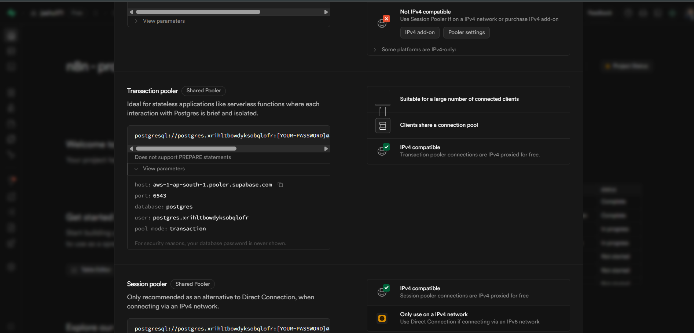
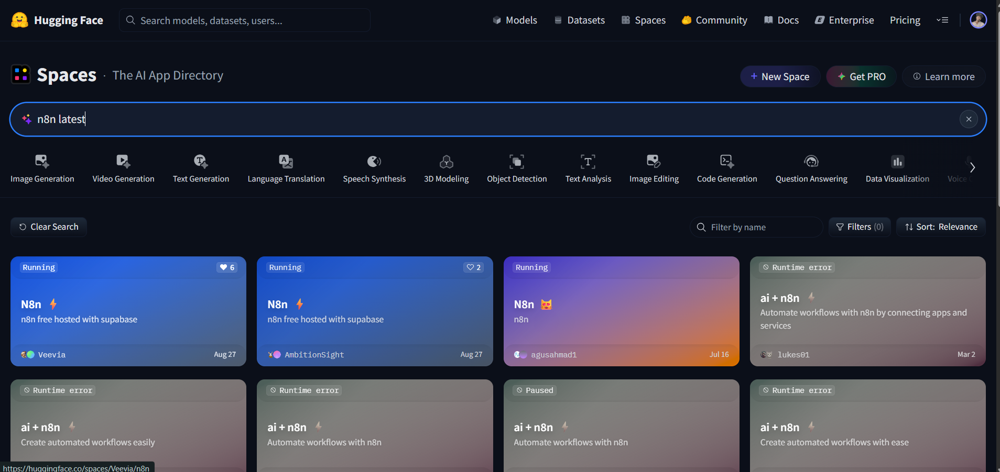

# n8n on Hugging Face Spaces (Docker) + Supabase Postgres — Workflow Steps Only

> Goal: start from **Supabase** (database) → deploy **n8n** on **Hugging Face Spaces (Docker SDK)** → get a live hosted URL like `https://<owner>-<space>.hf.space`.
> Key upgrade: **use the latest stable n8n** (default community templates are often pinned to older images).

---
### Video Guide

---

## 0) Quick Links (for reference)
- Supabase: https://supabase.com/
- Hugging Face Spaces: https://huggingface.co/spaces

---

## 1) Create Supabase Postgres (copy the connection values)
1. Open **Supabase - Supabase: https://supabase.com/ → New project** → choose org + project name → **Create**.
2. Go to **Project settings → Database → Connection string** and note:
   - **Host** (e.g., `db.<hash>.supabase.co`)
   - **Port** (`5432`)
   - **Database** (e.g., `postgres`)
   - **User** (e.g., `postgres`)
   - **Password** (generated on project creation)
3. Keep these for Space → **Settings → Variables**.

**Screenshot:**  


---

## 2) Create a new Hugging Face Space (Docker SDK)
- Hugging Face Spaces: https://huggingface.co/spaces
1. Go to **Hugging Face → Spaces → New Space**.
2. Choose **SDK = Docker**, **Hardware = CPU Basic**, **Visibility = Public** (or Private).
3. Name your space (e.g., `n8n`). Create it.

**Screenshot:**  


---

## 3) Add Space metadata (front‑matter)
Edit the Space `README.md` and add at the very top (required for Docker Spaces routing):
```yaml
---
title: n8n on Hugging Face Spaces
emoji: ⚙️
colorFrom: indigo
colorTo: indigo
sdk: docker
app_port: 7860
pinned: false
---
```

---

## 4) Choose ONE of these Dockerfile options

### Option A — **Recommended:** Official stable image (auto‑tracks stable releases)
Create `Dockerfile` in the Space repo with:
```dockerfile
# Always run the latest stable release of n8n
FROM n8nio/n8n:stable

# Required by Hugging Face Spaces
ENV N8N_PORT=7860
ENV N8N_PROTOCOL=https
ENV N8N_HOST=0.0.0.0

# Optional timezone (adjust as needed)
# ENV GENERIC_TIMEZONE=Asia/Kolkata

EXPOSE 7860
```
- **Benefit:** No manual Node/npm setup. You track **stable** automatically.

### Option B — **Manual pin** via Node + npm (old pattern, but sometimes requested)
Create `Dockerfile` with Node and global install of a **specific** n8n version:
```dockerfile
# Base Node image
FROM node:20-alpine

# System deps (if you later need packages)
RUN apk add --no-cache bash curl tini

# Install the latest stable n8n (1.113.3) — update when a newer stable is released
# NOTE: earlier/older guides often had: npm install -g n8n@1.104.2
RUN npm install -g n8n@1.113.3

# n8n needs a working dir
WORKDIR /data

# Hugging Face Spaces expects port 7860
ENV N8N_PORT=7860
ENV N8N_PROTOCOL=https
ENV N8N_HOST=0.0.0.0

EXPOSE 7860

# Start n8n
CMD ["/usr/local/bin/n8n"]
```
- **Use this** only if you explicitly want to **pin** a version via npm or must extend Node yourself.
- Otherwise prefer **Option A** for simplicity and faster builds.

---

## 5) Set Space → Settings → Variables (runtime env)
Add each key/value in the Space **Variables** panel:

```
# Database
DB_TYPE=postgresdb
DB_POSTGRESDB_HOST=db.<hash>.supabase.co
DB_POSTGRESDB_PORT=5432
DB_POSTGRESDB_DATABASE=postgres
DB_POSTGRESDB_USER=postgres
DB_POSTGRESDB_PASSWORD=<your-supabase-db-password>

# SSL (recommended for Supabase)
DB_POSTGRESDB_SSL=true
# If your connection requires it:
# DB_POSTGRESDB_SSL_REJECT_UNAUTHORIZED=false

# n8n security & URLs
N8N_ENCRYPTION_KEY=<a-long-random-secret>
N8N_PROTOCOL=https
N8N_PORT=7860
N8N_HOST=0.0.0.0

# Fill these AFTER the first successful run when you know your Space URL
N8N_EDITOR_BASE_URL=
WEBHOOK_URL=
```

> **Never** hardcode secrets in the Dockerfile; keep them in **Variables**.

---

## 6) Build the Space
1. Commit the `Dockerfile` (and README front‑matter).
2. Open the Space main page and wait for **Build & Run** to finish.

---

## 7) Lock in the public URLs, then Restart
1. Copy your public Space URL: `https://<owner>-<space>.hf.space/`
2. Back in **Settings → Variables**, set:
   - `N8N_EDITOR_BASE_URL=https://<owner>-<space>.hf.space/`
   - `WEBHOOK_URL=https://<owner>-<space>.hf.space/`
3. Click **Restart this Space**.

---

## 8) First‑time login
1. Visit your Space URL.
2. Create the **Owner** account (email + password).
3. You’re ready to build workflows. Data & credentials persist in **Supabase**.

---

## 9) Upgrading later
- **If using Option A**: the `stable` tag keeps you on the most recent **stable** automatically.
- **If using Option B**: change `npm install -g n8n@<new-stable>` and commit to rebuild.

---

## Copy‑Paste Blocks (quick grab)

### Space README front‑matter
```yaml
---
sdk: docker
app_port: 7860
---
```

### Dockerfile (stable image, recommended)
```dockerfile
FROM n8nio/n8n:stable
ENV N8N_PORT=7860
ENV N8N_PROTOCOL=https
ENV N8N_HOST=0.0.0.0
EXPOSE 7860
```

### Dockerfile (manual pin via npm, 1.113.3)
```dockerfile
FROM node:20-alpine
RUN apk add --no-cache bash curl tini
RUN npm install -g n8n@1.113.3
WORKDIR /data
ENV N8N_PORT=7860
ENV N8N_PROTOCOL=https
ENV N8N_HOST=0.0.0.0
EXPOSE 7860
CMD ["/usr/local/bin/n8n"]
```

### Required Variables (paste into Space → Settings → Variables)
```
DB_TYPE=postgresdb
DB_POSTGRESDB_HOST=db.<hash>.supabase.co
DB_POSTGRESDB_PORT=5432
DB_POSTGRESDB_DATABASE=postgres
DB_POSTGRESDB_USER=postgres
DB_POSTGRESDB_PASSWORD=<your-supabase-db-password>

DB_POSTGRESDB_SSL=true
# DB_POSTGRESDB_SSL_REJECT_UNAUTHORIZED=false

N8N_ENCRYPTION_KEY=<a-long-random-secret>
N8N_PROTOCOL=https
N8N_PORT=7860
N8N_HOST=0.0.0.0

N8N_EDITOR_BASE_URL=https://<owner>-<space>.hf.space/
WEBHOOK_URL=https://<owner>-<space>.hf.space/
```

---

### Result
- **Editor**: `https://<owner>-<space>.hf.space/`
- **Webhooks**: same base URL inside n8n
- **Persistence**: Supabase Postgres
