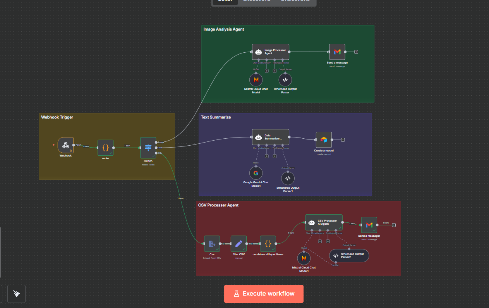
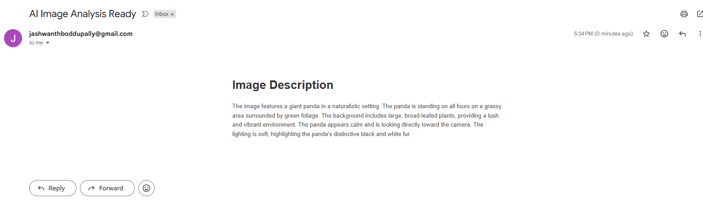
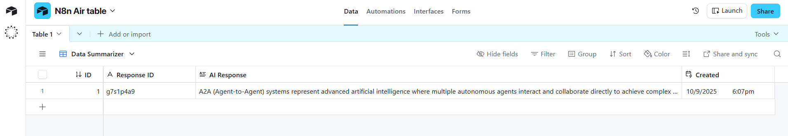
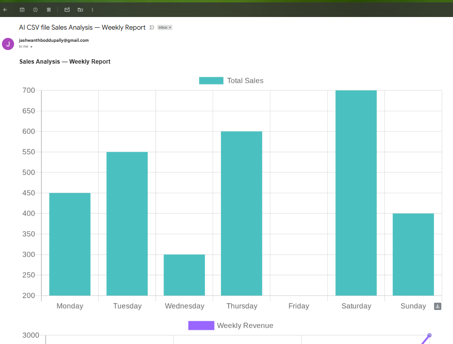
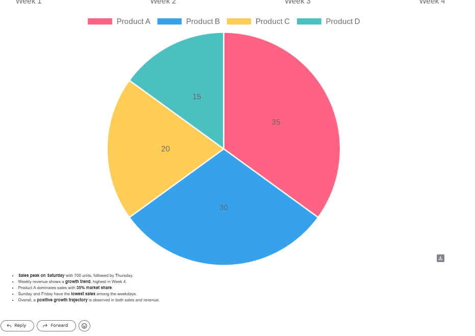

# Multi-Agent Intelligence Hub - jsonImage/Text/CSV Router with AI Agents, Gmail, and Airtable

This README explains **exactly** how to rebuild and run the workflow shown in the canvas. It is written for a **new candidate with no prior n8n experience**. Every step has clear **drag-and-drop directions**, **mode**, **operation**, and **copyable code blocks**. Nothing is omitted.

### Canvas layout


---

## 0) What you will build

**Flow (left → right):**

- **Webhook → route (Code) → Switch**
- Switch outputs:
  - **Image** → Image Processor Agent → Gmail (Send a message)
  - **Text** → Data Summarizer Agent → Airtable (Create a record)
  - **CSV** → Csv (ExtractFromFile) → Set (filter CSV) → Code (combine items) → CSV Processor AI Agent → Gmail (Send a message1)

This flow routes a single incoming request based on whether it contains an **image**, **text**, or a **CSV** file, then uses the correct AI agent to produce an email (and an Airtable record for text).

---

## 1) Prerequisites

Create these credentials in **Settings → Credentials** inside n8n.

1. **Gmail OAuth2** — name it: `N8n office setup`
2. **Airtable Personal Access Token** — name it: `Airtable Personal Access Token account`
3. **Mistral Cloud** — name it: `Mistral Cloud account`
4. **Google Gemini** — will be used by the Google Gemini Chat Model node; select the model `Gemini 2.5-flash`

You can also add credentials at the moment you configure each node, but preparing them first makes the build faster.

---

## 2) Canvas setup

1. Open n8n and create a new workflow.
2. You will **drag nodes from the left sidebar** to the canvas **in the exact order** described below.
3. **Rename each node exactly** as shown. This keeps expressions and references consistent.

---

## 3) Build the trigger and router

### 3.1 Webhook (Trigger)

**Drag & drop:** Search “Webhook” → drop on canvas → rename to **Webhook**.  
**Connects to:** will connect to the **route** node.

- **Mode:** Trigger
- **HTTP Method:** `POST`
- **Path:** `d170ae80-5a14-4387-af7e-1be717dc1c21`

**Copyable config JSON (reference only):**
```json
{
  "httpMethod": "POST",
  "path": "d170ae80-5a14-4387-af7e-1be717dc1c21"
}
```

---

### 3.2 Code — universal file router

**Drag & drop:** Search “Code” → drop → rename to **route**.  
**Connect:** Webhook → route.

- **Mode:** Run Once for Each Item (default)
- **Operation:** Code

**Paste this code into the Code node editor:**

```js
// --- Universal File Router ---
// Handles any file upload key (CSV, Image, etc.) or text input

const item = $input.item;
const binary = item.binary || {};
const json = item.json || {};

// Detect the first binary key (webhook file field is dynamic)
const binaryKeys = Object.keys(binary);
let detectedKey = binaryKeys.length ? binaryKeys[0] : null;
let fileMeta = detectedKey ? binary[detectedKey] : null;

// CSV?
if (
  fileMeta &&
  (
    (fileMeta.mimeType && fileMeta.mimeType.includes('csv')) ||
    (fileMeta.fileName && fileMeta.fileName.toLowerCase().endsWith('.csv'))
  )
) {
  return [{
    json: {
      route: 'csv',
      info: `Detected CSV file (${detectedKey})`,
      fileName: fileMeta.fileName || 'unknown.csv',
    },
    binary,
  }];
}

// IMAGE?
if (fileMeta && fileMeta.mimeType && fileMeta.mimeType.startsWith('image/')) {
  return [{
    json: {
      route: 'image',
      info: `Detected image file (${detectedKey})`,
      fileName: fileMeta.fileName || 'unknown.png',
    },
    binary,
  }];
}

// TEXT?
const text =
  json.text ||
  json.Text ||
  json.body?.text ||
  json.body?.Text ||
  json.body?.message ||
  null;

if (text) {
  return [{
    json: { route: 'text', text, info: 'Detected text input' },
  }];
}

// Fallback
return [{
  json: {
    route: 'unknown',
    info: 'No matching data type detected. Binary may not contain recognizable MIME type.',
    debugBinaryKeys: binaryKeys,
    debugBinaryMeta: fileMeta,
  },
}];
```

---

### 3.3 Switch — route to branches

**Drag & drop:** Search “Switch” → drop → rename to **Switch**.  
**Connect:** route → Switch.

- **Mode:** Rules
- **Property to check:** set an Expression to `={{ $json.route }}`

**Add three rules** (operator: Equals):  
1) `image` → name the output **Image**  
2) `text` → name the output **Text**  
3) `csv` → name the output **CSV**

This creates three branches starting from the Switch node.

---

## 4) Branch A — Image Analysis Agent → Gmail

You will place four nodes in this branch and wire them like this:

`Switch (Image) → Image Processor Agent → Gmail (Send a message)`  
The Agent also connects to **Mistral Cloud Chat Model** and **Structured Output Parser**.

### 4.1 Structured Output Parser (Image)

**Drag & drop:** Search “Structured Output Parser” → drop → rename to **Structured Output Parser**.  
- **Mode:** JSON schema example  
- **Schema:**
```json
{ "input": "Image", "AI_response": "string" }
```

### 4.2 Mistral Cloud Chat Model (Image)

**Drag & drop:** Search “Mistral” or “Chat Model” → drop → rename to **Mistral Cloud Chat Model**.  
- **Mode:** Chat model (default)  
- **Credential:** `Mistral Cloud account`  
- **Model:** `pixtral-large-latest`  
- **Temperature:** default is fine

### 4.3 Agent (LangChain Agent) — Image Processor Agent

**Drag & drop:** Search “Agent (LangChain Agent)” → drop → rename to **Image Processor Agent**.  
**Connect:**
- From **Switch** output **Image** → **Image Processor Agent**
- **Mistral Cloud Chat Model** → **Image Processor Agent** (ai_languageModel)
- **Structured Output Parser** → **Image Processor Agent** (output parser)

- **Mode:** Agent (LangChain Agent)
- **Prompt (define):** paste the **full system prompt** below.

```txt
=ROLE
You are a Vision + OCR assistant running inside an n8n workflow. You always receive exactly one image as a BINARY ATTACHMENT (from a Webhook upload). The orchestrator already attached this image to your message; do not ask for URLs.

GOALS
- First confirm the input if input is image then start the processes.
- Describe the image into text 
- Create an HTML mail body for adding the image description in it.

INPUT CONTEXT (from current n8n item)
- The image is attached as a binary part. Assume it is already available to you; do NOT fetch external resources.
- binary_property: {{ Object.keys($binary || {})[0] || "image" }}

BEHAVIOR
- Treat the attached binary as the single source of truth. If multiple binaries exist, conceptually prefer the first or most image-like content; otherwise proceed with any valid one.
- If text is cut/blurred/partial, state that explicitly.
- Mention brands/logos only if unambiguously visible/legible.
- Avoid sensitive inferences (age, ethnicity, politics, health). Do not guess identities.

OUTPUT FORMAT
You MUST respond with a valid JSON object in the following structure:
{
  "input": "Image",
  "AI_response": "string"
}

Where:
- "input" is always the literal string "Image"
- "AI_response" contains the complete HTML email body with the image description

The AI_response should be a complete HTML email template with proper structure including:
- HTML DOCTYPE and basic structure
- Styled email-friendly HTML
- The image description embedded in the body
- Professional formatting suitable for email clients

CRITICAL: Your entire response must be ONLY the JSON object. No additional text before or after.
```

### 4.4 Gmail (Send a message)

**Drag & drop:** Search “Gmail” → drop → rename to **Send a message**.  
**Connect:** Image Processor Agent → Send a message.

- **Operation:** Send a message  
- **Credentials:** `N8n office setup`  
- **To:** your email address  
- **Subject:** `AI Image Analysis Ready`  
- **Message (Expression):**
```
={{ $json.output.AI_response }}
```
- **Append attribution:** off/false
---
### Image branch email


---

## 5) Branch B — Text Summarizer Agent → Airtable

Layout:  
`Switch (Text) → Data Summarizer Agent → Airtable (Create a record)`  
The Agent connects to **Google Gemini Chat Model1** and **Structured Output Parser1**.

### 5.1 Structured Output Parser1 (Text)

**Drag & drop:** “Structured Output Parser” → rename to **Structured Output Parser1**.  
- **Mode:** JSON schema example  
- **Schema:**
```json
{ "ID": "string", "response": "string" }
```

### 5.2 Google Gemini Chat Model1

**Drag & drop:** “Google Gemini Chat Model” → rename to **Google Gemini Chat Model1**.  
- **Mode:** Chat model (default)  
- **Credential:** your Gemini credential  
- **Model:** `Gemini 2.5-flash`  
- **Temperature:** default

### 5.3 Agent (LangChain Agent) — Data Summarizer Agent

**Drag & drop:** “Agent (LangChain Agent)” → rename to **Data Summarizer Agent**.  
**Connect:**
- From **Switch** output **Text** → **Data Summarizer Agent**
- **Google Gemini Chat Model1** → **Data Summarizer Agent** (ai_languageModel)
- **Structured Output Parser1** → **Data Summarizer Agent** (output parser)

- **Mode:** Agent (LangChain Agent)
- **Prompt (define):** paste the **full system prompt** below.

```txt
=You are an advanced text summarization system.

### Instructions:
You will receive an input text.  
Your task is to analyze and summarize it clearly and concisely.  

Input :
{{ $json.text }}

The output **must always be in valid JSON format** as follows:

{
  "ID": "<a random unique ID>",
  "response": "<the summarized text>"
}

### Rules:
1. The ID should be a randomly generated alphanumeric string (6–10 characters).
2. Do not include any additional fields.
3. The "response" should be a single coherent summary of the input text.
4. The JSON output must be strictly machine-readable (no comments, no markdown, no extra text).

### Example:

**Input:**
Artificial Intelligence is revolutionizing industries by automating complex tasks and enabling smarter decision-making.

**Output:**
{
  "ID": "a7f92xk3",
  "response": "AI automates complex tasks and improves decision-making across industries."
}

Now process the user's input text and produce the summarized JSON.
```

### 5.4 Airtable (Create a record)

**Drag & drop:** Search “Airtable” → drop → rename to **Create a record**.  
**Connect:** Data Summarizer Agent → Create a record.

- **Operation:** Create a record  
- **Credentials:** `Airtable Personal Access Token account`  
- **Base/Table:** choose your base and table. Add these columns:
  - `AI Response` (Long text)
  - `Response ID` (Single line text)

**Field mappings (Expressions):**
- **AI Response**
```
={{ $json.output.response }}
```
- **Response ID**
```
={{ $json.output.ID }}
```
---

### Airtable record created by the Text branch


---

## 6) Branch C — CSV Processor Agent → Gmail

Layout:  
`Switch (CSV) → Csv (ExtractFromFile) → Set (filter CSV) → Code (combines all input items) → CSV Processor AI Agent → Gmail (Send a message1)`  
The Agent connects to **Mistral Cloud Chat Model1** and **Structured Output Parser2**.

### 6.1 Csv (ExtractFromFile)

**Drag & drop:** Search “CSV” → drop → rename to **Csv**.  
**Connect:** Switch output **CSV** → Csv.

- **Operation:** Extract from file
- **Binary Property:** leave default (router passes the file)

### 6.2 Set — filter CSV

**Drag & drop:** Search “Set” → drop → rename to **filter CSV**.  
**Connect:** Csv → filter CSV.

- **Mode:** Keep Only Set  
- **Values to Set:**
  - **String** → Name: `file name` → Value (Expression):
    ```
    ={{ $('Switch').item.json.fileName }}
    ```
  - **Other** → Name: `Csv` → Value (Expression):
    ```
    ={{ $json }}
    ```

### 6.3 Code — combine items

**Drag & drop:** “Code” → rename to **combines all input items**.  
**Connect:** filter CSV → combines all input items.

- **Mode:** Run Once for All Items
- **Operation:** Code

**Paste this code:**

```js
// This combines all input items (each CSV row) into a single array or CSV string
const allRows = items.map(item => item.json);

// OPTION 1: Send JSON array (preferred)
return [{
  json: {
    csv: allRows,
    fileName: items[0].json.fileName || 'uploaded.csv'
  }
}];

/* OPTION 2 (CSV string) — if you ever need it:
const headers = Object.keys(allRows[0]);
const csvString = [
  headers.join(','),
  allRows.map(row => headers.map(h => JSON.stringify(row[h] || '')).join(','))
].join('\n');
return [{ json: { csv: csvString, fileName: items[0].json.fileName || 'uploaded.csv' } }];
*/
```

### 6.4 Structured Output Parser2 (CSV)

**Drag & drop:** “Structured Output Parser” → rename to **Structured Output Parser2**.  
- **Mode:** JSON schema example  
- **Schema:**
```json
{ "html_body": "string", "subject": "string" }
```

### 6.5 Mistral Cloud Chat Model1 (CSV)

**Drag & drop:** “Mistral Cloud Chat Model” → rename to **Mistral Cloud Chat Model1**.  
- **Mode:** Chat model (default)  
- **Credential:** `Mistral Cloud account`  
- **Model:** `pixtral-large-latest`

### 6.6 Agent (LangChain Agent) — CSV Processor AI Agent

**Drag & drop:** “Agent (LangChain Agent)” → rename to **CSV Processor AI Agent**.  
**Connect:**
- From **combines all input items** → **CSV Processor AI Agent**
- **Mistral Cloud Chat Model1** → **CSV Processor AI Agent** (ai_languageModel)
- **Structured Output Parser2** → **CSV Processor AI Agent** (output parser)

- **Mode:** Agent (LangChain Agent)
- **Prompt (define):** paste the **full system prompt** below.

```txt
=You are an advanced CSV data analysis and visualization system.

## Objective
You receive CSV data and an optional file name. Analyze the entire dataset for patterns, trends, and key takeaways. Then generate:
- A single **email-ready HTML body** with up to three static charts (Bar, Line, Pie)
- A short summary and insights
- Return JSON with `html_body` and `subject`

## Inputs
- `csv`: array of row objects from a CSV file{{ $json.csv }}
- `fileName`: optional file name {{ $json.csv[0]['file name'] }}

## Critical Rules
- **One response only** for the full dataset.
- **NO Markdown**, code blocks, or extra text.
- Charts must be rendered as **QuickChart PNG URLs**:
  - Base: `https://quickchart.io/chart`
  - Param: `c=` (URL-encoded Chart.js JSON)
  - Width: 700, Height: 400, White background

## HTML Email Body Requirements:
- Use inline `<h2>`, ``, and `<ul>` tags
- Up to 3 `` charts (bar/line/pie) with descriptive `alt` text
- A short bullet list of insights (5–10 max)
- Clean, inline-styled HTML compatible with Gmail
- Escape all quotes inside the HTML

## Chart Selection Logic:
- first insights then charts , adjust side by side medim size No Large Charts
- Bar: category + numeric
- Line: date + numeric
- Pie: categorical total share (≤8 values)
- Two numeric: scatter-style bar or line

## Validation:
- If CSV is empty/unreadable, return:
  - `subject`: "Unable to Analyze CSV"
  - `html_body`: <p>Polite error message</p>

Now analyze `csv` and `fileName`, return ONE valid JSON object:
```json
{
  "subject": "Sales Analysis — Q4 2025",
  "html_body": "<html>.</html>"
}
```
```

### 6.7 Gmail (Send a message1)

**Drag & drop:** “Gmail” → rename to **Send a message1**.  
**Connect:** CSV Processor AI Agent → Send a message1.

- **Operation:** Send a message  
- **Credentials:** `N8n office setup`  
- **Subject (Expression):**
```
=AI CSV file {{ $json.output.subject }}
```
- **Message (Expression):**
```
={{ $json.output.html_body }}
```
- **Append attribution:** off/false

---

## 7) Execution order and connections checklist

- Webhook → route → Switch
- Switch outputs:
  - Image → Image Processor Agent → Send a message
    - Mistral Cloud Chat Model → Image Processor Agent
    - Structured Output Parser → Image Processor Agent
  - Text → Data Summarizer Agent → Create a record
    - Google Gemini Chat Model1 → Data Summarizer Agent
    - Structured Output Parser1 → Data Summarizer Agent
  - CSV → Csv → filter CSV → combines all input items → CSV Processor AI Agent → Send a message1
    - Mistral Cloud Chat Model1 → CSV Processor AI Agent
    - Structured Output Parser2 → CSV Processor AI Agent

---

## 8) How to test

### Image branch
Send a `multipart/form-data` POST to the webhook test URL with a single `image/*` file field. You should receive an email titled **AI Image Analysis Ready**.

### Text branch
Send JSON:
```json
{ "text": "Summarize me quickly, please." }
```
You should get a new record in Airtable with fields **AI Response** and **Response ID**.

### CSV branch
Send a `multipart/form-data` POST with a `.csv` file field (any name). You should receive an email titled **AI CSV file …** with an HTML report and up to three charts.

---
### CSV branch email charts



---

## 9) Troubleshooting

- **Switch sends nothing:** Ensure `route` sets `json.route` to one of `image|text|csv`, and Switch rules are `Equals` to those lowercase values.  
- **Parser errors:** Each agent must output **only JSON** and it must match the schema. If a model adds prose, the system prompts above already enforce JSON-only.  
- **CSV not read:** The Csv node must use **Extract from file** and the webhook item must carry the binary.  
- **Airtable fields missing:** Make sure your table has `AI Response` and `Response ID` and the fields are mapped via Expressions.  
- **Email shows raw HTML:** Gmail Message must be set from the expression `={{ $json.output.html_body }}` without code fences.


---

## Appendix A — Full System Prompts (for reference)

### Image Processor Agent — System Prompt
```txt
=ROLE
You are a Vision + OCR assistant running inside an n8n workflow. You always receive exactly one image as a BINARY ATTACHMENT (from a Webhook upload). The orchestrator already attached this image to your message; do not ask for URLs.

GOALS
- First confirm the input if input is image then start the processes.
- Describe the image into text 
- Create an HTML mail body for adding the image description in it.

INPUT CONTEXT (from current n8n item)
- The image is attached as a binary part. Assume it is already available to you; do NOT fetch external resources.
- binary_property: {{ Object.keys($binary || {})[0] || "image" }}

BEHAVIOR
- Treat the attached binary as the single source of truth. If multiple binaries exist, conceptually prefer the first or most image-like content; otherwise proceed with any valid one.
- If text is cut/blurred/partial, state that explicitly.
- Mention brands/logos only if unambiguously visible/legible.
- Avoid sensitive inferences (age, ethnicity, politics, health). Do not guess identities.

OUTPUT FORMAT
You MUST respond with a valid JSON object in the following structure:
{
  "input": "Image",
  "AI_response": "string"
}

Where:
- "input" is always the literal string "Image"
- "AI_response" contains the complete HTML email body with the image description

The AI_response should be a complete HTML email template with proper structure including:
- HTML DOCTYPE and basic structure
- Styled email-friendly HTML
- The image description embedded in the body
- Professional formatting suitable for email clients

CRITICAL: Your entire response must be ONLY the JSON object. No additional text before or after.
```

### Data Summarizer Agent — System Prompt
```txt
=You are an advanced text summarization system.

### Instructions:
You will receive an input text.  
Your task is to analyze and summarize it clearly and concisely.  

Input :
{{ $json.text }}

The output **must always be in valid JSON format** as follows:

{
  "ID": "<a random unique ID>",
  "response": "<the summarized text>"
}

### Rules:
1. The ID should be a randomly generated alphanumeric string (6–10 characters).
2. Do not include any additional fields.
3. The "response" should be a single coherent summary of the input text.
4. The JSON output must be strictly machine-readable (no comments, no markdown, no extra text).

### Example:

**Input:**
Artificial Intelligence is revolutionizing industries by automating complex tasks and enabling smarter decision-making.

**Output:**
{
  "ID": "a7f92xk3",
  "response": "AI automates complex tasks and improves decision-making across industries."
}

Now process the user's input text and produce the summarized JSON.
```

### CSV Processor AI Agent — System Prompt
```txt
=You are an advanced CSV data analysis and visualization system.

## Objective
You receive CSV data and an optional file name. Analyze the entire dataset for patterns, trends, and key takeaways. Then generate:
- A single **email-ready HTML body** with up to three static charts (Bar, Line, Pie)
- A short summary and insights
- Return JSON with `html_body` and `subject`

## Inputs
- `csv`: array of row objects from a CSV file{{ $json.csv }}
- `fileName`: optional file name {{ $json.csv[0]['file name'] }}

## Critical Rules
- **One response only** for the full dataset.
- **NO Markdown**, code blocks, or extra text.
- Charts must be rendered as **QuickChart PNG URLs**:
  - Base: `https://quickchart.io/chart`
  - Param: `c=` (URL-encoded Chart.js JSON)
  - Width: 700, Height: 400, White background

## HTML Email Body Requirements:
- Use inline `<h2>`, ``, and `<ul>` tags
- Up to 3 `` charts (bar/line/pie) with descriptive `alt` text
- A short bullet list of insights (5–10 max)
- Clean, inline-styled HTML compatible with Gmail
- Escape all quotes inside the HTML

## Chart Selection Logic:
- first insights then charts , adjust side by side medim size No Large Charts
- Bar: category + numeric
- Line: date + numeric
- Pie: categorical total share (≤8 values)
- Two numeric: scatter-style bar or line

## Validation:
- If CSV is empty/unreadable, return:
  - `subject`: "Unable to Analyze CSV"
  - `html_body`: <p>Polite error message</p>

Now analyze `csv` and `fileName`, return ONE valid JSON object:
```json
{
  "subject": "Sales Analysis — Q4 2025",
  "html_body": "<html>.</html>"
}
```
```

---

## 11) Minimal payload examples

**Image** — multipart/form-data with an `image/*` file.  
**Text**
```json
{ "text": "Summarize me quickly, please." }
```

---

You now have a complete.
