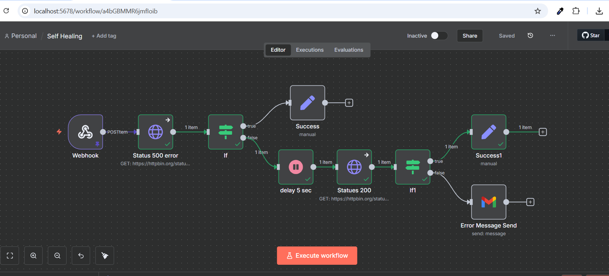
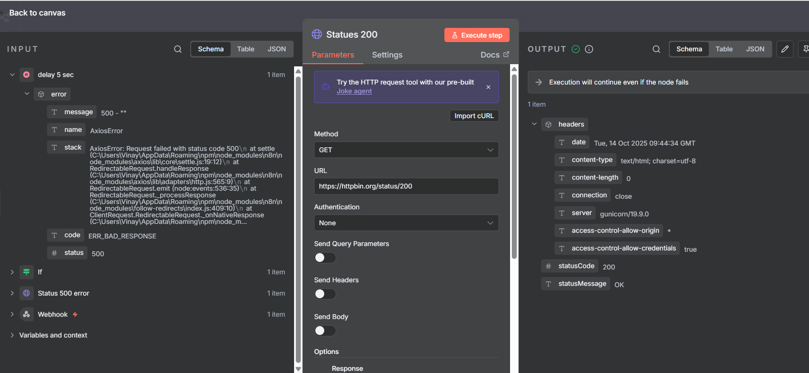

# Self-Healing Workflow (n8n) — Step-by-Step README

---

## Goal

Build a small **self-healing check**:

1. Receive a webhook call.  
2. Call an endpoint that fails with HTTP **500**.  
3. If it failed, **wait 5 seconds**, then try a **200** endpoint.  
4. If it still isn’t 200, **email the error** via Gmail.  
5. If it’s OK, mark success in a Set node.

---

## What you will build (Canvas Overview)



---

## Prerequisites

- n8n running (local or server).
- A Gmail OAuth2 credential added in **Credentials** (for the Gmail node).  
  You can add the Gmail node first; n8n will prompt you to connect.

---

## Workflow Overview (structure)

```
Webhook (POST)
/ \
  -> HTTP Request: Status 500 error  ->  If (check error.status == 200?)
                                          |true --> Set: Success
                                          |false -> Wait 5 sec -> HTTP Request: Statues 200 (full response)
                                                               -> If1 (check statusCode == 200?)
                                                                  |true --> Set: Success1
                                                                  |false -> Gmail: Error Message Send
```

> Note: Node names intentionally match the JSON (including the exact spacing/typo in “Statues 200 ”).

---

## Create a New Workflow

1. In n8n, click **Workflows ▸ + New**.
2. Click the title and rename it to **Self Healing**.

---

## Step 1 — Add **Webhook** node

**Drag & Drop Guide:**  
Left sidebar ▸ **Triggers** ▸ drag **Webhook** onto the canvas. Rename it to **Webhook**.

**Operation / Mode:**
- **HTTP Method:** `POST`
- **Path:** use any slug (when importing JSON, keep the path from the file). Example:
  ```
  e943efb2-0129-4f6e-b663-9c32edca234e
  ```

**Copyable Test Payload (use in Postman/cURL):**
```json
{
  "status": "pending",
  "score": 72,
  "fullName": "Ali Khan"
}
```

**How to test the Webhook:**
- Click **Listen for Test Event** on the Webhook node.
- Send a POST to the **Test URL** shown in the node (it ends with `/webhook-test/...`).
- When you deploy for real, use the **Production URL** (ends with `/webhook/...`).

**Connect to next node:** From **Webhook → main** output, drag a connection to: **Status 500 error**.

---

## Step 2 — Add **HTTP Request** node: “Status 500 error”

**Drag & Drop Guide:**  
Left sidebar ▸ **Core Nodes ▸ HTTP Request** ▸ drag next to Webhook. Rename to **Status 500 error**.

**Operation / Mode:**
- **Method:** `GET`
- **URL:**  
  ```
  https://httpbin.org/status/500
  ```
- **Error Handling:** set **On Error** to **Continue** (in the node **Settings** tab).

**Reference screenshot:**


**Connect:** Webhook → **Status 500 error**.

---

## Step 3 — Add **If** node: “If”

This checks whether the first request is “OK”. In the JSON, it compares `error.status == 200`. Since the first call is 500, it goes to the **false** branch and proceeds to the retry path.

**Drag & Drop Guide:**  
Left sidebar ▸ **Core Nodes ▸ If** ▸ drag to the right of **Status 500 error**. Rename to **If**.

**Condition (copy/paste the expression):**
- **Left Value (Expression):**
  ```
  {{$json.error.status}}
  ```
- **Operator:** `equals`
- **Right Value:** `200`
- **Type:** `Number`
- **Combinator:** `AND`

**Connections from If:**
- **true** (top) → **Set: Success** (Step 4A).
- **false** (bottom) → **Wait: delay 5 sec** (Step 4B).

---

## Step 4A — Add **Set** node: “Success” (true branch)

**Purpose:** Record the status you got from the first call (kept as per JSON).

**Drag & Drop Guide:**  
Core Nodes ▸ **Set** ▸ place right of **If**. Rename to **Success**.

**Add a field:**
- Click **Add Value** → **String**
  - **Name:** `Success`
  - **Value (Expression):**
    ```
    {{$('Status 500 error').item.json.error.status}}
    ```

**Connect:** **If** (true) → **Success**.

---

## Step 4B — Add **Wait** node: “delay 5 sec” (false branch)

**Drag & Drop Guide:**  
Core Nodes ▸ **Wait** ▸ place below **If**. Rename to **delay 5 sec**.

**Mode:**
- **Wait for Duration**
- **Seconds:** `5`

**Connect:** **If** (false) → **delay 5 sec**.

---

## Step 5 — Add **HTTP Request** node: “Statues 200 ”

**Drag & Drop Guide:**  
Core Nodes ▸ **HTTP Request** ▸ place to the right of **delay 5 sec**. Rename to **Statues 200 ** (note the trailing space).

**Operation / Options:**
- **Method:** `GET`
- **URL:**
  ```
  https://httpbin.org/status/200
  ```
- **Settings ▸ Response:** enable **Full Response** (so you get `statusCode`).
- **On Error:** **Continue**.

**Reference screenshot:**



**Connect:** **delay 5 sec** → **Statues 200 **.

---

## Step 6 — Add **If** node: “If1”

Checks if the retry returned HTTP 200.

**Drag & Drop Guide:**  
Core Nodes ▸ **If** ▸ place right of **Statues 200 **. Rename to **If1**.

**Condition (copy/paste the expression):**
- **Left Value (Expression):**
  ```
  {{$json.statusCode}}
  ```
- **Operator:** `is equal to`
- **Right Value:** `200`
- **Type:** `Number`

**Reference screenshot:**


**Connections from If1:**
- **true** → **Set: Success1** (Step 7A)
- **false** → **Gmail: Error Message Send** (Step 7B)

---

## Step 7A — Add **Set** node: “Success1” (true branch)

**Drag & Drop Guide:**  
Core Nodes ▸ **Set** ▸ place right of **If1**. Rename to **Success1**.

**Add a field (as in JSON):**
- **Name:** `success`
- **Value (Expression):**
  ```
  {{$('Statues 200 ').item.json.error.status}}
  ```

> Note: Because this call succeeded (200), `error.status` might be undefined. See “Recommended Fixes” for a cleaner value.

**Connect:** **If1** (true) → **Success1**.

---

## Step 7B — Add **Gmail** node: “Error Message Send” (false branch)

**Drag & Drop Guide:**  
Apps ▸ **Gmail** ▸ place below **If1**. Rename to **Error Message Send**.

**Operation / Mode:**
- **Operation:** Send Email
- **Credentials:** select your **Gmail OAuth2** account.
- **To:**  
  ```
  krus0523@gmail.com
  ```
- **Subject:**  
  ```
  error
  ```
- **Message (Expression):**
  ```
  {{$json.error.message}}
  ```

**Connect:** **If1** (false) → **Error Message Send**.

---

## Final Connections Checklist

- **Webhook → Status 500 error**
- **Status 500 error → If**
- **If (true) → Success**
- **If (false) → delay 5 sec**
- **delay 5 sec → Statues 200 **
- **Statues 200  → If1**
- **If1 (true) → Success1**
- **If1 (false) → Error Message Send**

---

## How to Test

1. Open **Webhook** node and click **Listen for Test Event**.
2. Send a POST request with the sample JSON to the **Test URL**.
3. Expected behavior:
   - The first HTTP call returns 500 → **If** goes **false** → wait 5 seconds.
   - The second HTTP call returns 200 → **If1** goes **true** → **Success1** runs.
   - If you break the URL to force a non-200 on the retry, **If1** goes **false** and **Gmail** sends an error email.

---

## Production vs Test

- **Test URL** contains `/webhook-test/…` and only works while the node is listening.
- **Production URL** contains `/webhook/…` and works after the workflow is **activated**.
- If you are on localhost, external services can’t reach your Production URL; use a public host or a tunnel. For real deployments, prefer a proper domain with SSL.

---

## Recommended Fixes (optional)

These keep the JSON behavior intact but improve clarity:

1. **If (first check):** To mark success when the first request already returns 200, prefer:
   ```
   {{$json.statusCode}} == 200
   ```
   (Enable **Full Response** on the first HTTP node.)

2. **Success1 value:** Use a guaranteed field from the 200 response, for example:
   ```
   {{$json.statusCode}}
   ```
   or set a literal:
   ```
   OK
   ```

3. **Gmail message safety:** Fall back if `error.message` is absent:
   ```
   {{ $json.error?.message || 'Unknown error' }}
   ```

---

## Importing the JSON (alternative to manual build)

1. **Workflows ▸ Import from File**  
2. Select `Self Healing.json`.
3. Open each node once to reconnect credentials (Gmail), then **Activate** and test.

---

## Sample cURLs

**Webhook Test Call (replace with your Test URL):**
```bash
curl -X POST "http://localhost:5678/webhook-test/e943efb2-0129-4f6e-b663-9c32edca234e"   -H "Content-Type: application/json"   -d '{"status":"pending","score":72,"fullName":"Ali Khan"}'
```

**Webhook Production Call (replace with your Production URL):**
```bash
curl -X POST "http://<your-host>/webhook/e943efb2-0129-4f6e-b663-9c32edca234e"   -H "Content-Type: application/json"   -d '{"status":"pending","score":72,"fullName":"Ali Khan"}'
```
