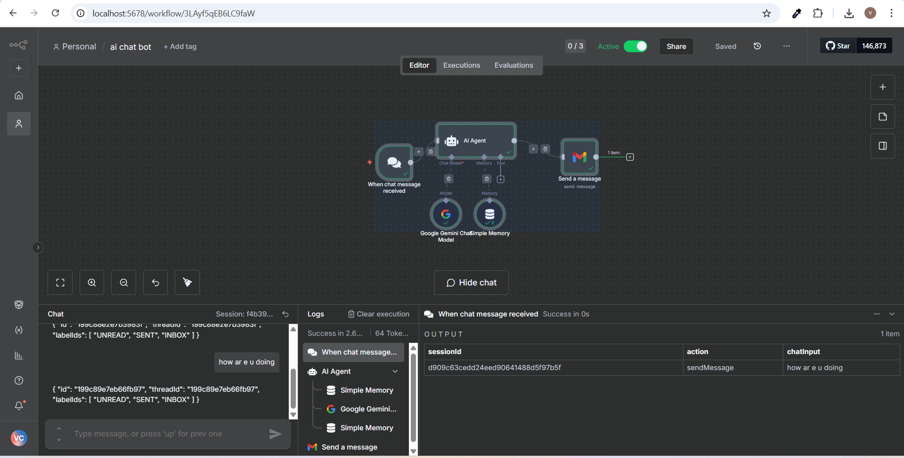
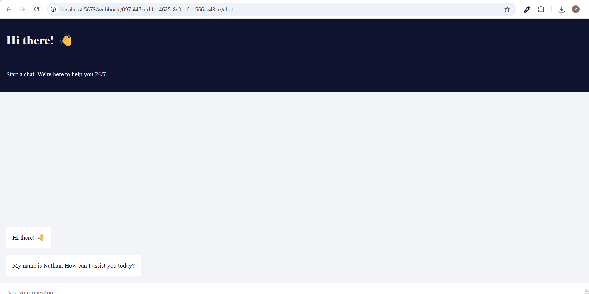

# n8n AI Chat Bot Workflow – Onboarding Guide (Local)

This guide walks a new teammate—starting from zero—through recreating and understanding the **ai chat bot** workflow in **n8n**. It uses a **local n8n instance** and intentionally points the “production” URL at your local machine to match the current setup. **Treat this only as a temporary/demo setup. Pointing production to local is bad practice**—see the note at the end for safer deployment patterns.

---

## What You Will Build
A simple chat pipeline that:

1. Receives a chat message via **When chat message received** (Chat Trigger)
2. Passes the message to an **AI Agent**
3. The **AI Agent** uses **Google Gemini Chat Model** and **Simple Memory**
4. Sends the input and AI output to a target email using the **Gmail** node

**High-level flow:**
```
When chat message received ──▶ AI Agent ──▶ Send a message (Gmail)
                                   ▲               
         Google Gemini Chat Model ─┘
         Simple Memory ────────────┘
```

### Screenshots (stored in `./images`)
- Chat UI (public chat page served via local→ngrok): `./images/chat-ui.png`

  

- n8n Workflow editor with nodes wired: `./images/n8n-workflow.png`

  

---

## Repository Layout

```
README.md
images/
  chat-ui.png
  n8n-workflow.png
```

---

## Prerequisites
- **Local n8n** running (e.g., Docker or npx). You will import or build the workflow inside this instance.
- **Google Gemini (PaLM/Gemini) API credential** available to n8n.
- **Gmail OAuth2 credential** available to n8n, with permission to send email.
- An email inbox where you can receive test messages.

> Important: This onboarding uses a **local** n8n for “production.” This is **not recommended** for real environments. Keep reading for the bad-practice note and what to do instead.

---

## Option A — Import the Provided Workflow JSON (Fastest)
1. In n8n, click **Workflows** → **Import from file**.
2. Paste the content from **Appendix: Full Workflow JSON** (at the end of this doc) **or** upload the JSON file.
3. Open the imported workflow **“ai chat bot.”**
4. Update credentials where needed (Gemini and Gmail).
5. Click **Save**.

After importing, jump to **Testing the Workflow** below.

---

## Option B — Build It From Scratch (Recommended for Understanding)
Follow the exact steps below. Each step has: a **clear node instruction**, **operation**, **mode** (when relevant), **drag-and-drop guide**, and **copyable code**.

### Step 1 — Create a New Workflow
1. In n8n, click **Workflows** → **New**.
2. **Name** it: `ai chat bot`.
3. Click **Save**.

```
# No code for this step; just create and name the workflow.
```

---

### Step 2 — Add the Chat Trigger
**Node:** `When chat message received`

**Drag & Drop Guide:**
1. In the left **Nodes** panel, search for **Chat Trigger** (it may appear under LangChain/LangSmith integration pack if installed; exact catalog name can vary by version). 
2. Drag **When chat message received** onto the canvas.

**Clear Operation / Mode:**
- **Public:** set to `true` (so the trigger exposes a public endpoint for incoming chat messages)
- Leave other options as default unless instructed by your environment.

**Copyable minimal node JSON:**
```json
{
  "name": "When chat message received",
  "type": "@n8n/n8n-nodes-langchain.chatTrigger",
  "typeVersion": 1.3,
  "parameters": {
    "public": true,
    "options": {}
  }
}
```

**Get the public URL:**
- Open the node → copy the **Public URL** shown by n8n (varies per install). You will use it during testing.

---

### Step 3 — Add the AI Agent
**Node:** `AI Agent`

**Drag & Drop Guide:**
1. Search for **AI Agent** in the Nodes panel.
2. Drag it to the canvas **to the right** of the Chat Trigger.
3. Connect **When chat message received → AI Agent** using the standard **main** output to **main** input.

**Clear Operation / Mode:**
- Keep the default **Agent** mode (suitable for a general chat completion agent). You can fine-tune later.
- This node expects a **Language Model** and optional **Memory** to be wired into its special ports.

**Copyable minimal node JSON:**
```json
{
  "name": "AI Agent",
  "type": "@n8n/n8n-nodes-langchain.agent",
  "typeVersion": 2.2,
  "parameters": {
    "options": {}
  }
}
```

---

### Step 4 — Add the Google Gemini Chat Model
**Node:** `Google Gemini Chat Model`

**Drag & Drop Guide:**
1. Search for **Google Gemini Chat Model**.
2. Drag it onto the canvas **below-left** of the AI Agent.
3. Connect its **Language Model** output to the **AI Agent**’s **ai_languageModel** input.

**Clear Operation / Mode:**
- Configure **credentials** for Gemini (PaLM/Gemini API). Choose your account in the node’s **Credentials** dropdown.
- Leave model parameters (temperature, topP, etc.) at defaults for now.

**Copyable minimal node JSON:**
```json
{
  "name": "Google Gemini Chat Model",
  "type": "@n8n/n8n-nodes-langchain.lmChatGoogleGemini",
  "typeVersion": 1,
  "parameters": {}
}
```

---

### Step 5 — Add Memory (Conversation Buffer)
**Node:** `Simple Memory`

**Drag & Drop Guide:**
1. Search for **Simple Memory** (a buffer window memory helper).
2. Drag it onto the canvas **below-right** of the AI Agent.
3. Connect its output to the **AI Agent**’s **ai_memory** input.

**Clear Operation / Mode:**
- Default **buffer window** memory. No change required.

**Copyable minimal node JSON:**
```json
{
  "name": "Simple Memory",
  "type": "@n8n/n8n-nodes-langchain.memoryBufferWindow",
  "typeVersion": 1.3,
  "parameters": {}
}
```

---

### Step 6 — Add Gmail to Send the Transcript
**Node:** `Send a message` (Gmail)

**Drag & Drop Guide:**
1. Search for **Gmail**.
2. Drag **Send a message** onto the canvas **to the right** of the AI Agent.
3. Connect **AI Agent → Send a message (Gmail)** using the **main** output.

**Clear Operation / Mode:**
- **Operation:** Send a message
- **Email Type:** `text`
- **To (sendTo):** set the recipient address you control
- **Subject:** `Chat History`
- **Message:** use an expression that includes the user input from the trigger and the AI Agent’s output

**Copyable Gmail message expression:**
```
=input  : {{ $('When chat message received').item.json.chatInput }}
output : {{ $json.output }}
```

**Copyable minimal node JSON:**
```json
{
  "name": "Send a message",
  "type": "n8n-nodes-base.gmail",
  "typeVersion": 2.1,
  "parameters": {
    "sendTo": "you@example.com",
    "subject": "Chat History",
    "emailType": "text",
    "message": "=input  : {{ $('When chat message received').item.json.chatInput }}\noutput : {{ $json.output }}",
    "options": { "appendAttribution": false }
  }
}
```

Credential Note: Configure the **Gmail OAuth2** credential on this node before executing. Ensure the account has permission to send email.

---

### Step 7 — Wire Everything Correctly
Use these exact connections:

1. **When chat message received** `main` → **AI Agent** `main`
2. **Google Gemini Chat Model** `ai_languageModel` → **AI Agent** `ai_languageModel`
3. **Simple Memory** `ai_memory` → **AI Agent** `ai_memory`
4. **AI Agent** `main` → **Send a message (Gmail)** `main`

**Copyable connections JSON (reference):**
```json
{
  "connections": {
    "When chat message received": { "main": [[{ "node": "AI Agent", "type": "main", "index": 0 }]] },
    "Google Gemini Chat Model": { "ai_languageModel": [[{ "node": "AI Agent", "type": "ai_languageModel", "index": 0 }]] },
    "Simple Memory": { "ai_memory": [[{ "node": "AI Agent", "type": "ai_memory", "index": 0 }]] },
    "AI Agent": { "main": [[{ "node": "Send a message", "type": "main", "index": 0 }]] }
  }
}
```

---

### Step 8 — Save and (Optionally) Activate
1. Click **Save**.
2. To receive external events, toggle **Active** on. For local-only testing, you can keep it inactive and use the **Test** features depending on node capabilities. For webhooks/triggers, activation is typically required.

```
Tip: In Settings, the workflow uses executionOrder v1 by default.
```

---

## Testing the Workflow

### A. Triggering With a Public URL (Local)
1. Open **When chat message received** and copy its **Public URL**.
2. From your terminal, send a test message. Replace `<PUBLIC_URL>` with the copied value.

**Copyable cURL test:**
```bash
curl -X POST <PUBLIC_URL>       -H 'Content-Type: application/json'       -d '{"chatInput":"Hello from local test"}'
```

If your local n8n runs at `http://localhost:5678` and your trigger shows a path like `/webhook/<id>`, the full URL may look like:
```
http://localhost:5678/webhook/<id>
```

### B. Expected Result
- The **AI Agent** calls **Google Gemini** with the `chatInput`, using **Simple Memory** for short context.
- The **Gmail** node sends an email with subject **“Chat History”** to your configured recipient. The body includes both the `input` (from the trigger) and the `output` (from the AI Agent).

### C. If You Need Remote Testing
- You can temporarily expose your local n8n with a tunnel (e.g., `ngrok`) for external POSTs. Use only for development.

---

## Troubleshooting
- **401/403 on trigger:** Ensure the workflow is **Active** and you copied the correct **Public URL**.
- **Gmail node fails:** Verify the **Gmail OAuth2** credential and scopes; try re-authenticating.
- **No AI output:** Check that **Google Gemini Chat Model** is correctly connected to the **AI Agent**’s **ai_languageModel** port and that your API key is valid.
- **Memory not working:** Confirm **Simple Memory** is connected to the **ai_memory** port.

---

## Bad-Practice Note: “Production URL” → Local
- In this onboarding, the so-called **production URL points to your local n8n**. This is **bad practice** for real systems because:
  - Local machines are unstable as a service endpoint (sleep, updates, IP changes).
  - Security is weaker (no hardened perimeter, inconsistent TLS, credential leakage risk).
  - Debug/test workflows can impact real users.
- What to do instead:
  - Host n8n on a dedicated, secured environment (cloud VM or managed container), behind HTTPS with a real domain.
  - Use environment variables and secrets management; do not store sensitive keys in exported JSON.
  - Separate **dev/staging/prod** with distinct credentials and URLs.

---

## Appendix: Full Workflow JSON (as provided)
Import this as-is, then rebind your credentials.

```json
{
  "name": "ai chat bot",
  "nodes": [
    {
      "parameters": {
        "public": true,
        "options": {}
      },
      "type": "@n8n/n8n-nodes-langchain.chatTrigger",
      "typeVersion": 1.3,
      "position": [-224, -64],
      "id": "d3cf53cd-1c34-4e05-9af4-81a021695048",
      "name": "When chat message received",
      "webhookId": "d400435f-44fd-4587-8cff-f74848b47cb2"
    },
    {
      "parameters": { "options": {} },
      "type": "@n8n/n8n-nodes-langchain.agent",
      "typeVersion": 2.2,
      "position": [-48, -128],
      "id": "1262c30f-b388-4e18-bad5-08315b518c80",
      "name": "AI Agent"
    },
    {
      "parameters": { "options": {} },
      "type": "@n8n/n8n-nodes-langchain.lmChatGoogleGemini",
      "typeVersion": 1,
      "position": [-64, 96],
      "id": "3aae425c-b62f-4f8f-9e0b-3fa62a99e730",
      "name": "Google Gemini Chat Model",
      "credentials": { "googlePalmApi": { "id": "FFJ0QF9gDVGDZ2sr", "name": "Google Gemini(PaLM) Api account" } }
    },
    {
      "parameters": {},
      "type": "@n8n/n8n-nodes-langchain.memoryBufferWindow",
      "typeVersion": 1.3,
      "position": [64, 96],
      "id": "c62cf1ae-a0f1-4c3f-afc3-30601501d545",
      "name": "Simple Memory"
    },
    {
      "parameters": {
        "sendTo": "krus0523@gmail.com",
        "subject": "Chat History",
        "emailType": "text",
        "message": "=input  : {{ $('When chat message received').item.json.chatInput }}\noutput : {{ $json.output }}",
        "options": { "appendAttribution": false }
      },
      "type": "n8n-nodes-base.gmail",
      "typeVersion": 2.1,
      "position": [320, -80],
      "id": "ac3a3c9e-79d1-4f60-8cb7-24bca5c816bc",
      "name": "Send a message",
      "webhookId": "ca9f9ab9-39b4-4086-9df2-684347b4078c",
      "credentials": { "gmailOAuth2": { "id": "UHZa8dl21qZshVrS", "name": "Gmail account" } }
    }
  ],
  "pinData": {},
  "connections": {
    "When chat message received": { "main": [[{ "node": "AI Agent", "type": "main", "index": 0 }]] },
    "Google Gemini Chat Model": { "ai_languageModel": [[{ "node": "AI Agent", "type": "ai_languageModel", "index": 0 }]] },
    "Simple Memory": { "ai_memory": [[{ "node": "AI Agent", "type": "ai_memory", "index": 0 }]] },
    "AI Agent": { "main": [[{ "node": "Send a message", "type": "main", "index": 0 }]] }
  },
  "active": true,
  "settings": { "executionOrder": "v1" },
  "versionId": "60485584-46d9-433b-98ad-7b226f4773b2",
  "meta": { "templateCredsSetupCompleted": true, "instanceId": "0668e88de7a16f28d063324a020917a9ba638413818ac1cc358f702865c45d84" },
  "id": "3LAyf5qEB6LC9faW",
  "tags": []
}
```
