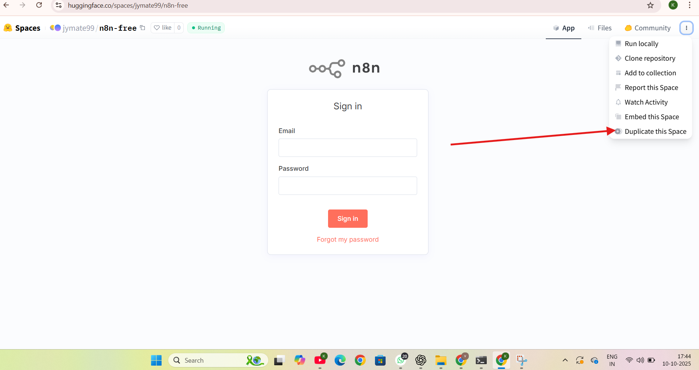

# n8n on Hugging Face Spaces (Hosted with Supabase)
A step-by-step guide to deploy **n8n** on **Hugging Face Spaces** using **Supabase** as the hosted Postgres database (transaction pooler).  
This repo contains:
- `README.md` (this file)
- `images/` — screenshots to follow the steps
- `AiChatModel-Local.md` — original local n8n onboarding guide (kept for reference)

---

## Goal
Duplicate an existing Hugging Face Space (preconfigured for n8n + Supabase), supply the Supabase *transaction pooler* credentials, and run n8n on Hugging Face Spaces. After duplication you will be redirected to the n8n sign-in page — then import or recreate your local workflow (the repo includes the local onboarding doc `AiChatModel-Local.md`).

---

## Prerequisites
1. Hugging Face account (sign up / log in). (see `images/Hugging-Face-Interface.png`)
2. Supabase account and permission to create a project (free tier is fine). (see `images/Supabase-Workspace.png`)
3. Basic comfort with copying/pasting secrets and using the Hugging Face "Duplicate this Space" dialog.

---

## Quick overview (high-level)
1. Create a Supabase project (or use an existing one).
2. Locate the **Transaction pooler** connection string/credentials in Supabase.
3. On Hugging Face Spaces select a running n8n Space that uses Supabase and click **Duplicate this Space**.
4. In the Duplicate modal paste the Supabase credentials and fill required Space variables.
5. Duplicate and wait for the Space to boot — you will be redirected to the n8n sign-in page.
6. Log in and import or recreate the workflow from `AiChatModel-Local.md`.

---

## Detailed steps

### A — Create a Supabase project and enable transaction pooling
1. Sign in to Supabase and create a new **Organization** (if asked). 
2. Create a new **Project** (free tier is OK). Wait for the project to provision. 
3. Open the Project dashboard and click **Connect** (top of the project page).


### B — Get the Transaction Pooler credentials (use these; they are required)
1. In the Supabase project, navigate to **Settings → Database** (or look for "Transaction pooler" in the UI).
2. Under **Transaction pooler** you will see a connection string and a small "View parameters" area — click it. 
   
3. The transaction pooler connection string will look like:
```
postgresql://<user>:<password>@<host>:<port>/<database>?options=...
```
4. You can either:
   - Extract `<user>` and `<password>` and paste them into the Hugging Face secret fields `DB_POSTGRESDB_USER` and `DB_POSTGRESDB_PASSWORD`, **or**
   - Paste the full connection string into a Space secret called `DB_CONNECTION_STRING` if the duplicated Space supports that environment variable. (Note: the example Duplicate modal expects user + password as separate secrets.)

> **Important:** Use the **Transaction pooler** credentials (not the direct DB superuser). Transaction pooler is designed for multiple clients (Spaces) and is safer & compatible with HF proxying.

### C — Find a running n8n Space on Hugging Face and duplicate it
1. Go to Hugging Face → **Spaces** and search for `n8n`. Filter for Spaces that are **Running** and mention "supabase" in their description. 

2. Open a Space that is **Running** and appears to be configured for Supabase (many community Spaces have a "Duplicate this Space" option). Click the three-dot menu and choose **Duplicate this Space**. 

### D — Fill the Duplicate modal: secrets & variables
When the Duplicate modal appears you will see two sections: **Space secrets (private)** and **Space variables (public)**. The screenshots in `images/` show the expected fields for a common n8n + Supabase Space.

**Typical secrets to add (private)** — paste values from Supabase transaction pooler:
- `DB_POSTGRESDB_USER` → (from transaction pooler connection string)
- `DB_POSTGRESDB_PASSWORD` → (from transaction pooler connection string)
- `N8N_ENCRYPTION_KEY` → create a random 32+ char secret (used by n8n to encrypt cookies/session info)
  - Example generator (locally): `openssl rand -base64 32`
- If the Space expects different names, match those names in the modal.
  
  

**Typical public variables to set (Space variables):**
- `N8N_PORT` → `7860` (example; many Spaces run on this port)
- `N8N_PROTOCOL` → `https`
- `N8N_HOST` → `<your-hf-username>-n8n-free.hf.space` (replace `<your-hf-username>` with your HF username)
- `WEBHOOK_URL` → `https://<your-hf-username>-n8n-free.hf.space` (used by n8n to generate webhook links)
- `N8N_EDITOR_BASE_URL` → `https://<your-hf-username>-n8n-free.hf.space`
- `NOTION_MARKDOWN_CONVERSION` and other extra fields often default to `true` or can be left as-is if shown in the modal. (see `images/Duplicate-This-Space.png` which shows sample fields)

**Notes:**
- Use the same string (your HF-space hostname) for `N8N_HOST`, `WEBHOOK_URL`, and `N8N_EDITOR_BASE_URL` to ensure internal links and webhook URLs are correct.
- If the modal asks for a `DB_TYPE` or `DB_CONNECTION` variable, set it to `postgresql` or follow the modal's hint.

### E — Duplicate and wait
1. Click **Duplicate Space** in the dialog after filling secrets & variables.
2. The Space creation will start. Wait for the build to finish; watch logs if available.
3. When the Space finishes booting the UI should redirect you to the Space page and often to the n8n sign-in page. 

### F — Sign in to n8n and recreate/import your workflow
1. Use the sign-in form that appears. Depending on the Space's configuration, there may be a default admin account or a signup flow. If the Space uses Supabase Auth you may need to create the user via the n8n sign-up page or directly in Supabase Auth.
2. After login, either:
   - Import your local workflow JSON (see `AiChatModel-Local.md` Appendix) via **Workflows → Import**, or
   - Recreate the workflow step-by-step using `AiChatModel-Local.md` as the authoritative build guide.

---

## Post-deploy checks & troubleshooting
- If webhooks are failing, verify `WEBHOOK_URL` and that the public HF hostname matches `N8N_HOST`.
- If DB connection fails, confirm you used the **Transaction pooler** credentials (not the primary DB superuser), and that you copied the correct user/password into the Space secrets.
- Check the Space build logs on Hugging Face for environment or build-time errors.
- If Supabase blocks connections, ensure the project allows connections from external IPs/proxies; using the transaction pooler is usually compatible with HF proxying.

---

## Security / best practices
- Do **not** commit secrets to source control.
- Use Supabase's transaction pooler credentials only for app connections and rotate keys when needed.
- For production/critical workloads, prefer hosting n8n on a managed VM or Kubernetes cluster where you control network & backups.
- Keep separate dev/stage/prod Supabase projects and HF Spaces.

---

## Useful example variable values (replace `<username>` and `<db values>` with yours)
```
N8N_PORT=7860
N8N_PROTOCOL=https
N8N_HOST=<your-hf-username>-n8n-free.hf.space
WEBHOOK_URL=https://<your-hf-username>-n8n-free.hf.space
N8N_EDITOR_BASE_URL=https://<your-hf-username>-n8n-free.hf.space
DB_POSTGRESDB_USER=<user from transaction pooler>
DB_POSTGRESDB_PASSWORD=<password from transaction pooler>
N8N_ENCRYPTION_KEY=<random 32+ char secret>
```

---

## What You Will Build
A simple chat pipeline that:

1. Receives a chat message via **When chat message received** (Chat Trigger)
2. Passes the message to an **AI Agent**
3. The **AI Agent** uses **Google Gemini Chat Model** and **Simple Memory**
4. Sends the input and AI output to a target email using the **Gmail** node

**High-level flow:**
```
When chat message received ──▶ AI Agent ──▶ Send a message (Gmail)
                                   ▲               
         Google Gemini Chat Model ─┘
         Simple Memory ────────────┘
```

### Screenshots (stored in `./images`)

- n8n Workflow editor with nodes wired: `./images/n8n-workflow.png`

  

---

## Repository Layout

```
README.md
images/
  chat-ui.png
  n8n-workflow.png
```

---

## Prerequisites
- **Local n8n** running (e.g., Docker or npx). You will import or build the workflow inside this instance.
- **Google Gemini (PaLM/Gemini) API credential** available to n8n.
- **Gmail OAuth2 credential** available to n8n, with permission to send email.
- An email inbox where you can receive test messages.

> Important: This onboarding uses a **local** n8n for “production.” This is **not recommended** for real environments. Keep reading for the bad-practice note and what to do instead.

---

## Option A — Import the Provided Workflow JSON (Fastest)
1. In n8n, click **Workflows** → **Import from file**.
2. Paste the content from **Appendix: Full Workflow JSON** (at the end of this doc) **or** upload the JSON file.
3. Open the imported workflow **“ai chat bot.”**
4. Update credentials where needed (Gemini and Gmail).
5. Click **Save**.

After importing, jump to **Testing the Workflow** below.

---

## Option B — Build It From Scratch (Recommended for Understanding)
Follow the exact steps below. Each step has: a **clear node instruction**, **operation**, **mode** (when relevant), **drag-and-drop guide**, and **copyable code**.

### Step 1 — Create a New Workflow
1. In n8n, click **Workflows** → **New**.
2. **Name** it: `ai chat bot`.
3. Click **Save**.

```
# No code for this step; just create and name the workflow.
```

---

### Step 2 — Add the Chat Trigger
**Node:** `When chat message received`

**Drag & Drop Guide:**
1. In the left **Nodes** panel, search for **Chat Trigger** (it may appear under LangChain/LangSmith integration pack if installed; exact catalog name can vary by version). 
2. Drag **When chat message received** onto the canvas.

**Clear Operation / Mode:**
- **Public:** set to `true` (so the trigger exposes a public endpoint for incoming chat messages)
- Leave other options as default unless instructed by your environment.

**Copyable minimal node JSON:**
```json
{
  "name": "When chat message received",
  "type": "@n8n/n8n-nodes-langchain.chatTrigger",
  "typeVersion": 1.3,
  "parameters": {
    "public": true,
    "options": {}
  }
}
```

**Get the public URL:**
- Open the node → copy the **Public URL** shown by n8n (varies per install). You will use it during testing.

---

### Step 3 — Add the AI Agent
**Node:** `AI Agent`

**Drag & Drop Guide:**
1. Search for **AI Agent** in the Nodes panel.
2. Drag it to the canvas **to the right** of the Chat Trigger.
3. Connect **When chat message received → AI Agent** using the standard **main** output to **main** input.

**Clear Operation / Mode:**
- Keep the default **Agent** mode (suitable for a general chat completion agent). You can fine-tune later.
- This node expects a **Language Model** and optional **Memory** to be wired into its special ports.

**Copyable minimal node JSON:**
```json
{
  "name": "AI Agent",
  "type": "@n8n/n8n-nodes-langchain.agent",
  "typeVersion": 2.2,
  "parameters": {
    "options": {}
  }
}
```

---

### Step 4 — Add the Google Gemini Chat Model
**Node:** `Google Gemini Chat Model`

**Drag & Drop Guide:**
1. Search for **Google Gemini Chat Model**.
2. Drag it onto the canvas **below-left** of the AI Agent.
3. Connect its **Language Model** output to the **AI Agent**’s **ai_languageModel** input.

**Clear Operation / Mode:**
- Configure **credentials** for Gemini (PaLM/Gemini API). Choose your account in the node’s **Credentials** dropdown.
- Leave model parameters (temperature, topP, etc.) at defaults for now.

**Copyable minimal node JSON:**
```json
{
  "name": "Google Gemini Chat Model",
  "type": "@n8n/n8n-nodes-langchain.lmChatGoogleGemini",
  "typeVersion": 1,
  "parameters": {}
}
```

---

### Step 5 — Add Memory (Conversation Buffer)
**Node:** `Simple Memory`

**Drag & Drop Guide:**
1. Search for **Simple Memory** (a buffer window memory helper).
2. Drag it onto the canvas **below-right** of the AI Agent.
3. Connect its output to the **AI Agent**’s **ai_memory** input.

**Clear Operation / Mode:**
- Default **buffer window** memory. No change required.

**Copyable minimal node JSON:**
```json
{
  "name": "Simple Memory",
  "type": "@n8n/n8n-nodes-langchain.memoryBufferWindow",
  "typeVersion": 1.3,
  "parameters": {}
}
```

---

### Step 6 — Add Gmail to Send the Transcript
**Node:** `Send a message` (Gmail)

**Drag & Drop Guide:**
1. Search for **Gmail**.
2. Drag **Send a message** onto the canvas **to the right** of the AI Agent.
3. Connect **AI Agent → Send a message (Gmail)** using the **main** output.

**Clear Operation / Mode:**
- **Operation:** Send a message
- **Email Type:** `text`
- **To (sendTo):** set the recipient address you control
- **Subject:** `Chat History`
- **Message:** use an expression that includes the user input from the trigger and the AI Agent’s output

**Copyable Gmail message expression:**
```
=input  : {{ $('When chat message received').item.json.chatInput }}
output : {{ $json.output }}
```

**Copyable minimal node JSON:**
```json
{
  "name": "Send a message",
  "type": "n8n-nodes-base.gmail",
  "typeVersion": 2.1,
  "parameters": {
    "sendTo": "you@example.com",
    "subject": "Chat History",
    "emailType": "text",
    "message": "=input  : {{ $('When chat message received').item.json.chatInput }}\noutput : {{ $json.output }}",
    "options": { "appendAttribution": false }
  }
}
```

Credential Note: Configure the **Gmail OAuth2** credential on this node before executing. Ensure the account has permission to send email.

---

### Step 7 — Wire Everything Correctly
Use these exact connections:

1. **When chat message received** `main` → **AI Agent** `main`
2. **Google Gemini Chat Model** `ai_languageModel` → **AI Agent** `ai_languageModel`
3. **Simple Memory** `ai_memory` → **AI Agent** `ai_memory`
4. **AI Agent** `main` → **Send a message (Gmail)** `main`

**Copyable connections JSON (reference):**
```json
{
  "connections": {
    "When chat message received": { "main": [[{ "node": "AI Agent", "type": "main", "index": 0 }]] },
    "Google Gemini Chat Model": { "ai_languageModel": [[{ "node": "AI Agent", "type": "ai_languageModel", "index": 0 }]] },
    "Simple Memory": { "ai_memory": [[{ "node": "AI Agent", "type": "ai_memory", "index": 0 }]] },
    "AI Agent": { "main": [[{ "node": "Send a message", "type": "main", "index": 0 }]] }
  }
}
```

---

### Step 8 — Save and (Optionally) Activate
1. Click **Save**.
2. To receive external events, toggle **Active** on. For local-only testing, you can keep it inactive and use the **Test** features depending on node capabilities. For webhooks/triggers, activation is typically required.

```
Tip: In Settings, the workflow uses executionOrder v1 by default.
```

---

## Testing the Workflow

### A. Triggering With a Public URL 
1. Open **When chat message received** and copy its **Public URL**.
2. From your terminal, send a test message. Replace `<PUBLIC_URL>` with the copied value.
testingurl WEBHOOK_URL=https://<your-hf-username>-n8n-free.hf.space/webhook/<id>


### B. Expected Result
- The **AI Agent** calls **Google Gemini** with the `chatInput`, using **Simple Memory** for short context.
- The **Gmail** node sends an email with subject **“Chat History”** to your configured recipient. The body includes both the `input` (from the trigger) and the `output` (from the AI Agent).

---

## Troubleshooting
- **401/403 on trigger:** Ensure the workflow is **Active** and you copied the correct **Public URL**.
- **Gmail node fails:** Verify the **Gmail OAuth2** credential and scopes; try re-authenticating.
- **No AI output:** Check that **Google Gemini Chat Model** is correctly connected to the **AI Agent**’s **ai_languageModel** port and that your API key is valid.
- **Memory not working:** Confirm **Simple Memory** is connected to the **ai_memory** port.

---
