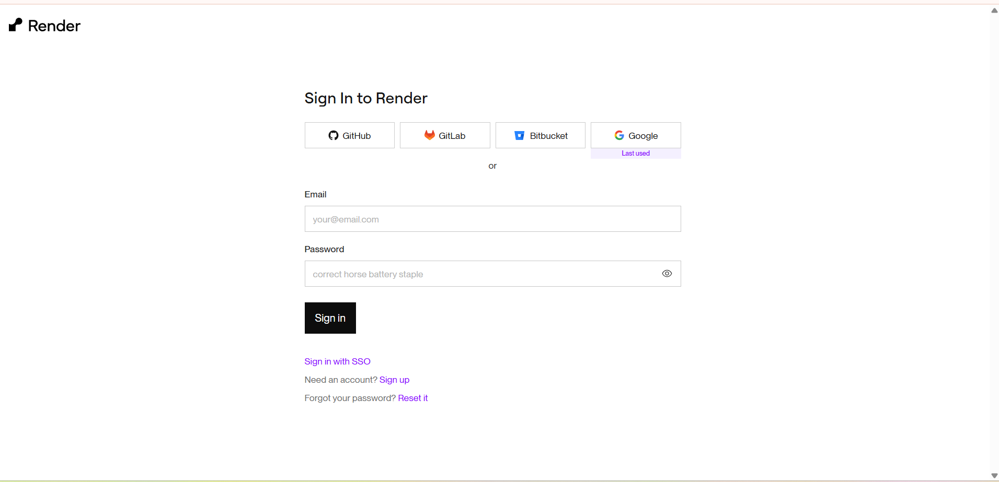
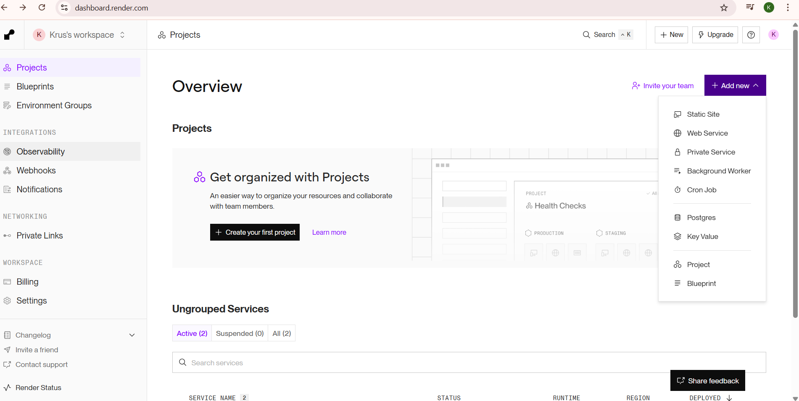
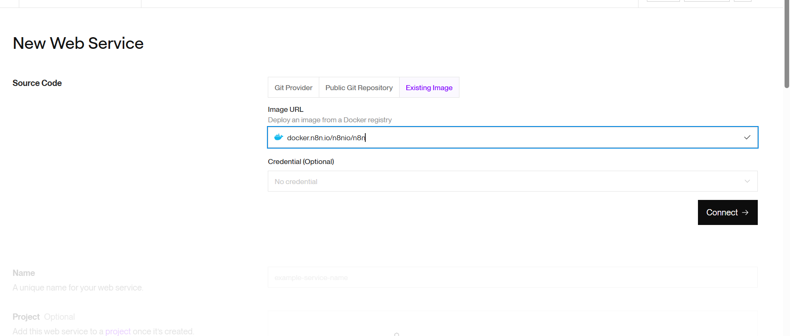
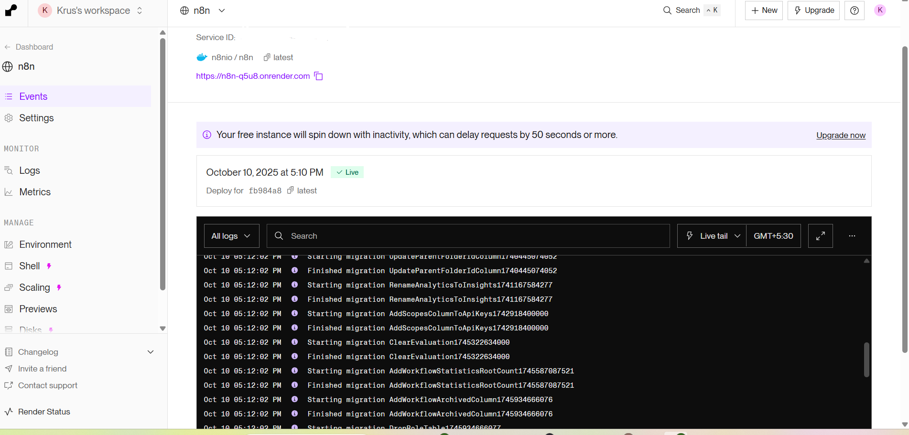
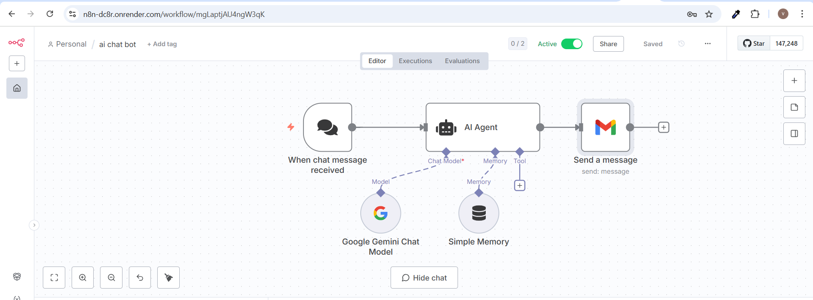
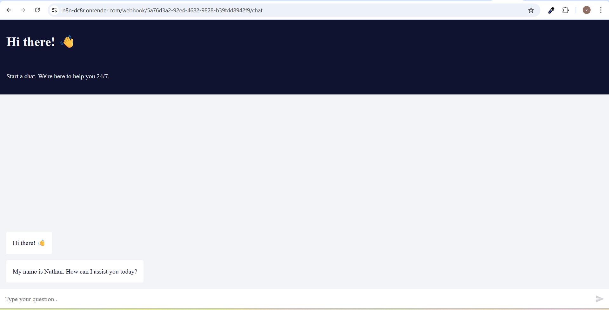

# n8n on Render.com — AI Chat Bot (Production URL on Render)

This guide upgrades your **local n8n** workflow to a **Render.com** deployment and then recreates the **AI Agent chat workflow**. 
It follows the same structure as your local guide, but **the production URL is your Render service URL.**

---

## What You’ll Build
- A live **n8n** instance hosted on **Render** using the official Docker image.
- The **AI Agent** chat workflow (Chat Trigger → AI Agent → Gmail) using Google Gemini and Simple Memory, identical to your local flow.
- A production-ready **public webhook URL** on Render for your chat UI or any client to call.

---  

## Prerequisites
- A **Render** account.
- (Recommended) A Render **PostgreSQL** database for persistence (SQLite on ephemeral disk will lose data on redeploy).
- **Google Gemini (PaLM/Gemini) API credential**.
- **Gmail OAuth2** credential to send email.
- Your previous local README for reference (we mirror that workflow here).

---

## Part A — Deploy n8n on Render (Existing Image)

### 1) Create a Render account & sign in


- Go to https://render.com and sign up / sign in.

### 2) Click **Add New → Web Service**


- In the left sidebar choose **Projects** (or stay on Overview).
- Click **Add new** → **Web Service**.

### 3) Choose **Existing Image** and paste the official image

```docker.n8n.io/n8nio/n8n```

- Tab: **Existing Image**
- **Image URL:** `docker.n8n.io/n8nio/n8n`

### 4) Basic service settings
- **Service Name:** `n8n` (or any unique name)
- **Region:** pick closest to your users
- **Plan:** start with the free tier to test; upgrade for reliability
-direct go to step 6 as 5 is optional


### 5) Optional  Environment variables (minimum)
Add the following under **Environment**:

```
N8N_PROTOCOL=https
N8N_HOST=<your-service-name>.onrender.com
WEBHOOK_URL=https://<your-service-name>.onrender.com
N8N_EDITOR_BASE_URL=https://<your-service-name>.onrender.com
N8N_ENCRYPTION_KEY=<generate-a-32-plus-char-secret>
N8N_BASIC_AUTH_ACTIVE=true
N8N_BASIC_AUTH_USER=admin
N8N_BASIC_AUTH_PASSWORD=<strong-password>
N8N_DIAGNOSTICS_ENABLED=false
NODE_ENV=production
```

**Optional (Postgres persistence):**
If you created Render PostgreSQL, add:
```
DB_TYPE=postgresdb
DB_POSTGRESDB_HOST=<render-postgres-host>
DB_POSTGRESDB_PORT=5432
DB_POSTGRESDB_DATABASE=<db-name>
DB_POSTGRESDB_USER=<db-user>
DB_POSTGRESDB_PASSWORD=<db-password>
DB_POSTGRESDB_SSL_CA=<leave empty unless provided>
```

### 6) Create & deploy
- Click **Create Web Service**. Render will pull the image and start n8n.
- Wait until the service shows **Live**.


### 7) Open your service URL


- Click the public URL (for example: `https://<your-service-name>.onrender.com`).
- You’ll see n8n’s login or setup screen. Log in or create the initial owner.
- If you enabled Basic Auth, you’ll be prompted for those credentials first.

> From now on, **this URL is your production URL.** You’ll use it for webhooks and your chat UI.

---

## Part B — Build the AI Agent Chat Workflow (same as your local guide)

**High-level flow** (unchanged):
```
When chat message received ──▶ AI Agent ──▶ Send a message (Gmail)
                                   ▲               
         Google Gemini Chat Model ─┘
         Simple Memory ────────────┘
```


### Step 1 — Create a New Workflow
1. In n8n, click **Workflows → New**.
2. Name it: `ai chat bot` and **Save**.

### Step 2 — Add the Chat Trigger
**Node:** `When chat message received`
- **Public:** `true` (so it exposes a public endpoint on Render)
- Copy the **Public URL**. It will look like:
  `https://<your-service-name>.onrender.com/webhook/<id>`

**Minimal node JSON:**
```json
{
  "name": "When chat message received",
  "type": "@n8n/n8n-nodes-langchain.chatTrigger",
  "typeVersion": 1.3,
  "parameters": { "public": true, "options": {} }
}
```

### Step 3 — Add the AI Agent
**Node:** `AI Agent`
- Keep default Agent mode.
```json
{
  "name": "AI Agent",
  "type": "@n8n/n8n-nodes-langchain.agent",
  "typeVersion": 2.2,
  "parameters": { "options": {} }
}
```

### Step 4 — Add the Google Gemini Chat Model
Configure with your Gemini credential.
```json
{
  "name": "Google Gemini Chat Model",
  "type": "@n8n/n8n-nodes-langchain.lmChatGoogleGemini",
  "typeVersion": 1,
  "parameters": {}
}
```

### Step 5 — Add Memory (Conversation Buffer)
```json
{
  "name": "Simple Memory",
  "type": "@n8n/n8n-nodes-langchain.memoryBufferWindow",
  "typeVersion": 1.3,
  "parameters": {}
}
```

### Step 6 — Add Gmail to Send the Transcript
```json
{
  "name": "Send a message",
  "type": "n8n-nodes-base.gmail",
  "typeVersion": 2.1,
  "parameters": {
    "sendTo": "you@example.com",
    "subject": "Chat History",
    "emailType": "text",
    "message": "=input  : {{ $('When chat message received').item.json.chatInput }}\noutput : {{ $json.output }}",
    "options": { "appendAttribution": false }
  }
}
```

### Step 7 — Wire the nodes
- **Chat Trigger → AI Agent** (main → main)
- **Gemini → AI Agent** (ai_languageModel → ai_languageModel)
- **Simple Memory → AI Agent** (ai_memory → ai_memory)
- **AI Agent → Gmail** (main → main)

### Step 8 — Activate & test
Send a test message to your **production Render URL**:

```bash
curl -X POST https://<your-service-name>.onrender.com/webhook/<id>   -H 'Content-Type: application/json'   -d '{"chatInput":"Hello from Render!"}'
```

You should receive an email titled **“Chat History”** with the input and the AI’s output.

---

## Troubleshooting (Render)
- **502 / failed healthcheck:** Ensure your app listens on `$PORT`. Use the **Start Command** shown above.
- **Webhook 404/401:** Verify the workflow is **Active** and you copied the **Public URL** from the Chat Trigger.
- **No AI output:** Check Gemini credentials and the llm port connection into **AI Agent**.
- **Emails not sending:** Re-auth the Gmail OAuth2, confirm scopes.
- **Data loss after deploy:** Use **PostgreSQL** instead of SQLite for persistence.
