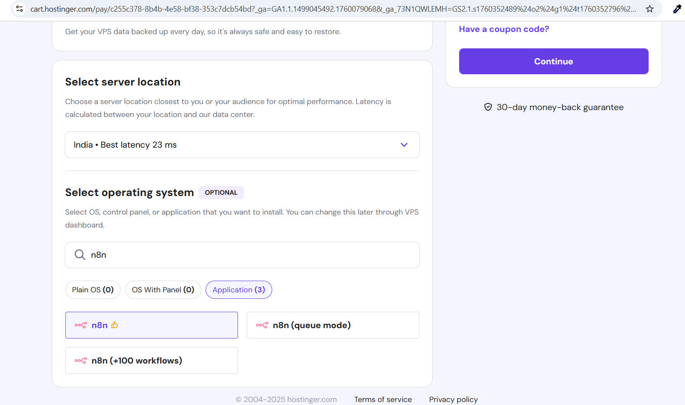
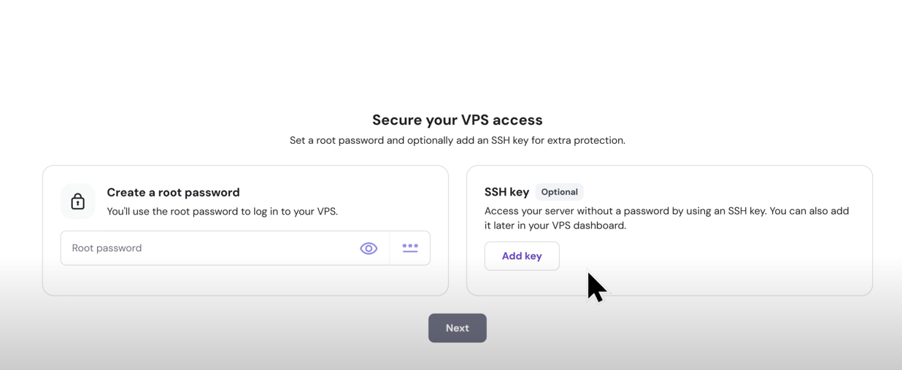
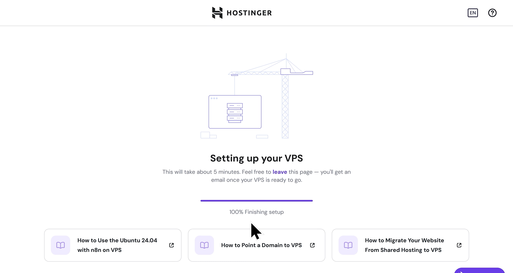
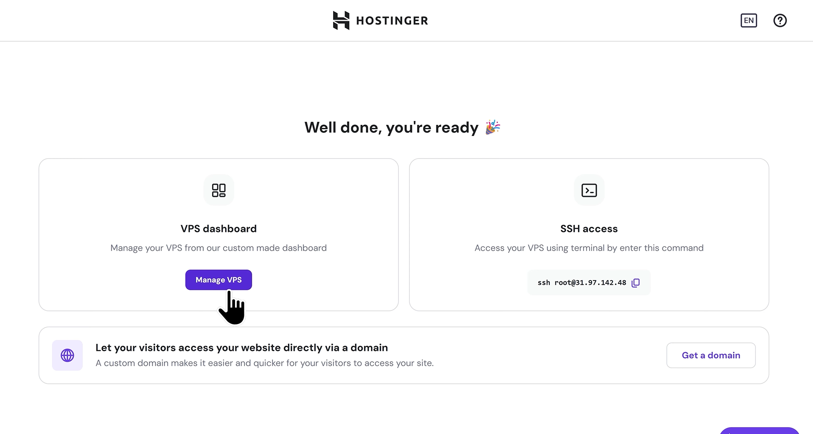
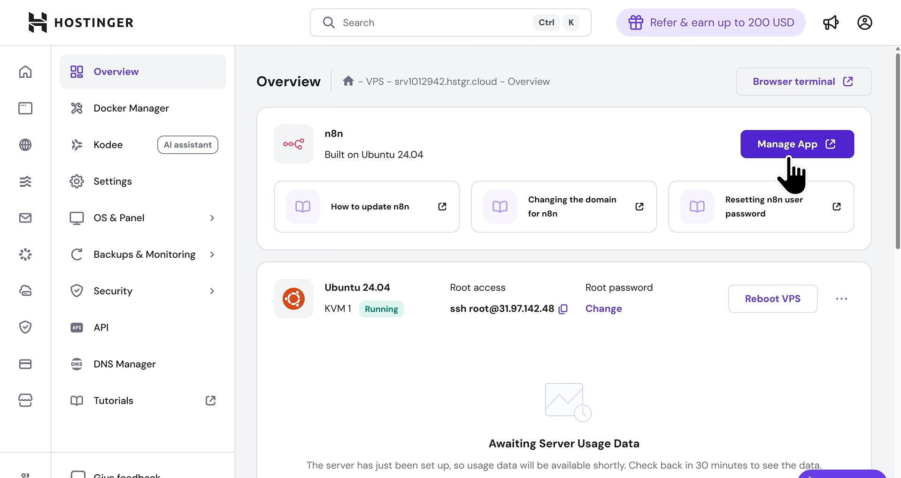

# n8n AI Chat Bot Workflow on Hostinger VPS

This README converts your local n8n guide into a production‑style deploy on **Hostinger VPS** using their prebuilt **n8n on Ubuntu 24.04** image. 

Use this when you want a predictable public URL and 24×7 uptime instead of running on localhost.

---

## What You Will Deploy
A minimal chat pipeline identical to the local guide:

```
When chat message received ──▶ AI Agent ──▶ Gmail: Send a message
                             ▲            ▲
          Google Gemini Chat Model    Simple Memory
```

---

## Prerequisites
- Hostinger account and a VPS plan that supports the **n8n** application image.
- A domain (optional but recommended).
- Google Gemini API key and Gmail OAuth2 credential ready to connect inside n8n.
- The local guide file for reference (`AiChatModel-Local.md`).

---

## Step 1 — Open the Hostinger n8n page
1. Open: https://www.hostinger.com/self-hosted-n8n
2. Click **Get started**.

> Choose a location near your users for lower latency.



---

## Step 2 — Purchase and initialize the VPS
1. Sign in or create a Hostinger account.
2. Pick a plan, region, and the **Application → n8n** image.
3. Set a strong **root password** (or add an SSH key).



4. Click **Next** and wait for provisioning to finish.



---

## Step 3 — Open the VPS dashboard
- From **Home → VPS**, select your new server to reach the **VPS dashboard**.



---

## Step 4 — Launch the n8n app
1. In the VPS dashboard, find the **n8n** card and click **Manage App**.
2. Use the **Open app** link (or copy the public URL shown) to load n8n in your browser.



> If you own a domain, point it to the VPS and (optionally) configure HTTPS. You can keep using the public URL/IP while you test.

---

## Step 5 — First‑time n8n sign‑up
When n8n opens for the first time:
1. Create the **Owner** account (email + password).
2. In **Settings → Credentials**, connect:
   - **Google Gemini** (PaLM/Gemini) API key
   - **Gmail OAuth2** for sending mail

---

## Step 6-Workflow
Follow the exact steps below. Each step has: a **clear node instruction**, **operation**, **mode** (when relevant), **drag-and-drop guide**, and **copyable code**.

### Step A — Create a New Workflow
1. In n8n, click **Workflows** → **New**.
2. **Name** it: `ai chat bot`.
3. Click **Save**.

```
# No code for this step; just create and name the workflow.
```

---

### Step B — Add the Chat Trigger
**Node:** `When chat message received`

**Drag & Drop Guide:**
1. In the left **Nodes** panel, search for **Chat Trigger** (it may appear under LangChain/LangSmith integration pack if installed; exact catalog name can vary by version). 
2. Drag **When chat message received** onto the canvas.

**Clear Operation / Mode:**
- **Public:** set to `true` (so the trigger exposes a public endpoint for incoming chat messages)
- Leave other options as default unless instructed by your environment.

**Copyable minimal node JSON:**
```json
{
  "name": "When chat message received",
  "type": "@n8n/n8n-nodes-langchain.chatTrigger",
  "typeVersion": 1.3,
  "parameters": {
    "public": true,
    "options": {}
  }
}
```

**Get the public URL:**
- Open the node → copy the **Public URL** shown by n8n (varies per install). You will use it during testing.

---

### Step C — Add the AI Agent
**Node:** `AI Agent`

**Drag & Drop Guide:**
1. Search for **AI Agent** in the Nodes panel.
2. Drag it to the canvas **to the right** of the Chat Trigger.
3. Connect **When chat message received → AI Agent** using the standard **main** output to **main** input.

**Clear Operation / Mode:**
- Keep the default **Agent** mode (suitable for a general chat completion agent). You can fine-tune later.
- This node expects a **Language Model** and optional **Memory** to be wired into its special ports.

**Copyable minimal node JSON:**
```json
{
  "name": "AI Agent",
  "type": "@n8n/n8n-nodes-langchain.agent",
  "typeVersion": 2.2,
  "parameters": {
    "options": {}
  }
}
```

---

### Step D — Add the Google Gemini Chat Model
**Node:** `Google Gemini Chat Model`

**Drag & Drop Guide:**
1. Search for **Google Gemini Chat Model**.
2. Drag it onto the canvas **below-left** of the AI Agent.
3. Connect its **Language Model** output to the **AI Agent**’s **ai_languageModel** input.

**Clear Operation / Mode:**
- Configure **credentials** for Gemini (PaLM/Gemini API). Choose your account in the node’s **Credentials** dropdown.
- Leave model parameters (temperature, topP, etc.) at defaults for now.

**Copyable minimal node JSON:**
```json
{
  "name": "Google Gemini Chat Model",
  "type": "@n8n/n8n-nodes-langchain.lmChatGoogleGemini",
  "typeVersion": 1,
  "parameters": {}
}
```

---

### Step E — Add Memory (Conversation Buffer)
**Node:** `Simple Memory`

**Drag & Drop Guide:**
1. Search for **Simple Memory** (a buffer window memory helper).
2. Drag it onto the canvas **below-right** of the AI Agent.
3. Connect its output to the **AI Agent**’s **ai_memory** input.

**Clear Operation / Mode:**
- Default **buffer window** memory. No change required.

**Copyable minimal node JSON:**
```json
{
  "name": "Simple Memory",
  "type": "@n8n/n8n-nodes-langchain.memoryBufferWindow",
  "typeVersion": 1.3,
  "parameters": {}
}
```

---

### Step F — Add Gmail to Send the Transcript
**Node:** `Send a message` (Gmail)

**Drag & Drop Guide:**
1. Search for **Gmail**.
2. Drag **Send a message** onto the canvas **to the right** of the AI Agent.
3. Connect **AI Agent → Send a message (Gmail)** using the **main** output.

**Clear Operation / Mode:**
- **Operation:** Send a message
- **Email Type:** `text`
- **To (sendTo):** set the recipient address you control
- **Subject:** `Chat History`
- **Message:** use an expression that includes the user input from the trigger and the AI Agent’s output

**Copyable Gmail message expression:**
```
=input  : {{ $('When chat message received').item.json.chatInput }}
output : {{ $json.output }}
```

**Copyable minimal node JSON:**
```json
{
  "name": "Send a message",
  "type": "n8n-nodes-base.gmail",
  "typeVersion": 2.1,
  "parameters": {
    "sendTo": "you@example.com",
    "subject": "Chat History",
    "emailType": "text",
    "message": "=input  : {{ $('When chat message received').item.json.chatInput }}\noutput : {{ $json.output }}",
    "options": { "appendAttribution": false }
  }
}
```

Credential Note: Configure the **Gmail OAuth2** credential on this node before executing. Ensure the account has permission to send email.

---

### Step G — Wire Everything Correctly
Use these exact connections:

1. **When chat message received** `main` → **AI Agent** `main`
2. **Google Gemini Chat Model** `ai_languageModel` → **AI Agent** `ai_languageModel`
3. **Simple Memory** `ai_memory` → **AI Agent** `ai_memory`
4. **AI Agent** `main` → **Send a message (Gmail)** `main`

**Copyable connections JSON (reference):**
```json
{
  "connections": {
    "When chat message received": { "main": [[{ "node": "AI Agent", "type": "main", "index": 0 }]] },
    "Google Gemini Chat Model": { "ai_languageModel": [[{ "node": "AI Agent", "type": "ai_languageModel", "index": 0 }]] },
    "Simple Memory": { "ai_memory": [[{ "node": "AI Agent", "type": "ai_memory", "index": 0 }]] },
    "AI Agent": { "main": [[{ "node": "Send a message", "type": "main", "index": 0 }]] }
  }
}
```

---

### Step H — Save and (Optionally) Activate
1. Click **Save**.
2. To receive external events, toggle **Active** on. For local-only testing, you can keep it inactive and use the **Test** features depending on node capabilities. For webhooks/triggers, activation is typically required.

```
Tip: In Settings, the workflow uses executionOrder v1 by default.
```

---


## Step I — Activate and test
1. Toggle the workflow **Active**.
2. Open the **When chat message received** node and copy its **Public URL**.
3. Send a test request:

```bash
curl -X POST <YOUR_N8N_PUBLIC_URL>   -H 'Content-Type: application/json'   -d '{{"chatInput":"Hello from Hostinger"}}'
```

Expected: the **Gmail** node sends an email with both the input and the AI output.

---

## Hardening checklist (recommended)
- Add a domain and HTTPS. Keep your Owner password long and unique.
- Limit credentials to least privilege. Rotate API keys regularly.
- Create separate **dev/staging/prod** workflows and credentials.
- Back up workflows and credentials securely.
- Avoid exporting secrets inside workflow JSON; use environment variables where applicable.

---

