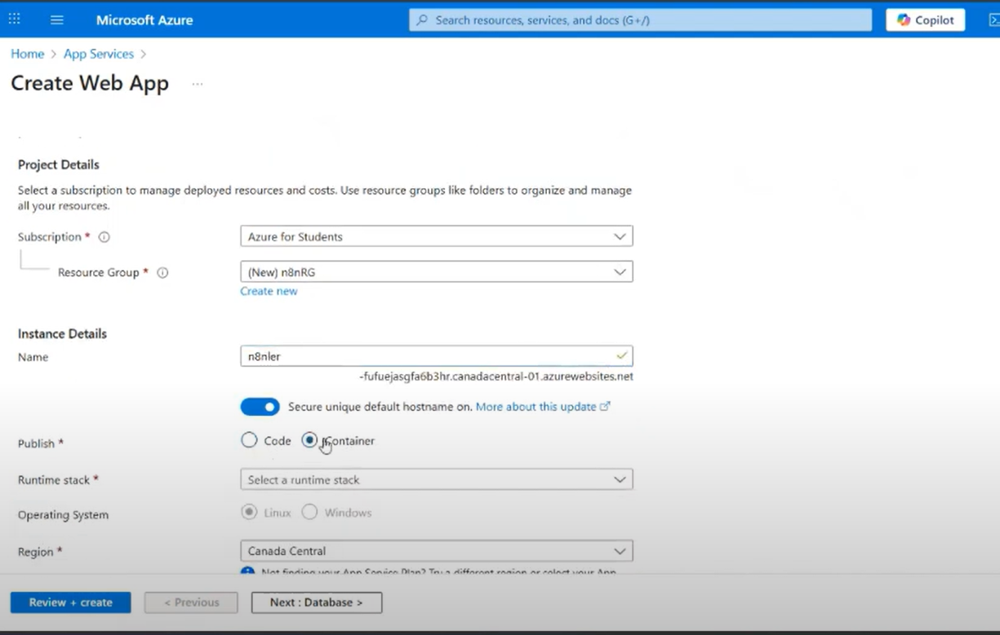
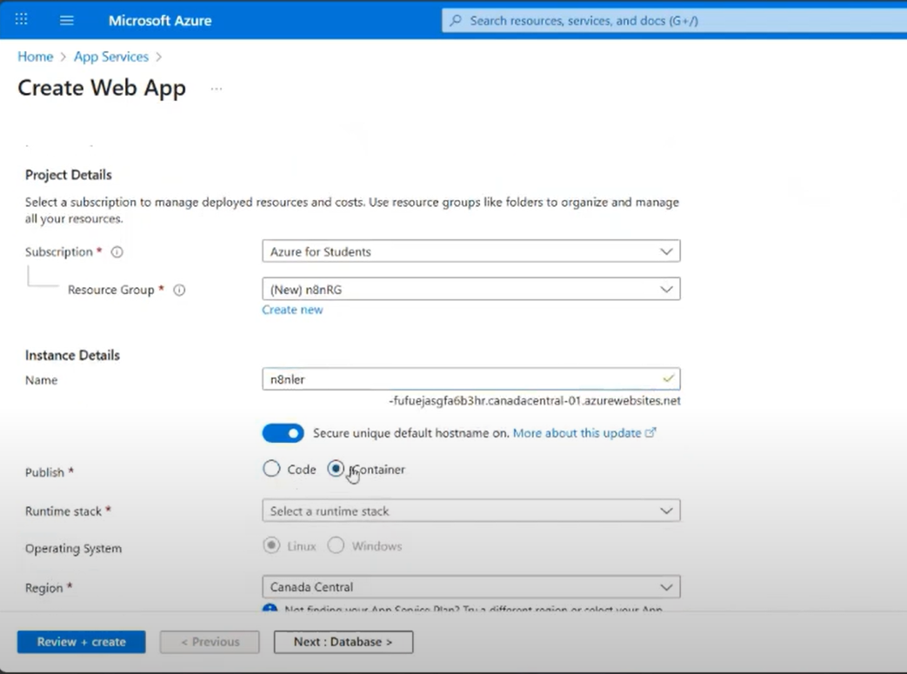
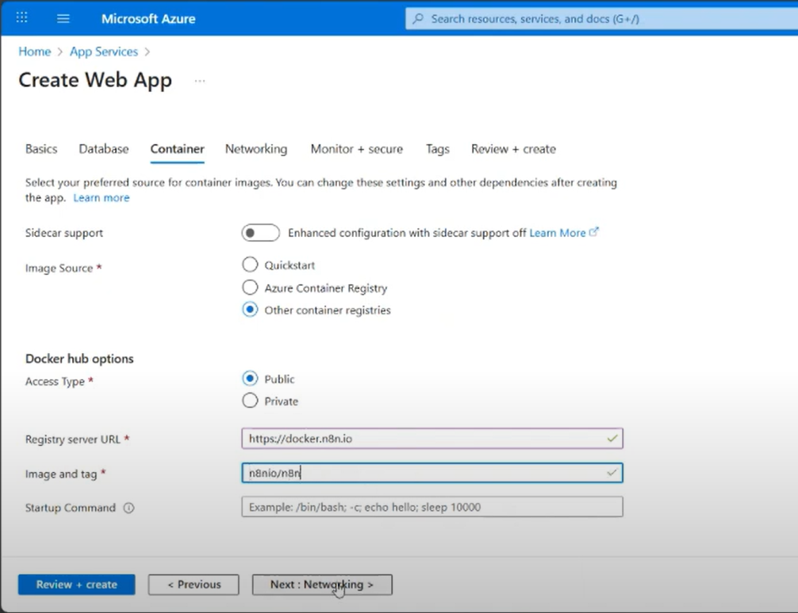
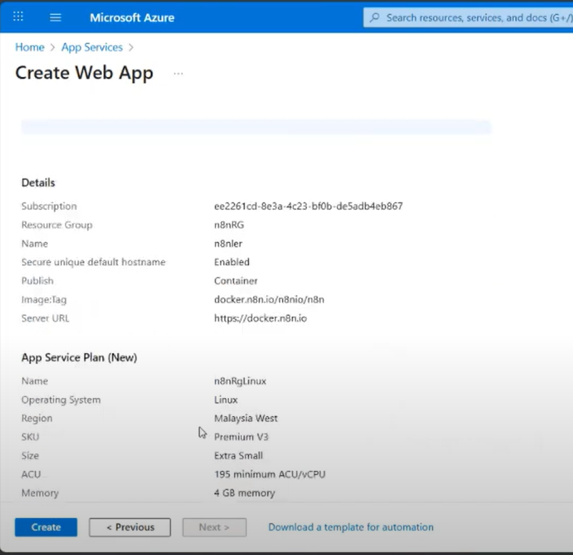
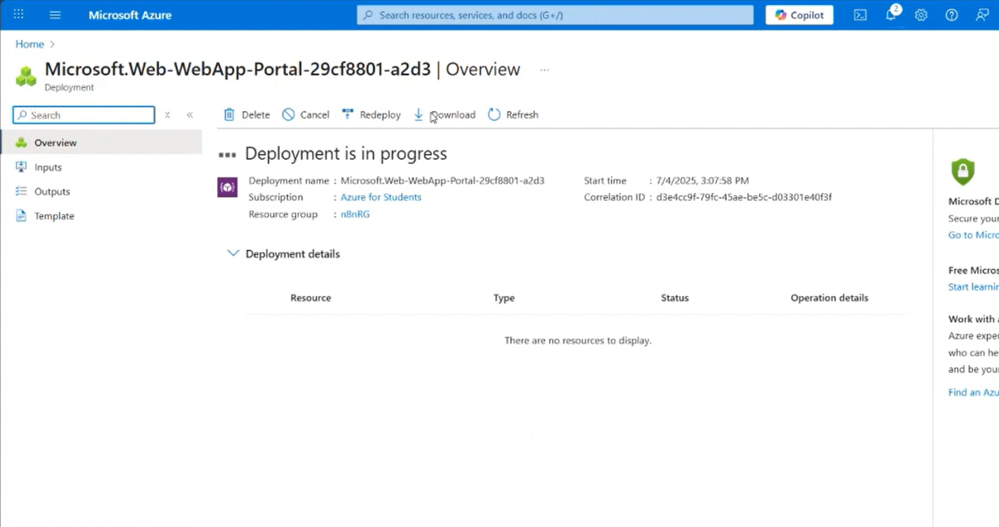

# n8n on Microsoft Azure (Docker) — Step‑by‑Step README

Goal: Deploy the official n8n Docker image to **Azure App Service (Linux)** with persistent storage, correct time zone, and working webhooks.

---

## 1) Prerequisites

- Azure subscription.
- App Service Plan with **Linux** runtime (B1 or higher recommended for “Always On”).
- A globally unique app name (e.g., `my-n8n-azure`).

---

## 2) Wire Diagram (Who Talks to Whom)

```
You (Browser) → Azure Web App (Linux/windows) → n8n Docker Container (listening on 5678)
                                  ↘
                                 Webhooks (public HTTPS)
```

Azure forwards traffic to the container port you set (`WEBSITES_PORT=5678`).

---

## 3) Create the Web App in the Azure Portal (Click‑Path)

1) **Sign in** to Azure Portal  
   
2) **Create a resource → Web App**  
   

3) **Basics**  
   - Subscription / Resource group: choose or create  
   - **Name**: `my-n8n-azure` (must be unique)  
   - **Publish**: **Docker Container**  
   - **Operating System**: **Linux** or **Windows**  
   - **Region**: India (e.g., Central India / South India / West India)  
   - **Plan**: B1 or higher (so you can enable **Always On**)  
     
     
   

4) **Container**  
   - **Image Source**: Public Registry (Docker Hub or other)  
   - **Image and Tag**: `docker.n8n.io/n8nio/n8n:latest`  
   - Leave credentials blank (public image).  
     
   

5) **Create** the Web App.

---

## 4) Configure Environment Variables (Azure → Web App → Configuration)

Open your new Web App → **Settings → Environment variables** and add the following. Save, then **Restart** the app.

### 4.1 Required App Service Settings

```env
# Forward Azure to the container's internal port
WEBSITES_PORT=5678

# Persist /home across restarts/scale-out (n8n stores in /home/node/.n8n)
WEBSITES_ENABLE_APP_SERVICE_STORAGE=true
```

### 4.2 Time Zone (India)

```env
TZ=Asia/Kolkata
# Optionally also (Linux App Service supports this):
WEBSITE_TIME_ZONE=Asia/Kolkata
```

### 4.3 n8n Base URL & Webhooks

```env
# Replace <yourapp> with your app name
N8N_HOST=<yourapp>.azurewebsites.net
N8N_PORT=5678
N8N_PROTOCOL=https
WEBHOOK_URL=https://<yourapp>.azurewebsites.net/
```

### 4.4 Security & Stability

```env
NODE_ENV=production
N8N_DIAGNOSTICS_ENABLED=false
N8N_ENCRYPTION_KEY=<generate-a-strong-random-hex>   # keep this safe
N8N_SECURE_COOKIE=true
```

After saving, **Restart** the Web App.  


---

## 5) First Launch & Login

Open in a browser:  
```
https://<yourapp>.azurewebsites.net/
```
You should see the n8n onboarding/login page.  


If you get secure-cookie or URL warnings, confirm `N8N_HOST`, `N8N_PROTOCOL=https`, and `WEBHOOK_URL` are correct.

---

## 6) Quick “Drag & Drop” Check — Minimal Workflow

Purpose: verify public webhooks end‑to‑end.

### Step 1 — Create a New Workflow
1. In n8n, click **Workflows** → **New**.
2. **Name** it: `ai chat bot`.
3. Click **Save**.

```
# No code for this step; just create and name the workflow.
```

---

### Step 2 — Add the Chat Trigger
**Node:** `When chat message received`

**Drag & Drop Guide:**
1. In the left **Nodes** panel, search for **Chat Trigger** (it may appear under LangChain/LangSmith integration pack if installed; exact catalog name can vary by version). 
2. Drag **When chat message received** onto the canvas.

**Clear Operation / Mode:**
- **Public:** set to `true` (so the trigger exposes a public endpoint for incoming chat messages)
- Leave other options as default unless instructed by your environment.

**Copyable minimal node JSON:**
```json
{
  "name": "When chat message received",
  "type": "@n8n/n8n-nodes-langchain.chatTrigger",
  "typeVersion": 1.3,
  "parameters": {
    "public": true,
    "options": {}
  }
}
```

**Get the public URL:**
- Open the node → copy the **Public URL** shown by n8n (varies per install). You will use it during testing.

---

### Step 3 — Add the AI Agent
**Node:** `AI Agent`

**Drag & Drop Guide:**
1. Search for **AI Agent** in the Nodes panel.
2. Drag it to the canvas **to the right** of the Chat Trigger.
3. Connect **When chat message received → AI Agent** using the standard **main** output to **main** input.

**Clear Operation / Mode:**
- Keep the default **Agent** mode (suitable for a general chat completion agent). You can fine-tune later.
- This node expects a **Language Model** and optional **Memory** to be wired into its special ports.

**Copyable minimal node JSON:**
```json
{
  "name": "AI Agent",
  "type": "@n8n/n8n-nodes-langchain.agent",
  "typeVersion": 2.2,
  "parameters": {
    "options": {}
  }
}
```

---

### Step 4 — Add the Google Gemini Chat Model
**Node:** `Google Gemini Chat Model`

**Drag & Drop Guide:**
1. Search for **Google Gemini Chat Model**.
2. Drag it onto the canvas **below-left** of the AI Agent.
3. Connect its **Language Model** output to the **AI Agent**’s **ai_languageModel** input.

**Clear Operation / Mode:**
- Configure **credentials** for Gemini (PaLM/Gemini API). Choose your account in the node’s **Credentials** dropdown.
- Leave model parameters (temperature, topP, etc.) at defaults for now.

**Copyable minimal node JSON:**
```json
{
  "name": "Google Gemini Chat Model",
  "type": "@n8n/n8n-nodes-langchain.lmChatGoogleGemini",
  "typeVersion": 1,
  "parameters": {}
}
```

---

### Step 5 — Add Memory (Conversation Buffer)
**Node:** `Simple Memory`

**Drag & Drop Guide:**
1. Search for **Simple Memory** (a buffer window memory helper).
2. Drag it onto the canvas **below-right** of the AI Agent.
3. Connect its output to the **AI Agent**’s **ai_memory** input.

**Clear Operation / Mode:**
- Default **buffer window** memory. No change required.

**Copyable minimal node JSON:**
```json
{
  "name": "Simple Memory",
  "type": "@n8n/n8n-nodes-langchain.memoryBufferWindow",
  "typeVersion": 1.3,
  "parameters": {}
}
```

---

### Step 6 — Add Gmail to Send the Transcript
**Node:** `Send a message` (Gmail)

**Drag & Drop Guide:**
1. Search for **Gmail**.
2. Drag **Send a message** onto the canvas **to the right** of the AI Agent.
3. Connect **AI Agent → Send a message (Gmail)** using the **main** output.

**Clear Operation / Mode:**
- **Operation:** Send a message
- **Email Type:** `text`
- **To (sendTo):** set the recipient address you control
- **Subject:** `Chat History`
- **Message:** use an expression that includes the user input from the trigger and the AI Agent’s output

**Copyable Gmail message expression:**
```
=input  : {{ $('When chat message received').item.json.chatInput }}
output : {{ $json.output }}
```

**Copyable minimal node JSON:**
```json
{
  "name": "Send a message",
  "type": "n8n-nodes-base.gmail",
  "typeVersion": 2.1,
  "parameters": {
    "sendTo": "you@example.com",
    "subject": "Chat History",
    "emailType": "text",
    "message": "=input  : {{ $('When chat message received').item.json.chatInput }}\noutput : {{ $json.output }}",
    "options": { "appendAttribution": false }
  }
}
```

Credential Note: Configure the **Gmail OAuth2** credential on this node before executing. Ensure the account has permission to send email.

---

### Step 7 — Wire Everything Correctly
Use these exact connections:

1. **When chat message received** `main` → **AI Agent** `main`
2. **Google Gemini Chat Model** `ai_languageModel` → **AI Agent** `ai_languageModel`
3. **Simple Memory** `ai_memory` → **AI Agent** `ai_memory`
4. **AI Agent** `main` → **Send a message (Gmail)** `main`

**Copyable connections JSON (reference):**
```json
{
  "connections": {
    "When chat message received": { "main": [[{ "node": "AI Agent", "type": "main", "index": 0 }]] },
    "Google Gemini Chat Model": { "ai_languageModel": [[{ "node": "AI Agent", "type": "ai_languageModel", "index": 0 }]] },
    "Simple Memory": { "ai_memory": [[{ "node": "AI Agent", "type": "ai_memory", "index": 0 }]] },
    "AI Agent": { "main": [[{ "node": "Send a message", "type": "main", "index": 0 }]] }
  }
}
```

---

### Step 8 — Save and (Optionally) Activate
1. Click **Save**.
2. To receive external events, toggle **Active** on. For local-only testing, you can keep it inactive and use the **Test** features depending on node capabilities. For webhooks/triggers, activation is typically required.

```
   ```
   https://<yourapp>.azurewebsites.net/webhook/health-check
   ```
   Expected: `OK from Azure n8n`  
  
---

## 7) Azure CLI — One‑Shot Setup (Alternative to Portal)

Run in **Azure Cloud Shell** or local `az` after `az login`.

```bash
# ===== Variables =====
RG=n8n-rg
LOC="CentralIndia"        # or SouthIndia / WestIndia
PLAN=n8n-plan
APP=my-n8n-azure          # must be globally unique
IMG="docker.n8n.io/n8nio/n8n:latest"

# ===== Resource Group =====
az group create -n $RG -l "$LOC"

# ===== Linux App Service Plan (B1) =====
az appservice plan create -g $RG -n $PLAN --sku B1 --is-linux

# ===== Web App for Containers (Linux) =====
az webapp create -g $RG -p $PLAN -n $APP   --deployment-container-image-name $IMG

# ===== App Settings (Environment Variables) =====
APP_FQDN="$APP.azurewebsites.net"
ENCRYPTION_KEY="$(openssl rand -hex 32)"   # save this securely!

az webapp config appsettings set -g $RG -n $APP --settings   WEBSITES_PORT=5678   WEBSITES_ENABLE_APP_SERVICE_STORAGE=true   TZ=Asia/Kolkata   WEBSITE_TIME_ZONE=Asia/Kolkata   NODE_ENV=production   N8N_DIAGNOSTICS_ENABLED=false   N8N_ENCRYPTION_KEY="$ENCRYPTION_KEY"   N8N_HOST="$APP_FQDN"   N8N_PORT=5678   N8N_PROTOCOL=https   WEBHOOK_URL="https://$APP_FQDN/"   N8N_SECURE_COOKIE=true

# Optional: restart after changes
az webapp restart -g $RG -n $APP
```

---

## 8) Validate Quickly

```bash
APP=my-n8n-azure
curl -I https://$APP.azurewebsites.net/
# Expect HTTP/2 200 or an application response
```

If you created the test workflow:

```bash
curl https://$APP.azurewebsites.net/webhook/health-check
# OK from Azure n8n
```

---

## 9) Common Issues & Fixes

- **502/503 on start** → Ensure `WEBSITES_PORT=5678` is set.  
- **Data not persisting** → Ensure `WEBSITES_ENABLE_APP_SERVICE_STORAGE=true`.  
- **Secure cookie warning** → Keep `N8N_SECURE_COOKIE=true` and verify `N8N_HOST`, `N8N_PROTOCOL`, `WEBHOOK_URL`.  
- **Timezone still UTC** → Use `TZ=Asia/Kolkata` (and optionally `WEBSITE_TIME_ZONE=Asia/Kolkata`). Restart app.

---

## 10) Map Your Provided Variables → Correct Keys

You provided:

```
website-enable-appservice-storage=true
Generic_TIMEZONE=INDIA TIME ZONE
N8N_PORT=5678
N8N_PROTOCOL=http
N8N_Host
WEEBHOOK_URL
```

Use these corrected keys/values:

```env
WEBSITES_ENABLE_APP_SERVICE_STORAGE=true
WEBSITES_PORT=5678

TZ=Asia/Kolkata
WEBSITE_TIME_ZONE=Asia/Kolkata

N8N_HOST=<yourapp>.azurewebsites.net
N8N_PORT=5678
N8N_PROTOCOL=https
WEBHOOK_URL=https://<yourapp>.azurewebsites.net/

N8N_ENCRYPTION_KEY=<strong-random-hex>
N8N_SECURE_COOKIE=true
NODE_ENV=production
N8N_DIAGNOSTICS_ENABLED=false
```

---

## 11) Next Steps (Optional)

- Enable **Always On** (General settings) for lower latency.
- Add a custom domain and TLS.
- Export/backup n8n credentials & workflows regularly.
