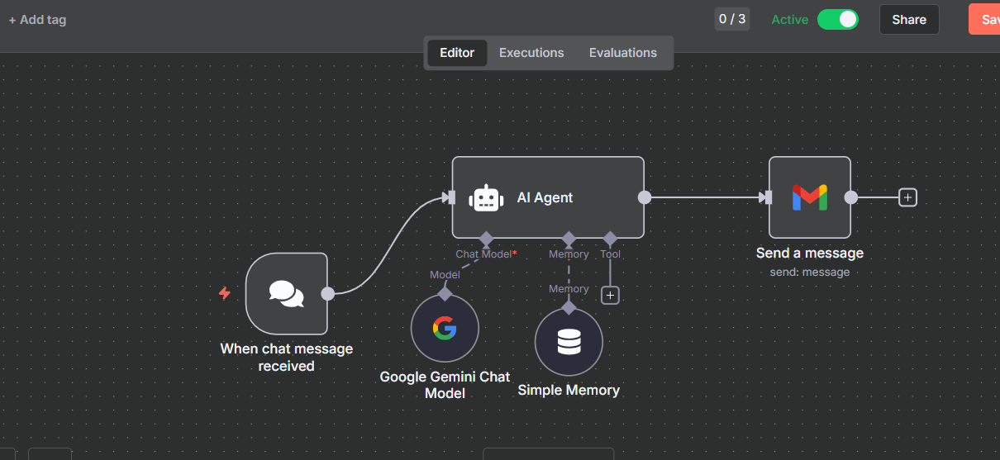

# n8n on **Microsoft Azure App Service (PaaS)** — Docker (Single Container) README

**Goal:** Run the official n8n Docker image on **Azure App Service for Linux** with persistent storage, correct time zone, HTTPS, custom domain, and working webhooks.

---

## 1) Prerequisites

- Azure subscription  
- App Service Plan (Linux) — **Basic (B1) or higher** recommended  
- Optional: a custom domain (for production HTTPS)  
- Credentials for any integrations you’ll use (Gmail, Gemini, etc.)

---

## 2) Wire Diagram (Who Talks to Whom)

```
You (Browser) → DNS → Azure Frontend → Azure App Service (Linux)
                                          ↳ Your n8n Docker container (listens on :5678)
                                          ↳ /home mounted persistent storage
```

- Public ports exposed by App Service: 80/443  
- Container listens internally on **5678** (must be declared to App Service)

---

## 3) Create the Web App (Portal Click-Path)

1) **Azure Portal → Create a resource → Web App**  
2) **Basics**
   - Subscription / Resource Group: choose or create
   - Name: `n8n-webapp` (this becomes `https://n8n-webapp.azurewebsites.net`)
   - Publish: **Docker Container**
   - Operating System: **Linux**
   - Region: India (e.g., Central India / South India / West India)
   - App Service Plan: **Create new** or select existing (Linux B1+)
3) **Docker**
   - Options: **Single Container**
   - Image Source: **Other registry**
   - Registry server URL: `https://docker.n8n.io`
   - Image and tag: `n8nio/n8n:latest`
4) **Review + Create** → **Create**

After deployment, open the Web App’s blade.

---

## 4) Configure Container Port & Storage

**Settings → Configuration → Application settings → New application setting**  
Add the following keys (exact names):

```
WEBSITES_PORT = 5678
WEBSITES_ENABLE_APP_SERVICE_STORAGE = true
```

- `WEBSITES_PORT` tells App Service which port your container exposes.  
- `WEBSITES_ENABLE_APP_SERVICE_STORAGE=true` enables the persistent `/home` mount inside the container, so your n8n data survives restarts.

Click **Save** to restart.

---

## 5) Add n8n Environment Variables (Production-Safe)

Still under **Configuration → Application settings**, add:

```
TZ = Asia/Kolkata
NODE_ENV = production
N8N_DIAGNOSTICS_ENABLED = false
N8N_HOST = n8n-webapp.azurewebsites.net     # or your custom domain later
N8N_PORT = 5678
N8N_PROTOCOL = https                         # use http if you are only testing default URL without TLS
WEBHOOK_URL = https://n8n-webapp.azurewebsites.net/
N8N_SECURE_COOKIE = true
N8N_ENCRYPTION_KEY = <paste-strong-random-hex>
```

Generate a strong key locally and paste:

```bash
openssl rand -hex 32
```

Optional (basic auth at the n8n UI):

```
# N8N_BASIC_AUTH_ACTIVE = true
# N8N_BASIC_AUTH_USER   = admin
# N8N_BASIC_AUTH_PASSWORD = change_me
```

Click **Save** to restart.

---

## 6) First Launch & Health Check

Open:

```
https://n8n-webapp.azurewebsites.net/
```

You should see the n8n onboarding/login screen.

If you see startup/port errors:
- Confirm **WEBSITES_PORT=5678**
- Confirm **N8N_PORT=5678**
- Check **Logs → Log stream** for container output

---

## 7) Custom Domain + HTTPS (Recommended)

1) **Custom domains → Add custom domain**, map your domain (CNAME → `n8n-webapp.azurewebsites.net`)  
2) After validation, **TLS/SSL settings → Private Key Certificates (Preview) → Create Managed Certificate** for your domain  
3) **Bindings**: bind the certificate to your hostname  
4) **Settings → TLS/SSL settings → HTTPS Only: On**

Then update n8n settings:

```
N8N_HOST = yourdomain.com
N8N_PROTOCOL = https
WEBHOOK_URL = https://yourdomain.com/
```

Save (restarts app).

---

## 8) Minimal Workflow (Drag & Drop) — Same Example

**Goal:** Verify public trigger, AI model call, memory, and Gmail.



### Step 1 — Create a New Workflow
1. In n8n, **Workflows → New**  
2. Name: `ai chat bot`  
3. Save

### Step 2 — Add the Chat Trigger
**Node:** `When chat message received` (public: true)

```json
{
  "name": "When chat message received",
  "type": "@n8n/n8n-nodes-langchain.chatTrigger",
  "typeVersion": 1.3,
  "parameters": { "public": true, "options": {} }
}
```

Copy the public URL from the node UI.

### Step 3 — AI Agent
```json
{
  "name": "AI Agent",
  "type": "@n8n/n8n-nodes-langchain.agent",
  "typeVersion": 2.2,
  "parameters": { "options": {} }
}
```

### Step 4 — Google Gemini Chat Model
```json
{
  "name": "Google Gemini Chat Model",
  "type": "@n8n/n8n-nodes-langchain.lmChatGoogleGemini",
  "typeVersion": 1,
  "parameters": {}
}
```

Configure Gemini credentials on this node.

### Step 5 — Simple Memory (Conversation Buffer)
```json
{
  "name": "Simple Memory",
  "type": "@n8n/n8n-nodes-langchain.memoryBufferWindow",
  "typeVersion": 1.3,
  "parameters": {}
}
```

### Step 6 — Gmail: Send Transcript
```json
{
  "name": "Send a message",
  "type": "n8n-nodes-base.gmail",
  "typeVersion": 2.1,
  "parameters": {
    "sendTo": "you@example.com",
    "subject": "Chat History",
    "emailType": "text",
    "message": "=input  : {{ $('When chat message received').item.json.chatInput }}\noutput : {{ $json.output }}",
    "options": { "appendAttribution": false }
  }
}
```

### Step 7 — Connections Reference
```json
{
  "connections": {
    "When chat message received": { "main": [[{ "node": "AI Agent", "type": "main", "index": 0 }]] } ,
    "Google Gemini Chat Model": { "ai_languageModel": [[{ "node": "AI Agent", "type": "ai_languageModel", "index": 0 }]] },
    "Simple Memory": { "ai_memory": [[{ "node": "AI Agent", "type": "ai_memory", "index": 0 }]] },
    "AI Agent": { "main": [[{ "node": "Send a message", "type": "main", "index": 0 }]] }
  }
}
```

Activate the workflow to enable the public endpoint.

---

## 9) Operational Tips

**Log stream (container logs):**  
Web App → **Logs → Log stream**

**Restart / Swap image tag:**  
Web App → **Overview → Restart**  
Web App → **Deployment → Containers** to change image or tag

**Always On:**  
Web App → **Configuration → General settings → Always On = On** (recommended for triggers and webhooks)

**Scale Up/Out:**  
- **Scale up** the App Service Plan tier for more CPU/RAM  
- **Scale out** instances; for webhooks ensure idempotent processing or external queue if needed

**Backups (data persistence):**  
n8n stores data in `/home/node/.n8n` (inside container).  
Because `/home` is persisted in App Service Linux, your credentials/workflows survive restarts.  
Export production workflows regularly (Workflows → Export) for disaster recovery.

---

## 10) Common Issues & Fixes

- **Container didn’t start / port error**  
  - Set `WEBSITES_PORT=5678`, `N8N_PORT=5678`, check Log stream  
- **Webhook or URL mismatch**  
  - Update `N8N_HOST`, `N8N_PROTOCOL`, `WEBHOOK_URL` to your final hostname and scheme  
- **Cookies / session warnings**  
  - Ensure `N8N_SECURE_COOKIE=true` with HTTPS; false for temporary HTTP testing only  
- **No persistence**  
  - Confirm `WEBSITES_ENABLE_APP_SERVICE_STORAGE=true` so `/home` is mounted  
- **Gmail sends failing**  
  - Configure Gmail OAuth correctly in the n8n Gmail node; check scopes & consent

---

## 11) Azure CLI — One-Shot Setup (Optional)

```bash
# variables
RG=n8n-rg
LOC="centralindia"
APPPLAN=n8n-plan
APPNAME=n8n-webapp    # must be globally unique
IMG="docker.n8n.io/n8nio/n8n:latest"

# resource group & plan
az group create -n $RG -l $LOC
az appservice plan create -n $APPPLAN -g $RG --is-linux --sku B1

# web app with container
az webapp create -n $APPNAME -g $RG --plan $APPPLAN   --deployment-container-image-name $IMG

# app settings
az webapp config appsettings set -g $RG -n $APPNAME --settings   WEBSITES_PORT=5678   WEBSITES_ENABLE_APP_SERVICE_STORAGE=true   TZ=Asia/Kolkata   NODE_ENV=production   N8N_DIAGNOSTICS_ENABLED=false   N8N_HOST="${APPNAME}.azurewebsites.net"   N8N_PORT=5678   N8N_PROTOCOL=https   WEBHOOK_URL="https://${APPNAME}.azurewebsites.net/"   N8N_SECURE_COOKIE=true   N8N_ENCRYPTION_KEY=$(openssl rand -hex 32)

# enable HTTPS Only (UI also available)
az webapp update -g $RG -n $APPNAME --set httpsOnly=true
```

---

## 12) Map Your Earlier Variables → Correct PaaS Keys

You had:

```
website-enable-appservice-storage=true
Generic_TIMEZONE=INDIA TIME ZONE
N8N_PORT=5678
N8N_PROTOCOL=http
N8N_Host
WEEBHOOK_URL
```

Use **these exact** App Service settings:

```
WEBSITES_ENABLE_APP_SERVICE_STORAGE = true
WEBSITES_PORT = 5678
TZ = Asia/Kolkata
NODE_ENV = production
N8N_DIAGNOSTICS_ENABLED = false
N8N_ENCRYPTION_KEY = <strong-random-hex>
N8N_HOST = yourdomain.com OR <appname>.azurewebsites.net
N8N_PORT = 5678
N8N_PROTOCOL = https
WEBHOOK_URL = https://<your host>/
N8N_SECURE_COOKIE = true
# Optional basic auth:
# N8N_BASIC_AUTH_ACTIVE / N8N_BASIC_AUTH_USER / N8N_BASIC_AUTH_PASSWORD
```

---

## 13) Notes & Best Practices

- Prefer a **custom domain + managed certificate** for production  
- Keep **Always On** enabled to reduce cold starts  
- Regularly **export workflows** and **back up credentials**  
- Use **Queues/Workers** (Redis + n8n queue mode) for heavy workloads — can be done with Azure Cache for Redis and a second container environment if needed
