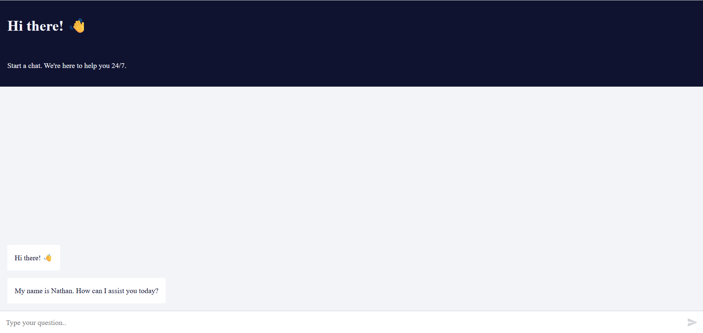

# n8n on Microsoft Azure **VM** (Docker) — Step-by-Step README

**Goal:** Run the official n8n Docker image on an **Azure Ubuntu VM** with persistent storage, correct time zone, HTTPS, and working webhooks.

---

## 1) Prerequisites

- Azure subscription  
- A DNS domain you control (recommended for HTTPS)  
- Basic SSH access knowledge  
- VM size: `B1ms` or higher recommended

---

## 2) Wire Diagram (Who Talks to Whom)

```
You (Browser) → DNS (yourdomain.com) → Azure VM (Ubuntu)
                                             ↳ Caddy (TLS & reverse proxy, :80/:443)
                                                 ↳ n8n Docker container (:5678)
```

- Public ports on VM: **80, 443** (and **22** for SSH)
- n8n listens internally on **5678**

---

## 3) Create the Azure VM (Portal Click-Path)

1) **Azure Portal → Create a Resource → Virtual Machine**  
2) **Basics**
   - Resource Group: create/select  
   - VM Name: `n8n-vm`  
   - Region: India (e.g., Central India / South India / West India)  
   - Image: **Ubuntu 22.04 LTS**  
   - Size: **B1ms** or better  
   - Authentication: SSH key (recommended)  
3) **Networking**
   - Make sure a **Public IP** is assigned  
   - Network Security Group (NSG) inbound rules **allow**:  
     - **22/tcp** (SSH)  
     - **80/tcp** (HTTP)  
     - **443/tcp** (HTTPS)  
4) **Create** the VM and note its **Public IP**.  
5) In your DNS provider, create an **A record** pointing `yourdomain.com` → the VM’s Public IP.

---

## 4) SSH In and Install Docker

From your computer:

```bash
ssh azureuser@<VM_PUBLIC_IP>
```

Install Docker & Compose (Ubuntu):

```bash
# Update
sudo apt-get update -y

# Install prerequisites
sudo apt-get install -y ca-certificates curl gnupg

# Docker repo
sudo install -m 0755 -d /etc/apt/keyrings
curl -fsSL https://download.docker.com/linux/ubuntu/gpg   | sudo gpg --dearmor -o /etc/apt/keyrings/docker.gpg
echo   "deb [arch=$(dpkg --print-architecture)   signed-by=/etc/apt/keyrings/docker.gpg]   https://download.docker.com/linux/ubuntu   $(. /etc/os-release && echo $UBUNTU_CODENAME) stable" | sudo tee /etc/apt/sources.list.d/docker.list > /dev/null

sudo apt-get update -y
sudo apt-get install -y docker-ce docker-ce-cli containerd.io docker-buildx-plugin docker-compose-plugin

# Allow current user to run docker
sudo usermod -aG docker $USER
# Re-login to apply group change (or run 'newgrp docker')
```

---

## 5) Open the VM Firewall (UFW)

```bash
sudo apt-get install -y ufw
sudo ufw allow OpenSSH
sudo ufw allow 80/tcp
sudo ufw allow 443/tcp
sudo ufw enable
sudo ufw status
```

---

## 6) Project Structure

Create a folder for n8n:

```bash
mkdir -p ~/n8n/{caddy_data,caddy_config,n8n_data}
cd ~/n8n
```

Create `.env` with production-safe settings (edit domain/email):

```bash
cat > .env << 'EOF'
# ---- n8n core ----
TZ=Asia/Kolkata
NODE_ENV=production
N8N_DIAGNOSTICS_ENABLED=false
N8N_ENCRYPTION_KEY=
N8N_HOST=yourdomain.com
N8N_PORT=5678
N8N_PROTOCOL=https
WEBHOOK_URL=https://yourdomain.com/
N8N_SECURE_COOKIE=true

# Optional: basic auth (uncomment to use)
# N8N_BASIC_AUTH_ACTIVE=true
# N8N_BASIC_AUTH_USER=admin
# N8N_BASIC_AUTH_PASSWORD=change_me
EOF
```

Generate a strong encryption key and append it:

```bash
printf "N8N_ENCRYPTION_KEY=%s\n" $(openssl rand -hex 32) | tee -a .env
```

---

## 7) Reverse Proxy with **Caddy** (Auto-TLS)

Create `Caddyfile`:

```bash
cat > Caddyfile << 'EOF'
yourdomain.com {
  encode gzip
  reverse_proxy n8n:5678
}
EOF
```

---

## 8) Docker Compose

Create `docker-compose.yml`:

```yaml
version: "3.8"

services:
  n8n:
    image: docker.n8n.io/n8nio/n8n:latest
    restart: unless-stopped
    env_file: .env
    volumes:
      - ./n8n_data:/home/node/.n8n

  caddy:
    image: caddy:2
    restart: unless-stopped
    ports:
      - "80:80"
      - "443:443"
    volumes:
      - ./Caddyfile:/etc/caddy/Caddyfile
      - ./caddy_data:/data
      - ./caddy_config:/config
    depends_on:
      - n8n
```

Bring the stack up:

```bash
docker compose up -d
docker compose ps
```

When DNS is pointed correctly, Caddy will fetch valid TLS automatically.

---

## 9) First Launch & Login

Open:

```
https://yourdomain.com/
```

You should see n8n’s onboarding/login screen.

If you get secure-cookie/URL issues, verify `N8N_HOST`, `N8N_PROTOCOL=https`, and `WEBHOOK_URL` in `.env`, then:

```bash
docker compose down
docker compose up -d
```

---

## 10) (Alternative) No Domain / HTTP-Only Quick Test

If you don’t have a domain yet:

1) Change `.env`:
```env
N8N_HOST=<VM_PUBLIC_IP>
N8N_PROTOCOL=http
WEBHOOK_URL=http://<VM_PUBLIC_IP>:5678/
```

2) In `docker-compose.yml`, expose n8n’s port and remove Caddy:

```yaml
services:
  n8n:
    image: docker.n8n.io/n8nio/n8n:latest
    restart: unless-stopped
    env_file: .env
    volumes:
      - ./n8n_data:/home/node/.n8n
    ports:
      - "5678:5678"
```

3) Up it:

```bash
docker compose up -d
```

4) Visit: `http://<VM_PUBLIC_IP>:5678/`  
(Use HTTPS + domain for production later.)

---

## 11) Minimal Workflow (Drag & Drop)



### Step 1 — Create a New Workflow
1. In n8n, **Workflows → New**  
2. **Name:** `ai chat bot`  
3. **Save**

### Step 2 — Add the Chat Trigger
**Node:** `When chat message received` (public: true)

```json
{
  "name": "When chat message received",
  "type": "@n8n/n8n-nodes-langchain.chatTrigger",
  "typeVersion": 1.3,
  "parameters": { "public": true, "options": {} }
}
```

### Step 3 — Add the AI Agent
```json
{
  "name": "AI Agent",
  "type": "@n8n/n8n-nodes-langchain.agent",
  "typeVersion": 2.2,
  "parameters": { "options": {} }
}
```

### Step 4 — Google Gemini Chat Model
```json
{
  "name": "Google Gemini Chat Model",
  "type": "@n8n/n8n-nodes-langchain.lmChatGoogleGemini",
  "typeVersion": 1,
  "parameters": {}
}
```

### Step 5 — Memory (Conversation Buffer)
```json
{
  "name": "Simple Memory",
  "type": "@n8n/n8n-nodes-langchain.memoryBufferWindow",
  "typeVersion": 1.3,
  "parameters": {}
}
```

### Step 6 — Gmail: Send Transcript
```json
{
  "name": "Send a message",
  "type": "n8n-nodes-base.gmail",
  "typeVersion": 2.1,
  "parameters": {
    "sendTo": "you@example.com",
    "subject": "Chat History",
    "emailType": "text",
    "message": "=input  : {{ $('When chat message received').item.json.chatInput }}\noutput : {{ $json.output }}",
    "options": { "appendAttribution": false }
  }
}
```

### Step 7 — Connections Reference
```json
{
  "connections": {
    "When chat message received": { "main": [[{ "node": "AI Agent", "type": "main", "index": 0 }]] },
    "Google Gemini Chat Model": { "ai_languageModel": [[{ "node": "AI Agent", "type": "ai_languageModel", "index": 0 }]] },
    "Simple Memory": { "ai_memory": [[{ "node": "AI Agent", "type": "ai_memory", "index": 0 }]] },
    "AI Agent": { "main": [[{ "node": "Send a message", "type": "main", "index": 0 }]] }
  }
}
```

Activate the workflow to enable the public endpoint.

---

## 12) Operations

**Logs**
```bash
docker compose logs -f n8n
docker compose logs -f caddy
```

**Restart / Update**
```bash
docker compose pull
docker compose up -d
```

**Backup (persistent data)**
```bash
tar czf n8n_backup_$(date +%F).tar.gz n8n_data
```

---

## 13) Common Issues & Fixes

- **Cannot reach site** → Confirm DNS A-record → VM public IP; NSG allows 80/443; Caddy is up.  
- **Cookie/URL warnings** → Ensure `.env` has `N8N_HOST=yourdomain.com`, `N8N_PROTOCOL=https`, `WEBHOOK_URL=https://yourdomain.com/`.  
- **TLS fails** → Domain must resolve to the VM before starting Caddy.  
- **Time zone wrong** → Check `TZ=Asia/Kolkata` in `.env`, recreate containers.  
- **Gmail send error** → OAuth2 credentials and scopes must be configured in the Gmail node.

---

## 14) Map Your Provided Variables → Correct Keys

Earlier mapping:

```
website-enable-appservice-storage=true
Generic_TIMEZONE=INDIA TIME ZONE
N8N_PORT=5678
N8N_PROTOCOL=http
N8N_Host
WEEBHOOK_URL
```

For **VM + Docker**, use:

```env
TZ=Asia/Kolkata
N8N_HOST=yourdomain.com
N8N_PORT=5678
N8N_PROTOCOL=https
WEBHOOK_URL=https://yourdomain.com/
N8N_ENCRYPTION_KEY=<strong-random-hex>
N8N_SECURE_COOKIE=true
NODE_ENV=production
N8N_DIAGNOSTICS_ENABLED=false
```

---

## 15) Optional Hardening

- Enable `N8N_BASIC_AUTH_*` in `.env`  
- Restrict SSH (use key-based auth only)  
- Regularly back up `n8n_data/`  
- Keep Docker images updated
