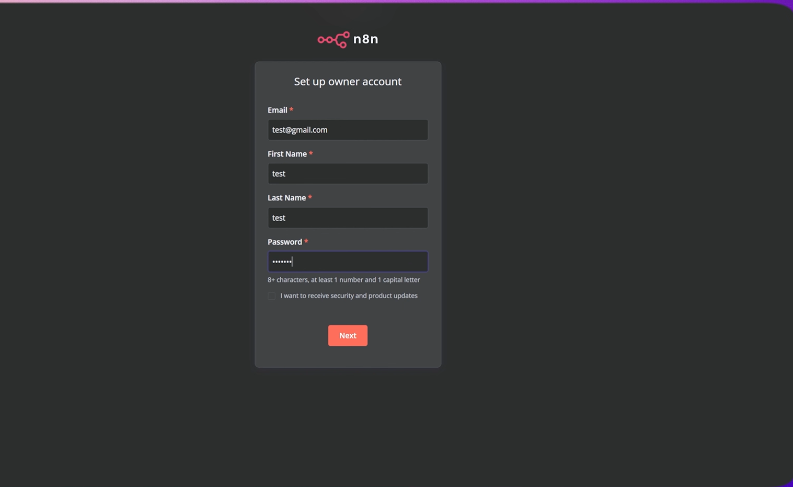

# Install n8n on Google Cloud VM with SSL (Beginner‑Friendly)

This guide walks you through deploying **n8n** on **Google Cloud** using a **Compute Engine VM**, **Cloud SQL (PostgreSQL)**, and **free SSL via Caddy + Let’s Encrypt**. It’s written so a brand‑new teammate can follow it without prior cloud experience.

> **You’ll do this in two phases:**
> 1) Get a basic n8n running (quick test, no domain).
> 2) Put it behind Caddy with your domain and HTTPS (production‑ready).

---

## ✅ Prerequisites

- A Google account with **billing enabled** for Google Cloud.
- (Optional but recommended) A domain you control (e.g., purchased on Namecheap).
- Basic terminal copy‑paste skills.
- **Do not paste real secrets into chats or screenshots.** Store them in a safe place (e.g., a password manager).

---

## 🏗️ Architecture (what you’re building)

```
Internet ──► :80/:443  →  Caddy (on VM)  ─►  n8n Docker container (:5678)
                               │
                               └──────────►  Cloud SQL (PostgreSQL) (:5432, authorized to VM IP)
```

- Only ports **80** and **443** are public. n8n’s internal port **5678** stays private (best practice).


---

## 1) Create a Google Cloud Project

1. Open **Google Cloud Console** → click the **project dropdown** (top‑left) → **New Project**.
2. Name: `n8n-project` (or anything you like) → **Create**.

---

## 2) Enable Required APIs

1. Console → **☰ (menu)** → **APIs & Services** → **Library**.
2. Enable:
   - **Compute Engine API**
   - **Cloud SQL Admin API**

---

## 3) Create a VM (Ubuntu 22.04)

1. **Compute Engine** → **VM Instances** → **Create Instance**  
   - **Name:** `n8n-server`  
   - **Region/Zone:** closest to you (e.g., `us-central1`)  
   - **Machine type:** `e2-small` (good for testing)  
   - **Boot disk:** **Ubuntu 22.04 LTS** (10 GB default is fine)  
   - **Firewall:** ✅ Allow HTTP traffic, ✅ Allow HTTPS traffic  
2. Click **Create**.

### (Optional) Reserve a Static IP
1. Stop the VM → **Edit**.
2. **Network interfaces** → your interface → **External IPv4 address** → **Reserve static IP**.
3. Name it and **Reserve** → **Save** → start the VM again.

> **Why static IP?** So your DNS record always points to the same address.

---

## 4) Open Ports (firewall)

> **Best practice:** Because we’ll use Caddy, you only need **80** and **443** open publicly.  
> You **do not** need to expose 5678 or 5679 to the internet when using Caddy.

If you must open custom ports:
1. **VPC Network** → **Firewall** → **Create firewall rule**  
   - **Name:** `allow-n8n`  
   - **Targets:** All instances in the network  
   - **Source IP ranges:** `0.0.0.0/0` (you can restrict later)  
   - **Protocols and ports:** TCP → `5678,5679`  
   - **Create**

---

## 5) SSH into the VM

**Compute Engine** → **VM Instances** → your `n8n-server` → **SSH**.

---

## 6) Install Docker (on the VM)

```bash
# Download Docker install script
curl -fsSL https://get.docker.com -o get-docker.sh

# Run it
sudo sh get-docker.sh
```

(Optional) Install the Docker Compose plugin:
```bash
sudo apt-get update
sudo apt-get install -y docker-compose-plugin
```

---

## 7) Add your user to the docker group, then reboot

```bash
sudo usermod -aG docker $USER
sudo reboot
```

After ~1–2 minutes, SSH back in. Verify Docker:
```bash
docker --version
```

You should see a Docker version line.

---

## 8) Install Caddy (reverse proxy with free SSL)

```bash
sudo apt install -y debian-keyring debian-archive-keyring apt-transport-https
curl -1sLf 'https://dl.cloudsmith.io/public/caddy/stable/gpg.key' | sudo gpg --dearmor -o /usr/share/keyrings/caddy-stable-archive-keyring.gpg
curl -1sLf 'https://dl.cloudsmith.io/public/caddy/stable/debian.deb.txt' | sudo tee /etc/apt/sources.list.d/caddy-stable.list
sudo apt update
sudo apt install -y caddy

# Confirm Caddy is running
sudo systemctl status caddy --no-pager
```

---

## 9) Create Cloud SQL (PostgreSQL)

1. **Cloud SQL** → **Create Instance** → **PostgreSQL**  
   - **Instance ID:** `n8n-db`  
   - **Version:** PostgreSQL 15  
   - **Region:** same as VM if possible  
   - **Machine type:** smallest (sandbox) for testing  
   - **Storage:** 10 GB  
   - Set a strong **postgres** password → **Create** (3–5 minutes).

### Create a database and a user
- **Cloud SQL** → your `n8n-db` → **Databases** → **Create database** → name: `n8n_db` → **Create**.  
- **Users** → **Create user account**:  
  - **Username:** `n8n_user`  
  - **Password:** `<STRONG_PASSWORD>` (save it!) → **Create**.

### Allow the VM to connect (Public IP method)
- **Connections** → **Networking** → **Add Network** → paste your VM **External IP** → **Done** → **Save**.

> This authorizes your VM’s IP to reach the DB’s public IP securely.

---

## 10) Prepare n8n secrets and folders

Create a data folder on the VM to persist n8n configs/credentials:
```bash
mkdir -p ~/.n8n
```

Generate a strong encryption key for n8n (store it safely):
```bash
openssl rand -base64 32
```
You’ll use the output as `N8N_ENCRYPTION_KEY`.

> **Why this matters:** Without a persistent folder and encryption key, you risk losing credentials after container restarts or migrations.

---

## 11) Quick test: run n8n **without a domain** (HTTP only)

> This is only to confirm n8n boots and can reach Cloud SQL. Do **not** use in production.

Replace placeholders before running:
- `<DB_NAME>` = `n8n_db`
- `<DB_HOST>` = your Cloud SQL **Public IP**
- `<DB_USER>` = `n8n_user`
- `<DB_PASSWORD>` = the password you set
- `<YOUR_USERNAME>` and `<YOUR_PASSWORD>` = for Basic Auth to the editor
- `<YOUR_TIMEZONE>` = e.g., `Asia/Kolkata`
- `<YOUR_ENCRYPTION_KEY>` = from the `openssl` command

```bash
docker run -d   --name n8n   -p 5678:5678   -e DB_TYPE=postgresdb   -e DB_POSTGRESDB_DATABASE=<DB_NAME>   -e DB_POSTGRESDB_HOST=<DB_HOST>   -e DB_POSTGRESDB_PORT=5432   -e DB_POSTGRESDB_USER=<DB_USER>   -e DB_POSTGRESDB_PASSWORD=<DB_PASSWORD>   -e N8N_BASIC_AUTH_ACTIVE=true   -e N8N_BASIC_AUTH_USER=<YOUR_USERNAME>   -e N8N_BASIC_AUTH_PASSWORD=<YOUR_PASSWORD>   -e N8N_SECURE_COOKIE=false   -e GENERIC_TIMEZONE=<YOUR_TIMEZONE>   -e N8N_ENCRYPTION_KEY=<YOUR_ENCRYPTION_KEY>   -v ~/.n8n:/home/node/.n8n   n8nio/n8n
```

Visit: `http://<VM_EXTERNAL_IP>:5678` → log in with Basic Auth.  
If it works, stop the container and continue to the domain + SSL setup:

```bash
docker stop n8n && docker rm n8n
```

---

## 12) Point your **domain** to the VM (DNS)

In **Namecheap** (or your DNS provider):

- **A Record**
  - **Host:** `@` (root) or `n8n` for a subdomain like `n8n.yourdomain.com`
  - **Value:** `<YOUR_VM_STATIC_IP>`
  - **TTL:** Automatic
  - **Save**

> DNS can take **5–60 minutes** to propagate.

---

## 13) Configure Caddy to proxy n8n (HTTPS)

Create the Caddyfile:
```bash
sudo nano /etc/caddy/Caddyfile
```

Put this in (replace `yourdomain.com`):
```caddyfile
yourdomain.com {
  encode zstd gzip
  reverse_proxy 127.0.0.1:5678
}
```

Save (**Ctrl+O**) and exit (**Ctrl+X**), then:
```bash
sudo systemctl restart caddy
sudo systemctl status caddy --no-pager
```

> Caddy will automatically fetch and renew a free Let’s Encrypt certificate for `yourdomain.com`.

---

## 14) Run n8n **behind Caddy** (production)

Use the **loopback binding** so port 5678 isn’t exposed publicly:

```bash
docker run -d   --name n8n   -p 127.0.0.1:5678:5678   -e DB_TYPE=postgresdb   -e DB_POSTGRESDB_DATABASE=<DB_NAME>   -e DB_POSTGRESDB_HOST=<DB_HOST>   -e DB_POSTGRESDB_PORT=5432   -e DB_POSTGRESDB_USER=<DB_USER>   -e DB_POSTGRESDB_PASSWORD=<DB_PASSWORD>   -e N8N_HOST=yourdomain.com   -e N8N_PROTOCOL=https   -e N8N_EDITOR_BASE_URL=https://yourdomain.com/   -e WEBHOOK_URL=https://yourdomain.com/   -e N8N_BASIC_AUTH_ACTIVE=true   -e N8N_BASIC_AUTH_USER=<YOUR_USERNAME>   -e N8N_BASIC_AUTH_PASSWORD=<YOUR_PASSWORD>   -e N8N_SECURE_COOKIE=true   -e GENERIC_TIMEZONE=<YOUR_TIMEZONE>   -e N8N_ENCRYPTION_KEY=<YOUR_ENCRYPTION_KEY>   -v ~/.n8n:/home/node/.n8n   n8nio/n8n
```

Open `https://yourdomain.com` → sign in with Basic Auth.

---

## 15) First workflow: **Webhook test** (clear node instructions)

This confirms your reverse proxy and webhook URLs are correct.

**Create the workflow**  
1. In n8n, click **New**.  
2. **Drag** a **Webhook** node from the left panel onto the canvas.  
   - **HTTP Method:** `POST`  
   - **Path:** `hello` (production URL will be `/webhook/hello`)  
   - **Response Mode:** `On Received`  
   - **Response Data:** `JSON`  
   - **Response Body:** `{"status":"ok","echo": {{$json}} }` (optional)  
3. **Drag** a **Respond to Webhook** node *only if* you prefer explicit response control.  
   - **Mode:** `Last node` (or set custom body)  
4. **Connect** `Webhook → Respond to Webhook` (if using the second node).  
5. **Activate** the workflow (top‑right toggle).

**Test from a terminal (replace the domain):**
```bash
curl -X POST https://yourdomain.com/webhook/hello   -H 'Content-Type: application/json'   -d '{"message":"Hi n8n!"}'
```

You should get a JSON response and see an execution in n8n.

> **Manual vs Production URL:** In the Webhook node panel, n8n shows both. Use the **Production URL** in real use. With our env vars (`N8N_HOST`, `N8N_PROTOCOL`, `WEBHOOK_URL`) set, the production URL will be your **https domain**.

---

## 16) operations (useful Docker commands)

List running containers:
```bash
docker ps
```

Start/stop/restart n8n:
```bash
docker start n8n
docker stop n8n
docker restart n8n
```

Remove the container:
```bash
docker rm n8n
```

Prune stopped containers:
```bash
docker container prune
```

Logs (live / last 100 lines):
```bash
docker logs -f n8n
docker logs --tail=100 n8n
```

Find “error” in logs:
```bash
docker logs n8n | grep -i "error"
```

**Update n8n** to latest image (zero data loss thanks to `~/.n8n` volume):
```bash
docker pull n8nio/n8n:latest
docker stop n8n && docker rm n8n
# re-run the same 'docker run' command you used in step 14
```

---

## 17) Security & reliability checklist (strongly recommended)

- **Keep port 5678 private** (`-p 127.0.0.1:5678:5678`) and proxy only via **Caddy** on **80/443**.
- Use strong, unique values for **DB password**, **Basic Auth**, and **N8N_ENCRYPTION_KEY**.
- Regularly **back up** `~/.n8n` (contains credentials and config).
- In Cloud SQL, restrict **Authorized Networks** to only the VM’s static IP.
- Set `GENERIC_TIMEZONE` (e.g., `Asia/Kolkata`) so cron/schedules behave as expected.
- Consider **Docker Compose** for easier upgrades (see appendix).

---

## 18) Troubleshooting

**Q: Caddy shows a certificate error / serves HTTP only.**  
- DNS may not have propagated yet. Wait 5–60 minutes.  
- Ensure your **A record** points to the VM’s **static** IP.  
- Confirm Caddy is running: `sudo systemctl status caddy`.

**Q: n8n can’t connect to PostgreSQL.**  
- Check Cloud SQL **Public IP** and that your VM IP is **Authorized**.  
- Verify env vars: DB host, DB name, user, password.  
- Try from VM: `telnet <DB_HOST> 5432` (install `telnet` if needed).

**Q: I get 502/Bad Gateway from Caddy.**  
- Ensure the n8n container is running: `docker ps`.  
- Check logs: `docker logs -f n8n`.  
- The Caddyfile must proxy to `127.0.0.1:5678` and the container must bind there.

**Q: Webhook uses wrong base URL.**  
- Ensure `N8N_HOST`, `N8N_PROTOCOL=https`, `WEBHOOK_URL=https://yourdomain.com/`, and `N8N_EDITOR_BASE_URL=https://yourdomain.com/` are set in the container env.

---

## 19) Appendix: Docker Compose (optional, nice for upgrades)

Create `docker-compose.yml` on the VM (e.g., in `~/n8n/`):

```yaml
services:
  n8n:
    image: n8nio/n8n:latest
    container_name: n8n
    restart: unless-stopped
    ports:
      - "127.0.0.1:5678:5678"
    environment:
      DB_TYPE: postgresdb
      DB_POSTGRESDB_DATABASE: <DB_NAME>
      DB_POSTGRESDB_HOST: <DB_HOST>
      DB_POSTGRESDB_PORT: "5432"
      DB_POSTGRESDB_USER: <DB_USER>
      DB_POSTGRESDB_PASSWORD: <DB_PASSWORD>
      N8N_HOST: yourdomain.com
      N8N_PROTOCOL: https
      N8N_EDITOR_BASE_URL: https://yourdomain.com/
      WEBHOOK_URL: https://yourdomain.com/
      N8N_BASIC_AUTH_ACTIVE: "true"
      N8N_BASIC_AUTH_USER: <YOUR_USERNAME>
      N8N_BASIC_AUTH_PASSWORD: <YOUR_PASSWORD>
      N8N_SECURE_COOKIE: "true"
      GENERIC_TIMEZONE: <YOUR_TIMEZONE>
      N8N_ENCRYPTION_KEY: <YOUR_ENCRYPTION_KEY>
    volumes:
      - ~/.n8n:/home/node/.n8n
```

Then run:
```bash
docker compose up -d
```

To upgrade later:
```bash
docker compose pull
docker compose up -d
```

---

## 20) n8n “node” basics (drag‑and‑drop quick guide)

- **Add a node:** Click **+** in the editor or drag from the left panel.
- **Configure a node:** Click it → fill in **parameters** (clear labels per node).
- **Modes (when available):** e.g., Webhook node offers **Test** and **Production** URLs; use **Production** in real webhooks.
- **Operations:** Many nodes have an **Operation** dropdown (e.g., Google Sheets → *Append*, *Read*, etc.). Choose exactly what you need for the step.
- **Connections:** Drag the circle on the right edge of a node to the next node to define flow.
- **Activate workflow:** Toggle **Active** (top‑right) to expose **Production** endpoints.
- **Execution list:** Left sidebar → **Executions** to see runs and debug.

> For your **first test** in this guide, we used: **Webhook (POST, path: `hello`) → Respond to Webhook**. That’s enough to confirm SSL + proxy + base URLs.

---

### You’re done!

- Your n8n instance is live at **https://yourdomain.com** behind **Caddy** with **free SSL**.
- Data is backed by **Cloud SQL (Postgres)**.
- You can now add Google Sheets, Gmail, and other nodes and build production workflows.
