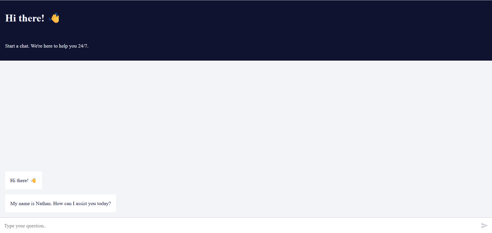

# n8n on **AWS (Docker PaaS)** — ECS Fargate + ALB + EFS — Step-by-Step README

**Goal:** Run the official n8n Docker image on **AWS ECS Fargate** behind an **Application Load Balancer (HTTPS)** with **persistent storage** on **EFS**. This is the AWS “Docker hosting” .
---

## 1) Why ECS + Fargate + EFS?
- **Fargate** runs containers without managing VMs.
- **ALB** gives you a stable HTTPS URL and scales cleanly.
- **EFS** provides persistent storage for `/home/node/.n8n` so credentials/workflows survive deployments.

---

## 2) Architecture (Who talks to whom)

```
You (Browser) → DNS (Route 53) → ALB (HTTPS 443)
                                 ↳ ECS Service (Fargate tasks)
                                     ↳ n8n container (port 5678)
                                 ↳ EFS (mounted at /home/node/.n8n in the task)
```

Open inbound Security Groups: **80/443** → ALB; **NFS 2049** from ECS tasks to EFS.

---

## 3) Prerequisites

- AWS account with permissions for **VPC, ECS, ECR (optional), EFS, ACM, ELB, IAM**.
- A public **domain** (Route 53 recommended) for HTTPS and a **public ACM certificate** in the ALB’s region.
- A VPC with **two public subnets** (for ALB) and **two private subnets** (recommended for Fargate tasks).  
  *(You can use public subnets for tasks for simplicity while testing.)*

---

## 4) Create/Prepare Supporting Resources

### 4.1 Security Groups
- **ALB SG**: inbound **80, 443** from the Internet; outbound all.
- **ECS Task SG**: inbound from **ALB SG** on **5678**; outbound all.
- **EFS SG**: inbound **2049 (NFS)** from **ECS Task SG**; outbound all.

### 4.2 EFS
- Create an **EFS file system** in the VPC.
- Create **Mount Targets** in each subnet where tasks run.
- Attach the **EFS SG** to allow NFS from tasks.

### 4.3 ACM Certificate
- Request a **public certificate** for `yourdomain.com` (and `www.yourdomain.com` if needed) in **the same region** as the ALB.
- Validate via DNS in Route 53.

### 4.4 ALB + Target Group
- Create an **Application Load Balancer** in **public subnets**.
- Create a **Target Group** (type **IP**) on port **5678** with health check path `/`.
- Create **Listeners**:
  - **443/HTTPS** → forward to Target Group (use ACM cert).
  - Optional: **80/HTTP** → redirect to **443**.

---

## 5) Environment Variables (n8n)

Use these **exact** keys in the ECS task definition:

```
TZ = Asia/Kolkata
NODE_ENV = production
N8N_DIAGNOSTICS_ENABLED = false
N8N_ENCRYPTION_KEY = <strong-random-hex>
N8N_HOST = yourdomain.com
N8N_PORT = 5678
N8N_PROTOCOL = https
WEBHOOK_URL = https://yourdomain.com/
N8N_SECURE_COOKIE = true
# Optional basic auth for the UI:
# N8N_BASIC_AUTH_ACTIVE = true
# N8N_BASIC_AUTH_USER = admin
# N8N_BASIC_AUTH_PASSWORD = change_me
```

Generate a key locally and paste:
```bash
openssl rand -hex 32
```

> For production, put sensitive values in **AWS Secrets Manager** and reference them in the task definition `secrets` block.

---

## 6) Task Definition (Fargate) with EFS Mount

- Image: `docker.n8n.io/n8nio/n8n:latest`
- Port mapping: container **5678 → target group 5678**
- EFS volume: mount to **/home/node/.n8n**
- CPU/Memory: start with **0.5 vCPU / 1GB** (512/1024) or **1 vCPU / 2GB** (1024/2048)

See `taskdef.json` in this package (fill placeholders).

---

## 7) Create the ECS Service (Fargate)

- Launch type: **FARGATE**
- Desired tasks: **1** (scale later)
- Subnets: the subnets where tasks should run
- Security group: **ECS Task SG**
- **Load balancing**: attach to your **Target Group** (port 5678)
- **Health check**: Target Group path `/`, matcher `200`
- **Public IP**: optional; not needed if behind ALB

You can use the **AWS Console** or the **CLI**. See `cli-steps.sh` included.

---

## 8) Route 53 — Point the Domain

- In Route 53, create an **A/AAAA Alias** record for `yourdomain.com` → your **ALB**.
- Wait for DNS to propagate and ACM to show **Issued**.

Open:
```
https://yourdomain.com/
```

You should see the n8n onboarding screen.

---

## 9) Minimal Workflow (Drag & Drop) — Same Example




### Step 1 — Create a New Workflow
- In n8n: **Workflows → New**
- **Name:** `ai chat bot`
- **Save**

### Step 2 — Add the Chat Trigger
**Node:** `When chat message received` (public: true)

```json
{
  "name": "When chat message received",
  "type": "@n8n/n8n-nodes-langchain.chatTrigger",
  "typeVersion": 1.3,
  "parameters": { "public": true, "options": {} }
}
```

Copy the public URL from the node UI.

### Step 3 — AI Agent
```json
{
  "name": "AI Agent",
  "type": "@n8n/n8n-nodes-langchain.agent",
  "typeVersion": 2.2,
  "parameters": { "options": {} }
}
```

### Step 4 — Google Gemini Chat Model
```json
{
  "name": "Google Gemini Chat Model",
  "type": "@n8n/n8n-nodes-langchain.lmChatGoogleGemini",
  "typeVersion": 1,
  "parameters": {}
}
```

Configure Gemini credentials on this node.

### Step 5 — Simple Memory (Conversation Buffer)
```json
{
  "name": "Simple Memory",
  "type": "@n8n/n8n-nodes-langchain.memoryBufferWindow",
  "typeVersion": 1.3,
  "parameters": {}
}
```

### Step 6 — Gmail: Send Transcript
```json
{
  "name": "Send a message",
  "type": "n8n-nodes-base.gmail",
  "typeVersion": 2.1,
  "parameters": {
    "sendTo": "you@example.com",
    "subject": "Chat History",
    "emailType": "text",
    "message": "=input  : {{ $('When chat message received').item.json.chatInput }}\noutput : {{ $json.output }}",
    "options": { "appendAttribution": false }
  }
}
```

### Step 7 — Connections Reference
```json
{
  "connections": {
    "When chat message received": { "main": [[{ "node": "AI Agent", "type": "main", "index": 0 }]] },
    "Google Gemini Chat Model": { "ai_languageModel": [[{ "node": "AI Agent", "type": "ai_languageModel", "index": 0 }]] },
    "Simple Memory": { "ai_memory": [[{ "node": "AI Agent", "type": "ai_memory", "index": 0 }]] },
    "AI Agent": { "main": [[{ "node": "Send a message", "type": "main", "index": 0 }]] }
  }
}
```

Activate the workflow to enable the public endpoint.

---

## 10) Operations

**Logs (ECS task):**  
ECS → Cluster → Services → Tasks → **Logs** tab

**Deploy new version:**  
Update Service → **Force new deployment** (pulls latest image)

**Backups:**  
EFS keeps persistent data. Periodically back up the **EFS file system** (AWS Backup) and export workflows from n8n UI.

---

## 11) Common Issues & Fixes

- **ALB 5xx / unhealthy targets** → Target Group port must be **5678**, health check path `/`, security groups correct.
- **Cookie/URL warnings** → `N8N_HOST`, `N8N_PROTOCOL=https`, `WEBHOOK_URL=https://yourdomain.com/`.
- **No persistence** → Ensure EFS is mounted at `/home/node/.n8n` in the task definition.
- **TLS not working** → ACM certificate must be **Issued** and attached to ALB 443 listener; DNS must point to ALB.
- **Time zone wrong** → `TZ=Asia/Kolkata` in env vars; redeploy service.

---

## 12) Cost & Scaling Notes

- Start with **1 task** and a small **ALB**; use **Auto Scaling** policies later.
- EFS is billed per GB-month + throughput; ALB per hour + LCU.
- Fargate tasks billed per vCPU/GB per hour. Scale to **2+ tasks** for HA.

---


**Done.** Your n8n is now running as a **Docker container** on **AWS ECS Fargate** with HTTPS via ALB and persistent data on EFS.
