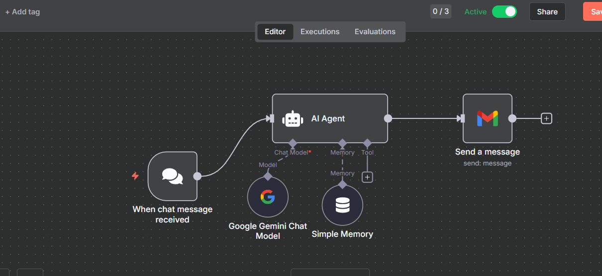

# n8n on **AWS EC2 (VM)** — Docker + Caddy (Auto‑HTTPS) — Step‑by‑Step README

**Goal:** Run the official n8n Docker image on an **AWS EC2 Ubuntu VM** with persistent storage, correct time zone, HTTPS, and working webhooks 

---

## 1) Prerequisites

- AWS account with access to **EC2**, **VPC**, and optionally **Route 53**
- A DNS domain you control (recommended for HTTPS)
- SSH key pair for EC2
- Familiarity with basic Linux shell commands

---

## 2) Architecture (Who talks to whom)

```
You (Browser) → DNS (Route 53 or other) → AWS EC2 (Ubuntu)
                                           ↳ Caddy (TLS & reverse proxy, :80/:443)
                                               ↳ n8n Docker container (:5678)
```

- Open inbound on the EC2 Security Group: **22/tcp**, **80/tcp**, **443/tcp**
- n8n listens internally on **5678** (not exposed publicly directly)

---

## 3) Launch the EC2 Instance (Console)

1) AWS Console → **EC2 → Launch instance**
2) **Name:** `n8n-ec2`
3) **AMI:** **Ubuntu Server 22.04 LTS (HVM)** (64‑bit x86)  
4) **Instance type:** `t3.small` (or `t3.micro` for light testing)
5) **Key pair:** select or create
6) **Network settings:**
   - VPC/Subnet: default or your choice
   - **Security Group:** allow **22**, **80**, **443** (from your IP or 0.0.0.0/0 for quick start)
7) **Storage:** at least **20 GB gp3**
8) **Launch**

**Optional:** Allocate an **Elastic IP** and associate it to keep a stable IP.  
**DNS:** Point your domain’s **A record** to the Elastic IP (or the current public IP).

---

## 4) SSH In & Install Docker (Ubuntu)

From your machine (replace with your public IP or DNS):

```bash
ssh -i /path/to/key.pem ubuntu@<EC2_PUBLIC_IP_OR_DNS>
```

Install Docker & Compose plugin:

```bash
# Update
sudo apt-get update -y

# Install prerequisites
sudo apt-get install -y ca-certificates curl gnupg

# Docker repo
sudo install -m 0755 -d /etc/apt/keyrings
curl -fsSL https://download.docker.com/linux/ubuntu/gpg | sudo gpg --dearmor -o /etc/apt/keyrings/docker.gpg
echo   "deb [arch=$(dpkg --print-architecture) signed-by=/etc/apt/keyrings/docker.gpg]   https://download.docker.com/linux/ubuntu   $(. /etc/os-release && echo $UBUNTU_CODENAME) stable" | sudo tee /etc/apt/sources.list.d/docker.list > /dev/null

sudo apt-get update -y
sudo apt-get install -y docker-ce docker-ce-cli containerd.io docker-buildx-plugin docker-compose-plugin

# Enable at boot
sudo systemctl enable docker
```

---

## 5) Open the Instance Firewall (UFW)

```bash
sudo apt-get install -y ufw
sudo ufw allow OpenSSH
sudo ufw allow 80/tcp
sudo ufw allow 443/tcp
sudo ufw --force enable
sudo ufw status
```

*(Security Group already allows these; UFW is an extra local firewall.)*

---

## 6) Project Structure

```bash
mkdir -p ~/n8n/{caddy_data,caddy_config,n8n_data}
cd ~/n8n
```

Create `.env` (edit domain/email later):

```bash
cat > .env << 'EOF'
# ---- n8n core ----
TZ=Asia/Kolkata
NODE_ENV=production
N8N_DIAGNOSTICS_ENABLED=false
N8N_ENCRYPTION_KEY=
N8N_HOST=yourdomain.com
N8N_PORT=5678
N8N_PROTOCOL=https
WEBHOOK_URL=https://yourdomain.com/
N8N_SECURE_COOKIE=true

# Optional: basic auth (uncomment to use)
# N8N_BASIC_AUTH_ACTIVE=true
# N8N_BASIC_AUTH_USER=admin
# N8N_BASIC_AUTH_PASSWORD=change_me
EOF
```

Generate and append a strong encryption key:

```bash
printf "N8N_ENCRYPTION_KEY=%s\n" $(openssl rand -hex 32) | tee -a .env
```

---

## 7) Reverse Proxy with **Caddy** (Auto‑TLS)

Create `Caddyfile`:

```bash
cat > Caddyfile << 'EOF'
yourdomain.com {
  encode gzip
  reverse_proxy n8n:5678
}
EOF
```

---

## 8) Docker Compose

Create `docker-compose.yml`:

```yaml
version: "3.8"

services:
  n8n:
    image: docker.n8n.io/n8nio/n8n:latest
    restart: unless-stopped
    env_file: .env
    volumes:
      - ./n8n_data:/home/node/.n8n

  caddy:
    image: caddy:2
    restart: unless-stopped
    ports:
      - "80:80"
      - "443:443"
    volumes:
      - ./Caddyfile:/etc/caddy/Caddyfile
      - ./caddy_data:/data
      - ./caddy_config:/config
    depends_on:
      - n8n
```

Bring it up:

```bash
docker compose up -d
docker compose ps
```

When DNS is pointed correctly, Caddy will automatically issue a valid TLS cert.

---

## 9) First Launch & Login

Open:

```
https://yourdomain.com/
```

If you see cookie/URL warnings, make sure `.env` has:
- `N8N_HOST=yourdomain.com`
- `N8N_PROTOCOL=https`
- `WEBHOOK_URL=https://yourdomain.com/`

Then restart:

```bash
docker compose down
docker compose up -d
```

---

## 10) (Alternative) No Domain / HTTP‑Only Quick Test

If you don’t have a domain yet:

1) Change `.env`:
```env
N8N_HOST=<EC2_PUBLIC_IP>
N8N_PROTOCOL=http
WEBHOOK_URL=http://<EC2_PUBLIC_IP>:5678/
```

2) Expose n8n’s port and omit Caddy in `docker-compose.yml`:

```yaml
services:
  n8n:
    image: docker.n8n.io/n8nio/n8n:latest
    restart: unless-stopped
    env_file: .env
    volumes:
      - ./n8n_data:/home/node/.n8n
    ports:
      - "5678:5678"
```

3) Up it:

```bash
docker compose up -d
```

4) Visit: `http://<EC2_PUBLIC_IP>:5678/`  
(Use HTTPS + domain for production later.)

---

## 11) Minimal Workflow (Drag & Drop)



### Step 1 — Create a New Workflow
- In n8n: **Workflows → New**
- **Name:** `ai chat bot`
- **Save**

### Step 2 — Add the Chat Trigger
**Node:** `When chat message received` (public: true)

```json
{
  "name": "When chat message received",
  "type": "@n8n/n8n-nodes-langchain.chatTrigger",
  "typeVersion": 1.3,
  "parameters": { "public": true, "options": {} }
}
```

Copy the public URL from the node UI.

### Step 3 — AI Agent
```json
{
  "name": "AI Agent",
  "type": "@n8n/n8n-nodes-langchain.agent",
  "typeVersion": 2.2,
  "parameters": { "options": {} }
}
```

### Step 4 — Google Gemini Chat Model
```json
{
  "name": "Google Gemini Chat Model",
  "type": "@n8n/n8n-nodes-langchain.lmChatGoogleGemini",
  "typeVersion": 1,
  "parameters": {}
}
```

Configure Gemini credentials on this node.

### Step 5 — Simple Memory (Conversation Buffer)
```json
{
  "name": "Simple Memory",
  "type": "@n8n/n8n-nodes-langchain.memoryBufferWindow",
  "typeVersion": 1.3,
  "parameters": {}
}
```

### Step 6 — Gmail: Send Transcript
```json
{
  "name": "Send a message",
  "type": "n8n-nodes-base.gmail",
  "typeVersion": 2.1,
  "parameters": {
    "sendTo": "you@example.com",
    "subject": "Chat History",
    "emailType": "text",
    "message": "=input  : {{ $('When chat message received').item.json.chatInput }}\noutput : {{ $json.output }}",
    "options": { "appendAttribution": false }
  }
}
```

### Step 7 — Connections Reference
```json
{
  "connections": {
    "When chat message received": { "main": [[{ "node": "AI Agent", "type": "main", "index": 0 }]] },
    "Google Gemini Chat Model": { "ai_languageModel": [[{ "node": "AI Agent", "type": "ai_languageModel", "index": 0 }]] },
    "Simple Memory": { "ai_memory": [[{ "node": "AI Agent", "type": "ai_memory", "index": 0 }]] },
    "AI Agent": { "main": [[{ "node": "Send a message", "type": "main", "index": 0 }]] }
  }
}
```

Activate the workflow to enable the public endpoint.

---

## 12) Ops: Logs, Update, Backup

**Logs**
```bash
docker compose logs -f n8n
docker compose logs -f caddy
```

**Update to latest**
```bash
docker compose pull
docker compose up -d
```

**Backup persistent data**
```bash
tar czf n8n_backup_$(date +%F).tar.gz n8n_data
```

---

## 13) Common Issues & Fixes

- **Site unreachable** → Check Security Group (80/443), UFW, DNS A‑record → EC2 IP, and that Caddy is healthy.
- **Cookie/URL warnings** → Ensure correct `N8N_HOST`, `N8N_PROTOCOL`, `WEBHOOK_URL` in `.env`.
- **TLS fails** → Domain must point to instance IP before Caddy starts; wait and check logs.
- **Wrong time zone** → `TZ=Asia/Kolkata` in `.env`, then recreate containers.
- **Gmail send error** → Configure Gmail OAuth2 credentials and scopes on the Gmail node.

---

## 14) Optional: **User‑Data** (Auto‑Provision on First Boot)

Paste the following as **User data** while launching the instance (Advanced details → User data).  
It sets your domain, installs Docker + UFW, writes config files, and starts the stack.

> **Before using:** set `DOMAIN` and (optionally) `EMAIL` at the top.

```bash
#!/bin/bash
set -euxo pipefail

DOMAIN="yourdomain.com"       # <-- change me
EMAIL="admin@yourdomain.com"  # unused by Caddy here, kept for reference

# Update & tools
apt-get update -y
apt-get install -y ca-certificates curl gnupg ufw

# Docker install
install -m 0755 -d /etc/apt/keyrings
curl -fsSL https://download.docker.com/linux/ubuntu/gpg | gpg --dearmor -o /etc/apt/keyrings/docker.gpg
echo "deb [arch=$(dpkg --print-architecture) signed-by=/etc/apt/keyrings/docker.gpg] https://download.docker.com/linux/ubuntu $(. /etc/os-release && echo $UBUNTU_CODENAME) stable" > /etc/apt/sources.list.d/docker.list
apt-get update -y
apt-get install -y docker-ce docker-ce-cli containerd.io docker-buildx-plugin docker-compose-plugin
systemctl enable docker

# Firewall
ufw allow OpenSSH || true
ufw allow 80/tcp || true
ufw allow 443/tcp || true
yes | ufw enable || true

# Project files
mkdir -p /opt/n8n/{caddy_data,caddy_config,n8n_data}
cat > /opt/n8n/.env <<EOF
TZ=Asia/Kolkata
NODE_ENV=production
N8N_DIAGNOSTICS_ENABLED=false
N8N_ENCRYPTION_KEY=$(openssl rand -hex 32)
N8N_HOST=${DOMAIN}
N8N_PORT=5678
N8N_PROTOCOL=https
WEBHOOK_URL=https://${DOMAIN}/
N8N_SECURE_COOKIE=true
EOF

cat > /opt/n8n/Caddyfile <<EOF
${DOMAIN} {
  encode gzip
  reverse_proxy n8n:5678
}
EOF

cat > /opt/n8n/docker-compose.yml <<'EOF'
version: "3.8"
services:
  n8n:
    image: docker.n8n.io/n8nio/n8n:latest
    restart: unless-stopped
    env_file: .env
    volumes:
      - ./n8n_data:/home/node/.n8n
  caddy:
    image: caddy:2
    restart: unless-stopped
    ports:
      - "80:80"
      - "443:443"
    volumes:
      - ./Caddyfile:/etc/caddy/Caddyfile
      - ./caddy_data:/data
      - ./caddy_config:/config
    depends_on:
      - n8n
EOF

cd /opt/n8n
docker compose up -d
```

---

## 15) Optional Hardening

- Enable `N8N_BASIC_AUTH_*` in `.env` for UI auth
- Use **restrictive Security Group** (limit 22/80/443 to your IP ranges)
- Keep Docker images updated regularly
- Regularly export workflows and back up `/opt/n8n/n8n_data`

---

**Done.** Your n8n is now running on an AWS EC2 VM with auto‑TLS and persistent storage.
